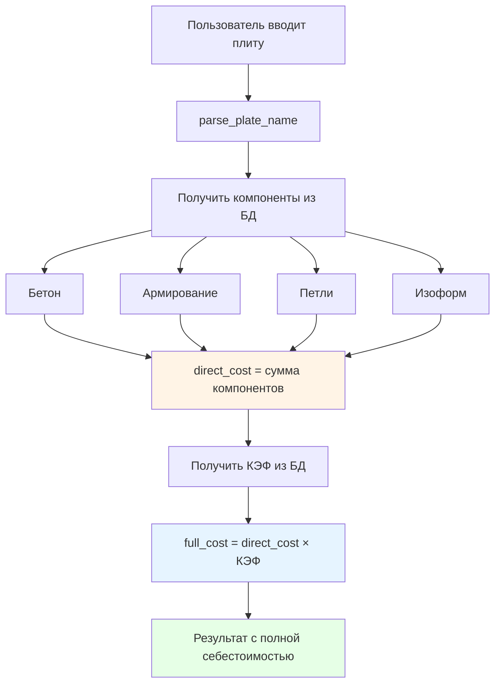

# План исправления расчёта себестоимости

## Проблема

Функция `calculate_plate_cost()` в [`cost_calculation/calculation.py`](cost_calculation/calculation.py) рассчитывает только **прямые затраты** (бетон + армирование + петли + изоформ), но не применяет **КЭФ** (коэффициент накладных расходов).По формулам из Excel ([`sebestoimost_key_formulas.csv`](d:\Downloads\sebestoimost_key_formulas.csv)):

- Лист "Стоимость": прямые затраты = бетон + армирование + петли + изоформ
- Лист "Себестоимость": полная себестоимость = прямые затраты × КЭФ
- Лист "Прайс": цена = полная себестоимость × 1.2

**Текущая проблема (строка 185):**

```python
total_cost = concrete_cost + reinforcement_cost + loops_cost + izoform_cost
```

Это только прямые затраты без КЭФ!

## Решение

### 1. Добавить КЭФ в БД (cost_calculation/db.py)

В функцию `init_default_constants()` добавить константу:

```python
('kef', 1.25, 'коэф', 'КЭФ - коэффициент накладных расходов'),
```

Типичное значение КЭФ = 1.2-1.5 (из Excel файла)

### 2. Создать функцию получения КЭФ (cost_calculation/db.py)

Добавить новую функцию после `get_izoform_norm()`:

```python
def get_kef(db_path: str = DEFAULT_DB) -> float:
    """
    Получает КЭФ (коэффициент накладных расходов) из БД
    
    Returns:
        Значение КЭФ (по умолчанию 1.0 если не найден)
    """
    kef = get_constant('kef', db_path)
    return kef if kef and kef >= 1.0 else 1.0
```


### 3. Исправить calculate_plate_cost() (cost_calculation/calculation.py)

**Импорт (добавить в строку 9):**

```python
from .db import (
    init_cost_schema, init_default_constants,
    get_constant, get_concrete_norms, get_reinforcement_norms, get_izoform_norm,
    get_kef  # <- ДОБАВИТЬ
)
```

**Изменить расчёт (после строки 185):**

```python
# Прямые затраты (как раньше)
direct_cost = concrete_cost + reinforcement_cost + loops_cost + izoform_cost

# Применяем КЭФ (по формуле из Excel)
kef = get_kef(db_path)
full_cost_with_kef = direct_cost * kef
overhead_cost = full_cost_with_kef - direct_cost

return {
    'plate_name': plate_name,
    'parameters': params,
    'volume_m3': volume_m3,
    'components': {
        'concrete': round(concrete_cost, 2),
        'reinforcement': round(reinforcement_cost, 2),
        'loops': round(loops_cost, 2),
        'izoform': round(izoform_cost, 2)
    },
    'direct_cost': round(direct_cost, 2),           # <- ДОБАВИТЬ: прямые затраты
    'overhead_cost': round(overhead_cost, 2),       # <- ДОБАВИТЬ: накладные
    'full_cost_with_kef': round(full_cost_with_kef, 2),  # <- ДОБАВИТЬ: полная себестоимость
    'kef': kef,                                     # <- ДОБАВИТЬ: КЭФ
    'total_cost': round(direct_cost, 2),           # <- ОСТАВИТЬ для обратной совместимости
    'breakdown': get_cost_breakdown(
        length_dm, width_dm, load_code, volume_m3, concrete_grade, db_path
    )
}
```


### 4. Экспортировать get_kef в **init**.py (cost_calculation/**init**.py)

Добавить в импорты (строка 6):

```python
from .db import (
    init_cost_schema, init_default_constants,
    get_constant, get_concrete_norms, get_reinforcement_norms, get_izoform_norm,
    get_kef  # <- ДОБАВИТЬ
)
```

Добавить в `__all__` (строка 28):

```python
__all__ = [
    'calculate_plate_cost', 'calculate_concrete_cost',
    'calculate_reinforcement_cost', 'calculate_loops_cost',
    'calculate_izoform_cost',
    'init_cost_schema', 'init_default_constants',
    'get_constant', 'get_concrete_norms', 'get_reinforcement_norms', 'get_izoform_norm',
    'get_kef',  # <- ДОБАВИТЬ
    'parse_plate_name',
]
```


## Результат

После исправления:

```python
result = calculate_plate_cost("ПБ 17-12-6")
# {
#     'plate_name': 'ПБ 17-12-6',
#     'direct_cost': 2219.82,        # Прямые затраты
#     'overhead_cost': 443.96,        # Накладные (при КЭФ=1.2)
#     'full_cost_with_kef': 2663.78,  # Полная себестоимость
#     'kef': 1.2,
#     'total_cost': 2219.82,          # Для обратной совместимости
#     'components': {...}
# }
```


## Соответствие формулам Excel

- Лист "Стоимость" R4 = H4 + L4 + P4 + Q4 → `direct_cost`
- Лист "Себестоимость" M3 = L3 × КЭФ → `overhead_cost` 
- Лист "Себестоимость" E3 = прямые + накладные → `full_cost_with_kef`

## Файлы для изменения

1. [`cost_calculation/db.py`](cost_calculation/db.py) - добавить КЭФ в константы и функцию get_kef()
2. [`cost_calculation/calculation.py`](cost_calculation/calculation.py) - применить КЭФ в расчёте
3. [`cost_calculation/__init__.py`](cost_calculation/__init__.py) - экспортировать get_kef

## Диаграмма потока данных




## Обратная совместимость

Поле `total_cost` остаётся для обратной совместимости со старым кодом, но теперь добавлены:

- `direct_cost` - прямые затраты
- `overhead_cost` - накладные расходы  
- `full_cost_with_kef` - полная себестоимость с КЭФ