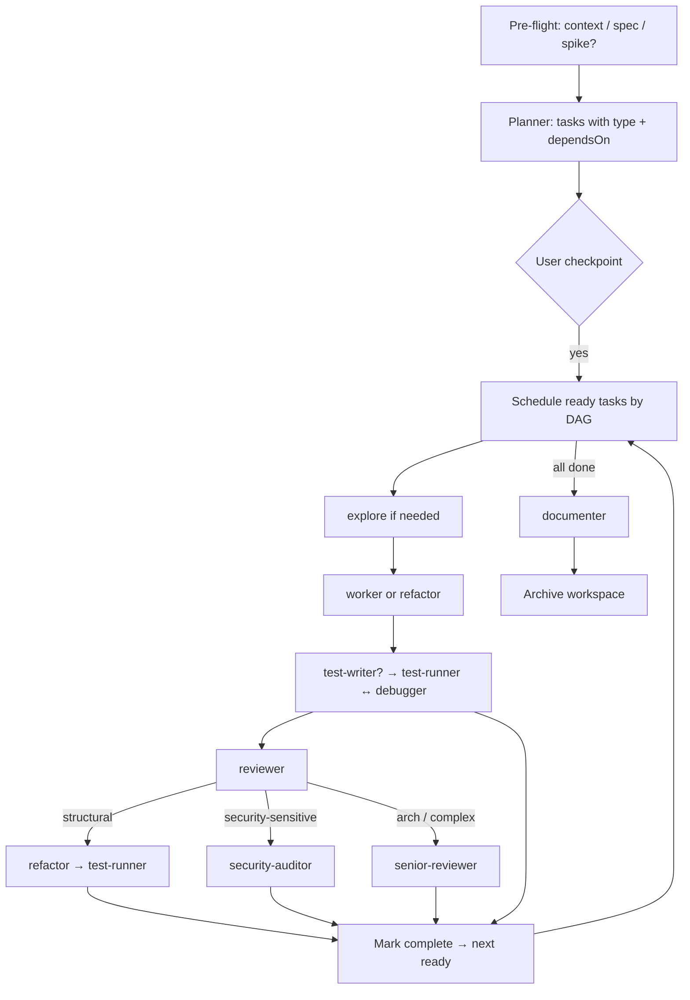

# Orchestration Workflow Skill

**Purpose**: Orchestrate complete development cycle — from planning to documentation with conditional pipelines, dependency-aware scheduling, and automatic error fixing.

## Workflow Architecture



## How It Works

### Phase 0: Pre-flight (coordinator, before planner)

**Always inject project context into planner/worker prompts:**
- Read `.cursor/skills/plan-web-context/SKILL.md` (or `project-shishov`) and pass a short summary + relevant paths into every implementation agent.

**Gate — what are we building?**

```javascript
hasSpec = userAttachedSpec || existsInDocs("specs|features|ideas") // from user input
isSpikeOnly = userAskedValidation || ideaHasUncheckedAssumptions // e.g. A1–A3

if (!hasSpec && !isSpikeOnly && taskIsNonTrivial) {
  // Prefer clarifying before a full code cycle
  askUser("Нет спеки. Сначала spec/idea-refine, spike-валидация, или сразу план?")
  // If user chooses spec → call planner only after spec exists, OR route to
  // Task(subagent_type="planner") with mode focused on validation tasks (type: spike)
}

if (isSpikeOnly) {
  // Planner must emit mostly type:spike tasks — no full UI/MVP until validated
}
```

Do **not** silently invent product requirements. Surface assumptions in the plan.

### Phase 1: Planning

1. Call **planner** with the full task description + pre-flight notes
2. Planner **must** create for each task: `type`, `dependsOn`, `pipeline` (see Task Types)
3. Planner creates:
   - Workspace: `.cursor/workspace/active/orch-{id}/`
   - Plan file: `workspace/plan.md` OR user's file / `ai_docs/develop/plans/`
   - Metadata: `progress.json`, `tasks.json`, `links.json`
4. Planner returns orchestration ID

**Planner output contract** — every task in `tasks.json`:

```json
{
  "AUTH-001": {
    "id": "AUTH-001",
    "name": "User Model",
    "type": "feat-be",
    "dependsOn": [],
    "pipeline": ["explore", "worker", "test-writer", "test-runner", "reviewer"],
    "securitySensitive": false,
    "needsExplore": true,
    "status": "pending"
  }
}
```

Plan markdown should also show type and dependencies per task.

### Phase 1b: User checkpoint (MANDATORY)

After planner finishes, **stop and show the plan**. Do not start Task 1 until the user approves.

```markdown
📋 Plan ready: {orchestrationId}
Tasks: …
DAG: …
Pipelines: (summary by type)

Proceed with execution? (yes / change plan / spike-only first)
```

- `yes` → Phase 2
- `change plan` → planner again with feedback
- `spike-only first` → execute only `type:spike` tasks, leave rest pending

**Exception:** User already said `/orchestrate execute {id}` or explicitly «выполняй без подтверждения».

### Phase 2: Load Orchestration

**Read configuration:**
```javascript
config = readJSON(".cursor/config.json") || defaultConfig
workspacePath = config.workspace.path
```

**Load orchestration state:**
```javascript
orchestrationId = userInput || findLatestActive()
workspaceDir = `${workspacePath}/active/${orchestrationId}`
// Also check failed/ for resume:
// `${workspacePath}/failed/${orchestrationId}`

progress = readJSON(`${workspaceDir}/progress.json`)
tasksState = readJSON(`${workspaceDir}/tasks.json`)
links = readJSON(`${workspaceDir}/links.json`)

planContent = read(links.plan || `${workspaceDir}/plan.md`)
taskIds = extractTaskIds(planContent)
```

**Resume:** If `progress.status` is `failed` / interrupted, skip `completed` tasks, continue from first non-completed ready task. Prefer `/orchestrate resume [{id}]`.

### Phase 3: Task Loop (DAG)

**CRITICAL:** Do not blindly iterate list order. Schedule by dependencies.

```javascript
function readyTasks(tasksState) {
  return Object.values(tasksState).filter(t =>
    t.status === "pending" &&
    (t.dependsOn || []).every(id => tasksState[id]?.status === "completed")
  )
}

function markBlocked(tasksState) {
  for (const t of Object.values(tasksState)) {
    if (t.status !== "pending") continue
    const blockedBy = (t.dependsOn || []).filter(
      id => tasksState[id]?.status !== "completed"
    )
    if (blockedBy.length) {
      t.status = "blocked"
      t.blockedBy = blockedBy
    }
  }
}
```

**Parallelism:** If several tasks are `ready` and do not touch the same files (planner should note `parallelSafe: true`), launch multiple worker pipelines via parallel `Task` calls. Default: one task at a time if unsure.

**Before starting each task:**
```javascript
if (tasksState[taskId]?.status === "completed") continue

tasksState[taskId] = {
  ...tasksState[taskId],
  status: "in-progress",
  startedAt: now()
}
write(`${workspaceDir}/tasks.json`, tasksState)
updateTaskInPlan(links.plan || `${workspaceDir}/plan.md`, taskId, "🔄 In Progress")
updateJSON(`${workspaceDir}/progress.json`, {
  status: "in-progress",
  currentTask: taskId,
  lastUpdated: now()
})
```

#### Resolve pipeline

```javascript
const PIPELINES = {
  "feat-be": ["explore", "worker", "test-writer", "test-runner", "reviewer"],
  "feat-fe": ["explore", "worker", "test-writer", "test-runner", "reviewer"],
  "ui":      ["explore", "worker", "test-writer", "test-runner", "reviewer"], // worker gets frontend-ui skill
  "api":     ["explore", "worker", "test-writer", "test-runner", "reviewer", "security-auditor"],
  "auth":    ["explore", "worker", "test-writer", "test-runner", "reviewer", "security-auditor"],
  "arch":    ["explore", "senior-reviewer", "worker", "test-writer", "test-runner", "reviewer", "senior-reviewer"],
  "refactor":["senior-reviewer", "refactor", "test-runner"],
  "spike":   ["explore", "worker", "test-runner", "documenter-lite"],
  "docs":    ["documenter"],
  "chore":   ["worker", "test-runner"]
}

pipeline = task.pipeline || PIPELINES[task.type] || PIPELINES["feat-be"]

// Auto-extend:
if (task.securitySensitive || ["auth", "api"].includes(task.type)) {
  appendUnique(pipeline, "security-auditor")
}
if (task.type === "ui") {
  workerExtraSkills.push("frontend-ui-engineering")
  // optional: browser-testing-with-devtools after test-runner if UI behavior changed
}
```

#### Step A: Explore (optional)

If `explore` in pipeline or `needsExplore !== false` for feat/arch:

```
Task(subagent_type="explore", prompt="Find existing code for: {task}.
Return: key files, functions, patterns to reuse, risks.
Project context: {plan-web-context summary}")
```

Pass explore result into worker prompt.

#### Step B: Implementation

- `worker` — default implementation
- `refactor` — when `type === "refactor"` (no behavior change)
- For `docs` — skip to documenter only
- For `spike` — scripts/measurements/validation only; no production UI unless asked

Prompt must include: task acceptance criteria, explore findings, plan goal, `plan-web-context` paths.

#### Step C: Tests (conditional)

Skip **test-writer** when:
- `type` in `docs`, `spike` (unless spike produced code under test)
- `type === "chore"` and no logic files changed
- `type === "refactor"` (existing tests must cover; test-runner only)

Otherwise:
1. **test-writer** for changed code
2. **test-runner** — linter + tests + acceptance criteria

**On failure:**
- Call **debugger** with error details
- Re-run **test-runner**
- Max **3** attempts; after **2** failures, include a root-cause hypothesis in the debugger prompt
- If still failing → set task `status: "failed"`, report to user, ask guidance (do not silently continue)

#### Step D: Review (conditional)

Skip **reviewer** for `docs` and pure `spike` (unless code landed in repo).

Otherwise call **reviewer**.

**Route findings:**
| Finding class | Agent |
|---------------|--------|
| Bugs / test gaps / small fixes | **debugger** → re-review |
| Structural / complexity / DRY | **refactor** → **test-runner** → re-review |
| Security | **security-auditor** (or debugger if trivial) |

Max 3 review fix cycles. If exceeded → pause for user.

#### Step E: Conditional heavy agents

- **security-auditor** — if in pipeline or reviewer flagged security, or files touch auth/upload/SQL/raw queries/API tokens
- **senior-reviewer** — if `type === "arch"`, or task touches >5 modules / optimizer / calendar planning cores, or planner set `needsArchitectureReview: true`
  - For `arch`: once before worker (approach) and once after reviewer (delta) is ideal; at minimum after implementation

Do **not** run full audit (senior + security + reviewer on whole repo) inside every task — that is `/audit`.

#### Step F: Complete task

```javascript
tasksState[taskId] = {
  ...tasksState[taskId],
  status: "completed",
  completedAt: now(),
  filesChanged: result.filesChanged,
  testsRun: testResult?.total ?? 0,
  testsPassed: testResult?.passed ?? 0
}
write(`${workspaceDir}/tasks.json`, tasksState)
updateTaskInPlan(..., taskId, "✅ Completed")

// Unblock dependents: blocked → pending when dependsOn satisfied
for (const t of Object.values(tasksState)) {
  if (t.status === "blocked" &&
      (t.dependsOn || []).every(id => tasksState[id]?.status === "completed")) {
    t.status = "pending"
    delete t.blockedBy
  }
}

updateJSON(`${workspaceDir}/progress.json`, {
  tasksCompleted: progress.tasksCompleted + 1,
  currentTask: null,
  lastUpdated: now()
})
```

Show progress: `Task k/N complete — ready next: […]`.

### Phase 4: Finalization

After all tasks `completed` (or user accepts partial done with spikes only):

```javascript
updateJSON(`${workspaceDir}/progress.json`, { status: "documenting", lastUpdated: now() })

reportFile = callDocumenter({
  orchestrationId: progress.id,
  planFile: links.plan,
  tasksState: tasksState
})

updateJSON(`${workspaceDir}/links.json`, { report: reportFile })
updateJSON(`${workspaceDir}/progress.json`, {
  status: "completed",
  completedAt: now(),
  reportFile: reportFile
})

move(
  `${workspacePath}/active/${orchestrationId}`,
  `${workspacePath}/completed/${orchestrationId}`
)
```

On unrecoverable failure: move to `failed/` (keep for resume), set `status: "failed"`.

## Task Types

| Type | Use when | Default pipeline |
|------|----------|------------------|
| `feat-be` | Backend feature | explore → worker → test-writer → test-runner → reviewer |
| `feat-fe` | Frontend feature | explore → worker → test-writer → test-runner → reviewer |
| `ui` | User-facing UI | same + frontend-ui skill; optional browser verify |
| `api` | Public/internal API | feat-be + security-auditor |
| `auth` | Authz/authn | feat-be + security-auditor |
| `arch` | Cross-module design | senior-reviewer + full feat pipeline |
| `refactor` | Behavior-preserving restructure | senior-reviewer → refactor → test-runner |
| `spike` | Validate assumption / measure | explore → worker → test-runner (light) |
| `docs` | Documentation only | documenter |
| `chore` | Config/tooling | worker → test-runner |

## Important Rules

### Sequential agents within a task
- Wait for each agent before the next step in the same task
- Pass context forward (files, errors, explore map)
- Debugger only when there are real failures/findings

### DAG across tasks
- Honor `dependsOn`
- Parallelize only `parallelSafe` ready tasks
- Never start a task whose dependencies failed — mark `blocked`, ask user

### Error Handling
- Max 3 retries per stage (test / review)
- After 2 test failures → debugger gets explicit hypothesis request
- Max retries exhausted → user guidance, workspace stays resumable

### Task Limits
- **Recommended max: 10 tasks per cycle**
- If more: complete first 10, report, ask to continue
- If context window pressure: save progress, ask user to `/orchestrate resume` in a new chat

### Context Management
- Every worker/planner prompt: project context + task acceptance criteria
- Debugger: concrete errors + files
- Documenter: full tasksState + plan

### Do not over-agent
- Skip test-writer/reviewer when pipeline says so
- Do not call senior-reviewer + security-auditor on every chore
- Full-repo health → `/audit`, not in-task

## Trigger Phrases

- `/orchestrate [task]`
- `/orchestrate execute [orch-id]`
- `/orchestrate resume [orch-id]`
- "Orchestrate [X]"
- "Full implementation of [Y]"

## When to Use This vs Simple Workflow

| Use `/implement` | Use `/orchestrate` |
|-----------------|---------------------|
| Single component | Full feature |
| One file change | Multiple modules |
| No planning needed | Needs breakdown |
| Quick task | Complex project |

## Example: Conditional cycle

```markdown
### Phase 0–1
Pre-flight → planner tags PLAN-001 spike, PLAN-002 feat-be, PLAN-003 ui
Checkpoint → user: yes

### Task PLAN-001 (spike)
explore → worker (validation script) → test-runner → ✅

### Task PLAN-002 (feat-be, dependsOn: PLAN-001)
explore → worker → test-writer → test-runner → reviewer → ✅

### Task PLAN-003 (ui, dependsOn: PLAN-002)
explore → worker(+frontend-ui) → test-writer → test-runner → reviewer → ✅

### Phase 4
documenter → archive
```

## Retry Logic

### Test/Verification Failures
```
test-runner → FAIL → debugger → test-runner
  ↓ (max 3 attempts; hypothesis after 2)
  ↓
  If still failing: status=failed, report to user
```

### Review Issues
```
review → bugs → debugger → review
review → structural → refactor → test-runner → review
review → security → security-auditor → (debugger if needed) → review
  ↓ (max 3 attempts)
  ↓
  If still issues: report to user
```

## Success Criteria

Workflow is complete when:
- ✅ All planned tasks completed (or explicit partial acceptance)
- ✅ Required tests passing per pipeline
- ✅ Reviews/security gates required by type passed
- ✅ Acceptance criteria verified (test-runner)
- ✅ Documentation created (documenter)
- ✅ Workspace archived to `completed/` (or `failed/` if stopped)

## Notes

- Replaces hook-based orchestration; coordinator runs in the same chat
- User can intervene at checkpoint and on failures
- Subagents via `Task` tool; coordinator updates workspace metadata
- Max 3 retries prevents infinite loops
- Aligns with `/audit` and `/refactor` agent roles without duplicating full audit each task
