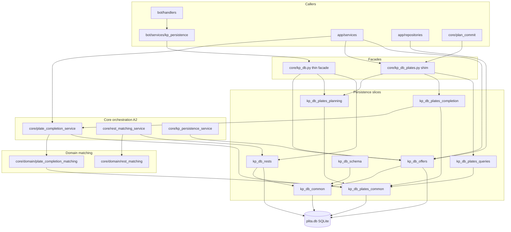

# Повторный consolidated audit: `core/kp_db` и границы слоёв

**Дата:** 2026-06-04  
**Область (scope):** `core/kp_db.py` и декомпозиция (`kp_db_*`, `kp_db_plates_*`), domain matching (`core/domain/*matching*`), оркестрация (`core/*_service.py`), границы `app` / `bot` / `plan_commit`  
**Baseline:** [2026-06-03-core-kp-db-audit.md](2026-06-03-core-kp-db-audit.md) — Health **2.0 / 10**  
**Контекст remediation:** stages 1–6 (обязательно в нарративе) + stages 7–12 по коду (plates sub-slices, rest/persistence services, debug/audit/boundary)  
**Проверено:** senior-reviewer + security-auditor + reviewer (прогон `/audit`, consolidated re-audit)  
**Remediation в рамках данного отчёта:** **не применялся**

---

## 1. Executive Summary

После remediation (roadmap + stages 1–12) монолит `core/kp_db.py` (~4034 строк, ~54 `def`) превращён в **тонкий фасад re-export** (~**143** строки / ~132 LOC). Логика распределена по `kp_db_offers`, `kp_db_rests`, `kp_db_schema`, `kp_db_plates_*` и трём orchestration-сервисам в `core/`. Критические риски P0 baseline (NDJSON в hot path completion, кросс-КП по умолчанию, PII менеджеров в коде, split без identity, отсутствие regression-тестов, core→app) **закрыты или существенно снижены**.

Остаётся **один Critical OPEN:** god-slice **`kp_db_plates_planning.py`** (~740 LOC / ~792 строки файла) — планирование, split, return/recover в одном модуле.

### Health Score — две оценки

| Оценка | Значение | Смысл |
|--------|----------|--------|
| **Строгая (все OPEN findings)** | **4.0 / 10** | Формула audit-workflow по незакрытым находкам re-audit |
| **Прагматическая (stages 1–6+ FIXED)** | **~6.0–6.5 / 10** | Учитывает закрытые A1/A2/A4/S4/S5/S7, plates sub-slices, core services, 113+ pytest |

**Формула (строгий подсчёт OPEN):**

```
10 − min(2×Critical, 6) − min(High×0.5, 3) − min(Medium×0.1, 1)
= 10 − min(2×1, 6) − min(15×0.5, 3) − min(25×0.1, 1)
= 10 − 2 − 3 − 1 = 4.0
```

### Агрегированная серьёзность (dedupe тем в нарративе)

| Категория | Critical | High | Medium | Low | **Итого** |
|-----------|----------|------|--------|-----|-----------|
| Архитектура | 1 | 6 | 8 | 5 | 20 |
| Безопасность | 0 | 6 | 9 | 4 | 19 |
| Качество кода | 0 | 3 | 8 | 4 | 15 |
| **Всего (raw)** | **1** | **15** | **25** | **13** | **54** |

### Вердикт

| Аспект | Оценка |
|--------|--------|
| Persistence КП | **Пригоден для разработки** при контроле High (границы app/bot, debug в nomenclature/bot completion, эвристики matching) |
| Следующий волновой приоритет | Декомпозиция **`kp_db_plates_planning`**, wave 2 **A3** (остатки `kp_db` facade), снижение сложности **`find_kp_plate_row`** |
| Целевой re-audit после planning-split | strict Health **≥ 5.5**, pragmatic **≥ 7.0** |

---

## 2. Сравнение: 2026-06-03 vs 2026-06-04

| Метрика | 2026-06-03 (baseline) | 2026-06-04 (re-audit) |
|---------|------------------------|------------------------|
| Health (строгий) | **2.0** | **4.0** |
| Health (прагматический) | — | **~6.0–6.5** |
| Critical (арх.) | 2 (A1 монолит, A2 домен в SQL) | **1** (A1b `kp_db_plates_planning`) |
| High (все категории) | 15 | 15 (состав сменился: часть → FIXED) |
| Medium | 22 | 25 |
| Low | 15 | 13 |
| Всего находок (raw) | 54 | 54 |
| `core/kp_db.py` | ~4034 строк, god module | **~143 строк** — фасад re-export (промежуточно в remediation доходило до ~1969 строк «толстого» shim; **финал — thin facade**) |
| `kp_db_plates` aggregate | внутри монолита | **~57 строк** — thin shim → `kp_db_plates_*` |
| `kp_db_plates_planning` | — | **~740 LOC / ~792 строки** — новый god-slice |
| `init_schema` на каждый вызов | 48× в монолите | `ensure_schema()` на старте `app/main.py`, `bot/bot_main.py`; **lazy leaks OPEN** (auth_repository, тесты) |
| Тесты kp_db / matching / boundary | 2 файла | **113 passed** (расширенный phase-2 набор, см. §7); stage 6 — **40 passed** |
| Прямой `core.kp_db` из bot | множество handlers | KP/commercial → `bot/services/kp_persistence`; production → slice modules + guards |
| Debug NDJSON в completion hot path | High S1/A7 | Убран из `core/plate_completion_service`; gated через `kp_db_agent_debug_active()`; **OPEN** в nomenclature, bot `production_completion` |
| `plan_commit` | `from core import kp_db` | `from core import kp_db_plates` — улучшение границы (частично A3) |
| Orchestration completion | в `kp_db` / `kp_db_plates` | **`core/plate_completion_service.py`** (~183 LOC) |

---

## 3. Что закрыто remediation (audit ID → stage)

| Audit ID | Статус | Этап / deliverable |
|----------|--------|-------------------|
| **A1** (монолит `kp_db.py` целиком) | **FIXED** | Slices + фасад ~143 строк; `kp_db_common`, `kp_db_offers`, `kp_db_rests`, `kp_db_managers`, `kp_db_nomenclature`, `kp_db_schema` |
| **A1** (plates aggregate) | **FIXED (shim)** | `kp_db_plates.py` → re-export; sub-slices: `kp_db_plates_common`, `kp_db_plates_completion`, `kp_db_plates_planning`, `kp_db_plates_queries` |
| **A2** (оркестрация completion) | **FIXED** | Stage 6: `core/plate_completion_service.py`; facade `kp_db_plates_completion.move_plates_to_completed` → service |
| **A2** (rests) | **FIXED** | Stage 7: `core/rest_matching_service.py` + `core/domain/rest_matching.py` |
| **A2** (save_kp) | **FIXED** | Stage 12: `core/kp_persistence_service.py` |
| **A4** / M6 (startup schema) | **FIXED (partial)** | Stage 5: `ensure_schema()` в `app/main.py`, `bot/bot_main.py` |
| **A5** | **FIXED** | Stage 9: `kp_db_audit.audit_append` + `PlateAuditRepository` |
| **A7** / **S1** (completion hot path) | **FIXED** | Stage 8: NDJSON убран из orchestration; `test_kp_db_agent_debug_log` |
| **S2** | **FIXED** | Stage 1: `data/managers_seed.json`, `MANAGERS_SEED_PATH`, `scripts/init_managers.py` |
| **S4** (кросс-КП default) | **FIXED** | Stage 2: `allow_cross_kp=False`; runbook [allow-cross-kp-runbook.md](../guides/allow-cross-kp-runbook.md) |
| **S5** | **FIXED** | Stage 1: `kp_file_paths.resolve_kp_xlsx_path_for_read` |
| **S7** | **FIXED** | Stage 3: `destructive_db_guard` + тесты |
| **Q1** | **FIXED** | Stage 1: split INSERT сохраняет `nomenclature_id`, `length_dm_raw` |
| **Q3** (golden regression) | **FIXED** | `test_kp_db_move_plates_to_completed`, rests, split identity, persistence, boundary |
| **Layer: core→app** | **FIXED** | `test_core_no_app_import`; orchestration в `core/`, не в `app/services` (уточнение post–stage 6) |
| **A3** (bot KP path) | **FIXED (partial)** | Stage 4: `bot/services/kp_persistence.py` |
| **A3** (production services) | **FIXED (partial)** | Stage 10: slice imports; `test_production_services_kp_boundary` |
| **A3** (`plan_commit`) | **FIXED (partial)** | Импорт `kp_db_plates`, не монолитный `kp_db` |
| **A8** (`KpRepository`) | **FIXED (partial)** | `kp_repository` → `kp_db_offers`, не полный фасад |
| **init_schema bug** (completion slice) | **FIXED** | Security: `kp_db_plates_completion` без лишнего `init_schema` на hot path |
| **Bot auth / prod guards** | **FIXED** | `bot/middleware/auth.py`, `role.py`; gated debug utilities |

**Остаётся OPEN:** A1b, A3 (остатки facade), A4 leaks, A2-SQL в domain, A6, A7/S1 остатки, A8 partial, A9–A15, S3/S6/S8/S9, Q2/Q3/Q10 и др. (§4–5).

### Stage 6 — уточнение для нарратива

| Было (отчёт stage 6, 2026-06-04) | Фактическое состояние re-audit |
|----------------------------------|--------------------------------|
| Orchestration в `app/services/plate_completion_service.py` | **`core/plate_completion_service.py`** — слой core, без зависимости core→app |
| Transitional `core → app` shim | Снят: lazy import ведёт на **`core.plate_completion_service`** |
| `kp_db_plates.move_plates_to_completed` | Facade в `kp_db_plates_completion.py` → `PlateCompletionService.move_plates_to_completed` |
| Верификация stage 6 | **40 passed** (move + service + production_completion + audit + plan_consistency) |

---

## 4. Находки по серьёзности

> Пересечения (S1+A7, A4+M6, Q1+A13, A6+S9+Q2) объединены одной строкой в нарративе; в таблицах — **первичный ID**.

### 4.1 Архитектура (senior-reviewer)

#### Critical — OPEN

| ID | Тема | Расположение | Влияние | Исправление |
|----|------|--------------|---------|-------------|
| **A1b** | God-slice planning: `mark_plates_as_planned`, split qty, return/recover, assign — единый модуль | `core/kp_db_plates_planning.py` (~**740** LOC, **~792** строки файла) | Любое изменение плана/split/return затрагивает весь слайс; review и изолированные тесты тяжёлые | Нарезка: `plates_plan_assign.py`, `plates_split.py`, `plates_return.py` (bounded context) |

#### High — OPEN

| ID | Тема | Расположение | Влияние | Исправление |
|----|------|--------------|---------|-------------|
| **A3** | App/bot всё ещё на фасаде `core.kp_db` или смешанные импорты | `app/planning/plan_manager.py`, `app/services/plate_parser_service.py`, `app/repositories/manager_repository.py`, `bot/services/kp_persistence.py`, `bot/bot_main.py` | Тройной обход: facade + slice + service; сложно отследить bounded context | Wave 2: slice-first imports; deprecate `kp_db` для новых callers |
| **A3-plan** | `plan_commit` зависит от `mark_plates_as_planned` в planning slice | `core/plan_commit.py` → `kp_db_plates` | Связка optimizer ↔ тяжёлый planning module | Выделить порт «plan persistence»; тонкий adapter |
| **A4** | `init_schema` / ensure leaks вне startup | `app/repositories/auth_repository.py` (4×), тесты, legacy scripts | Лишняя нагрузка, race при DDL | Только `ensure_schema` на lifespan; repository без DDL |
| **A4-reg** | Регрессия lazy `init_schema` в slice callers | Проверено: `kp_db_plates_completion` — **без** `init_schema` (**FIXED**); leaks в auth/tests — **OPEN** | — | Расширить `test_kp_db_schema_boundary` |
| **A2** | SQL и курсорные детали в domain matching | `core/domain/plate_completion_matching.py`, `core/domain/rest_matching.py` | Граница domain ↔ persistence размыта; domain знает `SELECT_COLS`, `STATUS_FILTER` | Ports: `PlateRowLookupPort`; SQL в `kp_db_plates_queries` / adapters |
| **A2-shim** | Импорт через aggregate `kp_db_plates` скрывает sub-slice | Callers `from core import kp_db_plates` | Неявная зависимость от planning god-slice | Прямые импорты `kp_db_plates_completion` / `kp_db_plates_planning` |
| **A6** / **S9** | Эвристический matching, O(n) сканы, допуски | `find_kp_plate_row` steps 0–7; шаги 2.55/2.6 | Предсказуемость списания; кросс-КП только opt-in (**S4 FIXED**) | Индексы, стратегии по шагам, golden per step |
| **A8** | Repository / services — частичный proxy | `manager_repository` → `core.kp_db`; `kp_repository` уже `kp_db_offers` | Несогласованная граница | Единый policy: repositories → slice modules only |
| **A7** / **S1′** | Debug NDJSON в nomenclature path | `core/kp_db_nomenclature.py` + `debug_paths` | PII/КП в `debug_logs/` при `APP_DEBUG` | Gated writes only; удалить legacy `#region agent log` |

#### Medium / Low — OPEN (архитектура)

| ID | Серьёзность | Тема | Статус |
|----|-------------|------|--------|
| **A9** | Medium | Нет Unit of Work — каждая функция своё соединение | OPEN |
| **A10** | Medium | DDL/backfill в runtime `ensure_schema` | OPEN |
| **A11** | Medium | BLOB XLSX — рост БД | OPEN |
| **A12** | Medium | Dict-based API без TypedDict/Pydantic | OPEN |
| **A13** | Medium | Split qty DRY в planning (4+ места) | OPEN |
| **A3b** | Medium | Triple facade: `kp_db` + slices + services | OPEN |
| **A5** | Medium | Legacy `_audit_append` в `kp_db_common` | OPEN (minor) |
| **A14** | Low | Deprecation path для `kp_db` не формализован | OPEN |
| **A15** | Low | Error contracts (bool/int/dict/raise) | OPEN |
| **A16–A20** | Low | `print`, DEFAULT_DB hardcode, magic tolerances | OPEN |

#### Архитектура — FIXED (таблица)

| ID | Что сделано |
|----|-------------|
| **A1** | `kp_db.py` thin facade; bounded-context modules |
| **A1 plates** | `kp_db_plates.py` shim → `kp_db_plates_*` |
| **A2** | `PlateCompletionService`, `RestMatchingService`, `KpPersistenceService` в `core/` |
| **A4** | Startup `ensure_schema` app/bot |
| **A5** | `kp_db_audit` + `PlateAuditRepository` |
| **A7** | Completion orchestration без NDJSON hot path |
| **plan_commit** | `kp_db_plates` вместо монолита |
| **core→app** | `test_core_no_app_import` green |
| **S4 default** | `allow_cross_kp=False` + runbook |

---

### 4.2 Безопасность (security-auditor)

#### Critical

**Нет** открытых Critical (baseline S1 в completion hot path — закрыт).

#### High — OPEN

| ID | Тема | Расположение | Влияние | Исправление |
|----|------|--------------|---------|-------------|
| **S3** | Нет authz на слое core DB | Все публичные `kp_db_*` | Любой импортёр = полный доступ к SQLite API | Policy: destructive только через guarded services; роли в app/bot |
| **S6** | SQLite без шифрования, BLOB XLSX | `kp_files`, deployment | Утечка при копировании `.db` | SQLCipher / том; лимит BLOB |
| **S1′** | Nomenclature NDJSON / debug paths | `kp_db_nomenclature.py`, `core/debug_paths.py` | PII при включённом debug | Не писать plate_name/kp_id в NDJSON в prod |
| **S1″** | Bot completion debug | `bot/handlers/production_completion.py`, `debug_util` | Session NDJSON с trace completion flow | Gated by role + `app_debug`; не в production |
| **S4′** | Opt-in cross-KP — операционный риск | `allow_cross_kp=True` | Списание с чужого `kp_id` | Runbook + audit trail + admin-only |
| **S8** | Write path xlsx менее жёсткий, чем read (S5) | `save_xlsx_file`, `get_xlsx_file` | Path traversal при записи | Symmetry с `kp_file_paths` whitelist |

#### Medium — OPEN (S3 bundle M3–M10)

| ID | Тема | Статус |
|----|------|--------|
| **M3** | BLOB без лимита размера в памяти | OPEN |
| **M4** | `db_path` без валидации | OPEN |
| **M5** | Абсолютный `file_path` в `kp_files` | OPEN |
| **M6** | Дубль A4 — schema на hot path (auth) | OPEN |
| **M7** | Audit actor не везде обязателен | OPEN |
| **M8** | Bot debug utilities без rate limit | OPEN |
| **M9** | `clear_all_*` — guard есть (S7), ops policy | OPEN (controlled) |
| **M10** | Cross-env `DEFAULT_DB` в scripts/tests | OPEN |

#### Low — позитив

| ID | Тема |
|----|------|
| **L1–L4** | WAL, FK, parameterized SQL, `_escape_sql_like` — OK |

#### Безопасность — FIXED

| ID | Что сделано |
|----|-------------|
| **S4** | Default `allow_cross_kp=False` + runbook |
| **S5** | Read path validation `kp_file_paths` |
| **S7** | `destructive_db_guard` |
| **S2** | Managers seed вне кода |
| **S1/A7** | Completion core без agent NDJSON |
| **init_schema bug** | `kp_db_plates_completion` — без регрессии `init_schema` на каждый вызов |

---

### 4.3 Качество кода (reviewer)

#### High — OPEN

| ID | Тема | Расположение | Влияние | Исправление |
|----|------|--------------|---------|-------------|
| **A1b** / **Q2** | `mark_plates_as_planned` — длинная процедура, смешение шагов | `kp_db_plates_planning.py` | Высокая CC, регрессии при правках плана | Декомпозиция + unit-тесты по шагам |
| **Q10** | `length_dm_raw` не везде в read path `completed_plates` | `kp_db_plates_queries.py`: `SELECT *` без явного контракта; INSERT в common — OK | Потребители могут не видеть поле | Явный SELECT с колонками + contract test |
| **Q3** | `find_kp_plate_row` — сложность, gaps на edge steps | `plate_completion_matching.py` | Регрессии шагов 2.55/2.6 | Golden test per step (частично есть — расширить) |
| **M1** / **Q5** | `print` + traceback в operational path | planning, completion check, offers | Шум в prod, утечка в stdout | `logging` + structured errors |
| **Q9** | Broad `except` в debug/legacy | `debug_paths`, bot debug_util | Скрытые сбои | Узкие исключения + log |

#### Medium / Low — OPEN (качество)

| ID | Серьёзность | Тема |
|----|-------------|------|
| **Q4** | Medium | `#region agent log` — техдолг |
| **Q6** | Medium | Dict API (дубль A12) |
| **Q7** | Medium | Unused / dead code в слайсах |
| **Q8** | Medium | Дублирование normalize length/qty |
| **Q11** | Medium | Нет connection context manager |
| **Q13** | Low | Test gaps: production planning flows |
| **Q14** | Low | Tests import `kp_db` facade vs slice |
| **Q15** | Low | Magic tolerances без config |
| **Q16** | Low | `update_kp_discount` в offers slice |

#### Качество — FIXED

| ID | Что сделано |
|----|-------------|
| **Q1** | Split identity: `nomenclature_id`, `length_dm_raw` |
| **Q3** | Regression: move_plates, rests, split, services |
| **A2** | Orchestration вынесена из persistence blob |
| **Schema boundary** | `test_kp_db_schema_boundary`, destructive guard tests |

---

## 5. Матрица приоритетов (топ 15)

| Приоритет | ID | Проблема | Категория | Усилие |
|-----------|-----|----------|-----------|--------|
| **P0** | **A1b** | Декомпозиция `kp_db_plates_planning` (plan / split / return) | Critical | High |
| **P0** | **A7/S1′** | Gated/удалить NDJSON в nomenclature + bot completion debug | High | Low |
| **P0** | **A3** | Wave 2: убрать остатки `core.kp_db` facade (`plan_manager`, `kp_persistence`, parsers) | High | High |
| **P1** | **A6/Q2/Q3** | Упростить `find_kp_plate_row` + индексы + golden per step | High | High |
| **P1** | **A4** | Убрать `init_schema` leaks из `auth_repository` | High | Medium |
| **P1** | **A8** | `manager_repository` → `kp_db_managers` | High | Low |
| **P1** | **S8** | Symmetry path validation read/write xlsx | High | Low |
| **P1** | **Q10** | Явный SELECT `completed_plates` + `length_dm_raw` | High | Low |
| **P2** | **A2** | Domain matching без прямого SQL — ports/adapters | High | High |
| **P2** | **Q1/A13** | Единая функция split INSERT (DRY) | High | Medium |
| **P2** | **A3-plan** | `plan_commit` → thin planning port | High | Medium |
| **P2** | **A9** | Unit of Work для multi-step transactions | Medium | High |
| **P2** | **A12/Q6** | TypedDict на plate dict boundaries | Medium | Medium |
| **P2** | **S6** | SQLCipher / BLOB limits | High | High |
| **P2** | **S3** | Authz policy на destructive core API | High | Medium |

---

## 6. Следующие шаги

### Немедленно (до следующего релиза)

1. Загейтить или удалить остаточный agent NDJSON (**A7/S1′/S1″**) в `kp_db_nomenclature`, `bot/handlers/production_completion.py`.
2. Зафиксировать ops-процедуру для **`allow_cross_kp=True`** (**S4′**) — [allow-cross-kp-runbook.md](../guides/allow-cross-kp-runbook.md).
3. Проверить write-path xlsx (**S8**) на parity с **S5**.

### Текущий спринт

1. Нарезка **`kp_db_plates_planning`** (**A1b**): planning vs split vs return/recover.
2. Закрыть **A3 wave 2**: `plan_manager`, `plate_parser_service`, `manager_repository`, `bot/kp_persistence` → slice modules.
3. Убрать **`init_schema`** из `auth_repository` hot paths (**A4**).
4. Рефакторинг **`find_kp_plate_row`** (**A6/Q2/Q3**) + golden tests per step.
5. Явный контракт **`completed_plates`** reads (**Q10**).

### Бэклог (phase 3+)

- **A9** Unit of Work; **A12** TypedDict; **S6** encryption; **A14** formal deprecation `kp_db` shim.
- **Q11** connection context manager; **Q13–Q15** planning tests + tolerances в config.
- Повторный slice re-audit после planning-split.

---

## 7. Метрики аудита

### Строки кода (проверено 2026-06-04, PowerShell `Measure-Object -Line`)

| Модуль | LOC (прибл.) | Роль |
|--------|--------------|------|
| `core/kp_db.py` | **132** | Thin facade re-export |
| `core/kp_db_plates.py` | **57** | Plates shim |
| `core/kp_db_plates_planning.py` | **740** | **God-slice OPEN (A1b)** |
| `core/kp_db_plates_completion.py` | **78** | Completion facade → service |
| `core/kp_db_plates_queries.py` | **232** | Read queries |
| `core/kp_db_plates_common.py` | **161** | Primitives INSERT/record |
| `core/kp_db_offers.py` | **991** | KP CRUD (следующий кандидат на split) |
| `core/plate_completion_service.py` | **183** | A2 orchestration |
| `core/rest_matching_service.py` | **69** | A2 rests |
| `core/kp_persistence_service.py` | **132** | A2 save_kp |
| **Сумма slices + facade** | **~3.5k+** | Логика вынесена из монолита |

**Нарратив по `kp_db.py`:** baseline ~4034 → промежуточный remediation shim до ~1969 → **финал ~143 строки** (не путать с промежуточным состоянием в diff-отчётах).

### Тесты (верификация re-audit)

**Stage 6 (A2 completion):** 40 passed.

**Расширенный phase-2 набор (2026-06-04):** **113 passed** за ~12s:

```bash
pytest tests/test_kp_db_move_plates_to_completed.py \
  tests/test_plate_completion_service.py \
  tests/test_kp_db_find_matching_rests.py \
  tests/test_rest_matching_service.py \
  tests/test_kp_persistence_service.py \
  tests/test_production_completion_service.py \
  tests/test_plate_audit.py \
  tests/test_plan_consistency.py \
  tests/test_bot_kp_boundary.py \
  tests/test_production_services_kp_boundary.py \
  tests/test_core_no_app_import.py \
  tests/test_kp_db_agent_debug_log.py \
  tests/test_kp_db_split_preserves_identity.py \
  tests/test_destructive_db_guard.py \
  tests/test_kp_db_xlsx_path_validation.py \
  tests/test_kp_db_init_managers_seed.py \
  tests/test_bot_auth.py -q
```

Дополнительно: `tests/test_kp_db_schema_boundary.py`, `tests/test_settings_app_secret_key.py` (в полном CI).

| Метрика | 2026-06-03 | 2026-06-04 |
|---------|------------|------------|
| pytest (ключевой набор) | 2 файла kp_db | **113 passed** |
| Health strict / pragmatic | 2.0 / — | **4.0 / ~6.0–6.5** |
| `init_schema` в `kp_db` monolith | 48× | 0 в facade; leaks в auth/tests |

---

## 8. Граф зависимостей (architecture)



**Ключевые границы:**

- ✅ Completion orchestration: `PlateCompletionService` в **core** (не app).
- ✅ `plan_commit` → `kp_db_plates`, не монолит.
- ⚠️ Остаточный вход через `kp_db` facade (bot KP, `plan_manager`).
- 🔴 Critical coupling: `kp_db_plates_planning` — hub для plan/split/return.

---

## 9. Связанная документация

### Аудиты

- [2026-06-03-core-kp-db-audit.md](2026-06-03-core-kp-db-audit.md) — baseline Health 2.0

### Runbooks / guides

- [allow-cross-kp-runbook.md](../guides/allow-cross-kp-runbook.md) — политика `allow_cross_kp` (S4′)

### Remediation reports

| Отчёт | Содержание |
|-------|------------|
| [2026-06-04-kp-db-remediation-roadmap-complete.md](../reports/2026-06-04-kp-db-remediation-roadmap-complete.md) | Roadmap phase 1 |
| [2026-06-04-kp-db-remediation-phase2-complete.md](../reports/2026-06-04-kp-db-remediation-phase2-complete.md) | Stages 7–12 |
| [2026-06-04-kp-db-stage1-remediation.md](../reports/2026-06-04-kp-db-stage1-remediation.md) | Q1, Q3, S2, S5 |
| [2026-06-04-kp-db-stage2-s4-remove-2-55.md](../reports/2026-06-04-kp-db-stage2-s4-remove-2-55.md) | S4 cross-KP |
| [2026-06-04-kp-db-stage3-s7-s1.md](../reports/2026-06-04-kp-db-stage3-s7-s1.md) | S7, S1 |
| [2026-06-04-kp-db-stage4-a3-3b-s4.md](../reports/2026-06-04-kp-db-stage4-a3-3b-s4.md) | A3 bot facade |
| [2026-06-04-kp-db-stage5-offers-managers-a4.md](../reports/2026-06-04-kp-db-stage5-offers-managers-a4.md) | A4 startup |
| [2026-06-04-kp-db-stage6-a2-completion.md](../reports/2026-06-04-kp-db-stage6-a2-completion.md) | **A2 completion — 40 passed**; orchestration → `core/plate_completion_service` |
| [2026-06-04-kp-db-stage7-a2-rests.md](../reports/2026-06-04-kp-db-stage7-a2-rests.md) | A2 rests |
| [2026-06-04-kp-db-stage8-a7-debug.md](../reports/2026-06-04-kp-db-stage8-a7-debug.md) | A7, S1 |
| [2026-06-04-kp-db-stage9-a5-audit.md](../reports/2026-06-04-kp-db-stage9-a5-audit.md) | A5 audit |
| [2026-06-04-kp-db-stage10-a3-production.md](../reports/2026-06-04-kp-db-stage10-a3-production.md) | A3 production |
| [2026-06-04-kp-db-stage11-core-services.md](../reports/2026-06-04-kp-db-stage11-core-services.md) | Layer boundary |
| [2026-06-04-kp-db-stage12-kp-persistence.md](../reports/2026-06-04-kp-db-stage12-kp-persistence.md) | A2 save_kp |

---

*Отчёт полностью перезаписан documenter по workflow audit-workflow. Consolidated re-audit после stages 1–6+ и sub-slices plates; remediation в отчёте не применялся.*
