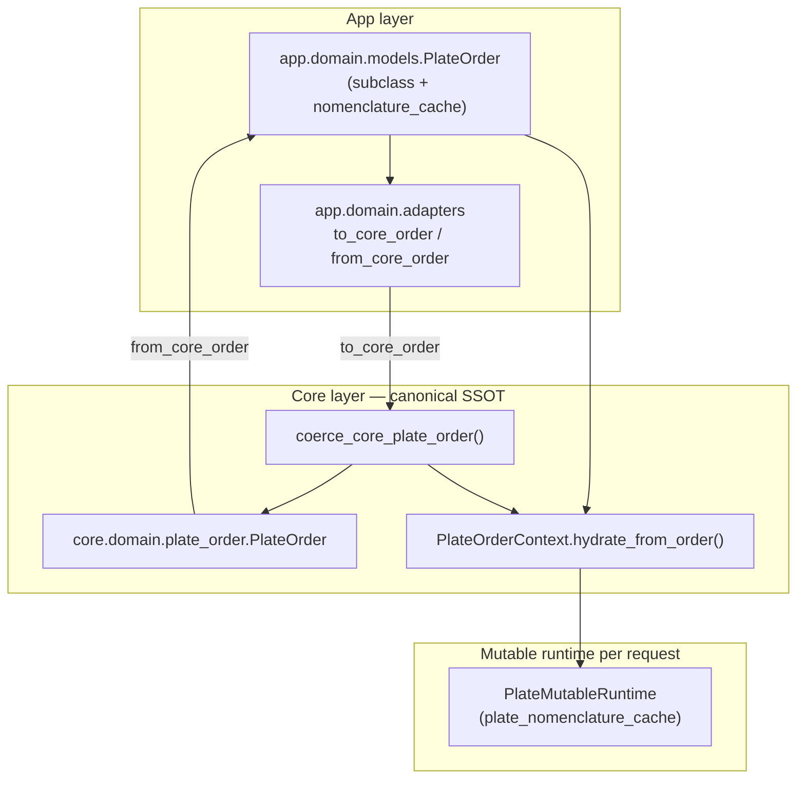

# Canonical PlateOrder, boundary adapters, and app subclass (A3-001)

**Status:** Implemented  
**Date:** 2026-06-03  
**Orchestration:** `orch-2026-06-03-arch-triage`  
**Plan:** [2026-06-03-architecture-triage-a1-a2-a3.md](../plans/2026-06-03-architecture-triage-a1-a2-a3.md) (task A3-001)  
**Depends on:** [plate-order-context-a1-001-phase-1.md](plate-order-context-a1-001-phase-1.md) (partial — `PlateOrderContext`, `coerce_core_plate_order` in hydration)  
**Blocks:** [A3-002](../plans/2026-06-03-architecture-triage-a1-a2-a3.md) (migrate ~15+ call sites; remove duplicate logic and `apply_to_globals` chains)

---

## Summary

A3-001 resolves the **triple PlateOrder** problem at the type boundary: one **canonical** dataclass in `core/domain/plate_order.py`, a thin **app subclass** for commercial-only `nomenclature_cache`, and explicit **adapters** at the app↔core edge. Serialization (`to_dict` / `from_dict` / `from_orders_2d`) lives on the canonical type; the app layer extends it without duplicating field definitions.

Core code that must not depend on app imports (optimization, `PlateOrderContext.hydrate_from_order`) uses `coerce_core_plate_order()` to strip app-only fields. FastAPI services and bot handlers continue importing `app.domain.models.plate_order.PlateOrder` until A3-002 migrates call sites.

---

## Problem (before A3-001)

| Issue | Impact |
|-------|--------|
| Two parallel `PlateOrder` dataclasses with overlapping fields | Field drift, inconsistent `to_dict`/`from_dict` |
| Legacy core model synced runtime only via `apply_to_globals()` | Hidden global mutation (addressed in A1-002 via `hydrate_from_order`) |
| App-only `nomenclature_cache` mixed with core serialization | Risk of leaking or dropping commercial metadata at boundaries |

---

## Architecture



| Layer | Type / module | Role |
|-------|----------------|------|
| **Canonical** | `core.domain.plate_order.PlateOrder` | Single source of truth for order fields, serialization, `from_orders_2d`, totals |
| **App subclass** | `app.domain.models.plate_order.PlateOrder` | Inherits all core fields; adds `nomenclature_cache` for commercial flows |
| **Adapters** | `app.domain.adapters.plate_order` | `to_core_order` / `from_core_order` at import boundaries |
| **Coercion** | `core.domain.plate_order.coerce_core_plate_order` | Core-safe normalization (no app import) |
| **Runtime** | `PlateMutableRuntime` via `PlateOrderContext` | Mutable per-request lists; `plate_nomenclature_cache` filled on hydrate |

---

## Canonical type (`core/domain/plate_order.py`)

**Import:** `from core.domain.plate_order import PlateOrder`  
**Legacy re-export:** `from core.config_and_data import PlateOrder` (unchanged compatibility)

### Responsibilities

- Dataclass aggregate: width bucket lists (`plates_1_2`, `plates_0_46`, …), `plate_load_details`, `plate_exact_widths`, strip/totals fields
- **Serialization:** `to_dict()` / `from_dict()` — JSON/FSM-safe list encoding for dict keys
- **Optimizer interchange:** `from_orders_2d()` / `to_orders_2d()`
- **Totals:** `recompute_totals()` / `_recompute_totals()`
- **Load codes:** `normalize_load_code()` helper

### Deprecated (A1-002 — still present, not removed in A3-001)

| API | Replacement |
|-----|-------------|
| `apply_to_globals()` | `PlateOrderContext.hydrate_from_order()` + `ctx.bound()` |
| `get_current_plate_order()` | `PlateOrderContext.plates` or explicit order object |

### `coerce_core_plate_order(plate_order: Any) -> PlateOrder`

Core-only helper used by `PlateOrderContext.hydrate_from_order()` and `to_core_order()`:

1. If `type(plate_order) is PlateOrder` (exact canonical type) → return as-is  
2. Else if `to_dict()` exists → `PlateOrder.from_dict()`, with `nomenclature_cache` popped from dict  
3. Else → `TypeError`

This guarantees hydration and optimization never see app-only fields.

---

## App subclass (`app/domain/models/plate_order.py`)

```python
@dataclass
class PlateOrder(CorePlateOrder):
    nomenclature_cache: dict[LoadKey, dict[str, Any]] = field(default_factory=dict)
```

### Design rules

| Rule | Rationale |
|------|-----------|
| **Subclass, do not copy fields** | Core field set changes propagate automatically |
| **Override `to_dict` / `from_dict` only for cache** | Core serialization stays authoritative for plate data |
| **`from_orders_2d` → `from_core_order(CorePlateOrder.from_orders_2d(...))`** | Building logic stays in core |
| **`from_legacy`** | Accepts any object with `to_dict()` (migration bridge for A3-002) |

### `nomenclature_cache` vs runtime `plate_nomenclature_cache`

| Name | Location | Purpose |
|------|----------|---------|
| `nomenclature_cache` | App `PlateOrder` (domain) | Commercial/KP metadata keyed by load tuple; persisted in FSM/drafts |
| `plate_nomenclature_cache` | `PlateMutableRuntime` | Filled during `hydrate_from_order` via `_try_fill_plate_nomenclature_cache` |

Do not conflate these names when migrating call sites (A3-002).

---

## Boundary adapters (`app/domain/adapters/plate_order.py`)

Public API (also re-exported from `app.domain.adapters`):

| Function | Direction | Behavior |
|----------|-----------|----------|
| `to_core_order(order)` | App → Core | Delegates to `coerce_core_plate_order` — strips `nomenclature_cache` |
| `from_core_order(core, *, nomenclature_cache=None)` | Core → App | Copies all `dataclasses.fields(CorePlateOrder)` with defensive list/dict copies; attaches cache |

`from_core_order` optimizations:

- If `core` is already `AppPlateOrder` and `nomenclature_cache is None` → return same instance  
- If override cache provided → new `AppPlateOrder` with copied core fields + cache  
- If core is `AppPlateOrder` without override → preserve existing `nomenclature_cache`

---

## Usage patterns

### App code (current — until A3-002)

```python
from app.domain.models.plate_order import PlateOrder

order = PlateOrder.from_orders_2d(orders_2d)
payload = order.to_dict()  # includes nomenclature_cache
restored = PlateOrder.from_dict(payload)
```

### Crossing into core / context

```python
from app.domain.adapters import to_core_order
from core.plate_order_context import PlateOrderContext

ctx = PlateOrderContext.fresh_empty()
ctx.hydrate_from_order(to_core_order(app_order))  # or pass app_order — coerce runs inside hydrate
```

`hydrate_from_order` always calls `coerce_core_plate_order` internally, so passing `AppPlateOrder` is safe.

### Core-only code

```python
from core.domain.plate_order import PlateOrder, coerce_core_plate_order

core = PlateOrder.from_dict(data)
# or
core = coerce_core_plate_order(unknown)
```

---

## Field inventory (canonical)

All fields below are defined **once** on `core.domain.plate_order.PlateOrder`:

| Group | Fields |
|-------|--------|
| Width lists | `plates_1_2`, `plates_1_5_to_1_2`, `plates_1_0`, `plates_1_08`, `plates_0_46`, `plates_0_32`, `plates_0_72`, `plates_0_70`, `plates_0_86`, `plates_0_74`, `plates_0_88`, `plates_0_48`, `plates_0_50`, `plates_0_34` |
| Maps | `plate_load_details`, `plate_length_dm_raw`, `plate_exact_widths` |
| Totals / waste | `longitudinal_cuts`, `length_trims`, `unused_strips_0_3_m_total`, `scrap_strips_*`, `usable_strips_*`, `waste_area_m2` |

**App-only field:** `nomenclature_cache` (not in core dataclass fields; excluded by `coerce_core_plate_order`).

---

## Related files

| File | Role |
|------|------|
| `core/domain/plate_order.py` | Canonical `PlateOrder`, `coerce_core_plate_order`, deprecations |
| `app/domain/models/plate_order.py` | App subclass |
| `app/domain/adapters/plate_order.py` | `to_core_order`, `from_core_order` |
| `app/domain/adapters/__init__.py` | Public adapter exports |
| `core/plate_order_context.py` | `hydrate_from_order` uses `coerce_core_plate_order` |
| `core/config_and_data.py` | Re-exports canonical `PlateOrder` for legacy imports |

### Consumers still on app type (A3-002 scope)

`app/services/*`, `bot/handlers/*`, `app/services/draft_store.py`, `tests/test_commercial_web_flow.py`, and related tests import `app.domain.models.plate_order.PlateOrder`. No behavioral change required for A3-001; migration replaces direct `apply_to_globals` chains where context already exists.

---

## Acceptance criteria (A3-001)

| Criterion | Status |
|-----------|--------|
| Single SSOT in `core/domain/plate_order.py` | Done |
| App layer delegates fields via subclass + adapters | Done |
| `coerce_core_plate_order` strips app-only serialization | Done |
| Roundtrip `to_dict`/`from_dict` preserves plate data + `nomenclature_cache` on app type | Covered by existing commercial/integration tests |
| No duplicate field definitions on app model | Done (inheritance) |
| `test_order_models.py` | Unrelated archive (`core.models.plate`); not the legacy cfg `PlateOrder` |

---

## Out of scope (A3-002)

- Replacing `AppPlateOrder` imports with core type across services/bot  
- Removing `apply_to_globals()` call sites  
- Shrinking `app/domain/models/plate_order.py` to re-export-only  
- Deleting deprecated `apply_to_globals` / `get_current_plate_order` shims  

---

## Testing notes

- Run plate/context tests: `tests/test_plate_order_context.py`, `tests/test_commercial_web_flow.py`, commercial AI plates tests  
- Adapter-specific unit tests may be added in A3-002; behavior is exercised indirectly via `hydrate_from_order` and app `from_dict` roundtrips  
- After changes, run full `tests/` suite (plan pre-condition: large blast radius on A3-002)

---

## Related documentation

- Plan: [2026-06-03-architecture-triage-a1-a2-a3.md](../plans/2026-06-03-architecture-triage-a1-a2-a3.md)  
- Context / middleware: [plate-order-context-a1-001-phase-1.md](plate-order-context-a1-001-phase-1.md), [plate-order-context-a1-002-middleware-deprecations.md](plate-order-context-a1-002-middleware-deprecations.md)  
- Audit reference: [2026-06-03-full-project-audit.md](../audits/2026-06-03-full-project-audit.md) (triple PlateOrder finding)
