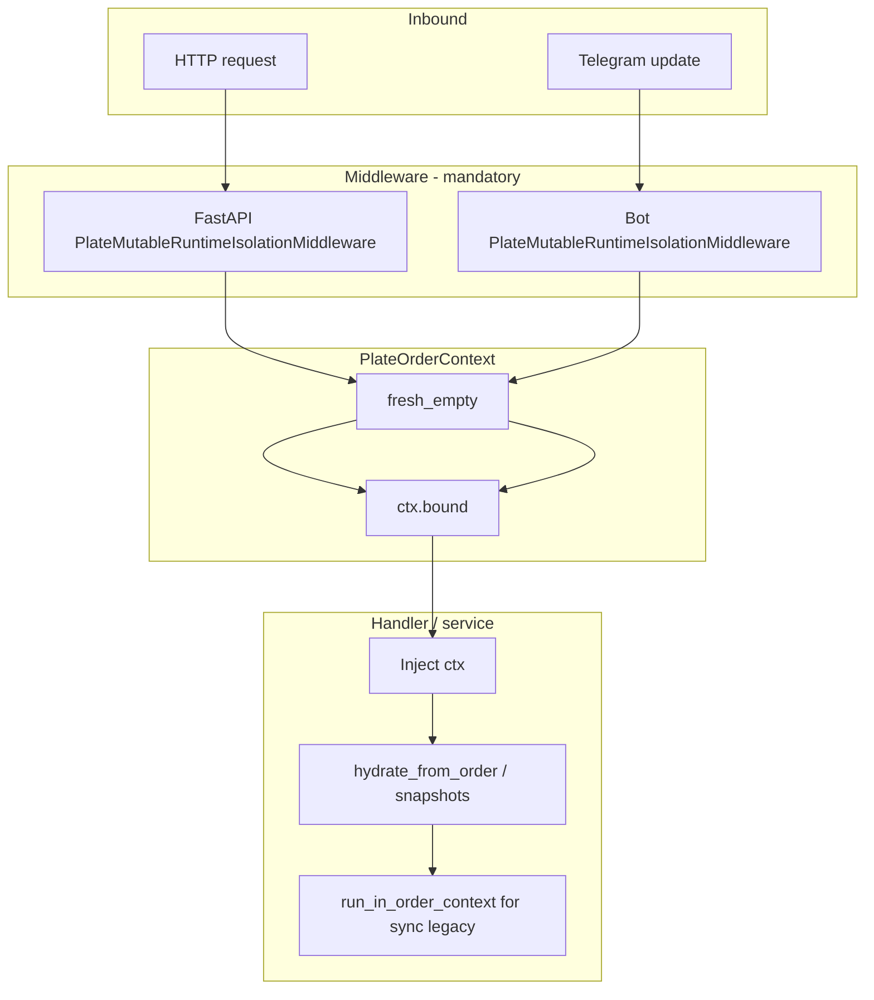

# Mandatory plate context middleware, deprecations, and hydration (A1-002)

**Status:** Implemented  
**Date:** 2026-06-03  
**Orchestration:** `orch-2026-06-03-arch-triage`  
**Plan:** [2026-06-03-architecture-triage-a1-a2-a3.md](../plans/2026-06-03-architecture-triage-a1-a2-a3.md) (task A1-002)  
**Depends on:** [plate-order-context-a1-001-phase-1.md](plate-order-context-a1-001-phase-1.md) (`PlateOrderContext`, middleware S1, `bound()`, `run_in_order_context` baseline)  
**Blocks:** A3-002 (removal of duplicate `PlateOrder` models and final `apply_to_globals` removal)

---

## Summary

A1-002 completes the strangler migration started in A1-001: every HTTP request and Telegram update runs inside mandatory isolation middleware; business code loads order state into an explicit `PlateOrderContext` instead of calling `PlateOrder.apply_to_globals()`. Sync work that still reads legacy `get_plate_mutable_runtime()` / `OPT_*` proxies runs through `run_in_order_context`. Legacy globals remain for compatibility but `apply_to_globals()` and `get_current_plate_order()` emit `DeprecationWarning` (A1-002).

---

## Problem (what A1-002 fixes)

| Before | Risk |
|--------|------|
| Handlers called `order.apply_to_globals()` | Implicit global mutation; easy to forget `bound()` in thread pools |
| `get_current_plate_order()` rebuilt domain from runtime | Hidden coupling; no explicit request object |
| Background `asyncio.to_thread` without binding | Cross-request plate/OPT leaks |

A1-001 introduced middleware and `PlateOrderContext`; A1-002 **migrates call sites** and **deprecates** the old entry points.

---

## Mandatory middleware enforcement

Every inbound HTTP request and bot update gets a fresh `PlateOrderContext` before any handler runs. Handlers must read `ctx` from middleware-backed storage—not create ad-hoc globals without binding.

### FastAPI

| Item | Detail |
|------|--------|
| Middleware | `PlateMutableRuntimeIsolationMiddleware` |
| Location | `app/middleware/plate_runtime_isolation.py` |
| Registration | `app/main.py` — added after `CORSMiddleware` |
| Storage | `request.state.plate_order_ctx` |
| DI | `Depends(get_plate_order_context)` → `app/dependencies/plate_context.py` |
| Failure mode | HTTP 500 `"Plate order context not initialized"` if middleware missing or wrong type |

```python
ctx = PlateOrderContext.fresh_empty()
request.state.plate_order_ctx = ctx
with ctx.bound():
    return await call_next(request)
```

### Telegram (aiogram)

| Item | Detail |
|------|--------|
| Middleware | `PlateMutableRuntimeIsolationMiddleware` |
| Location | `bot/middleware/plate_runtime_isolation.py` |
| Registration | `bot/handlers/__init__.py` → `dp.update.middleware(...)` on **all** updates |
| Storage | `data["plate_order_ctx"]` |
| Handler access | Parameter `plate_order_ctx: PlateOrderContext` (injected from `data`) or `get_plate_order_context(data)` → `bot/dependencies/plate_context.py` |
| Failure mode | `RuntimeError("Plate order context not initialized")` |

```python
ctx = PlateOrderContext.fresh_empty()
data["plate_order_ctx"] = ctx
with ctx.bound():
    return await handler(event, data)
```

### Enforcement model



**Rule for new code:** obtain `PlateOrderContext` from middleware/DI; populate with `hydrate_from_order` or snapshot helpers; use `run_in_order_context` when calling sync legacy functions from async code.

---

## Deprecations (A1-002)

**Location:** `core/domain/plate_order.py`

| Symbol | Replacement | Warning |
|--------|-------------|---------|
| `PlateOrder.apply_to_globals()` | `ctx.hydrate_from_order(order)` inside `ctx.bound()` or via `run_in_order_context` | `DeprecationWarning`, stacklevel=2 |
| `get_current_plate_order()` | Read `ctx.plates` or build `PlateOrder` from runtime fields explicitly; prefer `hydrate_from_order` for the opposite direction | Same |

Deprecated APIs **still work** while `ctx.bound()` is active (they use `get_plate_mutable_runtime()` internally). New and migrated paths must not call them.

**Remaining non-migrated callers (known):**

- `tests/test_procurement_loads.py` — uses `cfg.get_current_plate_order()` (test legacy)
- `core/config_and_data.py` — re-exports `get_current_plate_order` for backward compatibility
- Comments in `core/kp_db.py` referencing old `apply_to_globals` flow

---

## `hydrate_from_order`

**Location:** `core/plate_order_context.py` — method on `PlateOrderContext`

Copies all plate list fields, load details, exact widths, strip counters, and waste metrics from a `PlateOrder` (core or app model with `to_dict()`) into `self.plates`. Replaces the side effect of `apply_to_globals()` without touching module-level aliases directly.

| Behavior | Detail |
|----------|--------|
| Input | `core.domain.plate_order.PlateOrder` or any object with `to_dict()` (normalized via `CorePlateOrder.from_dict`) |
| Nomenclature | Optional `fill_nomenclature_cache`; runs `_try_fill_plate_nomenclature_cache` inside `self.bound()` |
| Scope | Mutates `ctx.plates` only; does not replace `ctx.optimization` |

```python
ctx = PlateOrderContext.fresh_empty()  # or from middleware
ctx.hydrate_from_order(order)
with ctx.bound():
    price_rows, total_sum = build_price_rows(price_table, reinforcement_code=8)
```

**When middleware already bound the request:** handlers receive `plate_order_ctx` from `data` / `Depends`; call `plate_order_ctx.hydrate_from_order(order)` before sync legacy pipelines.

---

## Snapshot helpers (production / visualization)

Also on `PlateOrderContext` (`core/plate_order_context.py`):

| Method | Purpose |
|--------|---------|
| `load_optimization_snapshot(...)` | Deep-copy OPT result / plan-by-load / reinforcement map into `self.optimization` |
| `load_production_snapshot(orders_2d, optimization_result)` | `hydrate_from_order(from_orders_2d)` + optimization snapshot for `visualize_plan` |
| `run_in_order_context(ctx, fn, *args, **kwargs)` | `asyncio.to_thread` worker runs `fn` with `ctx.bound()` |

Bot production day view uses `_prepare_visualization_ctx` → `ctx.load_production_snapshot(...)`.

---

## `run_in_order_context` migration

Use when async code must call **sync** functions that still read `get_plate_mutable_runtime()` or `core.optimization.OPT_*` inside a thread pool.

```python
async def generate_files(plate_order_ctx: PlateOrderContext, ...):
    plate_order_ctx.hydrate_from_order(order)
    plate_order_ctx.load_optimization_snapshot(...)
    result = await run_in_order_context(
        plate_order_ctx,
        sync_legacy_fn,
        arg1,
        kwarg=2,
    )
```

| Property | Detail |
|----------|--------|
| Implementation | Closure enters `with ctx.bound():` inside `asyncio.to_thread` worker |
| Requirement | `ctx` must already contain the order/OPT data the sync function expects |
| Anti-pattern | Calling `apply_to_globals()` then `run_in_order_context` without passing the same `ctx` |

**Ephemeral contexts (off-request work):** services that are not inside a user request may use `PlateOrderContext.fresh_empty()`, hydrate/snapshot, then `run_in_order_context`—see archive and day-documents flows.

---

## Migrated call sites

| Area | File | Pattern |
|------|------|---------|
| App — commercial preview | `app/services/commercial_service.py` | `fresh_empty` → `hydrate_from_order` → `load_optimization_snapshot` → `with ctx.bound()` |
| App — file generation | `app/services/file_generation_service.py` | `ctx.hydrate_from_order(order)` |
| App — day documents | `app/services/day_documents_service.py` | `_build_visualization_ctx` + `run_in_order_context` |
| App — archive | `app/services/archive_service.py` | `viz_ctx = fresh_empty()` + `run_in_order_context` |
| App — commercial workflow | `app/services/commercial_workflow_service.py` | `viz_ctx = fresh_empty()` for visualization branches |
| Bot — commercial | `bot/handlers/commercial.py` | `hydrate_from_order`, `_plate_order_from_ctx`, `run_in_order_context` for pricing/OPT |
| Bot — production day view | `bot/handlers/production_day_view.py` | `load_production_snapshot` / `_prepare_visualization_ctx` + `run_in_order_context` |
| Bot — production execution | `bot/handlers/production_execution.py` | `run_in_order_context` for optimization worker |
| Bot — production create | `bot/handlers/production_create.py` | Handler param `plate_order_ctx: PlateOrderContext` (middleware injection) |

Handlers that take `plate_order_ctx: PlateOrderContext` rely on aiogram injecting `data["plate_order_ctx"]` set by update middleware.

---

## Developer migration cheat sheet

| Old (deprecated) | New (A1-002) |
|------------------|--------------|
| `order.apply_to_globals()` | `ctx.hydrate_from_order(order)` |
| `get_current_plate_order()` | `_plate_order_from_ctx(ctx)` or read `ctx.plates` fields |
| Sync fn in async without binding | `await run_in_order_context(ctx, fn, ...)` |
| Ad-hoc global OPT/plate setup for viz | `ctx.load_production_snapshot(orders_2d, opt_result)` then `run_in_order_context` |
| New FastAPI route mutating plates | `Depends(get_plate_order_context)`; ensure middleware registered |

---

## Tests

```bash
pytest tests/test_plate_order_context.py -q
```

A1-002-specific coverage in that file:

- `test_apply_to_globals_emits_deprecation_warning`
- `test_get_current_plate_order_emits_deprecation_warning`
- `test_hydrate_from_order_populates_plates`
- `test_load_production_snapshot_binds_opt_in_worker` (hydrate + `run_in_order_context`)

Keep isolation suites green after changes:

```bash
pytest tests/test_plate_mutable_runtime_isolation.py tests/test_optimization_context_and_snapshot.py tests/test_optimization_thread_local_globals.py -q
```

---

## Files touched (A1-002)

| File | Role |
|------|------|
| `core/plate_order_context.py` | `hydrate_from_order`, `load_*_snapshot`, `run_in_order_context` |
| `core/domain/plate_order.py` | Deprecation warnings on legacy APIs |
| `app/middleware/plate_runtime_isolation.py` | HTTP enforcement (from A1-001, required for all routes) |
| `bot/middleware/plate_runtime_isolation.py` | Bot enforcement |
| `app/dependencies/plate_context.py` | FastAPI DI guard |
| `bot/dependencies/plate_context.py` | Bot `data` accessor |
| `app/services/*`, `bot/handlers/*` | Migrated call sites (see table above) |
| `tests/test_plate_order_context.py` | Deprecation + hydration + snapshot tests |

---

## Out of scope / follow-up (A3)

- Remove `apply_to_globals()` and `get_current_plate_order()` entirely (A3-002)
- Unify `app.domain.models.PlateOrder` vs `core.domain.plate_order.PlateOrder` (A3-001 / A3-002)
- Migrate remaining tests (`test_procurement_loads.py`) off `get_current_plate_order`

---

## Related documentation

- Phase 1 infrastructure: [plate-order-context-a1-001-phase-1.md](plate-order-context-a1-001-phase-1.md)
- Security prerequisite: [secure-session-cookies-a2-001.md](secure-session-cookies-a2-001.md)
- Architecture triage plan: [2026-06-03-architecture-triage-a1-a2-a3.md](../plans/2026-06-03-architecture-triage-a1-a2-a3.md)
