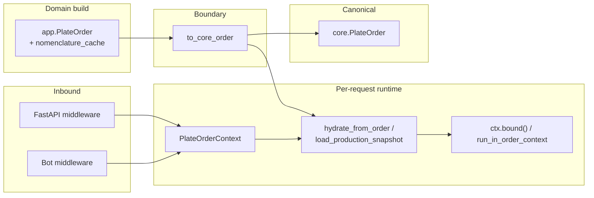

# PlateOrder call-site migration (A3-002)

**Status:** Implemented  
**Date:** 2026-06-03  
**Orchestration:** [`orch-2026-06-03-arch-triage`](../../.cursor/workspace/active/orch-2026-06-03-arch-triage/)  
**Plan:** [2026-06-03-architecture-triage-a1-a2-a3.md](../plans/2026-06-03-architecture-triage-a1-a2-a3.md) (task A3-002)  
**Depends on:** [plate-order-canonical-a3-001.md](plate-order-canonical-a3-001.md), [plate-order-context-a1-002-middleware-deprecations.md](plate-order-context-a1-002-middleware-deprecations.md)  
**Prerequisite chain:** A2-001 → A1-001 → A1-002 → A3-001 → **A3-002**

---

## Orchestration summary (`orch-2026-06-03-arch-triage`)

| Item | Location |
|------|----------|
| Workspace | `.cursor/workspace/active/orch-2026-06-03-arch-triage/` |
| Plan (docs) | `ai_docs/develop/plans/2026-06-03-architecture-triage-a1-a2-a3.md` |
| Workspace plan | `.cursor/workspace/active/orch-2026-06-03-arch-triage/plan.md` |
| Task registry | `.cursor/workspace/active/orch-2026-06-03-arch-triage/tasks.json` |
| Progress | `.cursor/workspace/active/orch-2026-06-03-arch-triage/progress.json` |

**Goal (orchestration):** Eliminate cross-request plate/optimizer leaks, harden sessions (A2), introduce explicit `PlateOrderContext` (A1), unify the triple `PlateOrder` model (A3).

**A3-002 task (from `tasks.json`):** *Migrate call sites and remove duplicate model* — replace `AppPlateOrder` → `core.PlateOrder` → `apply_to_globals` chains with explicit context + canonical model; update `app/services/*` and key `bot/handlers/*`; remove duplicate logic where context already holds state.

**Execution order:** `A2-001 → A1-001 → A1-002 → A3-001 → A3-002`

---

## Summary

A3-002 completes the plate-order architecture triage by **migrating production and commercial flows** off `PlateOrder.apply_to_globals()` onto explicit `PlateOrderContext` hydration. Call sites that needed core-safe plate data use `to_core_order()` at the boundary; visualization and production paths use `hydrate_from_order()` or `load_production_snapshot()` inside a bound context.

**Result:** No production code calls `apply_to_globals()`. The shim remains on `core.domain.plate_order.PlateOrder` with `DeprecationWarning` (A1-002); only `tests/test_plate_order_context.py` exercises it intentionally. The app `PlateOrder` is a **thin subclass** (commercial `nomenclature_cache` only) — not a second field definition.

---

## Problem (before A3-002)

| Pattern | Risk |
|---------|------|
| `AppPlateOrder` → `to_core` → `apply_to_globals()` | Double conversion + implicit global mutation |
| OPT/plate lists read from module globals after hydration | Cross-request leaks if middleware/`bound()` missing |
| Duplicate serialization paths on parallel dataclasses | Field drift (addressed in A3-001; migration deferred usage fixes to A3-002) |

A1-002 added mandatory middleware and deprecated globals; A3-001 defined canonical type + adapters. A3-002 **rewired call sites** so runtime state flows only through `PlateOrderContext`.

---

## Migration pattern

### Commercial / KP (optimize → price / files)

```python
from app.domain.adapters.plate_order import to_core_order
from core.plate_order_context import PlateOrderContext

ctx = PlateOrderContext.fresh_empty()
ctx.hydrate_from_order(to_core_order(order))
ctx.load_optimization_snapshot(
    optimization_result=...,
    plan_by_load=...,
    load_to_reinforcement_map=...,
)
with ctx.bound():
    # legacy viz/pricing reads bound runtime / OPT proxies
    ...
```

### Production visualization (saved plan / day view)

```python
ctx.load_production_snapshot(orders_2d, optimization_result)
# inside run_in_order_context(ctx, worker_fn, ...) where needed
```

Replaces the old sequence: build order → `apply_to_globals()` → mutate `OPT_*` globals → call viz.

### Planning / optimization (temporary cfg snapshot)

`production_planning_service` builds `AppPlateOrder.from_orders_2d`, converts with `to_core_order()`, copies `plate_load_details` / `plate_length_dm_raw` into `cfg` for `build_layout_sequence`, then runs `optimization_service.optimize(plate_order, ...)` — **no** `apply_to_globals()`.

---

## Migrated modules

### App services

| File | Change |
|------|--------|
| `app/services/commercial_service.py` | `generate_preview`: `ctx.hydrate_from_order(to_core_order(order))` + `load_optimization_snapshot` + `ctx.bound()` |
| `app/services/file_generation_service.py` | `generate_visualization`: requires `PlateOrderContext`; hydrates via `to_core_order` |
| `app/services/archive_service.py` | Schema regen: `viz_ctx.hydrate_from_order(to_core_order(plate_order))` + `run_in_order_context` |
| `app/services/commercial_workflow_service.py` | Schema file gen passes `viz_ctx` into `file_generation_service.generate_visualization` |
| `app/services/production_planning_service.py` | `_run_optimization_and_split`: `to_core_order` for cfg snapshot; no globals hydration |
| `app/services/day_documents_service.py` | `_build_visualization_ctx`: `load_production_snapshot` |

### Bot handlers

| File | Change |
|------|--------|
| `bot/handlers/commercial.py` | KP FSM: `plate_order_ctx.hydrate_from_order(to_core_order(...))`; `PlateOrderContextDep()` on flows |
| `bot/handlers/production_day_view.py` | `_prepare_visualization_ctx` → `load_production_snapshot`; workers via `run_in_order_context` |
| `bot/handlers/production_execution.py` | `load_production_snapshot` for execution/viz paths |
| `bot/handlers/production_create.py` | Handler params use injected `PlateOrderContext` |
| `bot/handlers/kp.py`, `bot/handlers/optimize.py` | `PlateOrderContextDep()` + `run_in_order_context` where needed |

Middleware/DI from A1-002 (`PlateMutableRuntimeIsolationMiddleware`, `get_plate_order_context`) is assumed on all migrated entry points.

---

## App `PlateOrder` after migration

`app/domain/models/plate_order.py` is **not** removed. It remains the commercial/API domain type:

- Subclasses `core.domain.plate_order.PlateOrder`
- Adds `nomenclature_cache` with `to_dict` / `from_dict` / `from_orders_2d` delegating to core + `from_core_order`
- `from_legacy()` retained for FSM/draft bridges

**Intentional continued imports** (domain construction, not global hydration):

- `app/services/plate_parser_service.py`, `optimization_service.py`, `draft_store.py`
- `app/domain/models/parse_result.py`, `optimization_context.py`
- Commercial/production tests

These build or persist `AppPlateOrder`; crossing into core/runtime always goes through `to_core_order` + context APIs at service/handler boundaries.

---

## `apply_to_globals` status

| Location | Role |
|----------|------|
| `core/domain/plate_order.py` | Deprecated shim; emits `DeprecationWarning` |
| `tests/test_plate_order_context.py` | Asserts warning behavior |
| **All other `*.py`** | **No** `apply_to_globals()` calls |

Grep verification: `apply_to_globals(` appears only in core definition + deprecation test.

---

## Acceptance criteria (A3-002)

| Criterion | Status |
|-----------|--------|
| No double conversion `App → core → apply_to_globals` in production/commercial flows | Done |
| `grep apply_to_globals(` — zero usages outside shim + test | Done |
| Services/bot viz paths use `PlateOrderContext` hydration | Done |
| `app/domain/models/plate_order.py` reduced to subclass + serialization (no duplicated core fields) | Done (A3-001 + A3-002) |
| Integration tests: commercial web flow, plate context, adapters | Covered by existing suite |
| Remove deprecated shim entirely | **Deferred** — safe while zero prod callers |

---

## Testing

| Test module | Focus |
|-------------|--------|
| `tests/test_plate_order_adapters.py` | `to_core_order` / `from_core_order` roundtrips, cache stripping |
| `tests/test_plate_order_context.py` | `hydrate_from_order`, `load_production_snapshot`, deprecation warnings |
| `tests/test_commercial_web_flow.py` | End-to-end commercial HTTP flow |
| `tests/test_production_planning_service.py` | Planning with `AppPlateOrder` |
| Isolation suite (A1) | `test_plate_mutable_runtime_isolation.py`, `test_optimization_thread_local_globals.py`, etc. |

Recommended after changes: full `pytest tests/` (plan pre-condition: large blast radius).

---

## Architecture (after A3-002)



---

## Related files

| File | Role |
|------|------|
| `app/domain/adapters/plate_order.py` | `to_core_order`, `from_core_order` |
| `app/domain/models/plate_order.py` | App subclass |
| `core/domain/plate_order.py` | Canonical type + deprecated shim |
| `core/plate_order_context.py` | `hydrate_from_order`, `load_production_snapshot`, `run_in_order_context` |
| `app/middleware/plate_runtime_isolation.py` | FastAPI isolation |
| `bot/middleware/plate_runtime_isolation.py` | Bot isolation |

---

## Out of scope / follow-ups

- Delete `apply_to_globals()` and `get_current_plate_order()` shims from `core/domain/plate_order.py` (separate cleanup once all docs/tests updated)
- Replace every `AppPlateOrder` import with core type in parser/draft-only modules (optional; no global side effect today)
- Completion report in `ai_docs/develop/reports/` for full orchestration (all five tasks) — not created in this pass
- Update `tasks.json` / `progress.json` in orchestration workspace when parent orchestrator closes the run

---

## Related documentation

- Orchestration plan: [2026-06-03-architecture-triage-a1-a2-a3.md](../plans/2026-06-03-architecture-triage-a1-a2-a3.md)
- Canonical model (A3-001): [plate-order-canonical-a3-001.md](plate-order-canonical-a3-001.md)
- Context + middleware (A1): [plate-order-context-a1-001-phase-1.md](plate-order-context-a1-001-phase-1.md), [plate-order-context-a1-002-middleware-deprecations.md](plate-order-context-a1-002-middleware-deprecations.md)
- Sessions (A2): [secure-session-cookies-a2-001.md](secure-session-cookies-a2-001.md)
- Audit: [2026-06-03-full-project-audit.md](../audits/2026-06-03-full-project-audit.md)
