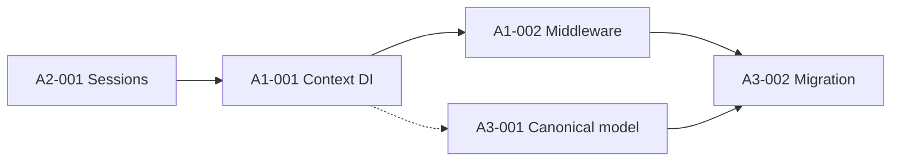

# Plan: Architecture Triage — Runtime State, Sessions, PlateOrder


**Created:** 2026-06-03  

**Orchestration:** `orch-2026-06-03-arch-triage`  

**Goal:** Eliminate cross-request state leaks, harden session security, and unify duplicate PlateOrder models  

**Total Tasks:** 5  

**Priority:** High  


## Execution Order (Recommended)


```

A2-001  →  A1-001  →  A1-002  →  A3-001  →  A3-002

(security)   (context)  (middleware)  (canonical)  (migration)

```


**Rationale**


| Order | Why |

|-------|-----|

| **A2 first** | Independent security fix; no dependency on plate-order refactor. Reduces session-forgery risk immediately. |

| **A1 before A3** | A3 removes `apply_to_globals()` and duplicate models — requires explicit request-scoped context from A1. |

| **A1-001 before A1-002** | Introduce DI/context API before enforcing middleware and deprecating globals. |

| **A3-001 before A3-002** | Pick canonical type and adapters before migrating 15+ call sites. |


**Partial dependency:** A3-001 can start design/analysis in parallel with A1-002, but migration (A3-002) must wait until A1-002 completes.


---


## Pre-condition Warnings


| Area | Tests found | Risk |

|------|-------------|------|

| **A2** | `tests/test_app_session.py` (roundtrip only) | ⚠️ No tests for cookie `secure`/`samesite` policy or secret validation — test-writer must add coverage in simple-workflow |

| **A1** | `tests/test_plate_mutable_runtime_isolation.py`, `tests/test_plate_runtime_thread_isolation.py`, `tests/test_optimization_context_and_snapshot.py`, `tests/test_optimization_thread_local_globals.py` | ✅ Good baseline; refactor must keep these green |

| **A3** | `tests/test_order_models.py`, service/bot integration tests using `AppPlateOrder` | ⚠️ Large blast radius (~15+ import sites in `app/services/*`, `bot/handlers/*`); field desync risk during migration |

| **General** | 77 test files in `tests/` | Run full suite after each task |


**Blockers before start:** Ensure `.env` has a strong `APP_SECRET_KEY` for local dev; document min length requirement before A2 enforces fail-fast.


---


## Task A2 — Unsafe Session Settings (Security)


**Command:** `/implement secure session cookies and secret validation`  

**Workflow:** simple-workflow → `worker` → `test-writer` → `test-runner` → `documenter`  

**Category:** Architecture / Security  


### A2-001 — Secure session cookies and APP_SECRET_KEY validation


- **Priority:** Critical  

- **Complexity:** Moderate  

- **Dependencies:** None  

- **Status:** ⏳ Pending  

- **Files:** `app/security/session.py`, `app/core/settings.py` (or `core/config/settings.py`), `app/api/v1/endpoints/auth.py`, `app/web/router.py`  


**Problem**


- Self-signed HMAC session cookie with no server-side store; `APP_SECRET_KEY` leak = full forgery.

- API login sets `secure=False` (`auth.py:31`).

- Web login may omit consistent `secure`/`samesite` on some cookie attributes.


**Implementation scope**


1. Mandatory `APP_SECRET_KEY` from environment with minimum entropy/length validation at settings load (fail-fast on startup).

2. Centralized cookie policy helper (httponly, samesite, max_age, secure flag).

3. `secure=True` when app runs behind HTTPS/reverse proxy (configurable via settings, e.g. `COOKIE_SECURE=true` or infer from `ENV=production`).

4. Apply unified policy to API login/logout and web router cookie set/delete.

5. Document rotation strategy (out of scope for code: note in docs that server-side sessions or JWT rotation are future options).


**Acceptance criteria**


- [ ] Application refuses to start without valid `APP_SECRET_KEY` (empty, default, or below min length).

- [ ] Login endpoints set cookies via shared policy helper; `secure` reflects settings, not hardcoded `False`.

- [ ] Logout/delete_cookie uses matching `secure` and `samesite` params.

- [ ] New tests cover secret validation failures and cookie attribute policy.

- [ ] Existing `test_app_session.py` and auth-related tests pass.


---


## Task A1 — Global Mutable Runtime State


**Command:** `/refactor core/plate_runtime_state.py core/domain/plate_order.py`  

**Workflow:** refactor-workflow → `senior-reviewer` → `refactor` → `test-runner` → `documenter`  

**Category:** Architecture  


### A1-001 — Explicit request-scoped order context (DI)


- **Priority:** High  

- **Complexity:** Complex  

- **Dependencies:** A2-001 (recommended, not blocking)  

- **Status:** ⏳ Pending  

- **Files:** `core/plate_runtime_state.py`, `core/optimization/context.py`, `core/config_and_data.py` (global plate list accessors)  


**Problem**


- Plate order and optimizer state live in thread-local / ContextVar / module-level lists.

- Incomplete `bind_*` usage in thread pools and background tasks can mix orders across requests/users.


**Implementation scope**


1. Senior-reviewer: map all `get_plate_mutable_runtime()`, global list mutations, and missing `bind_plate_mutable_runtime` call sites.

2. Introduce explicit `PlateOrderContext` (or extend existing scope API) as the single SSOT for a request/run.

3. Pass context via FastAPI `Depends`, bot handler wrappers, or explicit parameter — not implicit global lookup in business code.

4. Restrict `get_plate_mutable_runtime()` to infrastructure/legacy shim layer only (document allowed callers).


**Acceptance criteria**


- [ ] Business/services code receives order state via explicit context/DI, not bare `get_plate_mutable_runtime()`.

- [ ] `core/optimization/context.py` integrates with new context object.

- [ ] Isolation tests in `test_plate_mutable_runtime_isolation.py` and `test_optimization_context_and_snapshot.py` pass unchanged or with intentional test updates only.


### A1-002 — Mandatory middleware + deprecate apply_to_globals


- **Priority:** High  

- **Complexity:** Complex  

- **Dependencies:** A1-001  

- **Status:** ⏳ Pending  

- **Files:** `core/domain/plate_order.py`, FastAPI middleware (new or existing), bot middleware/handlers entry points, `core/config_and_data.py`  


**Implementation scope**


1. FastAPI middleware (or dependency) wraps order-processing routes with `plate_mutable_runtime_scope` / `bind_plate_mutable_runtime`.

2. Bot handlers use equivalent wrapper for production/commercial flows.

3. Audit thread pools and background tasks; add binding where missing.

4. Mark `apply_to_globals()` and `get_current_plate_order()` as deprecated; grep confirms no new usages in migrated paths.


**Acceptance criteria**


- [ ] All FastAPI routes that mutate plate state run inside context middleware.

- [ ] Bot entry points for order processing documented and wrapped.

- [ ] `apply_to_globals()` emits deprecation warning; migration path documented for A3.

- [ ] No regression in thread/async isolation tests.


---


## Task A3 — Triple PlateOrder Model


**Command:** `/refactor app/domain/models/plate_order.py core/domain/plate_order.py`  

**Workflow:** refactor-workflow → `senior-reviewer` → `refactor` → `test-runner` → `documenter`  

**Category:** Architecture  

**Depends on A1 partially:** canonical model must not rely on globals; removal of `apply_to_globals` requires A1-002.


### A3-001 — Canonical PlateOrder type and boundary adapters


- **Priority:** High  

- **Complexity:** Moderate  

- **Dependencies:** A1-001 (partial)  

- **Status:** ⏳ Pending  

- **Files:** `core/domain/plate_order.py`, `app/domain/models/plate_order.py`, `core/config_and_data.py` re-exports  


**Problem**


- Two `PlateOrder` dataclasses with different `to_dict`/`from_dict`; legacy core model syncs via `apply_to_globals()` only.


**Implementation scope**


1. Senior-reviewer: diff field sets between `app/domain/models/plate_order.py` and `core/domain/plate_order.py`; list divergences (`nomenclature_cache` vs `plate_nomenclature_cache`, metadata fields, etc.).

2. Choose **canonical type:** `core/domain/plate_order.py` (optimization/bot legacy SSOT) with app-layer adapter for API/Pydantic boundaries.

3. Unified serialization (`to_dict`/`from_dict`/`from_orders_2d`) in one place; thin re-export or adapter in app layer.


**Acceptance criteria**


- [ ] Single source of truth documented; duplicate field definitions eliminated or explicitly delegated.

- [ ] Adapter functions at app↔core boundary; no behavioral change in serialization roundtrips.

- [ ] `test_order_models.py` passes.


### A3-002 — Migrate call sites and remove duplicate model


- **Priority:** High  

- **Complexity:** Complex  

- **Dependencies:** A1-002, A3-001  

- **Status:** ⏳ Pending  

- **Files:** `app/services/*`, `bot/handlers/production_day_view.py`, `bot/handlers/production_execution.py`, `bot/handlers/commercial.py`, tests  


**Implementation scope**


1. Replace `AppPlateOrder` → `core.PlateOrder` → `apply_to_globals` chains with direct context + canonical model.

2. Update imports across services and bot handlers (~15+ sites).

3. Remove or reduce `app/domain/models/plate_order.py` to re-export/adapter only.

4. Remove `apply_to_globals()` usages where context already holds state.


**Acceptance criteria**


- [ ] No double conversion chain in production/commercial flows.

- [ ] `grep apply_to_globals` shows zero usages outside deprecated shim (or shim removed).

- [ ] Integration tests: `test_commercial_web_flow.py`, `test_production_planning_service.py`, bot-related tests pass.


---


## Dependencies Graph





---


## Architecture Decisions (Proposed)


| Decision | Choice | Rationale |

|----------|--------|-----------|

| Canonical PlateOrder | `core/domain/plate_order.py` | Already tied to runtime state and optimization; larger feature set |

| Session store | Keep HMAC cookie for A2; document JWT/server-side as phase 2 | Minimize scope; A2 hardens existing approach |

| Context delivery | FastAPI Depends + middleware; bot context manager | Matches existing `plate_mutable_runtime_scope` API |

| Deprecation | Warn on `apply_to_globals`, remove in A3-002 | Gradual migration per user request |


---


## Progress (updated by orchestrator)


- ⏳ **A2-001:** Secure session cookies and secret validation (Pending)

- ⏳ **A1-001:** Request-scoped order context DI (Pending)

- ⏳ **A1-002:** Middleware binding + deprecate apply_to_globals (Pending)

- ⏳ **A3-001:** Canonical PlateOrder + adapters (Pending)

- ⏳ **A3-002:** Migrate call sites, remove duplicate (Pending)


