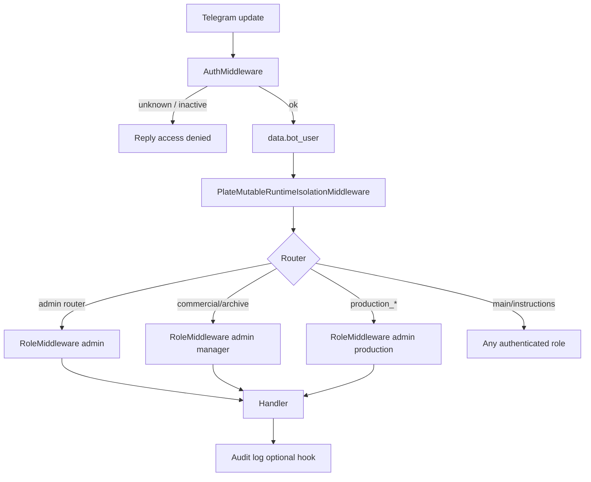

# Plan: Telegram bot authentication & authorization (S1)

**Created:** 2026-06-03  
**Orchestration:** `orch-2026-06-03-bot-auth-s1`  
**Audit:** [S1] in [2026-06-03-full-project-audit.md](../audits/2026-06-03-full-project-audit.md)  
**Priority:** Critical (security)  
**Status:** Ready to execute

## Goal

Close **S1**: any Telegram user can invoke commercial, production, and destructive DB flows. Introduce **fail-closed** access control aligned with web roles (`admin`, `manager`, `production`), hide destructive UI from non-admins, and log security-relevant actions.

## Current state (baseline)

| Area | Finding |
|------|---------|
| `bot/bot_main.py` | Registers handlers only; no auth middleware |
| `bot/handlers/__init__.py` | Only `PlateMutableRuntimeIsolationMiddleware` on `dp.update` |
| `bot/handlers/admin.py` | `/clear_all_kp`, `/delete_kp`, `db_clear_confirmed`, etc. — no `from_user` checks |
| `bot/keyboards.py` | `main_menu_kb()` exposes **⚙️ Управление БД**; `db_management_kb()` exposes **🗑️ Очистить все данные** to everyone |
| `core/config/settings.py` | `BOT_TOKEN`, loads `.env` + `bot/bot.env`; **no** Telegram allowlist |
| `app/repositories/auth_repository.py` | `app_users` with `role`, `manager_id` — **no** `telegram_user_id` column yet |
| Web pattern | `require_roles("admin", …)` in `app/dependencies/auth.py` |

## Target architecture



**Principles**

1. **Env-first allowlist** for MVP (fast deploy); optional **DB column** `telegram_user_id` on `app_users` in a later task.
2. **Defense in depth**: global auth middleware + router-level role middleware + no destructive buttons in public keyboards.
3. **Roles** mirror web: `admin`, `manager`, `production` (reject unknown role strings at settings parse).
4. **Production** `app_env=production`: refuse bot start if auth enabled and allowlist empty.
5. **Audit**: structured log line per denied access and per destructive success (user id, role, action).

## Role matrix (handlers)

| Capability | Roles |
|------------|-------|
| `/start`, `/help`, instructions | `admin`, `manager`, `production` (any allowlisted) |
| Commercial, KP, archive, comparison, optimize, pb_info, export | `admin`, `manager` |
| Production planning / execution / calendar / completion | `admin`, `production` |
| Admin DB, `/delete_kp`, `/clear_all_kp`, `db_clear_*`, `/recover_plates` | `admin` only |

## Tasks

### BOTAUTH-001 — Settings & env contract for bot allowlist

- **Priority:** Critical  
- **Complexity:** Simple  
- **Dependencies:** None  
- **Files:** `core/config/settings.py`, `.env.example`, `bot/bot.env` (comment block only, no secrets)

**Work**

- Add settings fields, e.g.:
  - `bot_auth_enabled: bool` (`BOT_AUTH_ENABLED`, default `True`)
  - `bot_telegram_allowlist_raw: str` (`BOT_TELEGRAM_ALLOWLIST`) — format `telegram_id:role,...` or JSON array of `{id, role}`
  - `bot_auth_fail_closed: bool` (`BOT_AUTH_FAIL_CLOSED`, default `True` when `app_env=production`)
- Parser → `dict[int, str]` (id → role) with validation against `admin|manager|production`
- `@model_validator`: if `app_env==production` and auth enabled and allowlist empty → `ValueError` with actionable message

**Acceptance criteria**

- `get_settings()` rejects production startup with empty allowlist when auth enabled
- `.env.example` documents format and example IDs (placeholders)
- Unit tests in `tests/test_bot_auth_settings.py` (or section in `tests/test_settings_app_secret_key.py`) cover parse + validation

---

### BOTAUTH-002 — Bot user model and resolver

- **Priority:** Critical  
- **Complexity:** Simple  
- **Dependencies:** BOTAUTH-001  
- **Files:** `bot/security/__init__.py`, `bot/security/users.py`

**Work**

- `BotUser` dataclass: `telegram_id`, `role`, optional `app_user_id`, `manager_id`
- `resolve_bot_user(telegram_id: int) -> BotUser | None` from settings allowlist
- `has_role(user, *roles) -> bool` helper
- Stub/hook `resolve_bot_user_from_db` (returns `None`) for BOTAUTH-010 — no DB IO yet

**Acceptance criteria**

- Resolver returns correct role for configured IDs; `None` for unknown
- Pure functions, no aiogram imports (easy unit tests)

---

### BOTAUTH-003 — Global authentication middleware

- **Priority:** Critical  
- **Complexity:** Moderate  
- **Dependencies:** BOTAUTH-002  
- **Files:** `bot/middleware/auth.py`, `bot/middleware/__init__.py`

**Work**

- `BotAuthMiddleware(BaseMiddleware)` on `dp.update` (register **before** plate isolation)
- Extract `telegram_id` from `Message` / `CallbackQuery` / other update types (use aiogram `getattr(event, "from_user", None)` pattern)
- If auth disabled (dev only): inject synthetic `bot_user` with role `admin` **only** when `app_env!=production` (document in code)
- If auth enabled and user missing/denied: answer with short RU message, **do not** call handler
- Inject `data["bot_user"] = BotUser(...)`

**Acceptance criteria**

- Unknown `telegram_id` never reaches handlers when auth enabled
- Known user reaches handlers with `bot_user` in middleware data
- Middleware registered in `bot/handlers/__init__.py`

---

### BOTAUTH-004 — Role middleware and router wiring

- **Priority:** Critical  
- **Complexity:** Moderate  
- **Dependencies:** BOTAUTH-003  
- **Files:** `bot/middleware/role.py`, `bot/handlers/__init__.py`

**Work**

- `RoleMiddleware(*allowed_roles: str)` — checks `data["bot_user"]`; on deny, reply + skip handler
- In `register_all_handlers`:
  - `admin.router` → `admin` only (message + callback_query)
  - `commercial`, `archive`, `kp`, `comparison`, `optimize`, `pb_info`, `export` → `admin`, `manager`
  - `production_*`, `work_calendar_manager` → `admin`, `production`
  - `main`, `instructions` → all three roles
- Leave `PlateMutableRuntimeIsolationMiddleware` after auth

**Acceptance criteria**

- Integration-style test: manager cannot trigger `db_clear_confirmed` callback path
- Production user cannot access commercial router handler (e.g. mock update)
- Admin can access admin router

---

### BOTAUTH-005 — Startup validation in bot_main

- **Priority:** High  
- **Complexity:** Simple  
- **Dependencies:** BOTAUTH-001, BOTAUTH-003  
- **Files:** `bot/bot_main.py`

**Work**

- Call `get_settings()` before polling; log allowlist size (no PII — count only)
- If settings validation fails, exit with clear log (mirror APP_SECRET_KEY fail-fast)
- Log warning when `bot_auth_enabled=False` in non-production

**Acceptance criteria**

- Bot does not start polling in production without valid allowlist when auth enabled
- Startup log includes `bot_auth_enabled` and allowed user count

---

### BOTAUTH-006 — Role-aware keyboards (remove public destructive UI)

- **Priority:** Critical  
- **Complexity:** Simple  
- **Dependencies:** BOTAUTH-002  
- **Files:** `bot/keyboards.py`, `bot/handlers/main.py`, `bot/handlers/admin.py`

**Work**

- Change signatures: `main_menu_kb(role: str | None = None)`, `db_management_kb(role: str | None = None)`
- Show **⚙️ Управление БД** only for `role == "admin"`
- `db_management_kb`: include **🗑️ Очистить все данные** only for admin; managers/production never see wipe button
- Update `/start` and `btn_db_management` to pass `bot_user.role` from handler `data` or `BotUser` injected via middleware typing helper

**Acceptance criteria**

- Non-admin allowlisted user gets main menu **without** DB management button
- Admin sees full menu including DB management
- Grep confirms no unconditional `db_clear_all` button in default menu path for non-admin

---

### BOTAUTH-007 — Admin handler defense in depth

- **Priority:** Critical  
- **Complexity:** Simple  
- **Dependencies:** BOTAUTH-004  
- **Files:** `bot/handlers/admin.py`

**Work**

- Add shared guard at top of destructive handlers (or dependency filter): assert `bot_user.role == "admin"` (read from handler kwargs/data)
- Commands: `/delete_kp`, `/clear_all_kp`, `/list_kp` (read-only list: admin **or** manager per matrix — **admin only** if list exposes delete hints; recommend admin-only for consistency with audit)
- Callbacks: `db_clear_all`, `db_clear_confirmed`, `confirm_db_clear`
- `db_stats`, `db_view_rests`: admin only (sensitive export)

**Acceptance criteria**

- Even if role middleware misconfigured, handler guard returns denial for non-admin
- All 17 admin router entry points covered (message + callback)

---

### BOTAUTH-008 — Security audit logging

- **Priority:** High  
- **Complexity:** Simple  
- **Dependencies:** BOTAUTH-003  
- **Files:** `bot/security/audit.py`, `bot/middleware/auth.py`, `bot/handlers/admin.py`

**Work**

- `log_bot_security_event(event, *, telegram_id, role, action, detail=None)` → logger `bot.security` INFO
- Log: access denied (middleware), destructive action **started** and **completed** (admin handlers)
- Do not log secrets, file paths with customer PII in bulk

**Acceptance criteria**

- Denied access produces one structured log line with `telegram_id` and `action`
- Successful `clear_all` / `db_clear_confirmed` produces audit log with counts from result dict

---

### BOTAUTH-009 — Tests for bot authorization

- **Priority:** High  
- **Complexity:** Moderate  
- **Dependencies:** BOTAUTH-001–004, BOTAUTH-007  
- **Files:** `tests/test_bot_auth.py`, `tests/conftest.py` (if shared fixtures needed)

**Work**

- Settings parse tests
- Middleware tests with mocked `Message`/`CallbackQuery` and dummy handler
- Admin denial for `manager` role on `db_clear_confirmed` data
- Optional: parametrize roles vs expected access for one commercial and one production handler

**Acceptance criteria**

- `pytest tests/test_bot_auth.py` passes in CI
- No live Telegram API calls

---

### BOTAUTH-010 — Link Telegram IDs to app_users (DB phase)

- **Priority:** Medium  
- **Complexity:** Moderate  
- **Dependencies:** BOTAUTH-002, BOTAUTH-003  
- **Files:** `app/repositories/auth_repository.py`, `bot/security/users.py`, `scripts/create_admin.py` (optional `--telegram-id`)

**Work**

- Migration in `init_schema`: `telegram_user_id INTEGER UNIQUE NULL` on `app_users`
- `get_user_by_telegram_id`, update `create_or_update_user` to accept optional `telegram_user_id`
- Resolver: check DB first, fallback to env allowlist
- Admin CLI/doc note: prefer DB over env for prod rotations

**Acceptance criteria**

- User with DB `telegram_user_id` authenticated without env entry
- `test_auth_repository` extended for telegram lookup
- Env allowlist still works for bootstrap

---

### BOTAUTH-011 — Documentation & operator runbook

- **Priority:** Medium  
- **Complexity:** Simple  
- **Dependencies:** BOTAUTH-001, BOTAUTH-005  
- **Files:** `ai_docs/develop/features/bot-telegram-auth-s1.md`, `.env.example`

**Work**

- Feature doc: threat model, env vars, role matrix, how to add/remove users, prod checklist
- Cross-link audit S1 and orchestration id

**Acceptance criteria**

- Operator can onboard a Telegram user without reading source code
- Documents fail-closed production behavior

---

## Dependencies graph

```
BOTAUTH-001 → BOTAUTH-002 → BOTAUTH-003 → BOTAUTH-004 → BOTAUTH-007
                    ↓              ↓
              BOTAUTH-006    BOTAUTH-008
                    ↓
              BOTAUTH-005

BOTAUTH-004 → BOTAUTH-009
BOTAUTH-003 → BOTAUTH-010 (optional, after MVP)
BOTAUTH-005 → BOTAUTH-011
```

## Execution order (recommended)

| Wave | Tasks | Agent |
|------|-------|-------|
| 1 | BOTAUTH-001, BOTAUTH-002 | worker |
| 2 | BOTAUTH-003, BOTAUTH-004 | worker |
| 3 | BOTAUTH-005, BOTAUTH-006, BOTAUTH-007 | worker |
| 4 | BOTAUTH-008, BOTAUTH-009 | worker + test-runner |
| 5 | BOTAUTH-010, BOTAUTH-011 | worker (optional DB), documenter |

## Verification (orchestrator)

After all Critical tasks:

1. Set `BOT_TELEGRAM_ALLOWLIST=<your_id>:admin` in `bot/bot.env`
2. Start bot; confirm stranger gets denial
3. Confirm non-admin menu has no DB wipe
4. Run `pytest tests/test_bot_auth.py`
5. Manual: attempt `/clear_all_kp` from non-admin test account → denied + audit log

## Out of scope (follow-ups)

- One-time web pairing code for Telegram linking (audit “optional”)
- Separate prod/stage bot tokens (ops, not code)
- Migrating bot handlers to `app/services` (audit **A3**, separate plan)
- Rate limiting Telegram updates (audit **S4**)

## Progress (orchestrator updates)

- ⏳ BOTAUTH-001: Settings & env contract
- ⏳ BOTAUTH-002: Bot user resolver
- ⏳ BOTAUTH-003: Auth middleware
- ⏳ BOTAUTH-004: Role middleware & router wiring
- ⏳ BOTAUTH-005: Startup validation
- ⏳ BOTAUTH-006: Role-aware keyboards
- ⏳ BOTAUTH-007: Admin handler guards
- ⏳ BOTAUTH-008: Audit logging
- ⏳ BOTAUTH-009: Tests
- ⏳ BOTAUTH-010: DB telegram_user_id (optional)
- ⏳ BOTAUTH-011: Documentation
