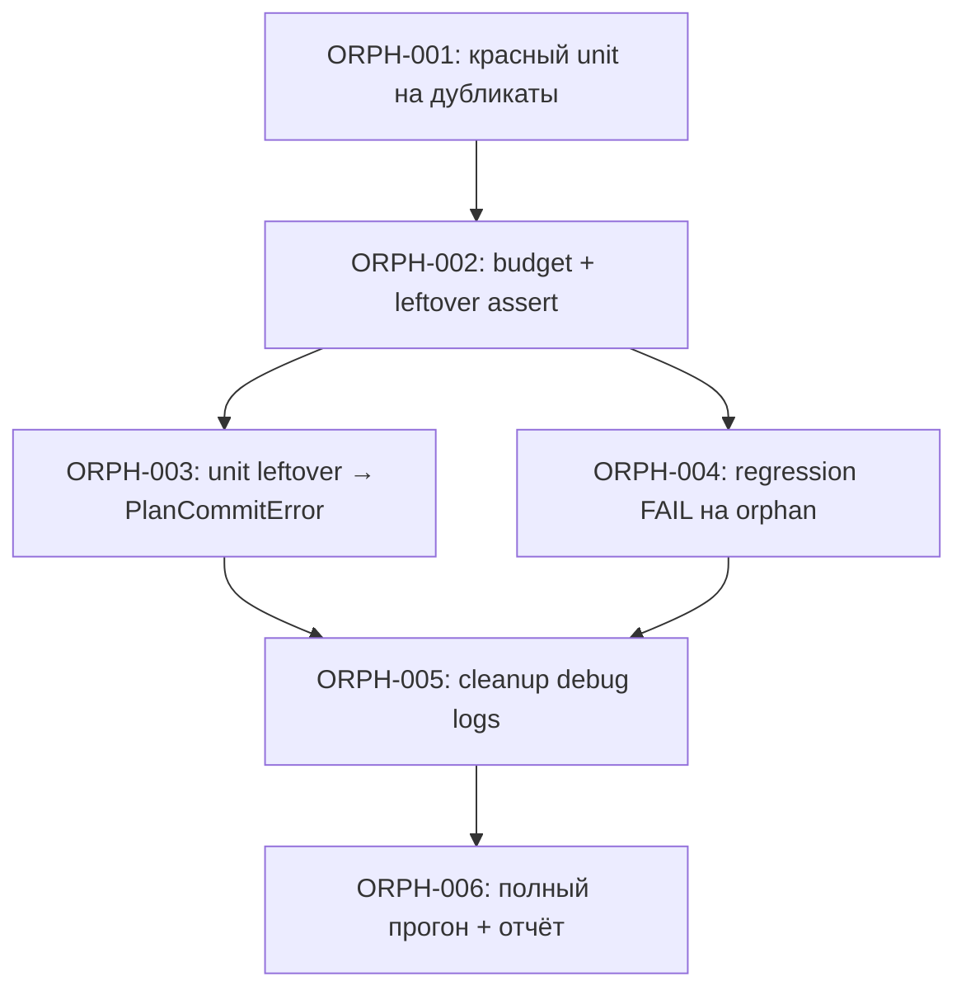

# Plan: Fix orphan kp_plates при commit

**Created:** 2026-07-21  
**Status:** ✅ Implemented  
**Spec:** [`ai_docs/specs/fix-orphan-kp-plates-commit.md`](../../specs/fix-orphan-kp-plates-commit.md)  
**Cursor plan (черновик):** [`fix_orphan_kp_plates_305ed643.plan.md`](file:///home/roman/.cursor/plans/fix_orphan_kp_plates_305ed643.plan.md)

## Goal

После `commit_plan_plates` не оставлять в БД строки «в плане» без ссылок `kp_plate_id` с дорожек. На фикстуре `roman_20260503` — **orphan Σ = 0**, exit code 0.

## Current state

| Компонент | Статус |
|-----------|--------|
| `core/plan_commit.py` | Баг: `per_day` не декрементится между order-строками одной identity; есть временные `_agent_dbg` |
| `scripts/run_plate_loss_regression.py` | Считает orphan; вердикт **WARN**, exit 0 при orphan>0 |
| `tests/test_plan_commit.py` | Есть happy-path / day_number / kp_plate_id; **нет** кейса дубликатов order |
| Спека | ✅ Готова |
| Доказательства | Отчёты `reports/plate_loss_regression_20260721_*.md`, БД `tmp/plate_loss_regression/` |

## Architecture decisions

1. **Чиним только commit** — не `complete_day`, не day_view, не мерж дубликатов при seed.
2. **Mutable budget** `remaining_by_identity_day` — единственный источник слотов дня на identity.
3. **Leftover pool → `PlanCommitError` + rollback** — orphan не проходит тихо.
4. **Undated «в плане»** при нехватке бюджета: **не создавать молча** в рамках этого фикса; если после бюджета `remaining > 0` у order — либо следующий день бюджета, либо ошибка/существующий mismatch path без overbook ранних дней. (Закрывает Open Question #2 спеки в пользу «не undated». Heal прод — отдельно, Ask first.)
5. **TDD:** сначала красный unit на дубликаты, потом фикс, потом ужесточение регрессии.



## Task list

### Phase 1: Reproduce in unit (RED)

- [x] **ORPH-001:** Unit — две строки `orders_2d` с одной identity (qty 2+2), две строки seed в БД или одна с qty=4; `tracks_by_day` на 2 дня по 2 плиты с identity; `plate_assignments` на 4 шт.
  - **Acceptance:**
    - [x] Тест падает на текущем коде (orphan / два id на один день / refs < qty) **или** явно ловит нарушение инварианта
    - [x] Имя: `test_commit_plan_plates_duplicate_order_lines_same_identity_no_orphan`
  - **Verify:** `./venv/bin/python -m pytest tests/test_plan_commit.py -q -k duplicate_order_lines` → **RED**
  - **Dependencies:** None
  - **Files:** `tests/test_plan_commit.py`
  - **Notes:** Переиспользовать хелперы `_seed_kp_plate` / паттерны из `test_commit_plan_plates_all_items_get_kp_plate_id`. После commit: `SUM(qty) в плане == 4`; каждый `kp_plate_id` на items; нет строк дня с `refs == 0`.

**Checkpoint Phase 1:** красный тест зафиксировал баг без правки продакшен-логики.

---

### Phase 2: Fix commit (GREEN)

- [x] **ORPH-002:** Mutable day budget в `commit_plan_plates`
  - **Description:** Перед циклом по `orders_with_qty` — копия `remaining_by_identity_day`. В обеих ветках (`total_in_days >= qty` и mismatch) брать `take` из бюджета и декрементить. После link: если в пуле `remaining > 0` — log + `return_plan_plates_to_production` + `PlanCommitError`.
  - **Acceptance:**
    - [x] ORPH-001 зелёный
    - [x] Существующие тесты `test_plan_commit.py` зелёные
    - [x] Повторный mark той же identity не превышает исходный `per_day` по дням
  - **Verify:** `./venv/bin/python -m pytest tests/test_plan_commit.py -q`
  - **Dependencies:** ORPH-001
  - **Files:** `core/plan_commit.py`
  - **Notes:** Не трогать `count_assigned_plates` / `distribute_*`. Бюджет — только day allocation.

- [x] **ORPH-003:** Unit — leftover pool → ошибка и откат
  - **Description:** Синтетически добиться leftover (например monkeypatch пула / forced over-mark) или узкий кейс; ожидать `PlanCommitError` и отсутствие «в плане» для `plan_id` после отката.
  - **Acceptance:**
    - [x] `pytest.raises(PlanCommitError)`
    - [x] После ошибки строки плана не остаются «в плане» (или откат вызван)
  - **Verify:** `./venv/bin/python -m pytest tests/test_plan_commit.py -q -k leftover_pool`
  - **Dependencies:** ORPH-002
  - **Files:** `tests/test_plan_commit.py`

**Checkpoint Phase 2:** unit suite green; баг дубликатов закрыт на микрокейсе.

---

### Phase 3: Harden regression gate

- [x] **ORPH-004:** Регрессия: orphan > 0 → FAIL + ненулевой exit
  - **Description:** В `_md_report` вердикт `FAIL (orphan plate ids...)` вместо WARN. В `main()` учитывать `orphan_total_qty > 0` в условии `return 1`.
  - **Acceptance:**
    - [x] На коде **до** ORPH-002 (если проверять временно) — exit ≠ 0; после фикса — exit 0, orphan Σ = 0
    - [x] Отчёт содержит явный FAIL/PASS по orphan
  - **Verify:** `./venv/bin/python scripts/run_plate_loss_regression.py`
  - **Dependencies:** ORPH-002 (для зелёного прогона); логику FAIL можно влить сразу после ORPH-002
  - **Files:** `scripts/run_plate_loss_regression.py`
  - **Notes:** Сейчас `main()` возвращает 0 даже при orphan (только WARN в тексте). Исправить оба места: вердикт + exit code.

**Checkpoint Phase 3:** `roman_20260503` → orphan Σ = 0, exit 0; баланс 871 «в плане» сохранён.

---

### Phase 4: Cleanup + close-out

- [x] **ORPH-005:** Удалить временную debug-инструментацию
  - **Acceptance:**
    - [x] Нет `_agent_dbg`, `_DEBUG_LOG_PATH`, `#region agent log` в `core/plan_commit.py`
    - [x] `rg '_agent_dbg|debug-c54f9e' core/plan_commit.py` пусто
  - **Verify:** rg + `pytest tests/test_plan_commit.py -q`
  - **Dependencies:** ORPH-002, ORPH-004
  - **Files:** `core/plan_commit.py`

- [x] **ORPH-006:** Финальная верификация и отчёт
  - **Acceptance:**
    - [x] Команды Success Criteria спеки все green
    - [x] Обновлён `reports/plate_loss_regression_roman_20260503.md` с PASS / orphan 0
    - [x] Статус спеки → «реализовано» (короткая правка шапки) — по желанию в том же PR
  - **Verify:**
    ```bash
    ./venv/bin/python -m pytest tests/test_plan_commit.py -q
    ./venv/bin/python scripts/run_plate_loss_regression.py
    ```
  - **Dependencies:** ORPH-001…005
  - **Files:** `reports/…`, опционально `ai_docs/specs/fix-orphan-kp-plates-commit.md`

---

## Out of scope (не планируем здесь)

- Heal уже залипших orphan в прод-БД
- Изменения `complete_day` / day_view
- Слияние дубликатов plate_name при импорте КП
- Правки оптимизатора

## Risks & mitigations

| Риск | Митигация |
|------|-----------|
| Бюджет сдвинет mark на другие дни → другой day_number, но без orphan | Unit + E2E: баланс qty и orphan=0 важнее прежних id |
| Safety-net начнёт ронять краевые планы | Желаемо; лог leftover с identity/day/plate_id |
| Регрессия стала FAIL до готовности фикса | Порядок: сначала ORPH-002, потом ORPH-004; либо ORPH-004 в одном коммите с фиксом |

## Estimated sequence (одна сессия)

1. ORPH-001 (~20 мин)  
2. ORPH-002 (~30–45 мин)  
3. ORPH-003 (~15 мин)  
4. ORPH-004 (~10 мин)  
5. ORPH-005 + ORPH-006 (~15 мин)

## Definition of Done

- [x] Все задачи ORPH-001…006 выполнены  
- [x] `pytest tests/test_plan_commit.py -q` green  
- [x] `scripts/run_plate_loss_regression.py` → orphan Σ = 0, exit 0  
- [x] Нет debug-инструментации в `plan_commit.py`  
- [x] Спека/этот план отмечают статус реализовано
