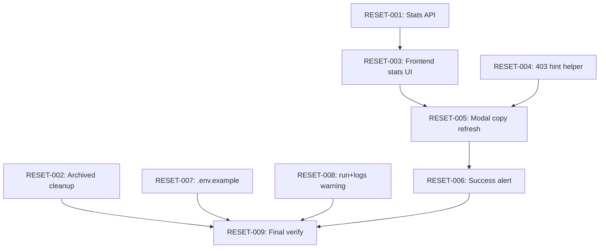

# Implementation Plan: Admin DB Reset Refresh

**Created:** 2026-07-23  
**Status:** ✅ Implemented (RESET-001…010)  
**Spec:** [`ai_docs/specs/admin-db-reset-refresh.md`](../../specs/admin-db-reset-refresh.md)  
**Idea:** [`ai_docs/ideas/admin-db-reset-refresh.md`](../../ideas/admin-db-reset-refresh.md)

## Overview

Приводим админское «Обнулить ВСЁ» в соответствие с текущей архитектурой: честная статистика (SQLite vs legacy JSON), расширенный full reset (включая `bot_archived/data/plans/`), актуальные тексты UI, понятный 403 для dev без ослабления security guard.

## Current state (baseline)

| Компонент | Сейчас |
|-----------|--------|
| `DbManagementModal` | Предупреждение про Telegram-бот; «JSON-планы»; stats «Файлов планов (JSON)» |
| `AdminService.get_stats` | `plans_count` из SQLite metadata; label в UI врёт |
| `AdminService.reset_full` | SQLite + `data/plans/` + calendar; **не** чистит `bot_archived/data/plans/` |
| 403 UX | Generic «запрещено в текущем окружении»; env detail скрыт в API (by design) |
| Tests | `test_admin_service.py`, `test_destructive_db_guard.py`, `test_http_errors.py` |
| Runtime plans | SQLite `production_plans` (4 rows); `data/plans/` пуст |

## Architecture decisions

1. **Backend-first для stats и reset scope** — frontend labels зависят от нового поля API.
2. **403 hint только на frontend** — HTTP `detail` не меняем (тест `hides_env_details`).
3. **`bot_archived` path injectable в тестах** — через optional `archived_data_dir` на `Settings` или параметр метода; **не** трогаем реальный `bot_archived/` в CI.
4. **`current_plan_present` остаётся в API**, но **убираем из UI** (open question #1 → решение: hide).
5. **Success Alert** — для всех reset-мутаций (`full`, `kp-only`, `plans-only`, `calendar-only`), не для `recover-plates` (open question #3).
6. **`run+logs.sh` warning** — включаем в MVP (open question #2 → yes).



---

## Task list

### Phase 1: Backend foundation

#### RESET-001: Honest stats API (`legacy_json_files_count`)

**Description:** Расширить `DbStatsResponse` и `AdminService.get_stats()`: исправить descriptions, добавить подсчёт legacy JSON в `settings.plans_dir` и archived plans dir.

**Acceptance criteria:**
- [ ] `DbStatsResponse.legacy_json_files_count: int` добавлено с description
- [ ] `plans_count` description указывает на SQLite (`production_plans` / metadata)
- [ ] `get_stats()` считает `*.json` в `plans_dir` + archived plans dir
- [ ] Существующие поля KP/plates без регрессий

**Verification:**
- [ ] `pytest tests/test_admin_service.py::test_get_stats_aggregates_db_and_plans -q`
- [ ] Новый тест: legacy files в tmp dirs → `legacy_json_files_count > 0`

**Dependencies:** None

**Files likely touched:**
- `app/schemas/admin.py`
- `app/services/admin_service.py`
- `tests/test_admin_service.py`

**Estimated scope:** S

**Implementation note:** Добавить на `Settings` поле `archived_data_dir: Path = PROJECT_ROOT / "bot_archived" / "data"` (или константу в `AdminService` с override в тестах через `Settings`).

---

#### RESET-002: Archived legacy cleanup in `reset_full`

**Description:** Реализовать `_clear_archived_legacy()` и вызвать из `reset_full` после `_clear_all_plans`. Отчёт в `DbResetReport.plans`: `archived_plan_files`, `archived_metadata`, `archived_calendar`.

**Acceptance criteria:**
- [ ] Full reset удаляет `*.json` в archived plans dir (rmtree + mkdir или unlink loop)
- [ ] Unlink `archived/plans_metadata.json`, `archived/work_calendar.json` if exist
- [ ] `reset_plans_only` / `reset_kp_only` / `reset_calendar_only` **не** вызывают archived cleanup
- [ ] `app_users` сохраняется (existing test green)

**Verification:**
- [ ] `pytest tests/test_admin_service.py::test_reset_full_clears_all_plate_tables_and_plans -q`
- [ ] Новый тест: seed archived dir в `tmp_path` → after reset files gone, report counts correct

**Dependencies:** None (parallel with RESET-001)

**Files likely touched:**
- `app/services/admin_service.py`
- `core/config/settings.py` (optional `archived_data_dir`)
- `tests/test_admin_service.py`

**Estimated scope:** M

---

### Checkpoint: Backend

- [ ] `pytest tests/test_admin_service.py tests/test_destructive_db_guard.py tests/test_http_errors.py -q` — green
- [ ] Guard policy и 403 detail без env vars — без изменений

---

### Phase 2: Frontend foundation

#### RESET-003: Admin stats types + StatsBlock labels

**Description:** Обновить `DbStatsResponse` TS type и `StatsBlock`: «Планов (SQLite)», «Legacy JSON-файлов»; убрать строку `current_plan.json`.

**Acceptance criteria:**
- [ ] `legacy_json_files_count` в `types/admin.ts`
- [ ] Labels без «JSON» как primary storage
- [ ] `current_plan_present` не отображается

**Verification:**
- [ ] `cd frontend && npm run typecheck`
- [ ] `cd frontend && npm run build`

**Dependencies:** RESET-001

**Files likely touched:**
- `frontend/src/features/admin/types/admin.ts`
- `frontend/src/features/admin/components/DbManagementModal.tsx`

**Estimated scope:** S

---

#### RESET-004: 403 destructive reset hint (frontend-only)

**Description:** Новый helper `destructiveResetError.ts`: map `ApiError` 403 + known detail → dev instruction. Интеграция в `ResetConfirmDialog` (расширенный текст под Alert).

**Acceptance criteria:**
- [ ] Константа client message совпадает с `MSG_DESTRUCTIVE_DB_BLOCKED` из backend
- [ ] Hint содержит `ALLOW_DESTRUCTIVE_DB_RESET=1` и «перезапустите backend»
- [ ] Другие 403 не получают этот hint
- [ ] Unit tests для helper

**Verification:**
- [ ] `cd frontend && npm test -- --run src/features/admin/lib/destructiveResetError.test.ts`
- [ ] Manual: reset без флага → hint виден в dialog

**Dependencies:** None

**Files likely touched:**
- `frontend/src/features/admin/lib/destructiveResetError.ts` (new)
- `frontend/src/features/admin/lib/destructiveResetError.test.ts` (new)
- `frontend/src/features/admin/components/ResetConfirmDialog.tsx`

**Estimated scope:** S

---

### Checkpoint: API ↔ UI wiring

- [ ] Stats modal показывает SQLite + legacy counts
- [ ] 403 hint работает независимо от stats

---

### Phase 3: UI copy + feedback

#### RESET-005: DbManagementModal — honest reset copy

**Description:** Переписать warning, descriptions всех 4 reset-кнопок, button labels per spec F1.

**Acceptance criteria:**
- [ ] Нет «Telegram-бот», «JSON-планы» как primary
- [ ] Full reset описывает SQLite + legacy + calendar
- [ ] «Удалить все планы» вместо «Только планы (JSON)»
- [ ] Plans-only description упоминает `production_plans`

**Verification:**
- [ ] Grep: `DbManagementModal.tsx` — no `Telegram`, no `JSON-планы производства`
- [ ] Manual: тексты читаются однозначно

**Dependencies:** RESET-003, RESET-004

**Files likely touched:**
- `frontend/src/features/admin/components/DbManagementModal.tsx`

**Estimated scope:** S

---

#### RESET-006: Success Alert после reset

**Description:** После успешной reset-мутации показывать краткий success Alert в главной модалке с ключевыми цифрами из `DbResetReport`.

**Acceptance criteria:**
- [ ] Alert после `full`, `kp-only`, `plans-only`, `calendar-only`
- [ ] Full reset: KP total из `sqlite`, plans из `plans`, legacy archived counts если > 0
- [ ] Alert исчезает при закрытии модалки или новой операции
- [ ] `recover-plates` без этого alert (свой RecoverResultLine)

**Verification:**
- [ ] Manual: full reset с флагом → success message + stats refetch

**Dependencies:** RESET-005

**Files likely touched:**
- `frontend/src/features/admin/components/DbManagementModal.tsx`

**Estimated scope:** S

**Helper sketch:**
```typescript
function formatResetSuccess(report: DbResetReport): string {
  const kp = report.sqlite?.kp_offers ?? 0;
  const plans = report.plans?.sqlite_plans ?? 0;
  // ...
}
```

---

### Phase 4: Dev DX

#### RESET-007: `.env.example` dev preset

**Description:** Добавить явный блок для локального destructive reset.

**Acceptance criteria:**
- [ ] Комментарий: только для local dev
- [ ] Строка `# ALLOW_DESTRUCTIVE_DB_RESET=1` с пояснением

**Verification:**
- [ ] Manual read — понятно новому dev

**Dependencies:** None

**Files likely touched:**
- `.env.example`

**Estimated scope:** XS

---

#### RESET-008: `run+logs.sh` startup warning

**Description:** При старте backend проверять `ALLOW_DESTRUCTIVE_DB_RESET`; если не truthy — жёлтое предупреждение в консоль.

**Acceptance criteria:**
- [ ] Warning только если переменная не `1/true/yes/on`
- [ ] Не ломает CI/non-interactive запуск
- [ ] Текст ссылается на `.env.example`

**Verification:**
- [ ] Запуск без флага → warning в лог
- [ ] Запуск с флагом → без warning

**Dependencies:** RESET-007

**Files likely touched:**
- `run+logs.sh`

**Estimated scope:** XS

---

### Phase 5: Documentation sync

#### RESET-010: Update spec status + docstrings

**Description:** Обновить статус spec → `planned`; поправить docstring в `AdminService.reset_full` («JSON-планы» → SQLite + legacy); link plan в spec header.

**Acceptance criteria:**
- [ ] Spec status и Plan link актуальны
- [ ] `admin_service.py` docstrings без бота

**Verification:**
- [ ] Read-through spec ↔ plan ↔ code comments

**Dependencies:** RESET-001…008

**Files likely touched:**
- `ai_docs/specs/admin-db-reset-refresh.md`
- `app/services/admin_service.py`

**Estimated scope:** XS

---

### Checkpoint: Complete

#### RESET-009: Final verification

**Description:** Полный прогон тестов и manual checklist из spec.

**Acceptance criteria:**
- [ ] All spec Success Criteria checked
- [ ] Manual checklist (403, full reset, admin login preserved)

**Verification:**
```bash
pytest tests/test_admin_service.py tests/test_destructive_db_guard.py tests/test_http_errors.py -q
cd frontend && npm test -- --run && npm run build && npm run typecheck
```

**Manual checklist:**
1. [ ] Без `ALLOW_DESTRUCTIVE_DB_RESET` → 403 + hint
2. [ ] С флагом → full reset → stats нули, production UI без планов
3. [ ] Admin login работает после reset
4. [ ] `bot_archived/data/plans/` пуст (если были файлы)

**Dependencies:** RESET-001…010

**Estimated scope:** S

---

## Parallelization

| Parallel group | Tasks | Notes |
|----------------|-------|-------|
| A | RESET-001, RESET-002, RESET-004, RESET-007 | Независимые backend/frontend/docs |
| B | RESET-003 | После RESET-001 |
| C | RESET-005, RESET-006 | После RESET-003, RESET-004 |
| D | RESET-008 | После RESET-007 |
| Final | RESET-009, RESET-010 | Sequential |

---

## Risks and mitigations

| Risk | Impact | Mitigation |
|------|--------|------------|
| Тесты удаляют реальный `bot_archived/data/plans/` | High | Injectable `archived_data_dir` в tmp_path |
| Frontend detail string drift vs backend | Med | Shared constant или copy test asserting exact match |
| Success alert шумит на partial reset | Low | Краткий однострочный формат per variant |
| `run+logs.sh` не видит `.env` | Med | Source `.env` if exists before check (как backend) |

---

## Resolved open questions (plan defaults)

| Question | Decision |
|----------|----------|
| `current_plan_present` в UI | **Убрать** из StatsBlock; поле API оставить |
| `run+logs.sh` warning | **Включить** (RESET-008) |
| Success Alert scope | **Все reset-варианты**, не recover |

---

## Implementation order (recommended)

1. RESET-001 → RESET-002 (backend)
2. RESET-003 + RESET-004 (frontend foundation, parallel)
3. RESET-005 → RESET-006 (UI polish)
4. RESET-007 → RESET-008 (dev DX)
5. RESET-010 → RESET-009 (docs + verify)

**Estimated total:** 9 implementation tasks + 1 doc sync, ~3–4 focused sessions.

---

## Ready for IMPLEMENT

После approval плана — Phase 4 по одной задаче (`RESET-001` first). Каждая задача: implement → verify → commit (если requested).
