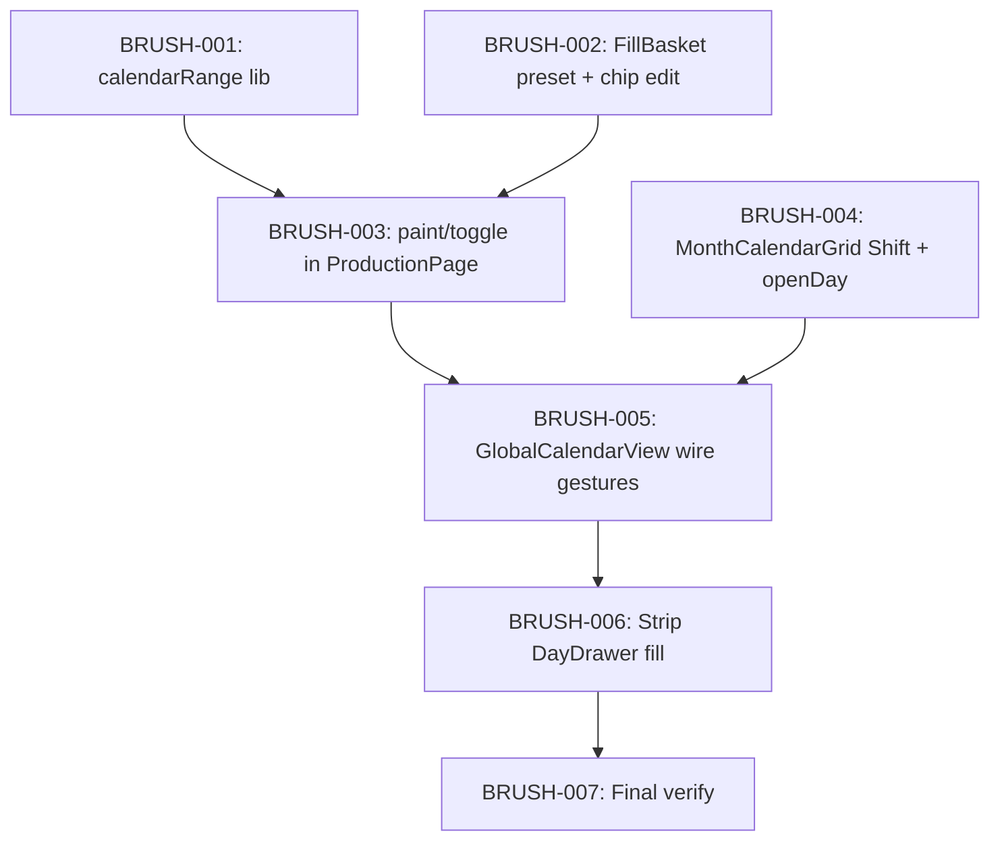

# Implementation Plan: Calendar Brush Planning

**Created:** 2026-07-23  
**Status:** ✅ Implemented (BRUSH-001…007)  
**Spec:** [`ai_docs/specs/calendar-first-planning.md`](../../specs/calendar-first-planning.md) (brush v2)  
**Idea:** [`ai_docs/ideas/calendar-first-planning.md`](../../ideas/calendar-first-planning.md)  
**Prerequisite:** CAL-001…009 (drawer calendar-first) уже в коде — переиспользуем basket/kind/wizard.

## Overview

Заменяем набор корзины через DayDrawer на **кисть на сетке**: пресет N в sticky-баре → клик / Shift-диапазон → чипы с editable N → тот же CTA и `fill_targets`. Drawer остаётся только для просмотра. Backend и wizard не трогаем.

## Current state (baseline)

| Компонент | Сейчас |
|-----------|--------|
| `FillBasket` | `return null` если пусто; нет пресета N; нет edit на чипе |
| `MonthCalendarGrid` | `onSelectDate(iso)` — без Shift; клик открывает drawer через родителя |
| `DayDrawer` | Есть fill-секция (`onAddToFillBasket`) |
| `ProductionPage` | `addToBasket(date, tracks)` + kind validation |
| `basketDayKind` / wizard / tabs | ✅ Готово, сохранить |

## Architecture decisions

1. **Pure `calendarRange` lib first** — `datesBetweenInclusive` + `paintDays` / `isDayBrushSelectable`; TDD до UI.
2. **`brushTracks` в `ProductionPage`** (или `GlobalCalendarView`) — отдельно от `item.tracks`; смена пресета не мутирует корзину.
3. **Клик = кисть (toggle); drawer = double-click или «i»** — без toggle «Планирую».
4. **Shift+range only** — drag out of MVP.
5. **Fill UI из DayDrawer удалить сразу** — без feature-flag.
6. **Sticky всегда виден** — пресет N даже при пустой корзине; CTA disabled/hidden пока пусто.

---

## Task list

### Phase 1: Foundation

#### BRUSH-001: `calendarRange` helpers + tests

**Description:** Чистые функции диапазона и покраски дней с clamp и kind-check, согласованные с `basketDayKind`.

**Acceptance criteria:**
- [x] `datesBetweenInclusive("2026-07-20","2026-07-24")` → отсортированный список ISO
- [x] `isDayBrushSelectable(dayInfo, holidays, …)` → false для weekend/full/completed
- [x] `paintDays(...)` возвращает items с `tracks = min(brushTracks, freeSlots)`; при mix kind — `error` и пустой/частичный add per spec (рекомендация: **reject весь batch если любой день несовместим**, либо skip incompatible + error — выбрать **skip incompatible + set error if any skipped**; зафиксировать в тесте)
- [x] Использует `getDayKind` / `canAddDayToBasket`

**Verification:**
- [x] `cd frontend && npm test -- --run src/features/production/lib/calendarRange.test.ts`

**Dependencies:** None

**Files likely touched:**
- `frontend/src/features/production/lib/calendarRange.ts` (new)
- `frontend/src/features/production/lib/calendarRange.test.ts` (new)

**Estimated scope:** S

**Decision note:** Для range: добавлять только совместимые дни; если часть пропущена из-за kind/holiday — `basketError` с понятным текстом (не молча).

---

#### BRUSH-002: FillBasket — always visible + preset N + chip edit

**Description:** Sticky-бар всегда рендерится. Пресет «Дорожек: N». Чипы с `<input type="number">` для tracks. CTA как сейчас, disabled при пустой корзине.

**Acceptance criteria:**
- [x] Пустая корзина: видны пресет N + подсказка; primary CTA disabled или скрыт
- [x] Непустая: чипы + editable N + dual CTA labels
- [x] `onBrushTracksChange`, `onChipTracksChange(date, tracks)`
- [x] Комментарий про DayDrawer удалён/обновлён

**Verification:**
- [x] `cd frontend && npm test -- --run` (no break)
- [ ] Manual later after wiring

**Dependencies:** None (можно параллельно с BRUSH-001)

**Files likely touched:**
- `frontend/src/features/production/components/FillBasket.tsx`
- `frontend/src/index.css` (chip input styles if needed)

**Estimated scope:** S

---

### Checkpoint: Foundation

- [x] calendarRange tests green
- [x] FillBasket compiles with new props (даже если родитель ещё stubs)

---

### Phase 2: Brush interaction

#### BRUSH-003: ProductionPage — brushTracks + paint/toggle/range API

**Description:** Состояние `brushTracks`, `selectionAnchor`. Методы: toggle day, paint range, update chip tracks, clear. Kind validation через `paintDays` / existing helpers.

**Acceptance criteria:**
- [x] Plain add использует `brushTracks` (clamp)
- [x] Toggle remove если день уже в корзине
- [x] `paintRange(from, to)` через `datesBetweenInclusive` + merge в basket
- [x] Смена `brushTracks` не меняет существующие items
- [x] Chip edit clamps to freeSlots

**Verification:**
- [x] Unit-тест helpers если вынесены; иначе thin wrapper + calendarRange coverage
- [x] `cd frontend && npm test -- --run`

**Dependencies:** BRUSH-001

**Files likely touched:**
- `frontend/src/pages/production/ProductionPage.tsx`
- optionally extract `lib/basketPaint.ts` if page gets heavy (keep ≤5 files)

**Estimated scope:** M

---

#### BRUSH-004: MonthCalendarGrid — Shift-click + open day gesture

**Description:** Расширить API сетки: `onDayActivate(iso, { shiftKey })`; `onOpenDay(iso)` по double-click и/или кнопке «i». Показ N на highlighted ячейках (`basketTracksByDate?: Record<string, number>`).

**Acceptance criteria:**
- [x] Single click → `onDayActivate(iso, { shiftKey: false })` (не открывает drawer)
- [x] Shift+click → `onDayActivate(iso, { shiftKey: true })`
- [x] Double-click или «i» → `onOpenDay(iso)`
- [x] Highlighted days показывают tracks если переданы
- [x] Holiday/outside по-прежнему не кликабельны как сейчас

**Verification:**
- [x] `cd frontend && npm test -- --run` 
- [ ] Manual: Shift range after BRUSH-005

**Dependencies:** None (parallel with BRUSH-003)

**Files likely touched:**
- `frontend/src/features/production/components/MonthCalendarGrid.tsx`
- `frontend/src/index.css` (info button / tracks badge)

**Estimated scope:** M

---

#### BRUSH-005: GlobalCalendarView — wire brush gestures

**Description:** Связать grid + FillBasket + drawer open. Клик сетки → page paint/toggle; Shift → range от anchor; openDay → setSelectedDate. Прокинуть brushTracks props в FillBasket. Обновить subtitle.

**Acceptance criteria:**
- [x] Полный flow клик/Shift без открытия drawer
- [x] Drawer открывается только secondary gesture
- [x] basketError показывается
- [x] FillBasket всегда смонтирован с пресетом

**Verification:**
- [ ] Manual smoke: empty range paint
- [x] `cd frontend && npm test -- --run`

**Dependencies:** BRUSH-002, BRUSH-003, BRUSH-004

**Files likely touched:**
- `frontend/src/features/production/components/GlobalCalendarView.tsx`
- `frontend/src/pages/production/ProductionPage.tsx` (prop plumbing)

**Estimated scope:** M

---

### Checkpoint: Brush E2E (after BRUSH-001–005)

- [ ] Пресет N → Shift-диапазон → чипы → CTA → plates (ручной)
- [ ] Chip edit меняет только один день
- [ ] Mix kind → warning
- [x] Review with human before stripping drawer fill

---

### Phase 3: Cleanup + verify

#### BRUSH-006: Strip DayDrawer fill UI

**Description:** Удалить `onAddToFillBasket`, fill state/UI, связанные props из DayDrawer и вызовов.

**Acceptance criteria:**
- [x] Нет секции «Положить дорожек» / «Добавить в план»
- [x] `rg onAddToFillBasket frontend/` пусто
- [x] Drawer по-прежнему показывает документы/треки

**Verification:**
- [x] `rg 'onAddToFillBasket|day-fill-add' frontend/` → empty
- [x] `cd frontend && npm test -- --run`

**Dependencies:** BRUSH-005

**Files likely touched:**
- `frontend/src/features/production/components/DayDrawer.tsx`
- `frontend/src/features/production/components/GlobalCalendarView.tsx`

**Estimated scope:** S

---

#### BRUSH-007: Final verification + docs

**Description:** Прогон критериев спеки; обновить статусы spec/plan.

**Acceptance criteria:**
- [x] `cd frontend && npm test -- --run` green
- [x] `cd frontend && npm run build` success
- [x] fill_targets pytest smoke + unit green
- [x] Spec acceptance checkboxes updated; plan status → implemented

**Verification:** commands above + manual checklist из Success Criteria спеки

**Dependencies:** BRUSH-006

**Files likely touched:**
- `ai_docs/specs/calendar-first-planning.md`
- `ai_docs/develop/plans/2026-07-23-calendar-brush-planning.md`

**Estimated scope:** XS

---

### Checkpoint: Complete

- [x] All brush MVP acceptance criteria met
- [x] DayDrawer без планирования
- [ ] Ready for review / commit (по запросу)

---

## Parallelization

| Parallel | Sequential |
|----------|------------|
| BRUSH-001 ‖ BRUSH-002 ‖ BRUSH-004 | BRUSH-003 after 001 |
| | BRUSH-005 after 002+003+004 |
| | BRUSH-006 after 005 |

---

## Risks and mitigations

| Risk | Impact | Mitigation |
|------|--------|------------|
| Путаница клик vs открыть день | Med | Явная «i» + double-click; subtitle hint |
| Shift-range хватает выходные/full | Low | `isDayBrushSelectable` skip + optional error |
| Partial batch kind mix mid-range | Med | Skip incompatible + warning (BRUSH-001 decision) |
| Регрессия drawer documents | Low | BRUSH-006 не трогает document mutations |
| FillBasket always-visible ломает layout | Low | CSS sticky; CTA disabled when empty |

---

## Open questions (locked for plan)

| # | Decision |
|---|----------|
| Q1–Q5 из спеки | Приняты рекомендации (нет toggle, нет drag, strip fill, no repaint on preset change, click=toggle) |
| Range mix policy | Skip incompatible days + set `basketError` |

---

## Estimated effort

| Phase | Tasks | Sessions |
|-------|-------|----------|
| Foundation | 001–002 | ~0.5–1 |
| Brush UI | 003–005 | ~1–2 |
| Cleanup | 006–007 | ~0.5 |
| **Total** | 7 tasks | **~2–3 sessions** |

---

## Verification checklist (plan approval)

- [x] Every task has acceptance criteria
- [x] Every task has verification step
- [x] Dependencies ordered; no task > ~5 files
- [x] Checkpoints after foundation and brush E2E
- [ ] Human reviewed and approved plan
