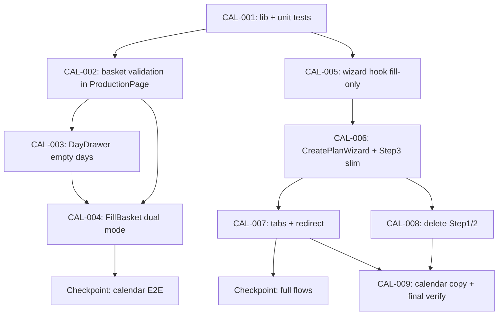

# Implementation Plan: Calendar-First Planning

**Created:** 2026-07-23  
**Status:** ✅ Implemented (Phase 3 complete)  
**Spec:** [`ai_docs/specs/calendar-first-planning.md`](../../specs/calendar-first-planning.md)  
**Idea:** [`ai_docs/ideas/calendar-first-planning.md`](../../ideas/calendar-first-planning.md)

## Overview

Переносим точку входа «Начать планирование» с 3-шагового мастера на sticky-корзину под «Календарным планом». Планировщик кликает дни → задаёт N дорожек per-day → жмёт «Начать планирование» (свободные) или «Дозаполнить» (частичные) → попадает сразу на выбор плит с `fill_targets` и автоименем. Backend не меняем.

## Current state

| Компонент | Статус |
|-----------|--------|
| `FillBasket.tsx` | Sticky-плашка; только кнопка «Дозаполнить» |
| `DayDrawer.tsx` | Секция добавления только при `freeSlots > 0`; текст «+ Добавить в дозаполнение» |
| `ProductionPage.tsx` | Корзина + переход `tab=create`; нет валидации kind |
| `CreatePlanWizard.tsx` | 3 шага; fill mode → step 3 |
| `ProductionTabs.tsx` | 4 вкладки, включая «Начать планирование» |
| Backend `fill_targets` | ✅ Работает; smoke-тесты есть |

## Architecture decisions

1. **Backend без изменений** — весь новый UX идёт через существующий `BuildPlanRequest.fill_targets`.
2. **`BasketDayKind` в чистых функциях** — `getDayKind(dayInfo)` и `getBasketKind(items, daysInfo)` в `lib/`, покрыты unit-тестами до UI.
3. **`tab=create` — скрытый programmatic route** — убираем из табов, но оставляем для перехода с корзины; прямой заход без `fillRequest` → redirect на calendar.
4. **Две кнопки в корзине по kind** — не объединяем «новый план» и «дозаполнение» (разная семантика и заголовки wizard).
5. **Автоимя плана** — `planNameFromDates()`; поле ввода в Step3 убираем для всех режимов.
6. **Wizard = только Step3** — Step1/Step2/WizardStepIndicator удаляем в финальной задаче после того, как fill-only path работает.
7. **Open questions (решения MVP):** Q1 — плашка только после 1-го дня; Q2 — redirect; Q3 — «План 23.07»; Q4 — контекстный текст в DayDrawer; Q5 — удалить Step1/Step2.

## Dependency graph

```
lib/basketDayKind.ts ──┬── lib/planNameFromDates.ts
                       │
                       ├── ProductionPage (validation, basket kind state)
                       │       │
                       │       ├── GlobalCalendarView (alert, subtitle)
                       │       │       ├── DayDrawer (empty days, labels)
                       │       │       └── FillBasket (dual CTA)
                       │       │
                       │       └── tab=create → CreatePlanWizard
                       │               │
                       │               ├── useCreatePlanWizardState (fill-only, auto name)
                       │               └── Step3KpPlateSelection (no name field)
                       │
                       └── ProductionTabs (remove create tab)
```

Порядок: **lib → calendar/basket → wizard → navigation cleanup → delete dead code → verify**.



---

## Task list

### Phase 1: Foundation (pure logic)

#### CAL-001: Basket kind + plan name helpers

**Description:** Добавить чистые функции определения типа дня/корзины и генерации автоимени плана. TDD: сначала тесты, потом реализация.

**Acceptance criteria:**
- [x] `getDayKind({ occupied, max })` → `"empty" | "partial" | "full"` (`full` при `freeSlots === 0`)
- [x] `getBasketKind(items, daysInfo)` → `"empty" | "partial" | null` (null для пустой корзины)
- [x] `canAddDayToBasket(basketKind, dayKind)` → false при смешивании empty/partial
- [x] `planNameFromDates(["2026-07-23"])` → `"План 23.07"`
- [x] `planNameFromDates(["2026-07-23","2026-07-25"])` → `"План 23–25.07"`

**Verification:**
- [x] `cd frontend && npm test -- --run src/features/production/lib/basketDayKind.test.ts src/features/production/lib/planNameFromDates.test.ts`

**Dependencies:** None

**Files likely touched:**
- `frontend/src/features/production/lib/basketDayKind.ts` (new)
- `frontend/src/features/production/lib/planNameFromDates.ts` (new)
- `frontend/src/features/production/lib/basketDayKind.test.ts` (new)
- `frontend/src/features/production/lib/planNameFromDates.test.ts` (new)

**Estimated scope:** S (4 files, pure logic)

---

### Phase 2: Calendar basket (vertical slice 1)

#### CAL-002: Basket validation in ProductionPage

**Description:** Расширить `addToBasket`: перед добавлением проверять kind дня vs kind корзины. При reject — не менять basket, выставлять `basketError` для UI. Прокинуть `daysInfo` из `GlobalCalendarView` / query.

**Acceptance criteria:**
- [x] Добавление partial дня в empty-корзину (и наоборот) блокируется
- [x] Сообщение: «Нельзя смешивать свободные и частично занятые дни…»
- [x] Добавление дня того же kind работает как сейчас (replace по date)
- [x] `basketKind` доступен downstream (`FillBasket`, `DayDrawer`)

**Verification:**
- [x] Unit-тест `addToBasket` logic (extract helper или test via `basketDayKind` + integration in component test)
- [x] `cd frontend && npm test -- --run` — green

**Dependencies:** CAL-001

**Files likely touched:**
- `frontend/src/pages/production/ProductionPage.tsx`
- `frontend/src/features/production/components/GlobalCalendarView.tsx` (pass daysInfo, basketError, basketKind)
- `frontend/src/features/production/lib/basketDayKind.test.ts` (extend if needed)

**Estimated scope:** M (3 files)

---

#### CAL-003: DayDrawer — empty days + contextual labels

**Description:** Показывать секцию «Положить дорожек: N» для empty days (`occupied === 0`, `freeSlots === max`). Лимит N: `1..max` для empty, `1..freeSlots` для partial. Контекстные тексты кнопки по kind дня/корзины.

**Acceptance criteria:**
- [x] Empty day (0/N) показывает секцию добавления с default N = max
- [x] Partial day — поведение как сейчас
- [x] Fully occupied day — секция скрыта
- [x] Кнопка: empty → «+ Добавить в план»; partial → «+ Добавить в дозаполнение» (или «Заменить…»)
- [x] Subtitle карточки календаря обновлён: «Клик по дню — задать число дорожек и добавить в корзину»

**Verification:**
- [ ] Manual: клик по пустому дню → input + добавление в корзину
- [x] `cd frontend && npm test -- --run` — green

**Dependencies:** CAL-002

**Files likely touched:**
- `frontend/src/features/production/components/DayDrawer.tsx`
- `frontend/src/features/production/components/GlobalCalendarView.tsx` (subtitle, pass basketKind)

**Estimated scope:** M (2–3 files)

---

#### CAL-004: FillBasket — dual-mode CTA

**Description:** Принять `basketKind: "empty" | "partial"` и показывать соответствующую primary-кнопку. Обновить aria-label региона.

**Acceptance criteria:**
- [x] `basketKind === "empty"` → «🚀 Начать планирование →» (без подсчёта дор./дн. или с ним — как в макете идеи)
- [x] `basketKind === "partial"` → «Дозаполнить N дор. на M дн. →» (как сейчас)
- [x] Плашка по-прежнему `return null` при пустой корзине
- [x] `basketError` отображается (Alert в FillBasket или над плашкой)

**Verification:**
- [ ] Manual: empty basket → правильная кнопка; partial → «Дозаполнить»
- [ ] Optional component test for button label

**Dependencies:** CAL-002, CAL-003

**Files likely touched:**
- `frontend/src/features/production/components/FillBasket.tsx`
- `frontend/src/index.css` (minor, only if error styling needed)

**Estimated scope:** S (1–2 files)

---

### Checkpoint: Calendar basket (after CAL-001 – CAL-004)

- [x] Можно добавить 2 свободных дня с разным N → sticky-корзина → кнопка «Начать планирование»
- [x] Дозаполнение partial days работает как раньше
- [x] Смешивание kind блокируется с сообщением
- [x] `cd frontend && npm test -- --run` green
- [ ] **Review with human before wizard refactor**

---

### Phase 3: Wizard fill-only (vertical slice 2)

#### CAL-005: useCreatePlanWizardState — fill-only entry

**Description:** Убрать step 1–2 flow. Hook всегда ожидает `fillRequest`; при mount без него — no-op (redirect делает ProductionPage). Авто `planName` из `planNameFromDates`. Submit всегда шлёт `plan_name` и `fill_targets`.

**Acceptance criteria:**
- [x] `fillRequest` → step 3 immediately, `isFillMode === true`
- [x] `planName` auto-set при consume fillRequest (не редактируется пользователем)
- [x] `handleSubmit` передаёт `plan_name: planNameFromDates(...)` всегда
- [x] `cardTitle`: empty kind → «Начать планирование»; partial → «Дозаполнение дней»
- [x] `tracksPerDaySource` → переименовать в «календарь» / убрать «шаг 2»
- [x] Удалены неиспользуемые state: `startDate`, `tracksCount`, step navigation 1–2 (или минимизированы)

**Verification:**
- [x] Переписать `useCreatePlanWizardState.test.ts`: убрать step 1–2 tests; добавить auto planName + empty kind title
- [x] `cd frontend && npm test -- --run useCreatePlanWizardState`

**Dependencies:** CAL-001

**Files likely touched:**
- `frontend/src/features/production/hooks/useCreatePlanWizardState.ts`
- `frontend/src/features/production/hooks/useCreatePlanWizardState.test.ts`

**Estimated scope:** M (2 files)

---

#### CAL-006: CreatePlanWizard + Step3 — plate selection only

**Description:** Убрать Step1, Step2, WizardStepIndicator из рендера. Step3 — убрать поле «Название плана»; кнопка «Назад» → `onCancelFill` (возврат на календарь), не step 2.

**Acceptance criteria:**
- [x] `CreatePlanWizard` рендерит только `Step3KpPlateSelection`
- [x] Нет поля ручного ввода planName
- [x] «Назад» / «Отмена» возвращает на календарь и очищает корзину
- [x] Subtitle показывает сводку дор./дней (как в fill mode сейчас)

**Verification:**
- [ ] Manual: proceed from basket → plate screen без step indicator
- [x] `cd frontend && npm test -- --run`

**Dependencies:** CAL-005

**Files likely touched:**
- `frontend/src/features/production/components/CreatePlanWizard.tsx`
- `frontend/src/features/production/components/create-plan-wizard/Step3KpPlateSelection.tsx`

**Estimated scope:** M (2 files)

---

### Phase 4: Navigation cleanup (vertical slice 3)

#### CAL-007: ProductionTabs + redirect guard

**Description:** Убрать вкладку «Начать планирование». При `tab=create` без pending `fillRequest` и пустой корзине — redirect `?tab=calendar` + info Alert «Сначала выберите дни на календаре».

**Acceptance criteria:**
- [x] `ProductionTabs` — 3 вкладки: calendar | plans | work-calendar
- [x] Прямой URL `?tab=create` → redirect на calendar + одноразовый hint (state или query flag)
- [x] Переход с корзины (`handleProceed`) по-прежнему открывает create tab с fillRequest
- [x] `ProductionTab` type: `create` остаётся для internal routing или помечается deprecated в комментарии

**Verification:**
- [ ] Manual: bookmark `?tab=create` → calendar + hint
- [ ] Manual: basket proceed → plate selection works
- [x] `cd frontend && npm test -- --run`

**Dependencies:** CAL-006

**Files likely touched:**
- `frontend/src/features/production/components/ProductionTabs.tsx`
- `frontend/src/pages/production/ProductionPage.tsx`
- `frontend/src/features/production/types/production.ts` (optional comment)

**Estimated scope:** S (2–3 files)

---

### Checkpoint: Full flows (after CAL-005 – CAL-007)

- [ ] **Happy path (новый план):** 2 empty days → «Начать планирование» → plates → build с `fill_targets`, имя «План DD–DD.MM»
- [ ] **Happy path (дозаполнение):** partial day → «Дозаполнить» → plates → build
- [x] **Redirect:** `?tab=create` без корзины → calendar
- [x] `cd frontend && npm test -- --run` green

---

### Phase 5: Dead code removal + close-out

#### CAL-008: Delete wizard steps 1–2

**Description:** Удалить неиспользуемые компоненты и импорты после того, как fill-only path стабилен.

**Acceptance criteria:**
- [x] Удалены: `Step1PlanStartDate.tsx`, `Step2TracksConfig.tsx`, `WizardStepIndicator.tsx`
- [x] Нет импортов / ссылок в codebase (`rg Step1PlanStartDate` пусто)
- [x] `utils.ts` в create-plan-wizard — оставить только используемое (`formatRu` и т.д.)

**Verification:**
- [x] `rg 'Step1PlanStartDate|Step2TracksConfig|WizardStepIndicator' frontend/` → empty
- [x] `cd frontend && npm run build` — success

**Dependencies:** CAL-006, CAL-007

**Files likely touched:**
- `frontend/src/features/production/components/create-plan-wizard/Step1PlanStartDate.tsx` (delete)
- `frontend/src/features/production/components/create-plan-wizard/Step2TracksConfig.tsx` (delete)
- `frontend/src/features/production/components/create-plan-wizard/WizardStepIndicator.tsx` (delete)

**Estimated scope:** S (3 deletes + grep verify)

---

#### CAL-009: Final verification

**Description:** Прогнать все критерии успеха из спеки; обновить статус spec/plan.

**Acceptance criteria:**
- [x] `cd frontend && npm test -- --run` — all green
- [x] `cd frontend && npm run build` — success
- [x] `pytest tests/test_production_planning_service_fill_targets_smoke.py -q` — green (unchanged)
- [x] `pytest tests/test_production_planning_service_fill_targets.py -q` — green
- [ ] Manual smoke: sticky basket visible; mixed kind blocked; auto plan name in created plan list

**Verification:** commands above + manual checklist from spec Success Criteria

**Dependencies:** CAL-008

**Files likely touched:**
- `ai_docs/specs/calendar-first-planning.md` (status → implemented)
- `ai_docs/develop/plans/2026-07-23-calendar-first-planning.md` (checkboxes)

**Estimated scope:** XS

---

### Checkpoint: Complete

- [x] All spec acceptance criteria met
- [x] No dead wizard code
- [x] Backend regression green
- [ ] Ready for code review

---

## Parallelization

| Parallel safe | Must be sequential |
|---------------|-------------------|
| CAL-001 tests writing while reviewing plan | CAL-002 depends on CAL-001 |
| CAL-005 (hook) can start once CAL-001 done, **parallel to CAL-003/004** if different agent | CAL-006 depends on CAL-005 |
| CAL-008 only after CAL-006/007 merged | CAL-004 depends on CAL-002 |

**Suggested parallel track after CAL-001:**
- Agent A: CAL-002 → CAL-003 → CAL-004 (calendar)
- Agent B: CAL-005 → CAL-006 (wizard)
- Merge → CAL-007 → CAL-008 → CAL-009

---

## Risks and mitigations

| Risk | Impact | Mitigation |
|------|--------|------------|
| Empty day не поддерживается backend `fill_targets` | High | Прогнать smoke до UI merge; при fail — эскалация (в spec assumption) |
| Race: redirect съедает fillRequest | Med | Передавать fillRequest через state до consume; redirect только если `!fillRequest && basket.length === 0` |
| Step3 «Назад» ломает UX | Low | Единый `onCancelFill` → calendar + clear basket |
| Тесты hook завязаны на step 1–2 | Med | CAL-005 явно переписывает test file |
| `daysInfo` недоступен в ProductionPage | Med | Поднять query в ProductionPage или прокинуть callback с kind из GlobalCalendarView |

---

## Open questions (carry-over from spec)

| # | Decision for implementation |
|---|----------------------------|
| Q1 | Sticky bar only after first day; hint in calendar Card subtitle |
| Q2 | Redirect `?tab=create` → calendar + Alert |
| Q3 | Auto name «План 23.07» for single day |
| Q4 | Contextual DayDrawer button labels |
| Q5 | Delete Step1/Step2 in CAL-008 |

---

## Estimated effort

| Phase | Tasks | Scope |
|-------|-------|-------|
| Foundation | CAL-001 | ~1 session |
| Calendar basket | CAL-002 – CAL-004 | ~1–2 sessions |
| Wizard | CAL-005 – CAL-006 | ~1 session |
| Navigation | CAL-007 | ~0.5 session |
| Cleanup + verify | CAL-008 – CAL-009 | ~0.5 session |
| **Total** | 9 tasks | **~3–4 focused sessions** |

---

## Verification checklist (plan approval)

- [x] Every task has acceptance criteria
- [x] Every task has verification step
- [x] Dependencies identified and ordered
- [x] No task touches more than ~5 files
- [x] Checkpoints after calendar slice and full flows
- [ ] Human reviewed and approved plan
