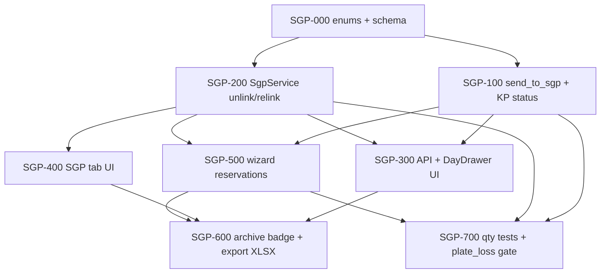

# Plan: Склад готовой продукции (СГП)

**Created:** 2026-07-27  
**Status:** ✅ Implemented (MVP complete)  
**Spec:** [`ai_docs/specs/sgp-warehouse.md`](../../specs/sgp-warehouse.md)  
**Idea:** [`ai_docs/ideas/sgp-warehouse.md`](../../ideas/sgp-warehouse.md)  
**Qty gate:** `scripts/run_plate_loss_regression.py` (PASS / orphan Σ=0)

## Goal

Разделить физический склад и потребность КП: день уходит на СГП, есть вкладка склада с unlink/relink, wizard умеет «закрыть со склада», статус КП «На СГП» + бейдж N/M, без потери qty.

## Current state

| Компонент | Сейчас |
|-----------|--------|
| `complete_day` | Alias → `send_to_sgp`; audit `on_sgp`/`sgp_send`; КП → «На СГП» |
| `completed_plates.kp_id` | NULLABLE + `plan_id` NULLABLE |
| UI | «Отправить на СГП»; вкладка СГП; unlink/relink |
| Wizard | Badge free + propose/confirm «Закрыть со склада» + `sgp_reservations` |
| Docs / export | Track docs без «с СГП»; `GET …/sgp-export` XLSX |
| Orphan / qty | Pre-flight 422; plate_loss PASS |
| Спека / план | ✅ implemented (MVP) |

## Architecture decisions

1. **Таблица:** расширить `completed_plates` (nullable `kp_id`), без rename.
2. **HTTP:** `POST /days/{date}/complete` остаётся; внутри — семантика send_to_sgp; метод сервиса переименовать в `send_to_sgp`, endpoint зовёт его (alias `complete_day` на 1 релиз для тестов).
3. **M (бейдж):** колонка `kp_meta.ordered_qty INTEGER` — заполняется один раз при первом уходе КП в производство (или backfill = SUM всех когда-либо учтённых qty по КП). N = SUM linked на СГП.
4. **Orphan pre-flight:** перед списанием сверить Σ `kp_plates` дня с агрегатом day_view/`kp_plate_id`; Δ>0 → 422, rollback.
5. **Reservations:** `sgp_reservations[]` в `BuildPlanRequest`; применяются в той же транзакции, что commit плана; в оптимизатор не попадают.
6. **Документы:** схема/разбивка/формовка без «с СГП»; новый endpoint + кнопка **«Со склада (XLSX)»** на уровне плана (`GET /plans/{plan_id}/sgp-export`).
7. **Удаление плана:** не трогать строки СГП; `plan_id` на СГП обнулять; `kp_plates` «в плане» → производство как сейчас.
8. **Схема СГП:** `completed_plates.plan_id TEXT NULL` + `kp_id` nullable.
9. **Без feature-flag.**
10. **Фаза 2 (не этот план):** рез донора с СГП.

## Plan-level answers (P1–P3)

| # | Решение |
|---|---------|
| P1 ordered_qty M | **a0:** freeze один раз при первом уходе КП в производство; дальше M не меняем |
| P2 export path | `GET /api/v1/production/plans/{plan_id}/sgp-export` → XLSX |
| P3 method name | `ProductionCompletionService.send_to_sgp`; `complete_day` = тонкий alias |
| P-A plan_id на СГП | **`completed_plates.plan_id TEXT NULL`** при send; delete plan → `plan_id=NULL`, qty не трогать |
| P-B удаление КП | **Без CASCADE** на СГП; при delete KP → `kp_id=NULL` (плиты остаются свободными) |
| P-C M (ordered_qty) | **a0:** freeze при первом уходе в производство; не меняем |
| P-D close qty | **min(free, demand)**; confirm да/нет без ручного qty |
| P-E выбор партий | **FIFO** по дате/id на СГП |
| P-F admin reset | Partial (kp/plans) **не** трогает СГП; **`reset_full` / «скинуть всё» — чистит и СГП** |

## Risks

| Риск | Митигация |
|------|-----------|
| Потеря qty при unlink/relink/split | TDD balance tests до UI; одна транзакция + audit |
| Orphan/фантомы на СГП | Pre-flight 422; не списывать без day_view |
| Wizard снова кладёт free на дорожку | Вычитать reservations до optimize |
| Старые тесты ждут «выполнено» | Массово обновить expectations → «На СГП» |
| FK `completed_plates.kp_id` при NULL | Миграция: пересоздать таблицу или ослабить FK (SQLite) — отдельный шаг SGP-000 |
| Удаление плана vs СГП | Явный тест: delete_plan не уменьшает SUM(completed_plates) |

## Parallelism

| Можно параллельно | После чего |
|-------------------|------------|
| SGP-200 (сервис unlink) ∥ SGP-100 (send) после SGP-000 | schema |
| SGP-400 (tab UI) ∥ SGP-500 (wizard) после API list/unlink | SGP-300 list endpoints |
| Frontend labels DayDrawer рано | после контракта ответа complete |

---

## Task list

### Phase 0–3

- [x] **SGP-000…303** ✅ (foundation, send, service, UI tab)

### Phase 4: Wizard reservations + plan row

- [x] **SGP-401:** Backend `sgp_reservations` + reduce demand before optimize + post-build reserve ✅
- [x] **SGP-402:** Wizard UI badge/confirm «Закрыть со склада» ✅
- [x] **SGP-403:** UI «с СГП» в day view; schema/formovka без этих позиций ✅

**Checkpoint 4:** ✅

### Phase 5: Archive, export, delete plan

- [x] **SGP-501:** Archive «На СГП» + бейдж N/M ✅
- [x] **SGP-502:** `GET /plans/{id}/sgp-export` + кнопка XLSX ✅
- [x] **SGP-503:** delete_plan clears `plan_id`, qty intact ✅

**Checkpoint 5:** ✅

### Phase 6: Hardening

- [x] **SGP-601:** qty balance tests ✅
- [x] **SGP-602:** plate_loss regression PASS ✅
- [x] **SGP-603:** expectations «На СГП» ✅
- [x] **SGP-604:** report ✅ (`ai_docs/develop/reports/2026-07-27-sgp-warehouse-implementation.md`)

**Checkpoint 6 (Done):** ✅

## Next

MVP СГП закрыт. Фаза 2 продукта (рез донора, отгрузка) — вне этого плана.
