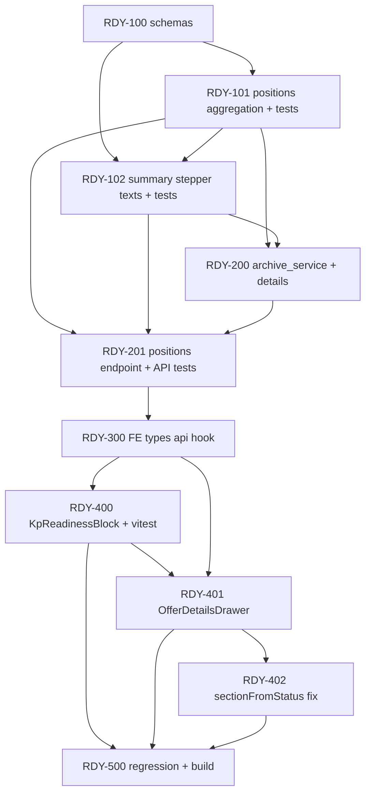
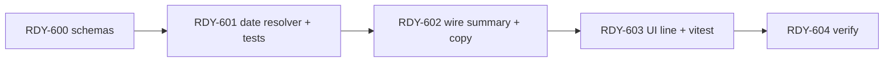

# Plan: A — Менеджер видит завод (готовность КП)

**Created:** 2026-07-28  
**Status:** ✅ Implemented (MVP complete)  
**Spec:** [`ai_docs/specs/kp-readiness-manager-view.md`](../../specs/kp-readiness-manager-view.md)  
**Idea:** [`ai_docs/ideas/kp-readiness-manager-view.md`](../../ideas/kp-readiness-manager-view.md)  
**Depends on:** СГП MVP ✅ ([`2026-07-27-sgp-warehouse.md`](2026-07-27-sgp-warehouse.md))  
**Qty gate:** `scripts/run_plate_loss_regression.py` (read-only feature — must stay PASS)

## Goal

Дать менеджеру продаж **один блок в карточке КП** (степпер, N/M, сводная фраза, lazy-таблица позиций, copy для клиента) — **read-only агрегация** без новых таблиц и без модуля выдачи B.

## Current state

| Компонент | Сейчас |
|-----------|--------|
| `ArchiveOfferList` | `completion_percentage`, `sgp_progress` N/M ✅ |
| `OfferDetailsDrawer` | только `completion_percentage` в шапке; нет N/M, степпера, таблицы |
| `ArchiveOfferDetails` | нет поля `readiness`; `_to_details` не зовёт `sgp_progress` |
| Per-position breakdown | нигде не собран |
| `sectionFromStatus` | «На СГП» → `archived` (баг) |
| `KpReadinessService` | не существует |

## Architecture decisions

1. **Read-only:** один `KpReadinessService`; никаких INSERT/UPDATE.
2. **API summary:** поле `readiness` в `GET /commercial/archive/{kp_id}`.
3. **API positions:** lazy `GET /commercial/archive/{kp_id}/readiness/positions` → `200` + `[]` если status не in production.
4. **N/M:** делегировать в `SgpService.sgp_progress`; не дублировать SQL.
5. **Completion %:** `get_kp_completion_percentage` из `core/kp/offers_read.py`.
6. **Identity позиции:** `plate_name` + `length_m` + `width_m` + `load_class`; tolerance 0.005 м.
7. **Инвариант строки:** `ordered = in_plan + on_sgp + remaining`.
8. **Сортировка:** `position_number` ASC (min по identity при split).
9. **UI copy:** backend генерирует `summary_text` + `client_copy_text`; frontend не собирает фразы.
10. **Без feature-flag;** без DI-фабрики для readiness в MVP — `ArchiveService` инстанцирует сервис с `repository.db_path` (как `_to_list_item` зовёт `SgpService`).

## Risks

| Риск | Impact | Митигация |
|------|--------|-----------|
| Split-строки `kp_plates` ломают группировку | Med | GROUP BY identity; `MIN(position_number)`; fixture-тест ideation-примера |
| Дублирование N/M логики vs list | Med | Единый `SgpService.sgp_progress` |
| Медленный drawer на больших КП | Low | Positions lazy; summary один запрос |
| `position_number` NULL у части строк | Low | NULLS LAST; fallback sort by `label` |
| Route shadowing `/{kp_id}` vs `/readiness/positions` | Low | Зарегистрировать path до generic handlers (как `/files/{kind}`) |

## Parallelism

| Можно параллельно | После |
|-------------------|-------|
| RDY-101 (positions SQL) ∥ RDY-100 (schemas) | — |
| RDY-402 (sectionFromStatus) ∥ RDY-400+ | RDY-300 types (опционально раньше) |
| Vitest KpReadinessBlock ∥ backend RDY-201 | контракт schemas зафиксирован в RDY-100 |

---

## Task list

### Phase 1: Backend foundation

#### Task RDY-100: Pydantic schemas

**Description:** Добавить DTO readiness в `app/schemas/archive.py` (или `app/schemas/kp_readiness.py` re-export). Переиспользовать `SgpProgress` из `app/schemas/sgp.py`.

**Acceptance criteria:**
- [ ] `KpReadinessStep`, `KpReadinessSummary`, `KpReadinessPositionItem`, `KpReadinessPositionsResponse` определены
- [ ] `ArchiveOfferDetails.readiness: KpReadinessSummary | None = None`
- [ ] OpenAPI / response_model компилируется без ошибок

**Verification:**
- [ ] `python -c "from app.schemas.archive import ArchiveOfferDetails"` OK
- [ ] Существующие archive tests не ломаются

**Dependencies:** None

**Files:**
- `app/schemas/archive.py` (или `app/schemas/kp_readiness.py`)

**Estimated scope:** S

---

#### Task RDY-101: Position aggregation

**Description:** `KpReadinessService.list_positions(kp_id)` — read-only SQL, группировка по identity, поля `ordered/in_plan/on_sgp/remaining`, sort by `position_number`.

**Acceptance criteria:**
- [ ] Фикстура ideation: 10 заказ / 4 в плане / 6 на СГП / 0 осталось → одна строка
- [ ] `ordered = in_plan + on_sgp + remaining` для каждой строки
- [ ] Для «в архиве» / «выполнено» метод возвращает `[]` (или guard на уровне service)

**Verification:**
- [ ] `pytest tests/test_kp_readiness_service.py -k positions -q` PASS

**Dependencies:** RDY-100

**Files:**
- `app/services/kp_readiness_service.py` (NEW)
- `tests/test_kp_readiness_service.py` (NEW)

**Estimated scope:** M

---

#### Task RDY-102: Summary, stepper, texts

**Description:** `KpReadinessService.build_summary(kp_id, status)` — steps (5), `summary_text`, `client_copy_text` (клиентский тон), hints на production/sgp, `release_note`.

**Acceptance criteria:**
- [ ] `status ∉ {в работе, На СГП}` → `None`
- [ ] Шаблоны текстов по таблице из spec (4 варианта UI + 4 clipboard)
- [ ] Steps: release/closed = `disabled`; kp = `done`
- [ ] Partial SGP: production `active`, sgp `active`, hints «72%» / «14/20»-подобные

**Verification:**
- [ ] `pytest tests/test_kp_readiness_service.py -k summary -q` PASS

**Dependencies:** RDY-101

**Files:**
- `app/services/kp_readiness_service.py`
- `tests/test_kp_readiness_service.py`

**Estimated scope:** M

---

### Checkpoint 1: Backend core

- [ ] `pytest tests/test_kp_readiness_service.py -q` green
- [ ] Нет мутаций БД в сервисе (code review / grep INSERT|UPDATE)

---

### Phase 2: API wiring

#### Task RDY-200: Readiness в archive details

**Description:** `ArchiveService._to_details` / `get_details` — attach `readiness` через `KpReadinessService.build_summary`.

**Acceptance criteria:**
- [ ] `GET /commercial/archive/{id}` для «в работе» содержит non-null `readiness`
- [ ] Для «в архиве» → `readiness: null`
- [ ] `sgp_progress` в details согласован со list item для того же kp_id

**Verification:**
- [ ] `pytest tests/test_archive_endpoints.py -k readiness -q` PASS

**Dependencies:** RDY-102

**Files:**
- `app/services/archive_service.py`
- `tests/test_archive_endpoints.py`

**Estimated scope:** S

---

#### Task RDY-201: Positions endpoint

**Description:** `GET /commercial/archive/{kp_id}/readiness/positions` + `ArchiveService.get_readiness_positions`.

**Acceptance criteria:**
- [ ] Auth: admin/manager (как archive)
- [ ] 404 если КП не найдено
- [ ] «в архиве» → `200`, `items: []`, `count: 0`
- [ ] Route не перехватывается `/{kp_id}` некорректно

**Verification:**
- [ ] `pytest tests/test_archive_endpoints.py -k positions -q` PASS

**Dependencies:** RDY-101, RDY-200

**Files:**
- `app/api/v1/endpoints/archive.py`
- `app/services/archive_service.py`
- `tests/test_archive_endpoints.py`

**Estimated scope:** S

---

### Checkpoint 2: API complete

- [ ] `pytest tests/test_archive_endpoints.py tests/test_kp_readiness_service.py -q` green
- [ ] Manual: Swagger `/docs` — оба endpoint видны

---

### Phase 3: Frontend contract

#### Task RDY-300: Types, API client, query hook

**Description:** TS types для readiness; `archiveApi.getReadinessPositions`; `useKpReadinessPositionsQuery(kpId, { enabled })`.

**Acceptance criteria:**
- [ ] `ArchiveOfferDetails.readiness` типизирован
- [ ] Query не fetch'ит positions пока `enabled: false`
- [ ] Ошибки через существующий `getErrorMessage`

**Verification:**
- [ ] `cd frontend && npm run build` OK

**Dependencies:** RDY-201 (контракт стабилен)

**Files:**
- `frontend/src/features/commercial-archive/types/archive.ts`
- `frontend/src/features/commercial-archive/api/archiveApi.ts`
- `frontend/src/features/commercial-archive/hooks/useArchiveQueries.ts`

**Estimated scope:** S

---

### Phase 4: UI

#### Task RDY-400: `KpReadinessBlock` component

**Description:** Степпер (5 steps), метрики, `summary_text`, `release_note`, кнопки «Подробнее» / «Скопировать для клиента», таблица при expand.

**Acceptance criteria:**
- [ ] Disabled steps визуально серые
- [ ] Expand → fetch positions; loading/error states
- [ ] Copy → `navigator.clipboard.writeText(client_copy_text)` + user feedback
- [ ] Колонки: Позиция | Заказ | В плане | На СГП | Осталось

**Verification:**
- [ ] `cd frontend && npm test -- --run KpReadiness` PASS
- [ ] Manual: drawer для КП in production

**Dependencies:** RDY-300

**Files:**
- `frontend/src/features/commercial-archive/components/KpReadinessBlock.tsx` (NEW)
- `frontend/src/features/commercial-archive/components/KpReadinessBlock.test.tsx` (NEW)

**Estimated scope:** M

---

#### Task RDY-401: `OfferDetailsDrawer` integration

**Description:** Встроить `KpReadinessBlock` после шапки; **убрать** «Готовность %» из шапки; `showReadiness` по status.

**Acceptance criteria:**
- [ ] Блок виден только для «в работе» / «На СГП»
- [ ] Нет дубля % в шапке
- [ ] Refetch on open (существующий query)

**Verification:**
- [ ] Manual: archived / completed — блок отсутствует
- [ ] `npm run build` OK

**Dependencies:** RDY-400

**Files:**
- `frontend/src/features/commercial-archive/components/OfferDetailsDrawer.tsx`

**Estimated scope:** S

---

#### Task RDY-402: Fix `sectionFromStatus`

**Description:** `case "На СГП": return "in_production"`.

**Acceptance criteria:**
- [ ] Vitest: item `{ status: "На СГП" }` → `in_production`
- [ ] Поиск КП «На СГП» не помечается как archived metadata

**Verification:**
- [ ] `npm test -- --run sectionFromStatus` или test file для archive page

**Dependencies:** None (можно параллельно RDY-400)

**Files:**
- `frontend/src/pages/commercial-offer-archive/CommercialOfferArchivePage.tsx`
- test file (NEW or extend existing)

**Estimated scope:** XS

---

### Checkpoint 3: UI E2E

- [ ] Manager flow: архив → «В производстве» → открыть КП → степпер + copy + expand table
- [ ] `cd frontend && npm run build` OK

---

### Phase 5: Hardening

#### Task RDY-500: Regression gate

**Description:** Прогнать plate_loss + full relevant pytest; fix если что-то задели.

**Acceptance criteria:**
- [ ] `pytest tests/ -k "readiness or archive" -q` PASS
- [ ] `./.venv/bin/python scripts/run_plate_loss_regression.py` PASS
- [ ] `cd frontend && npm test -- --run && npm run build` PASS

**Verification:** commands above

**Dependencies:** RDY-401, RDY-402

**Files:** —

**Estimated scope:** S

---

#### Task RDY-501: Implementation report (optional)

**Description:** Краткий report в `ai_docs/develop/reports/2026-07-28-kp-readiness-manager-view.md` — what shipped, manual UAT notes.

**Acceptance criteria:**
- [ ] Report с checklist spec Success Criteria

**Dependencies:** RDY-500

**Estimated scope:** XS

---

### Checkpoint 4: Done

- [ ] Все acceptance criteria из spec § Success Criteria (8 пунктов)
- [ ] Spec status → implemented
- [ ] Plan tasks отмечены `[x]`

---

## Implementation order (quick reference)

| # | ID | Title | Size |
|---|-----|-------|------|
| 1 | RDY-100 | Schemas | S |
| 2 | RDY-101 | Positions aggregation | M |
| 3 | RDY-102 | Summary + stepper + texts | M |
| — | **CP1** | Backend core | — |
| 4 | RDY-200 | Details integration | S |
| 5 | RDY-201 | Positions endpoint | S |
| — | **CP2** | API complete | — |
| 6 | RDY-300 | FE types/api/hook | S |
| 7 | RDY-400 | KpReadinessBlock | M |
| 8 | RDY-401 | Drawer integration | S |
| 9 | RDY-402 | sectionFromStatus | XS |
| — | **CP3** | UI E2E | — |
| 10 | RDY-500 | Regression | S |
| 11 | RDY-501 | Report (optional) | XS |

**Suggested first PR slice:** RDY-100 → RDY-102 → RDY-200 → RDY-201 (backend-only, тестируемо без UI).

**Suggested second PR slice:** RDY-300 → RDY-402 → RDY-400 → RDY-401 → RDY-500.

---

## Open Questions

_Нет — spec Q11–Q14 закрыты._

---

## Next

1. ~~Human approval plan → **Phase 3 IMPLEMENT** (RDY-100).~~ ✅ MVP done
2. **Addendum:** [`kp-readiness-expected-sgp-date.md`](../../specs/kp-readiness-expected-sgp-date.md) → **Phase 6** (RDY-600…603) below
3. После addendum — направление **B** (выдача) активирует steps release/closed без переделки UI.

---

## Phase 6: Ожидаемая дата на СГП (addendum)

**Spec:** [`ai_docs/specs/kp-readiness-expected-sgp-date.md`](../../specs/kp-readiness-expected-sgp-date.md)  
**Goal:** при `remaining_total == 0` и `n < m` показать дату последнего планового дня + дополнить copy.

### Task RDY-600: Schema fields

**Description:** Расширить `KpReadinessSummary` тремя полями: `expected_sgp_date`, `expected_sgp_date_label`, `fully_scheduled`.

**Acceptance criteria:**
- [x] Pydantic models + TS types в `archive.ts`
- [x] OpenAPI / import без ошибок

**Verification:** `python -c "from app.schemas.archive import KpReadinessSummary"`; `npm run build`

**Dependencies:** None (MVP readiness ✅)

**Files:** `app/schemas/archive.py`, `frontend/.../types/archive.ts`

**Estimated scope:** XS

---

### Task RDY-601: `_resolve_expected_sgp_date` + unit tests

**Description:** В `KpReadinessService` — read-only резолв даты: DISTINCT `(plan_id, day_number)` из `kp_plates` «в плане» → `get_plan_day_to_date_mapping` → `MAX(iso)` → label `DD.MM.YYYY`. Guard: `remaining_total > 0`, `n >= m`, `in_plan_total <= 0` → null.

**Acceptance criteria:**
- [x] Два дня одного плана → max date (10.08 vs 14.08 → 14.08)
- [x] `remaining > 0` → null
- [x] `n == m` → null
- [x] План не найден / нет mapping для day → skip, не 500
- [x] `fully_scheduled=True` только когда guard пройден и дата найдена

**Verification:** `pytest tests/test_kp_readiness_service.py -k expected_sgp -q`

**Dependencies:** RDY-600

**Files:** `app/services/kp_readiness_service.py`, `tests/test_kp_readiness_service.py`

**Fixtures:** `PlanRepository(db).create({ id, days: { "2026-08-10": {day_number:1}, "2026-08-14": {day_number:3} }})`; `kp_plates` с `plan_id`, `day_number`, status «в плане». При необходимости `monkeypatch` `plan_storage.load_plan` или settings `plita_db_path` (как `test_sgp_delete_plan.py`).

**Estimated scope:** M

---

### Task RDY-602: Wire `build_summary` + copy append

**Description:** Вызвать resolver из `build_summary`; дописать `client_copy_text` фразой «Ожидаем полный комплект на складе к {label}.» когда дата есть.

**Acceptance criteria:**
- [x] `GET /archive/{id}` возвращает новые поля для fully_scheduled КП
- [x] `summary_text` **не** меняется
- [x] Copy содержит дату при `expected_sgp_date_label`

**Verification:** `pytest tests/test_kp_readiness_service.py tests/test_archive_endpoints.py -k readiness -q`

**Dependencies:** RDY-601

**Files:** `app/services/kp_readiness_service.py`, `tests/test_kp_readiness_service.py`, `tests/test_archive_endpoints.py`

**Estimated scope:** S

---

### Checkpoint 5: Backend addendum

- [x] `pytest tests/test_kp_readiness_service.py -k expected_sgp -q` green
- [x] Read-only (grep no INSERT/UPDATE in new code paths)

---

### Task RDY-603: UI строка в `KpReadinessBlock`

**Description:** Под `summary_text` — строка «Ожидаем на СГП к: **{label}**» если `expected_sgp_date_label` задан.

**Acceptance criteria:**
- [x] Строка не рендерится при null
- [x] Vitest: mock readiness с label → текст на экране

**Verification:** `npm test -- --run KpReadiness`; manual drawer

**Dependencies:** RDY-600, RDY-602

**Files:** `KpReadinessBlock.tsx`, `KpReadinessBlock.test.tsx`

**Estimated scope:** S

---

### Task RDY-604: Verify

**Description:** Regression gate для addendum.

**Acceptance criteria:**
- [x] `pytest tests/ -k "readiness or archive" -q` PASS
- [x] `cd frontend && npm test -- --run && npm run build` PASS
- [x] Spec addendum acceptance criteria (5 пунктов)

**Verification:** commands above; optional `run_plate_loss_regression.py`

**Dependencies:** RDY-603

**Estimated scope:** XS

---

### Checkpoint 6: Addendum done

- [x] Spec addendum → implemented
- [x] Tasks RDY-600…604 `[x]`

---

## Implementation order (addendum)

| # | ID | Title | Size |
|---|-----|-------|------|
| 12 | RDY-600 | Schema + TS types | XS |
| 13 | RDY-601 | Date resolver + tests | M |
| 14 | RDY-602 | build_summary + copy | S |
| — | **CP5** | Backend | — |
| 15 | RDY-603 | UI line | S |
| 16 | RDY-604 | Verify | XS |

**Suggested slice:** RDY-600 → 602 (backend PR) → RDY-603 → 604 (UI PR) — или один PR, scope ≤ 6 files.

## Risks (addendum)

| Риск | Митигация |
|------|-----------|
| `load_plan` читает другой db_path | Тесты: тот же `db_path` в PlanRepository + monkeypatch settings |
| kp_plates без day_number (legacy) | null date, без UI строки |
| Несколько plan_id на один КП | MAX по всем датам — покрыть тестом |

## Open Questions (addendum)

_Нет._

