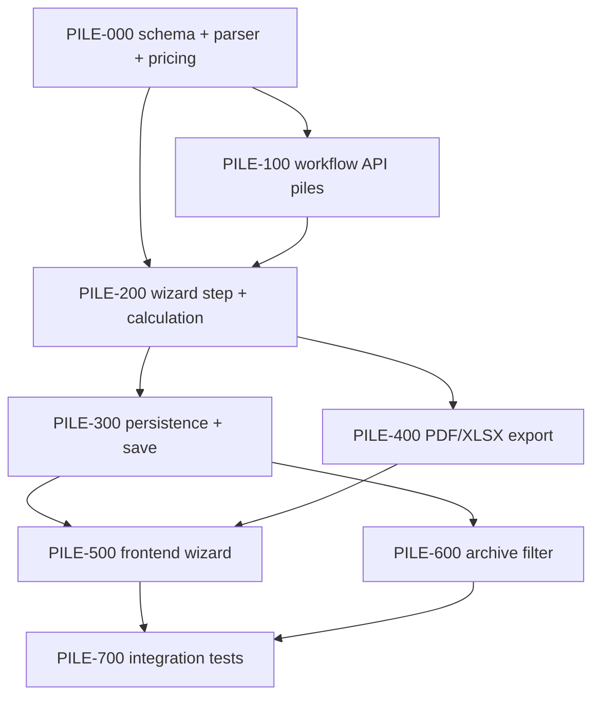

# Plan: КП на сваи

**Created:** 2026-07-30  
**Status:** 📋 Ready for review (PLAN)  
**Spec:** [`ai_docs/specs/kp-piles.md`](../../specs/kp-piles.md)  
**Idea:** [`ai_docs/ideas/kp-piles.md`](../../ideas/kp-piles.md)

## Goal

Менеджер создаёт **отдельное КП на цельные сваи** через web-мастер: выбор типа → ввод (текст/фото/ИИ) → класс бетона per-line → client → PDF/XLSX → архив с фильтром «Плиты / Сваи». Цены только из `pile_prices`. Production wizard — вне MVP.

## Current state

| Компонент | Сейчас |
|-----------|--------|
| Прайс свай | ✅ `core/pile_price_db.py`, таблица `pile_prices`, тесты импорта |
| Мастер КП | Только плиты: `plates → client → result` |
| API | `POST/PATCH .../plates`, `.../plates/ai`; нет `product_type` |
| Persistence | `KpPersistenceService` → только `kp_plates` |
| Архив | Список по section; нет `product_type` / фильтра свай |
| OCR | Plate system prompt; pile prompt — нет |
| PDF/XLSX | Только позиции плит (length/width/load) |

## Architecture decisions

1. **`product_type`** в metadata черновика и `kp_meta`; immutable после create draft.
2. **Wizard step `piles`** — параллельно `plates`; shared `client` / `result`.
3. **Domain first:** `pile_line_parser` + pile pricing до API.
4. **Отдельная таблица `kp_piles`** — не переиспользовать `kp_plates` (разная номенклатура, нет length/width/load).
5. **OCR:** тот же pipeline (`CommercialDraftService.resolve_source_input`), новый `pile_format_prompt.py`.
6. **Preview UX:** normalized text editable (как плиты) + `KpPilePreviewPanel` с grade dropdown и «применить ко всем».
7. **Validation:** strict mark+grade → `PriceNotFoundError` блокирует calculate/save.
8. **Files:** PDF/XLSX — минимальные колонки; без `breakdown` / `schema` для piles.
9. **Archive API:** `product_type` в list response + query param `product_type=all|plates|piles`.
10. **Production exclusion:** все queries кандидатов КП фильтруют `product_type != 'piles'` (или `= 'plates'`).
11. **Нумерация (Q12):** save свай через тот же `INSERT INTO KP_offers` → общий `kp_id` AUTOINCREMENT. Пример: плиты №2 → сваи №3. PDF/архив: `offer_number = str(kp_id)`. Без отдельного счётчика/префикса.
12. **Archive drawer (Q13–Q15):** полная карточка как у плит с pile-колонками; PDF/XLSX regen из архива — must; «В производство» — disabled + «скоро».
13. **Dedup (Q16):** при ingest merge строк с одинаковыми `mark` + `concrete_grade` (qty sum).

## Implementation order

| Phase | Focus | Depends on |
|-------|-------|------------|
| 0 | Schema, parser, pricing, grade helper | — |
| 1 | Schemas, wizard enums, create draft `product_type` | 0 |
| 2 | `/piles` ingest, AI, normalized → order_data | 0, 1 |
| 3 | Wizard step service, calculate (no wide-plates) | 2 |
| 4 | `kp_piles` save, `KpPersistenceService` branch | 0, 3 |
| 5 | PDF/XLSX pile columns | 3 |
| 6 | Frontend: picker, PileInputStep, preview panel | 2 (API contract) |
| 7 | Archive badge + filter + production exclusion | 4 |
| 8 | E2E tests + plate regression | all |

## Risks

| Риск | Митигация |
|------|-----------|
| Plate flow regression | `test_commercial_web_flow.py` в каждом checkpoint |
| OCR плохо читает марки свай | TDD parser на fixtures; normalized text fallback |
| Дублирование `CommercialWorkflowService` | Extract shared ingest helper; ветка по `product_type` |
| `kp_plates` queries ломаются на pile КП | `product_type` filter + empty `kp_plates` для pile save |
| SQLite migration на prod | Idempotent `ALTER TABLE` / `CREATE IF NOT EXISTS` в `kp_db_schema.py` |

## Parallelism

| Можно параллельно | После |
|-------------------|-------|
| PILE-400 (PDF/XLSX) ∥ PILE-500 (frontend shell) | API contract draft response зафиксирован |
| PILE-600 (archive) ∥ финал frontend | `product_type` в save/list |

---

## Task list

### Phase 0: Foundation

- [ ] **PILE-001:** Schema migration — `kp_meta.product_type`, table `kp_piles`
  - **Acceptance:** `init_kp_schema` создаёт колонку/таблицу; existing DB migrates idempotently
  - **Verify:** `pytest tests/test_kp_piles_schema.py -q` (new)
  - **Files:** `core/kp_db_schema.py`, `tests/test_kp_piles_schema.py`

- [ ] **PILE-002:** `core/pile_line_parser.py` — parse mark, grade, qty + merge same mark+grade
  - **Acceptance:** Parses lines; merges duplicate mark+grade (qty sum); keeps different grades separate
  - **Verify:** `pytest tests/test_pile_line_parser.py -q`
  - **Files:** `core/pile_line_parser.py`, `tests/test_pile_line_parser.py`

- [ ] **PILE-003:** Pile pricing in `core/commercial_pricing.py`
  - **Acceptance:** `lookup_pile_price`, `ensure_order_priced` for `product_kind=pile`; raises on missing
  - **Verify:** `pytest tests/test_commercial_pile_pricing.py -q`
  - **Files:** `core/commercial_pricing.py`, `tests/test_commercial_pile_pricing.py`

- [ ] **PILE-004:** `core/pile_format_prompt.py` + text normalizer (minimal)
  - **Acceptance:** Prompt documents pile mark formats; normalizer splits multiline text
  - **Verify:** unit test prompt non-empty; normalizer test
  - **Files:** `core/pile_format_prompt.py`, `core/pile_text_normalizer.py`, tests

**Checkpoint 0:** parser + pricing + schema green

---

### Phase 1: API & schemas

- [ ] **PILE-101:** Extend Pydantic — `ProductType`, `WizardStepId.piles`, `ingest_piles`, pile batch types
  - **Acceptance:** OpenAPI reflects new enums; backward compatible for plates
  - **Verify:** `pytest tests/test_commercial_wizard_step_service.py -q`
  - **Files:** `app/schemas/commercial.py`, frontend `types/commercialOffer.ts`

- [ ] **PILE-102:** `POST /commercial/drafts` — accept `product_type`
  - **Acceptance:** `product_type=piles` sets metadata; default `plates`; immutable on PATCH
  - **Verify:** extend `test_commercial_web_flow.py` or new pile create test
  - **Files:** `app/api/v1/endpoints/commercial.py`, `commercial_workflow_service.py`

- [ ] **PILE-103:** `PATCH /drafts/{id}/piles` + `POST .../piles/ai`
  - **Acceptance:** Text/image ingest builds pile `order_data` with prices; normalized_text in metadata
  - **Verify:** `pytest tests/test_commercial_pile_flow.py -q` (create + update)
  - **Files:** `commercial.py`, `commercial_workflow_service.py`, `commercial_draft_service.py`

**Checkpoint 1:** API create + piles ingest via HTTP tests

---

### Phase 2: Wizard & calculation

- [ ] **PILE-201:** `CommercialWizardStepService` — pile branch
  - **Acceptance:** No wide-plates gate; `ingest_piles` action; step `piles` in `can_proceed_to`
  - **Verify:** wizard step tests for pile payload
  - **Files:** `commercial_wizard_step_service.py`, `commercial_calculation_service.py`

- [ ] **PILE-202:** `CommercialCalculationService.calculate` — pile path
  - **Acceptance:** Re-price all lines on grade change; block if any unpriced
  - **Verify:** calculation service tests
  - **Files:** `commercial_calculation_service.py`, tests

- [ ] **PILE-203:** Grade bulk update endpoint (optional) or via normalized text + re-ingest
  - **Acceptance:** «Apply grade to all» achievable via API (dedicated PATCH or re-process normalized text)
  - **Verify:** API test updates all line grades and prices
  - **Files:** endpoint + workflow method

**Checkpoint 2:** calculate returns totals for valid pile draft

---

### Phase 3: Persistence & export

- [ ] **PILE-301:** `KpPersistenceService` — save pile lines to `kp_piles`
  - **Acceptance:** Save creates `KP_offers` + `kp_piles` + `kp_meta(product_type=piles)`; no `kp_plates` rows; **`kp_id` = next in shared sequence** (after existing plate KP #2 → pile KP #3)
  - **Verify:** persistence integration test with two prior `KP_offers` rows; assert new pile `kp_id == 3`
  - **Files:** `kp_persistence_service.py`, `kp_repository.py`

- [ ] **PILE-401:** PDF pile template branch
  - **Acceptance:** Columns: марка, класс, кол-во, цена, сумма
  - **Verify:** generate PDF in test; assert row content
  - **Files:** `core/commercial_offer.py`

- [ ] **PILE-402:** XLSX pile template branch
  - **Acceptance:** Same columns; formulas/totals match plate layout style
  - **Verify:** xlsx generation test
  - **Files:** `core/commercial_offer_xlsx.py`

- [ ] **PILE-403:** `generate-files` — skip breakdown/schema for piles
  - **Acceptance:** Only pdf + xlsx kinds returned for pile drafts
  - **Verify:** API test
  - **Files:** `commercial_export_service.py`

**Checkpoint 3:** save pile KP → files downloadable

---

### Phase 4: Frontend

- [ ] **PILE-501:** `ProductTypePicker` + route/store wiring
  - **Acceptance:** User picks plates/piles before wizard; choice passed to createDraft
  - **Verify:** component test; manual `/new`
  - **Files:** `ProductTypePicker.tsx`, `CommercialOfferCreatePage.tsx`

- [ ] **PILE-502:** `PileInputStep` (mirror PlateInputStep)
  - **Acceptance:** Text, file, paste, recognize, AI; calls piles API
  - **Verify:** vitest + manual smoke
  - **Files:** `PileInputStep.tsx`, `commercialOfferApi.ts`, `useCommercialOfferWizard.ts`

- [ ] **PILE-503:** `KpPilePreviewPanel` — grade dropdown, apply-all, price display
  - **Acceptance:** Changing grade refetches/recalculates; errors on missing price
  - **Verify:** vitest
  - **Files:** `KpPilePreviewPanel.tsx`

- [ ] **PILE-504:** `CommercialOfferWizard` — branch step 1, wizard progress labels
  - **Acceptance:** 3 steps for piles; client/result reused; no wide-plates UI
  - **Verify:** `useCommercialOfferWizard.test.ts`, `wizardStepOrder.test.ts`
  - **Files:** `CommercialOfferWizard.tsx`, `WizardProgress.tsx`, `wizardStepOrder.ts`

- [ ] **PILE-505:** `CalculationResultStep` — hide schema/breakdown for piles
  - **Acceptance:** Pile draft shows only pdf/xlsx download buttons
  - **Verify:** manual / component test
  - **Files:** `CalculationResultStep.tsx`

**Checkpoint 4:** full UI flow text → save (manual)

---

### Phase 5: Archive & production guard

- [ ] **PILE-601:** Archive API — `product_type` in list + filter param
  - **Acceptance:** `?product_type=piles` returns only pile KPs
  - **Verify:** archive service/repository tests
  - **Files:** `archive_service.py`, `kp_repository.py`, `app/api/v1/endpoints/archive.py`

- [ ] **PILE-602:** Archive UI — badge + filter + pile drawer + disabled production button
  - **Acceptance:** Filter toggles list; badge visible; drawer shows mark/grade/qty/price; «В производство» disabled + hint; readiness hidden/N/A for piles
  - **Verify:** vitest + manual `/archive`
  - **Files:** `CommercialOfferArchivePage`, `OfferDetailsDrawer`, archive list components, `archiveApi.ts`

- [ ] **PILE-604:** Archive PDF/XLSX regen for pile KPs
  - **Acceptance:** `archive_service` reads `kp_piles` → `order_data`; download pdf/xlsx works for saved pile KP
  - **Verify:** archive service test + manual download
  - **Files:** `archive_service.py`, `core/kp_order_data.py` or new `order_data_from_kp_piles`

- [ ] **PILE-603:** Production wizard — exclude `product_type=piles`
  - **Acceptance:** Pile KPs not in plan creation candidates
  - **Verify:** existing production planning tests still pass; new filter test
  - **Files:** `production_service.py` or kp queries used by wizard

**Checkpoint 5:** archive filter works; pile KP absent from production

---

### Phase 6: Hardening

- [ ] **PILE-701:** E2E API flow — text → calculate → generate → save → archive list
  - **Acceptance:** Full path in one test module; saved `kp_id` sequential; PDF/`offer_identity` use same number
  - **Verify:** `pytest tests/test_commercial_pile_flow.py -q`

- [ ] **PILE-702:** Plate regression gate
  - **Acceptance:** `test_commercial_web_flow.py` unchanged behavior
  - **Verify:** `pytest tests/test_commercial_web_flow.py -q`

- [ ] **PILE-703:** Frontend build + tests
  - **Acceptance:** `npm run test && npm run build` green
  - **Verify:** CI commands

- [ ] **PILE-704:** Implementation report
  - **Acceptance:** `ai_docs/develop/reports/2026-07-30-kp-piles-implementation.md`
  - **Verify:** doc exists, AC checklist mapped

**Checkpoint 6 (Done):** all AC-1…AC-12 ✅

---

## Verification checkpoints

| CP | Gate |
|----|------|
| 0 | `pytest tests/test_pile_line_parser.py tests/test_commercial_pile_pricing.py tests/test_kp_piles_schema.py` |
| 1 | pile draft HTTP create/update |
| 2 | calculate + wizard_state for piles |
| 3 | save + PDF/XLSX bytes |
| 4 | manual UI happy path |
| 5 | archive filter + no production leak |
| 6 | full regression |

## Out of scope (this plan)

- Производство свай (фаза 2)
- Fuzzy-match марок
- Смешанное КП
- Excel import заявок
- Telegram bot
- Отдельный счётчик/префикс номера для свай (Q12: общий `kp_id`)
- Интеграция нумерации с 1С (позже)

## Next

После **ревью плана** → Phase 3 TASKS (можно брать PILE-001) → IMPLEMENT по incremental-implementation + TDD.
