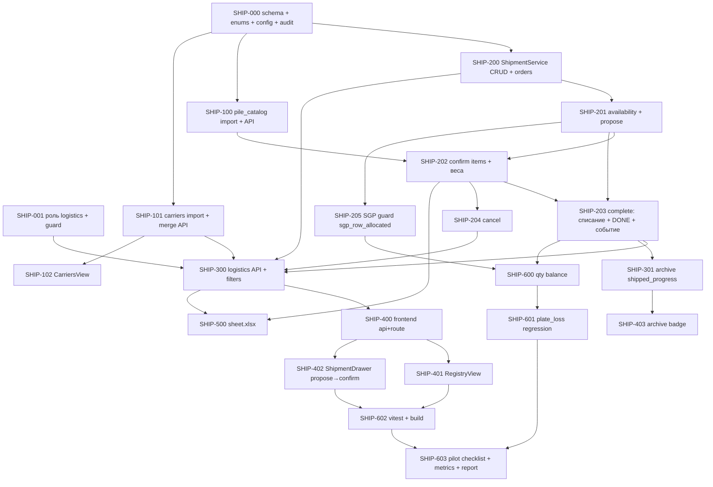

# Plan: Логистика и отгрузка (MVP-1 — реестр рейсов и списание СГП)

**Created:** 2026-07-31  
**Status:** ✅ Implemented (MVP-1, 2026-07-31)  
**Report:** [`ai_docs/develop/reports/2026-07-31-shipment-logistics-implementation.md`](../reports/2026-07-31-shipment-logistics-implementation.md)  
**Spec:** [`ai_docs/specs/shipment-logistics.md`](../../specs/shipment-logistics.md) (✅ approved)  
**Idea:** [`ai_docs/ideas/shipment-logistics.md`](../../ideas/shipment-logistics.md)  
**Qty gate:** `scripts/run_plate_loss_regression.py` (PASS / orphan Σ=0) + новый `test_shipment_qty_balance.py`

## Goal

Раздел «Логистика»: рейс собирается propose→confirm из реального СГП, статусы `в работе → обработано` + «внимание», выезд атомарно списывает СГП (audit `sgp_ship`), прогресс «отгружено X/M» и `KpStatus.DONE` при полном qty, справочник перевозчиков с дедупом, каталог свай с автовесом, событие `shipment_completed` за feature-flag. Без потери qty, без миграции истории Excel.

## Current state

| Компонент | Сейчас |
|-----------|--------|
| СГП MVP | ✅ implemented: `completed_plates` (kp_id/plan_id nullable), `SgpService` (list/unlink/relink/free), audit `sgp_send` |
| Регистры | `kp_plates` (потребность), `completed_plates` (физика), `plate_status_log` (audit), `kp_meta.ordered_qty` (M, freeze) |
| Enums | `PlateStatus`, `KpStatus` (DONE есть, не выставляется), `PlateTransitionReason` (SGP_*) |
| Auth | роли `admin`/`manager`/`production`; guard `require_roles` (`app/dependencies/auth.py`) |
| Вес | `core/kp_plate_weight.resolve_kp_line_weight_kg` (formula default) |
| Роутеры | `app/api/v1/router.py` — 8 роутеров, logistics отсутствует |
| Frontend | features: admin, auth, commercial-archive, commercial-offer, production, layout, providers; logistics отсутствует |
| 1С | ТЗ обмена JSON-папкой (`docs/specs/1c-integration-tz.md`); интеграция G не начата |
| Справочники | перевозчики — 2 397 строк в Excel с дублями; сваи — прайс, лист «Вес и объем» (44 марки) |

## Architecture decisions

1. **Схема:** новые таблицы (`shipments`, `shipment_orders`, `shipment_items`, `carriers`, `pile_catalog`) в `plita.db` через `ensure_schema`-паттерн (`CREATE TABLE IF NOT EXISTS` + `ALTER` try/except). `plate_status_log += shipment_id INTEGER NULL`. На `carriers.name_normalized` — частичный уникальный индекс `WHERE merged_into_id IS NULL`.
2. **Availability — вычислимый резерв, не колонка:** `cp.qty − Σ items open-рейсов`. Единый helper `_available_qty(cur, completed_plate_id)` используется тремя потребителями: propose, complete pre-flight, SGP unlink/relink (guard).
3. **complete() — одна транзакция:** pre-flight (статус `in_work`; ЯР у всех orders; availability по каждой plate-строке; ≥1 item) → split-deduct `completed_plates` → audit `sgp_ship` (с `shipment_id`) → статус `done` + `completed_at` → DONE-check по каждому КП. **Событие `shipment_completed` — после COMMIT**; ошибка записи файла = лог, не откат.
4. **DONE-критерий:** `shipped_qty(kp) ≥ kp_meta.ordered_qty` AND `Σ kp_plates(kp) == 0` AND `Σ completed_plates(kp) == 0` → `kp_meta = «выполнено»` в той же транзакции. M берём из существующего `ordered_qty` (freeze-механика СГП MVP уже есть).
5. **Confirm состава = PUT-семантика:** полная замена `shipment_items` в транзакции; веса пересчитываются на сервере (клиент не присылает доверенные веса, кроме явной ручной правки `weight_kg`).
6. **Вес:** плиты — `resolve_kp_line_weight_kg(length_m, width_m, qty)`; сваи — `pile_catalog.weight_kg × qty`; ручная правка строки перекрывает автовес. Вес ориентировочный, не учётный.
7. **ЯР на `shipment_orders`:** prefill из последнего рейса того же КП (P3); на complete — валидация **наличия** (не формата), 422 `shipment_missing_ya_order`.
8. **Событие 1С:** `build_shipment_event_payload(shipment_id)` + запись `shipment_completed_{id}_{ts}.json` (UTF-8) в `EXCHANGE_EXPORT_DIR`; за `SHIPMENT_EVENTS_ENABLED=false` по умолчанию.
9. **Auth:** `RegisterUserRequest.role` Literal += `"logistics"`; `REQUIRE_LOGISTICS = require_roles("admin", "logistics")` на всех `/logistics/*`; существующие роли не меняются (бейдж «отгружено X/M» в архиве видят все).
10. **FK при удалении КП:** `shipment_orders.kp_id` — `ON DELETE SET NULL` (как P-B СГП); рейс и его items сохраняются (snapshot `shipment_items.kp_id` — plain int, без FK).
11. **Admin reset:** partial reset (kp/plans) не трогает logistics-таблицы; `reset_full` чистит `shipments`/`shipment_orders`/`shipment_items`, но **сохраняет** `carriers` и `pile_catalog` (справочники, не данные планирования). Свериться с `admin-db-reset-refresh.md` на IMPLEMENT.
12. **Печатная форма:** XLSX через openpyxl (как `sgp-export`), `GET /logistics/shipments/{id}/sheet.xlsx`; позиции в `sort_order`, шапка рейса.

## Plan-level answers (P1–P6 из спеки + P-G..P-I)

| # | Решение |
|---|---------|
| P1 контракт 1С | Черновик из спеки финален для MVP-1 (payload v1); согласование с интегратором — параллельный процесс, flag остаётся off |
| P2 лимиты ТС | `VEHICLE_CLASS_LIMITS_KG = {"t20": 20000, "t30plus": 30000}` в `app/core/settings.py`, net-интерпретация (вес груза); смена = правка конфига |
| P3 prefill ЯР | При добавлении КП к рейсу подставлять `ya_order_no` из последнего `shipment_orders` того же `kp_id` (по `created_at DESC`); редактируется вручную |
| P4 re-import свай | `import_pile_catalog.py` — upsert по `mark`, безопасен для повторного запуска; отчёт «обновлено N, добавлено M» |
| P5 доверенность | Одно поле `proxy_no` в MVP-1; образец акта → расширение в MVP-2 без ломки |
| P6 а/м самовывоз | `vehicle_text` свободный и для самовывоза; справочника нет |
| P-G done-рейс | `PATCH`/`items` на `done` → 422 `shipment_not_in_work`; редактирование прошлого — только фаза 2 (возврат) |
| P-H удаление КП | `shipment_orders.kp_id → NULL` (SET NULL), items/snapshot и audit сохраняются; рейс отображается с «КП удалён» |
| P-I событие retry | Повторная выгрузка события — ручная (Ask first в спеке); MVP-1 без UI retry |

## Risks

| Риск | Митигация |
|------|-----------|
| Потеря qty при split/ship/cancel | TDD: `test_shipment_qty_balance.py` **до** UI (SHIP-600 рано, сразу после SHIP-203); одна транзакция + audit |
| DONE при браке/недопроизводстве | Критерий из 3 условий (decision 4); граничные тесты: shipped<M, shipped=M при остатке на СГП, shipped>M невозможен (availability) |
| Гонка двух логистов за одни плиты | Pre-flight availability в complete → 422 `shipment_no_availability`; SQLite single-writer + транзакция |
| Guard ломает привычный unlink/relink | 422 `sgp_row_allocated` с сообщением «зарезервировано рейсом #N от <дата>»; тесты SGP остаются зелёными |
| Старые тесты/regression | plate_loss gate в Checkpoint 6 обязателен; СГП-тесты прогонять после SHIP-205 |
| ПДн в листах перевозчиков (телефоны/имена водителей) | Импорт берёт **только** имя контрагента + источник; Excel с ПДн не коммитим (Never-boundary спеки) |
| Кириллица/пробелы в путях Excel | Скрипты принимают путь аргументом `--xlsx`; ноль хардкода путей |
| propose бесполезен (>50% правок) | `propose_snapshot` → метрика пилота (SHIP-603); пересмотр алгоритма — после данных, не до |
| Жёлтые строки (кран/доски) логист заведёт как рейс | Флаг «внимание» + комментарий покрывает кейс; `item_type` расширяем, тип события зарезервирован |
| Partial unique index на SQLite | Поддерживается (`CREATE INDEX ... WHERE`); fallback — проверка в коде импорта/merge |

## Parallelism

| Можно параллельно | После чего |
|-------------------|------------|
| SHIP-100 (сваи) ∥ SHIP-101 (перевозчики) ∥ SHIP-200 (CRUD рейса) | SHIP-000 |
| SHIP-204 (cancel) ∥ SHIP-205 (SGP guard) ∥ SHIP-102 (CarriersView) | SHIP-201/SHIP-202, SHIP-101 |
| SHIP-401 (реестр) ∥ SHIP-402 (карточка) | SHIP-400 (контракт API) |
| SHIP-500 (XLSX) ∥ SHIP-403 (бейдж) | SHIP-300/SHIP-301 |
| Frontend types/api-заглушки по контракту спеки | сразу после SHIP-300 (API freeze) |

---

## Task list

### Phase 0: Foundation

- [x] **SHIP-000:** enums (`ShipmentStatus`, `DeliveryType`, `ShipmentItemType`, `PlateStatus.SHIPPED`, `PlateTransitionReason.SGP_SHIP`); schema: 5 таблиц + `plate_status_log.shipment_id` + partial unique index carriers; `audit_append(..., shipment_id=None)`; settings (`VEHICLE_CLASS_LIMITS_KG`, `SHIPMENT_EVENTS_ENABLED`, `EXCHANGE_EXPORT_DIR`)
  - Acceptance: `ensure_schema` идемпотентен на существующей `plita.db`; старые audit-вызовы компилируют без `shipment_id`
  - Verify: `pytest tests/test_sgp_schema.py -q` PASS; `sqlite3 plita.db ".schema shipments"`
  - Files: `app/domain/enums.py`, `core/kp_db_schema.py`, `core/kp_db_audit.py`, `app/core/settings.py`
- [x] **SHIP-001:** роль `logistics` + `REQUIRE_LOGISTICS` guard
  - Acceptance: регистрация пользователя с ролью `logistics`; `manager`/`production` → 403 на `/logistics/*`
  - Verify: unit-тест guard'а; ручная проверка 403
  - Files: `app/schemas/auth.py`, `app/dependencies/auth.py`

**Checkpoint 0:** `pytest tests/ -k "sgp or schema or auth" -q` PASS

### Phase 1: Справочники

- [x] **SHIP-100:** `pile_catalog` импорт + API автокомплита
  - Acceptance: 44 марки из «Вес и объем»; `С137,5.40` парсится (запятая→точка в разборе); «-»→NULL; upsert re-run
  - Verify: `pytest tests/test_pile_catalog_import.py -q`; `GET /logistics/pile-catalog?q=С60` → С60.30/С60.35/С60.40 с весами
  - Files: `scripts/import_pile_catalog.py`, `tests/test_pile_catalog_import.py`, endpoint (в SHIP-300, схема здесь)
- [x] **SHIP-101:** carriers импорт (нормализация, дедуп, отчёт) + merge API
  - Acceptance: 2 397 строк → N активных (N < входного, отчёт с числом схлопнутых); merge переносит `shipments.carrier_id`, дубль `merged_into_id`+`active=0`
  - Verify: `pytest tests/test_carrier_import.py -q` (нормализация ОПФ/кавычек/ё; merge-конфликт на себя → 422)
  - Files: `scripts/import_carriers.py`, `app/services/carrier_service.py`, `tests/test_carrier_import.py`
- [x] **SHIP-102:** CarriersView (таблица, поиск, merge-dialog)
  - Acceptance: список с числом рейсов; merge с подтверждением «перенести K рейсов»
  - Verify: vitest на merge-flow; ручная проверка
  - Files: `frontend/src/features/logistics/components/CarriersView.tsx`

**Checkpoint 1:** справочники наполняются скриптами; merge работает через API

### Phase 2: ShipmentService core (TDD: тесты рядом с каждым шагом)

- [x] **SHIP-200:** CRUD рейса + `shipment_orders` (мульти-КП, prefill ЯР P3)
  - Acceptance: create требует ≥1 КП (422); get возвращает orders+items; PATCH полей; done-рейс → 422 на PATCH (P-G)
  - Verify: `pytest tests/test_shipment_service.py -k "create or patch" -q`
  - Files: `app/services/shipment_service.py`, `app/schemas/logistics.py`, `tests/test_shipment_service.py`
- [x] **SHIP-201:** `_available_qty` + propose (FIFO, лимит класса, «не влезло», `propose_snapshot`)
  - Acceptance: propose видит только `available>0` linked-плиты выбранных КП; FIFO по `completed_date,id`; при `t20` и 25т — 5т в «не влезло»; snapshot сохранён
  - Verify: unit-тесты propose (мульти-КП, лимит, пустой СГП)
  - Files: `app/services/shipment_service.py`, тесты
- [x] **SHIP-202:** confirm items (PUT-замена; plate+free; серверный пересчёт весов; автовес свай из `pile_catalog`)
  - Acceptance: free-строка «С60.30»×14 → 19 320 кг; ручная правка `weight_kg` сохраняется; plate-строка без `available` → 422
  - Verify: unit-тесты confirm + веса
  - Files: `app/services/shipment_service.py`, тесты
- [x] **SHIP-203:** complete — списание + audit + DONE-check + событие
  - Acceptance: pre-flight 422 (`shipment_missing_ya_order`, `shipment_no_availability`); split-deduct; audit `sgp_ship` с `shipment_id`; DONE при 3 условиях; событие JSON после коммита при flag=1; flag=0 → файла нет; ошибка записи файла не откатывает закрытие
  - Verify: integration-тесты complete (атомарность: 422 → БД без изменений; DONE-критерий границы; событие on/off)
  - Files: `app/services/shipment_service.py`, `app/domain/enums.py`(исп.), тесты
- [x] **SHIP-204:** cancel (только `in_work`)
  - Acceptance: items удалены, availability восстановилась, `completed_plates` не тронуты, audit-строк нет; cancel на done → 422
  - Verify: unit-тест cancel
  - Files: `app/services/shipment_service.py`, тесты
- [x] **SHIP-205:** SGP guard — unlink/relink по зарезервированному → 422 `sgp_row_allocated`
  - Acceptance: unlink части, зарезервированной open-рейсом, → 422 с именем рейса; свободная часть unlink'ится как раньше
  - Verify: `pytest tests/test_sgp_service.py -q` (старые PASS) + новые кейсы
  - Files: `app/services/sgp_service.py` (точечно), тесты

**Checkpoint 2:** `pytest tests/ -k "shipment or sgp" -q` PASS; qty-balance тесты зелёные

### Phase 3: API

- [x] **SHIP-300:** `app/api/v1/endpoints/logistics.py` + schemas + регистрация в `app/api/v1/router.py`; фильтры реестра (date range, kp, carrier, type, status, `no_upd=1`, `attention=1`); `REQUIRE_LOGISTICS` на всех
  - Acceptance: полный набор endpoint'ов из спеки; фильтры комбинируются; 403 для `manager`
  - Verify: API-тесты через TestClient; ручной прогон фильтров в Swagger
  - Files: `app/api/v1/endpoints/logistics.py`, `app/schemas/logistics.py`, `app/api/v1/router.py`
- [x] **SHIP-301:** archive DTO += `shipped_progress {x, m}` (X = Σ shipped по КП из done-рейсов, M = `ordered_qty`)
  - Acceptance: КП с отгрузкой 8/10 → `{x:8, m:10}`; без отгрузок → `x:0`
  - Verify: unit-тест сервиса архива
  - Files: `app/services/`(archive), `app/schemas/`(archive)

**Checkpoint 3:** API freeze — фронт стартует параллельно по контракту

### Phase 4: Frontend

- [x] **SHIP-400:** `logisticsApi.ts` + `types/logistics.ts` + route `/logistics`, `/logistics/carriers` + nav по роли
  - Acceptance: nav-item виден только `logistics`/`admin`; guard редиректит
  - Verify: vitest на guard
  - Files: `frontend/src/features/logistics/`, `frontend/src/features/router/`
- [x] **SHIP-401:** RegistryView — таблица + 6 фильтров + «Новый рейс»
  - Acceptance: фильтры из Acceptance спеки; строка → карточка
  - Verify: vitest на фильтры; ручная проверка
  - Files: `components/LogisticsRegistryView.tsx`
- [x] **SHIP-402:** ShipmentDrawer — поля, propose→confirm, редактор состава, вес-панель с перегрузом, «Выезд»/«Отмена»
  - Acceptance: propose → таблица предложения → правка (qty/удалить/plate-picker/free с автокомплитом свай) → confirm; Σ веса и лимит; предупреждение перегруза; подтверждение выезда
  - Verify: vitest propose→confirm; ручной сценарий «создать→предложить→утвердить→выезд»
  - Files: `components/ShipmentDrawer.tsx`
- [x] **SHIP-403:** archive badge «отгружено X/M» рядом с «N/M на СГП»
  - Acceptance: бейдж при `x>0`; виден всем ролям архива
  - Verify: vitest/ручная
  - Files: `frontend/src/features/commercial-archive/`

**Checkpoint 4:** `cd frontend && npm test -- --run && npm run build` PASS; полный ручной сценарий в браузере

### Phase 5: Печатная форма

- [x] **SHIP-500:** `GET /logistics/shipments/{id}/sheet.xlsx` — «Лист отгрузки»
  - Acceptance: позиции в `sort_order`, марка/размеры/qty/вес/заметки; шапка: дата, ЯР-заказы, заказчик, перевозчик/доверенность, водитель, ТС; открывается в Excel
  - Verify: unit-тест генерации (строки/порядок); ручное открытие файла
  - Files: `app/services/`(export), endpoint logistics

**Checkpoint 5:** печатная форма из карточки рейса

### Phase 6: Hardening + пилот-подготовка

- [x] **SHIP-600:** `test_shipment_qty_balance.py` — Σ(kp_plates)+Σ(completed)+Σ(shipped done) = const по сценариям complete/cancel/мульти-КП
  - Verify: pytest PASS
- [x] **SHIP-601:** `run_plate_loss_regression.py` PASS (orphan Σ=0) + полный `pytest tests/ -q`
  - Verify: gate PASS
- [x] **SHIP-602:** frontend vitest + build PASS
  - Verify: CI-команды зелёные
- [x] **SHIP-603:** pilot checklist (шаг 0 инвентаризация, cut-over неделя, метрики) + скрипт метрики «доля рейсов без правки» по `propose_snapshot` + implementation report
  - Acceptance: `ai_docs/develop/reports/2026-XX-XX-shipment-logistics-implementation.md`; чеклист пилота готов к передаче логисту
  - Files: `scripts/shipment_propose_hitrate.py`, `ai_docs/develop/reports/…`

**Checkpoint 6 (Done):** все Success Criteria спеки (код-блок) подтверждены; пилот-пакет готов

## Next

1. **Review плана** → approval
2. Implement по checkpoint'ам (SHIP-000 → …), TDD на Phase 2, инкрементально (`incremental-implementation`)
3. После Checkpoint 6 → передача пилот-пакета логисту; MVP-2 — отдельная спека
