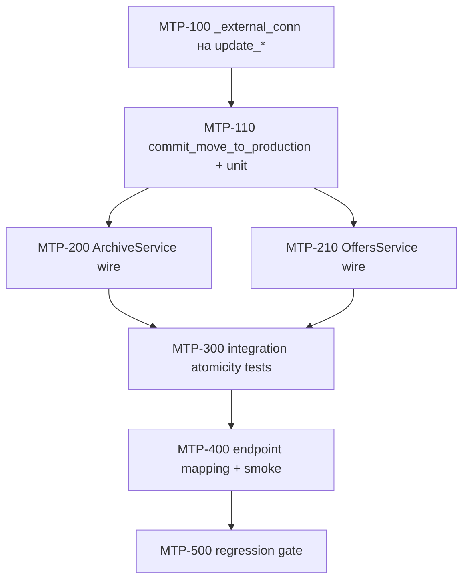

# Plan: Атомарный «перевести в производство» (Q1 + Q2)

**Created:** 2026-08-02  
**Status:** ✅ IMPLEMENTED  
**Spec:** [`ai_docs/specs/move-to-production-atomicity-q1-q2.md`](../../specs/move-to-production-atomicity-q1-q2.md)  
**Источник:** audit Q1 / Q2 — [`2026-08-02-full-project-audit.md`](../audits/2026-08-02-full-project-audit.md)

## Goal

Перевод КП «в архиве» → «в работе» выполняется как одна SQLite-транзакция: срок + статус + freeze `ordered_qty` (M). При любой ошибке — ROLLBACK, лог, ошибка клиенту; silent `except Exception: pass` убран.

**Метрика успеха:** интеграционный тест на tmp DB доказывает, что при сбое freeze статус/срок/M не меняются; happy path фиксирует M.

## Decisions locked (из спеки)

| # | Решение |
|---|---------|
| 1 | Ошибка → ROLLBACK + raise + `logger.exception` |
| 2 | Q6 (общий domain service двух UI-путей) — **out of scope** |
| 3 | `freeze` → `None` = ошибка операции |
| 4 | HTTP: archive `ArchiveError` → 500 ок; offers неизвестный `ValueError` → 400 уже есть |

## Current state

| Компонент | Сейчас |
|-----------|--------|
| `ArchiveService.move_to_production` | `update_execution_date` → `update_status` → freeze в 3-м conn; `except Exception: pass` |
| `OffersService.move_to_production` | То же через `KpRepository.update_offer_*` |
| `offers_write.update_kp_status/execution_date` | Своё `_connect` + `commit` / `close`; **нет** `_external_conn` |
| `freeze_ordered_qty_if_needed` | Cursor-level, ок; контракт не меняем |
| Тесты | Unit с MagicMock репозитория; **нет** интеграционного atomicity-теста |
| Endpoints | archive не ловит `ArchiveError` (→ 500); offers мапит ValueError → 400 |

## Architecture decisions

### A1. Транзакционный helper в `offers_write` (не Q6)

Вынести **только write-транзакцию** в один место:

```text
offers_write.commit_move_to_production(kp_id, execution_terms, db_path) -> int
```

Поведение:
1. `_connect` + `PRAGMA foreign_keys = ON`
2. `update_kp_execution_date(..., _external_conn=conn)`
3. `update_kp_status(..., "в работе", _external_conn=conn)`
4. `freeze_ordered_qty_if_needed(cur, kp_id)`; если `None` → raise
5. `commit`; return `ordered_qty`
6. на ошибке: `rollback` + re-raise; в `finally`: `close`

**Почему не дублировать tx-блок в двух сервисах:** риск снова разъехаться. Это не Q6: auth/validation/response shaping остаются в `ArchiveService` / `OffersService`.

**Почему не в app-repository:** оба репозитория уже тонкие обёртки над `offers_write`; атомарный write — домен БД-слоя `core`.

### A2. `_external_conn` на двух update-функциях

Паттерн как в `core/kp_db_rests.py`:
- `own_conn = _external_conn is None`
- внешний conn → без commit/rollback/close
- публичный API без `_external_conn` сохраняет прежнее поведение (own conn + commit)

### A3. Сервисы после валидации вызывают helper

```text
assert status == «в архиве»
parse terms
try:
    ordered = commit_move_to_production(...)
except Exception:
    logger.exception(...)
    raise ArchiveError / ValueError("move_to_production_failed")
return details
```

Убрать отдельный freeze-блок и bare `except` полностью.

### A4. Endpoint mapping (минимально)

- **archive:** поймать `ArchiveError` на `move-to-production` → 500 (или существующий server-error helper), чтобы не получить необработанный traceback в проде без контракта. Не менять 200-контракт успеха.
- **offers:** добавить код `move_to_production_failed` → 400/500 (предпочесть **500**, т.к. это сбой записи; спросить не нужно — спека допускает 4xx/5xx; в плане фиксируем **500** для tx/freeze, **400** только для validation/`invalid_status`).

### A5. Тесты: TDD, сначала красный интеграционный файл

Фикстуры: `tests/helpers/kp_db_fixtures.py` (`make_iso_db`, `seed_kp_offer`, `seed_plate`).



## Risks

| Риск | Митигация |
|------|-----------|
| Существующие unit-тесты архива мокают `update_execution_date`/`update_status` по отдельности | После wire: мокать `commit_move_to_production` **или** перевести happy-path на интеграцию; обновить `test_archive_service.py` |
| `_external_conn` сломает callers, передающих только positional args | Добавить kw-only `_external_conn=None` в конец сигнатуры |
| `update_kp_execution_date` пишет в `KP_offers`, status — в `kp_meta` | Обе таблицы в одной БД/conn — rollback покрывает обе |
| Двойной лог (helper + service) | Логировать в сервисе один раз; helper только raise |
| OffersService без dedicated unit suite (Q9) | Покрыть через MTP-300 (integration), не раздувать scope до Q9 |

## Parallelism

| Можно параллельно | После чего |
|-------------------|------------|
| MTP-200 ∥ MTP-210 | MTP-110 |
| Черновик MTP-300 (красный тест) | можно писать сразу после MTP-100 (TDD) |

---

## Task list

### Phase 1: Core write layer (TDD)

- [x] **MTP-100:** `_external_conn` для `update_kp_status` и `update_kp_execution_date`
  - Acceptance:
    - Без `_external_conn` — поведение as-is (own connect/commit/close)
    - С `_external_conn` — UPDATE выполнен, **нет** commit/close внутри функции
    - Короткий unit: на одном conn два update + rollback → ни статус, ни срок не сохранились
  - Verify: `pytest tests/test_offers_write_external_conn.py -q` (новый тонкий файл)  
  - Files: `core/kp/offers_write.py`, `tests/test_offers_write_external_conn.py`  
  - Scope: Small

- [x] **MTP-110:** `commit_move_to_production` + unit на tmp DB
  - Acceptance:
    - Happy: status=`в работе`, execution_terms обновлён, `ordered_qty == Σ kp_plates (+ sgp)`
    - `freeze` monkeypatch → raise: после вызова status=`в архиве`, terms прежние, `ordered_qty` NULL
    - Нет строки `kp_meta` / freeze `None`: raise, rollback
  - Verify: `pytest tests/test_move_to_production_atomicity.py -k commit_move -q`
  - Files: `core/kp/offers_write.py`, `tests/test_move_to_production_atomicity.py`  
  - Scope: Medium  
  - Dependencies: MTP-100

**Checkpoint 1:** core green; атомарность доказана без сервисов

### Phase 2: Services

- [x] **MTP-200:** `ArchiveService.move_to_production` → helper; убрать bare except
  - Acceptance:
    - После валидации вызывается `commit_move_to_production`
    - Нет `except Exception: pass`
    - Сбой helper → `ArchiveError` (или re-raise обёрнутый) + `logger.exception`
    - Unit-тесты архива обновлены под новый контракт (mock helper / integration)
  - Verify: `pytest tests/test_archive_service.py -q`
  - Files: `app/services/archive_service.py`, `tests/test_archive_service.py`  
  - Scope: Medium  
  - Dependencies: MTP-110

- [x] **MTP-210:** `OffersService.move_to_production` → тот же helper
  - Acceptance:
    - Аналогично MTP-200; код ошибки `move_to_production_failed` при сбое tx
    - Нет bare except
  - Verify: покрыто MTP-300 + `pytest tests/test_offers_production_authorization.py -q`
  - Files: `app/services/offers_service.py`  
  - Scope: Small  
  - Dependencies: MTP-110

**Checkpoint 2:** оба сервиса без silent swallow; unit archive green

### Phase 3: Integration + API

- [x] **MTP-300:** интеграционные тесты обоих сервисов на tmp SQLite
  - Acceptance:
    - Archive + Offers happy path: M зафиксирован
    - Freeze fail (monkeypatch): оба сервиса — статус «в архиве», M NULL, exception
    - Фикстуры из `tests/helpers/kp_db_fixtures.py`
  - Verify: `pytest tests/test_move_to_production_atomicity.py -q`
  - Files: `tests/test_move_to_production_atomicity.py`  
  - Scope: Medium  
  - Dependencies: MTP-200, MTP-210

- [x] **MTP-400:** endpoint mapping (минимально)
  - Acceptance:
    - archive `move-to-production`: `ArchiveError` → не 200 (500)
    - offers: `move_to_production_failed` → 500
    - Существующие happy/validation endpoint-тесты зелёные
  - Verify: `pytest tests/test_archive_endpoints.py -k move_to_production -q`
  - Files: `app/api/v1/endpoints/archive.py`, `app/api/v1/endpoints/offers.py`, при необходимости тесты  
  - Scope: Small  
  - Dependencies: MTP-300

- [x] **MTP-500:** regression gate
  - Acceptance:
    - `rg` не находит `except Exception: pass` в двух сервисах
    - Полный набор команд из спеки зелёный
  - Verify:
    ```bash
    pytest tests/test_archive_service.py \
      tests/test_archive_endpoints.py \
      tests/test_move_to_production_atomicity.py \
      tests/test_offers_write_external_conn.py \
      tests/test_offers_production_authorization.py \
      tests/test_offers_authorization.py -q
    rg -n 'except Exception:\s*\n\s*pass' app/services/archive_service.py app/services/offers_service.py
    ```
  - Files: none (verify only)  
  - Scope: Small  
  - Dependencies: MTP-400

**Checkpoint 3 (done):** все Success Criteria спеки выполнены

---

## Out of scope (напоминание)

- Q6 дедуп сервисов, frontend, schema migration, audit FIXED-маркеры, lazy-freeze в read-путях

## Next

Реализовано. Коммит — по запросу пользователя.
