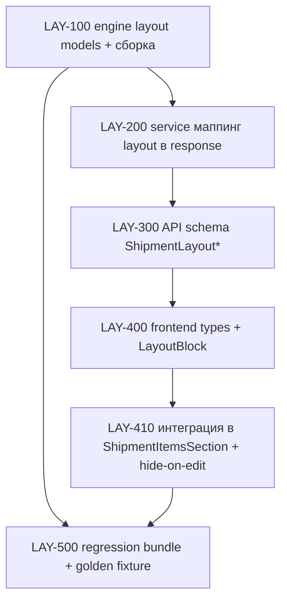

# Plan: Визуализация укладки рейса (layout visualization)

**Created:** 2026-08-02  
**Status:** ✅ IMPLEMENTED (2026-08-02)  
**Spec:** [`ai_docs/specs/shipment-layout-visualization.md`](../../specs/shipment-layout-visualization.md) (✅ approved 2026-08-02)  
**Idea:** [`ai_docs/ideas/shipment-layout-visualization.md`](../../ideas/shipment-layout-visualization.md)  
**Parent:** [`2026-08-02-shipment-propose-v2.md`](./2026-08-02-shipment-propose-v2.md) (движок укладки уже в `core/shipment_packing/`)

## Goal

После «Предложить состав» логист видит блок **«Укладка в кузов»**: полоска кузова со штабелями (пропорционально длине), раскрытие штабеля по ярусам и нумерованный порядок погрузки. Layout считается движком один раз — на propose; при любой ручной правке блок **скрывается** до следующего propose.

**Метрика успеха:** 100% propose по t20/null содержат `layout` в snapshot; логисты используют схему при проверке состава (наблюдение пилота).

## Decisions locked (из SPECIFY)

| # | Решение |
|---|---------|
| L1 | Layout metadata — только в `propose_snapshot`; БД-схему не меняем |
| L2 | При ручной правке состава блок **скрывается полностью** до следующего propose |
| L3 | XLSX 2-й лист — **вне MVP** (post-MVP) |
| L4 | `t30plus` → `layout = null` (legacy FIFO не считает геометрию) |
| L5 | Frontend-стейт локальный: layout живёт в `ShipmentItemsSection` state из ответа `useProposeMutation`; `GET /shipments/{id}` не расширяем |
| L6 | Порядок погрузки: штабели по порядку, внутри — ярусы снизу вверх; формируется на бэкенде |
| L7 | Без новых зависимостей — div'ы/inline styles |

## Current state

| Компонент | Сейчас |
|-----------|--------|
| Engine | `pack_shipment` строит `_Layout` (stacks→tiers→units) внутри, но `PackResult` отдаёт только `items/not_fit/remainder/warnings/total_weight_kg` |
| API | `ShipmentProposeResponse` — без layout; snapshot = `response.model_dump()` |
| Frontend | `ShipmentItemsSection`: propose → `setDrafts/setNotFit/setWarnings/setOrderRemainder/setLimits`; правки через `mutateDrafts → setDirty(true)` |
| Тесты | golden в `test_shipment_packing.py`; propose в `test_shipment_service.py`; API в `test_logistics_api.py`; UI в `ShipmentDrawer.test.tsx` |

## Architecture decisions

1. **Layout — frozen dataclasses в `core/shipment_packing/models.py`:** `LayoutUnit`, `LayoutTier`, `LayoutStack`, `LoadingStep`, `LayoutMetadata { body_length_m, body_used_m, stacks, loading_steps }`. Engine остаётся pure.
2. **Сборка в `pack_shipment`:** после упаковки `_Layout` конвертируется в `LayoutMetadata`; `PackResult.layout: LayoutMetadata | None`. Единицы ссылаются на `completed_plate_id` + `plate_name` + `width_m` (без весов — не нужны для схемы).
3. **Loading steps на бэкенде:** шаг = `{step, stack_index, tier_index, description}`; description — «ПБ 89-12-8п ×2» (агрегация одинаковых марок в ярусе). Frontend не догадывается о правилах укладки.
4. **API schema:** `ShipmentLayout*` Pydantic-модели в `app/schemas/logistics.py`; `ShipmentProposeResponse.layout: ShipmentLayoutMetadata | None = None` — backward compatible (optional, default None). Legacy path не заполняет.
5. **Hide-on-edit:** в `ShipmentItemsSection` `layout` в state; любой вызов `mutateDrafts` **вне** `runPropose` обнуляет layout. Повторный propose возвращает блок. Это дешевле, чем diff-сравнение составов.
6. **UI-компонент `LayoutBlock`:** изолированный presentational component: props `{ layout }`, рендерит полоску (flex, width % от `body_length_m`), аккордеон штабелей (локальный state expanded), список шагов. Не знает о mutations.

## Risks

| Риск | Митигация |
|------|-----------|
| Изменение `PackResult` ломает существующие тесты движка | Поле `layout` с default `None`; golden-тесты не трогаем, добавляем новый |
| Snapshot JSON растёт → hitrate скрипт ломается | Скрипт читает только `items`; проверка в LAY-500 на реальной БД |
| Layout и items расходятся (разные источники агрегации) | Layout собирается из того же `_Layout.packed`, что и `items`; golden-assert `qty(items) == qty(layout)` |
| Hide-on-edit срабатывает на программный `setDrafts` в `runPropose` | Обнуление только в `mutateDrafts` (ручные правки), `runPropose` ставит layout после setDrafts |
| Ширина полоски при узком drawer | `min-width` + горизонтальный скролл, как у таблицы состава |

## Parallelism

| Можно параллельно | После чего |
|-------------------|------------|
| LAY-100 (engine) ∥ LAY-300 (schema draft по spec API sketch) | — |
| LAY-400 (LayoutBlock на mock-fixture) | LAY-300 (типы зафиксированы) |
| Golden fixture эталонного рейса | LAY-100 |

---

## Task list

### Phase 1: Engine (TDD)

- [x] **LAY-100:** layout-модели + сборка в `pack_shipment`
  - Acceptance: `PackResult.layout` заполнен; эталонный рейс (3× ПБ 89-12-8п, 3× ПБ 80-12-8п, 1× ПБ 43-12-8п, 1× ПБ 42,6-5,3-10п, 1× ПБ 42-3,0-8п) → 2 штабеля (8,9 + 4,3 м), `body_used_m == 13.2`, 5 loading steps, шаг 1 = «ПБ 89-12-8п ×2»; `Σ qty(items) == Σ units(layout)`; t30plus-путь не затронут (layout собирается только в v2)
  - Verify: `pytest tests/test_shipment_packing.py -q` (старые golden PASS + новый `test_layout_metadata_golden`)
  - Files: `core/shipment_packing/models.py`, `core/shipment_packing/engine.py`, `tests/test_shipment_packing.py`

**Checkpoint 1:** engine отдаёт layout, все golden PASS без БД

### Phase 2: Service + API

- [x] **LAY-200:** `_propose_v2_packing` маппит `result.layout` в response; legacy — `layout=None`
  - Acceptance: snapshot JSON содержит `layout` для t20; отсутствует/null для t30plus
  - Verify: `pytest tests/test_shipment_service.py -k propose -q`
  - Files: `app/services/shipment_service.py`, `tests/test_shipment_service.py`

- [x] **LAY-300:** `app/schemas/logistics.py` — `ShipmentLayoutUnit/Tier/Stack/LoadingStep/Metadata`; поле в `ShipmentProposeResponse`
  - Acceptance: TestClient `POST /propose` → `layout.stacks[0].tiers[0].units[0].plate_name`; backward compat (старые тесты без layout зелёные)
  - Verify: `pytest tests/test_logistics_api.py -k propose -q`
  - Files: `app/schemas/logistics.py`, `tests/test_logistics_api.py`

**Checkpoint 2:** backend green, snapshot с layout, hitrate-скрипт работает

### Phase 3: Frontend

- [x] **LAY-400:** типы `ShipmentLayout*` в `types/logistics.ts` + `LayoutBlock.tsx` + `LayoutBlock.test.tsx`
  - Acceptance: рендер полоски (доли = marking/body_length), подписи метража; клик по штабелю → ярусы с марками и ширинами; нумерованный список шагов; `layout == null` → компонент ничего не рендерит
  - Verify: `cd frontend && npm test -- --run src/features/logistics/components/LayoutBlock`
  - Files: `frontend/src/features/logistics/types/logistics.ts`, `components/LayoutBlock.tsx`, `components/LayoutBlock.test.tsx`

- [x] **LAY-410:** интеграция в `ShipmentItemsSection`: state `layout`, показ после `runPropose`, обнуление в `mutateDrafts`, заголовок «Укладка в кузов» с весом/метражом
  - Acceptance: после propose блок виден; изменение qty/удаление/добавление строки — блок исчезает; повторный propose — появляется; readOnly-режим не тронут
  - Verify: `ShipmentDrawer.test.tsx` (обновить/добавить кейсы) + `npm run build`
  - Files: `frontend/src/features/logistics/components/ShipmentItemsSection.tsx`, `frontend/src/features/logistics/components/ShipmentDrawer.test.tsx`

**Checkpoint 3:** vitest + build PASS, ручная проверка в dev-стенде на эталонном рейсе

### Phase 4: Regression

- [x] **LAY-500:** полный гейт
  - Acceptance: `pytest tests/ -k "shipment or logistics" -q` PASS; hitrate-скрипт на текущей БД без ошибок; `npm run build` PASS
  - Verify: команды из раздела Commands спеки
  - Files: при необходимости — никаких (только прогон)

**Checkpoint 4:** MVP готов к пилоту; report stub `ai_docs/develop/reports/TBD-shipment-layout-visualization.md` — отдельным шагом после пилота

---

## Post-MVP backlog (не в этом плане)

| ID | Задача |
|----|--------|
| POST-1 | 2-й лист «Схема укладки» в `sheet.xlsx` (читать layout из snapshot) |
| POST-2 | Восстановление схемы при переоткрытии карточки (`GET /shipments/{id}` + layout из snapshot) |
| POST-3 | Вид «сбоку по ярусам» / печать из UI |
| POST-4 | Метрика misload (поле «перекладки» в рейсе) |
| POST-5 | QR → мобильная схема для крановщика |

---

## Verification checkpoints (summary)

| CP | Command | Gate |
|----|---------|------|
| 1 | `pytest tests/test_shipment_packing.py -q` | golden + layout PASS |
| 2 | `pytest tests/test_shipment_service.py tests/test_logistics_api.py -k propose -q` | PASS + snapshot layout |
| 3 | `cd frontend && npm test -- --run src/features/logistics && npm run build` | PASS |
| 4 | `pytest tests/ -k "shipment or logistics" -q` + hitrate | PASS |

---

## Next step (после ревью PLAN)

→ **Phase 3: TASKS/IMPLEMENT** — по vertical slice LAY-100 → LAY-200/300 → LAY-400/410 → LAY-500. Каждый LAY — один focused session, ≤5 файлов.
