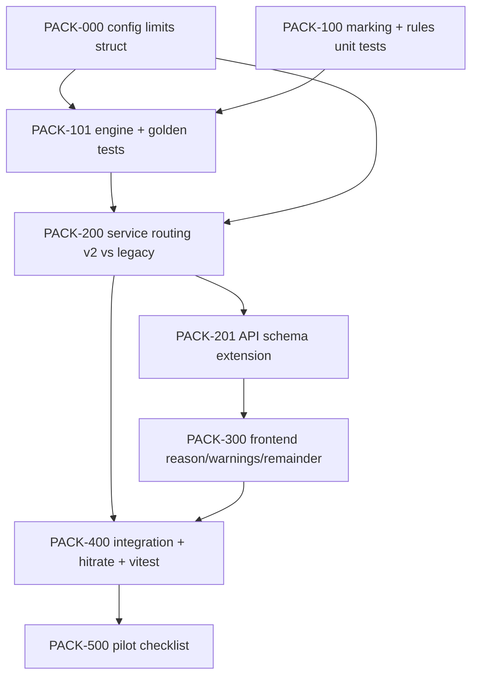

# Plan: Propose v2 — автонабор рейса по правилам укладки ПБ

**Created:** 2026-08-02  
**Status:** ✅ PLAN approved (2026-08-02)  
**Spec:** [`ai_docs/specs/shipment-propose-v2.md`](../../specs/shipment-propose-v2.md) (✅ approved 2026-08-02)  
**Idea:** [`ai_docs/ideas/shipment-propose-v2.md`](../../ideas/shipment-propose-v2.md)  
**Parent:** [`2026-07-31-shipment-logistics.md`](./2026-07-31-shipment-logistics.md) (SHIP-201 baseline)

## Goal

Заменить весовой FIFO в `ShipmentService.propose` на движок правил укладки ПБ для **t20** и **рейсов без класса ТС** (default t20). Каждая невлезшая плита — с причиной; остаток по заказу и soft-warnings в ответе. **`t30plus` — legacy propose** до уточнения правил с логистом.

**Метрика успеха пилота:** рост hit-rate `scripts/shipment_propose_hitrate.py` на done-рейсах с `vehicle_class` null/t20.

## Decisions locked (из SPECIFY)

| # | Решение |
|---|---------|
| D3 | t20 max_weight_kg = **19 800** (default config) |
| D4 | marking length из **`plate_name`** (`plate_line_parser`); fallback `round(length_m, 1)` |
| D7 | без `vehicle_class` → **t20 по умолчанию** (v2 движок) |
| D9 | **`t30plus` → legacy** (текущий SHIP-201 weight FIFO) |
| D10 | кандидат-пул MVP = **только привязанные КП**; расширение на заказчика — post-MVP |
| D11 | длина кузова 13,2 м — **hard** → `not_fit`; override «Добавить всё равно» |
| D12 | t30plus legacy — лимит **30 000 кг** |
| D13 | выкатка v2 сразу для t20/null, без feature-flag |
| D14 | `order_remainder` — по строкам `completed_plates` |

## Current state

| Компонент | Сейчас |
|-----------|--------|
| `propose` | FIFO по `completed_date`, split только по `vehicle_class_limits_kg` (20 000 / 30 000) |
| Config | `VEHICLE_CLASS_LIMITS_KG` — только вес, JSON в `settings.py` |
| API response | `items`, `not_fit` (без reason), `overload`, `vehicle_class_limits_kg` |
| Frontend | Alert «Не влезло в лимит класса ТС» — без причин |
| Tests | `test_propose_fifo_and_vehicle_limit`, multi-KP, reserved qty |
| Packing | `core/optimization/ffd_packing.py` — производственные дорожки, **не** кузов |

## Architecture decisions

1. **Новый модуль `core/shipment_packing/`** — pure stdlib; единственная зависимость на домен: `plate_line_parser.parse_line` для marking length.
2. **Routing в `propose`:**
   - `effective_class = vehicle_class or row["vehicle_class"] or "t20"` для v2;
   - если `effective_class == "t30plus"` → **`_propose_legacy_weight_fifo(...)`** (текущий код, вынести без изменения поведения);
   - иначе → `pack_shipment(candidates, limits=t20_limits)`.
3. **Config расширение:** `vehicle_class_limits_raw` → JSON объект `{max_weight_kg, body_length_m, max_tiers}`; property `vehicle_class_limits_kg` сохраняется (backward compat для UI/overload).
4. **Qty-инвариант:** `items.qty + not_fit.qty + remainder.qty == available` по каждому `completed_plate_id`.
5. **Hard vs soft (D11):** weight + tiers + **body_length_m** — hard (→ `not_fit`); suboptimal pieces и kp_mix — warnings. Перегруз по длине вручную — кнопка «Добавить всё равно», confirm не блокируется.
6. **Snapshot:** `propose_snapshot` хранит полный новый JSON (совместим с hitrate script — читает `items` multiset).
7. **Frontend:** минимальный diff — reason в not_fit, блок warnings + order_remainder; hint для t30plus «автоподбор по укладке недоступен».

## Risks

| Риск | Митигация |
|------|-----------|
| Жадный алгоритм не повторяет 43% микс-рейсов реестра | Golden-тесты 1–6 из спеки; pilot hit-rate; итерация engine без смены API |
| `plate_name` не парсится (свободный текст) | fallback `round(length_m, 1)` + warning `marking_fallback` |
| Регрессия t30plus / тестов SHIP-201 | Legacy path изолирован; существующие t30plus-тесты на legacy |
| Default 19 800 ломает UI «до 20 т» | Обновить `logisticsFormat.ts` + label; `.env` Ask first на prod |
| Сложность engine затягивает MVP | Vertical slice: golden tests до service integration |
| t30plus «ручной» неочевиден логисту | Alert в UI при propose t30plus |

## Parallelism

| Можно параллельно | После чего |
|-------------------|------------|
| PACK-100 (marking/rules) ∥ PACK-000 (config) | — |
| PACK-300 (frontend types/mock) | PACK-201 (schema freeze) |
| Golden fixtures из реестра | PACK-101 |

---

## Task list

### Phase 0: Foundation

- [ ] **PACK-000:** расширить config — `VehicleClassLimits` struct; default t20 `{19800, 13.2, 4}`; `vehicle_class_limits_kg` property сохраняет `{t20: 19800, t30plus: 30000}`
  - Acceptance: settings парсят новый JSON; старый env `{"t20": 20000}` мигрирует или документирован breaking change
  - Verify: unit-тест settings; `test_logistics_api` обновлён на 19800
  - Files: `core/config/settings.py`, `tests/test_settings*.py` или inline в shipment tests

- [ ] **PACK-100:** `core/shipment_packing/marking.py` + `rules.py` + `reasons.py`
  - Acceptance: `marking_length_m("ПБ 64-12-8") == 6.4`; GOST stack count table; piece = width < 1.2; length mix Δ≤1.0 по marking
  - Verify: `pytest tests/test_shipment_packing.py -k "marking or rules" -q`
  - Files: `core/shipment_packing/*.py`, `tests/test_shipment_packing.py`

**Checkpoint 0:** marking + rules unit tests PASS

### Phase 1: Engine (TDD)

- [ ] **PACK-101:** `engine.py` + `models.py` + `pack_shipment()` public API
  - Acceptance: golden 1–6 PASS; qty-инвариант; hard constraints never in items with violation
  - Verify: `pytest tests/test_shipment_packing.py -q`
  - Files: `core/shipment_packing/engine.py`, `tests/test_shipment_packing.py`

**Checkpoint 1:** все golden PASS без БД

### Phase 2: Service integration

- [ ] **PACK-200:** рефактор `shipment_service.propose`
  - Acceptance: t20/null → v2; t30plus → legacy; candidates только linked KPs; snapshot сохраняется; reserved qty respected
  - Verify: `pytest tests/test_shipment_service.py -k propose -q`
  - Files: `app/services/shipment_service.py`, `tests/test_shipment_service.py`

- [ ] **PACK-201:** расширить `ShipmentProposeResponse` / items
  - Acceptance: `not_fit[].reason_code/text`; `warnings[]`; `order_remainder[]`; optional fields с defaults
  - Verify: `pytest tests/test_logistics_api.py -k propose -q`
  - Files: `app/schemas/logistics.py`, `tests/test_logistics_api.py`

**Checkpoint 2:** backend propose v2 green; t30plus legacy unchanged

### Phase 3: Frontend

- [ ] **PACK-300:** типы + `ShipmentItemsSection` — reason, warnings, remainder, t30plus hint
  - Acceptance: not_fit показывает `reason_text`; warnings и остаток видны; t30plus — пояснение
  - Verify: vitest `ShipmentDrawer.test.tsx`, `npm run build`
  - Files: `frontend/src/features/logistics/types/logistics.ts`, `ShipmentItemsSection.tsx`, tests

**Checkpoint 3:** frontend build + vitest PASS

### Phase 4: Verification & pilot

- [ ] **PACK-400:** regression bundle
  - Acceptance: hitrate script читает новый snapshot; plate_loss gate PASS; нет регрессии SGP/shipment qty
  - Verify: `pytest tests/ -k "shipment or logistics" -q`; `./.venv/bin/python scripts/shipment_propose_hitrate.py`
  - Files: при необходимости `scripts/shipment_propose_hitrate.py` (только если JSON shape ломает)

- [ ] **PACK-500:** pilot checklist + report stub
  - Acceptance: 2–3 живых рейса с логистом; assumptions checklist из спеки; hit-rate baseline записан
  - Verify: manual; [`ai_docs/develop/reports/TBD-shipment-propose-v2.md`](../reports/TBD-shipment-propose-v2.md)
  - Files: report only

**Checkpoint 4:** pilot go/no-go

---

## Post-MVP backlog (не в этом плане)

| ID | Задача |
|----|--------|
| POST-1 | Кандидат-пул: непривязанные КП того же заказчика |
| POST-2 | Правила `t30plus` — спека после интервью с логистом |
| POST-3 | 5-й ярус с подтверждением роли |
| POST-4 | Раскладка КП на серию рейсов (reuse engine) |
| POST-5 | ГОСТ-схема загрузки для водителя |

---

## Verification checkpoints (summary)

| CP | Command | Gate |
|----|---------|------|
| 0 | `pytest tests/test_shipment_packing.py -k "marking or rules" -q` | PASS |
| 1 | `pytest tests/test_shipment_packing.py -q` | golden 1–6 PASS |
| 2 | `pytest tests/test_shipment_service.py tests/test_logistics_api.py -k propose -q` | PASS |
| 3 | `cd frontend && npm test -- --run src/features/logistics && npm run build` | PASS |
| 4 | `pytest tests/ -k "shipment or logistics" -q` + hitrate script | PASS + baseline |

---

## Next step (после ревью PLAN)

→ **Phase 3: TASKS** — детализация PACK-* с line-level acceptance (или сразу IMPLEMENT по vertical slice PACK-100 → PACK-101 → PACK-200)
