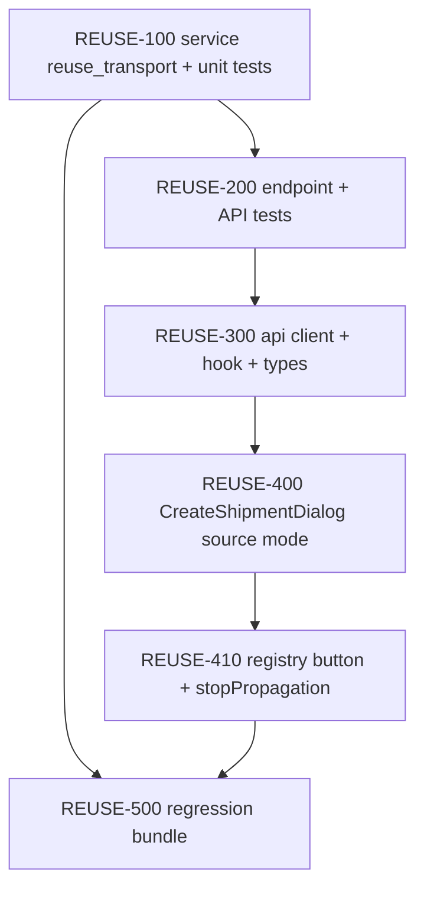

# Plan: Переиспользование рейса — клон транспорта

**Created:** 2026-08-02  
**Status:** ✅ IMPLEMENTED  
**Spec:** [`ai_docs/specs/shipment-reuse-transport.md`](../../specs/shipment-reuse-transport.md) (✅ SPECIFY locked 2026-08-02)  
**Idea:** [`ai_docs/ideas/shipment-reuse-transport.md`](../../ideas/shipment-reuse-transport.md)  
**Parent:** [`2026-07-31-shipment-logistics.md`](./2026-07-31-shipment-logistics.md)

## Goal

Логист из строки реестра жмёт **«На основе»** → в диалоге выбирает дату/Д/С/КП → получает новый рейс `in_work` с тем же транспортом (перевозчик, водитель, ТС, класс, доверенность), без УПД/заявки/состава/чужих заказов.

**Метрика успеха:** в пилоте часть новых рейсов создаётся через reuse; транспортный блок не перепечатывается вручную.

## Decisions locked

См. таблицу R1–R11 в спеке. Кратко:

- Атомарный endpoint; белый список из 5 полей; диалог = confirm; кнопка «На основе»; `carrier_id` копируется as-is.

## Current state

| Компонент | Сейчас |
|-----------|--------|
| Create | `POST /shipments` — только `shipment_date`, `delivery_type`, `kp_ids` (≥1); транспорт потом через `PATCH` |
| Service `create` | INSERT shipment + orders, commit, `get`; отдельной транзакции с transport нет |
| Registry UI | Клик по строке → drawer; `CreateShipmentDialog` без source; колонки действий нет |
| List row | Есть `carrier_name`, `driver_name`, `vehicle_text`, `proxy_no`; **нет** `carrier_id` / `vehicle_class` → клон только сервером по `source_id` |

## Architecture decisions

1. **`ShipmentService.reuse_transport`** — одна SQLite-транзакция: validate source → insert shipment+orders (логика как `create`) → `UPDATE` белого списка из source → commit → `get(new_id)`. Не вызывать публичный `create`+`patch` (два соединения / half-state).
2. **Request schema** — переиспользовать `ShipmentCreateRequest` (тот же body). Отдельный класс-алиас не обязателен; в endpoint summary явно «reuse-transport».
3. **Frontend** — расширить `CreateShipmentDialog`: props `sourceShipmentId?: number`, `initialDeliveryType?: DeliveryType`. Submit: если source задан → `reuseTransport`, иначе → `createShipment`.
4. **Registry** — колонка в конце таблицы; кнопка `type="button"` с `stopPropagation`; по клику `setReuseSource({ id, delivery_type })` + открыть диалог.
5. **Инвалидация** — как у create: invalidate list query + `onCreated(newId)` → открыть drawer.



## Risks

| Риск | Митигация |
|------|-----------|
| Half-created рейс при ошибке | Одна транзакция в `reuse_transport`; rollback на любой ошибке |
| Кнопка открывает drawer источника | `stopPropagation` + тест |
| Случайно скопировать УПД/состав | Явный whitelist UPDATE; тест на чёрный список |
| `carrier_id` не существует после ручной порчи БД | Копируем as-is (R11); FK в SQLite может быть off — поведение как у обычного patch |
| Дублирование SQL insert create/reuse | Вынести общий `_insert_shipment_with_orders(cur, ...)` внутри сервиса — минимальный рефактор, без смены публичного API `create` |

## Parallelism

| Можно параллельно | После чего |
|-------------------|------------|
| REUSE-100 ∥ черновик UI на mock | — |
| REUSE-400 (dialog) | REUSE-300 |
| REUSE-410 | REUSE-400 |

---

## Task list

### Phase 1: Backend (TDD)

- [x] **REUSE-100:** `ShipmentService.reuse_transport` + unit-тесты
  - Acceptance:
    - Новый рейс `in_work`; скопированы только `carrier_id`, `driver_name`, `vehicle_text`, `vehicle_class`, `proxy_no`
    - НЕ скопированы: `upd_no`, `freight_request_no`, `planned_cost`, `attention`, items; orders = переданные `kp_ids`
    - Работает для source `done` и `in_work`
    - `source_id` не найден → `shipment_not_found`
    - Пустой транспорт источника → поля null/пусто, рейс создан
  - Verify: `pytest tests/test_shipment_service.py -k reuse -q`
  - Files: `app/services/shipment_service.py`, `tests/test_shipment_service.py`

- [x] **REUSE-200:** endpoint + schema wiring + API-тесты
  - Acceptance:
    - `POST /api/v1/logistics/shipments/{id}/reuse-transport` → 200 `ShipmentCard` с транспортом
    - 404 на несуществующий source; 422 без `kp_ids`; 403 для manager; 401 без cookie
  - Verify: `pytest tests/test_logistics_api.py -k reuse -q`
  - Files: `app/api/v1/endpoints/logistics.py`, `app/schemas/logistics.py` (если нужен алиас), `tests/test_logistics_api.py`

**Checkpoint 1:** backend green; curl/reuse создаёт рейс с транспортом

### Phase 2: Frontend

- [x] **REUSE-300:** `logisticsApi.reuseTransport` + `useReuseTransportMutation` + типы
  - Acceptance: mutation инвалидирует list keys как create; типы payload = create
  - Verify: `npm test -- --run src/features/logistics/api` (если есть) или покрыть через dialog/registry
  - Files: `frontend/src/features/logistics/api/logisticsApi.ts`, `hooks/useLogisticsQueries.ts`, `types/logistics.ts`

- [x] **REUSE-400:** `CreateShipmentDialog` — режим source
  - Acceptance:
    - props `sourceShipmentId?`, `initialDeliveryType?`
    - при source: delivery_type префилл, submit → reuse endpoint
    - заголовок диалога отличается («Новый рейс на основе…» / аналог)
    - без source — поведение create без регрессии
  - Verify: unit/dialog test + существующие create-сценарии
  - Files: `CreateShipmentDialog.tsx` (+ test при наличии)

- [x] **REUSE-410:** кнопка в `LogisticsRegistryView`
  - Acceptance:
    - колонка/кнопка «На основе» (`title="Создать на основе"`)
    - клик открывает диалог с `sourceShipmentId=row.id`, не открывает drawer
    - после успеха — drawer нового id, list refresh
  - Verify: `LogisticsRegistryView.test.tsx` (+ stopPropagation кейс)
  - Files: `LogisticsRegistryView.tsx`, `LogisticsRegistryView.test.tsx`

**Checkpoint 2:** vitest + `npm run build` PASS

### Phase 3: Regression

- [x] **REUSE-500:** полный гейт
  - Acceptance: logistics/shipment зелёные; build зелёный; ручной сценарий на dev: reuse → транспорт на месте, УПД пуст, состав пуст
  - Verify:
    ```bash
    pytest tests/ -k "shipment or logistics" -q
    cd frontend && npm test -- --run src/features/logistics && npm run build
    ```
  - Files: none expected (fix only if regressions)

**Checkpoint 3:** готово к отчёту / гайду

---

## Verification commands

```bash
source .venv/bin/activate
pytest tests/test_shipment_service.py -k reuse -q
pytest tests/test_logistics_api.py -k reuse -q
pytest tests/ -k "shipment or logistics" -q

cd frontend
npm test -- --run src/features/logistics
npm run build
```

## Out of scope (reminders)

- Кнопка в drawer, шаблоны перевозчика, авто last-by-carrier, полный дубль, ослабление «≥1 КП»
- Обновление user-guide — после IMPLEMENT (documenter)

## Implementation order (recommended)

`REUSE-100 → REUSE-200 → REUSE-300 → REUSE-400 → REUSE-410 → REUSE-500`
