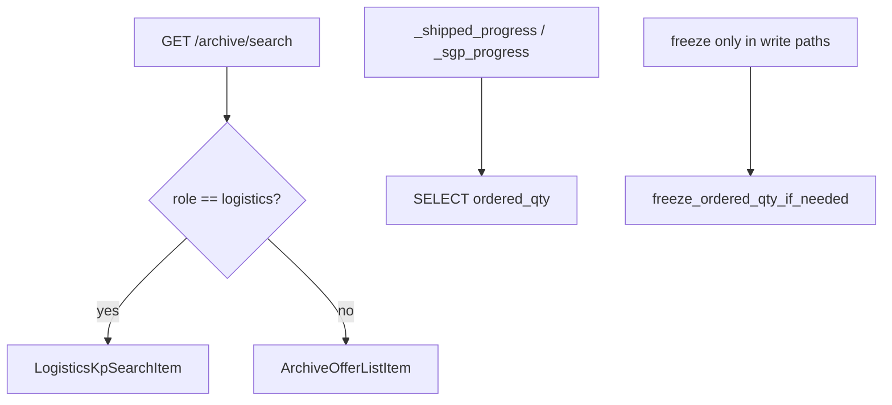

# Plan: Стабилизация P0 + узкий P1 (аудит 2026-08-02)

**Spec:** [`ai_docs/specs/stabilizaciya-p0-p1-audit-2026-08-02.md`](ai_docs/specs/stabilizaciya-p0-p1-audit-2026-08-02.md)  
**Источник:** [`ai_docs/develop/audits/2026-08-02-audit-comparison.md`](ai_docs/develop/audits/2026-08-02-audit-comparison.md)  
**Статус:** на ревью перед IMPLEMENT  
**Docs plan path (после approve):** `ai_docs/develop/plans/2026-08-02-stabilizaciya-p0-p1-audit.md`

## Overview

Закрыть production-блокеры и ближайшие security/integrity-риски минимальным diff: починить два missing import, убрать финансовые поля из `/archive/search` для `logistics`, санитизировать SQLite-ошибку pile catalog, убрать UPDATE `ordered_qty` из read-path progress, добавить тесты.

## Decisions locked (defaults из спеки)

| # | Решение |
|---|---------|
| D1 | Role-aware mapping на существующем `GET /commercial/archive/search` — **без** нового endpoint |
| D2 | Logistics item: `kp_id`, `customer_name`, `status`, `product_type` — без финансов и без progress badges |
| D3 | Admin/manager сохраняют полный `ArchiveOfferListItem` |
| D4 | SGP progress: ephemeral M без UPDATE; shipped progress: `null` если `ordered_qty IS NULL` (не `m=x`) |
| D5 | Sanitize единственное `ShipmentError(...{exc})` в pile catalog (`shipment_service.py:1058–1063`) |
| D6 | Audit markdown FIXED **не** трогать |
| D7 | Response typing: отдельная slim-модель + `response_model` через Union/`dict`/роль-зависимый return — фактический JSON для logistics без financial keys (проверяется тестом) |

## Architecture



**Ключевые точки кода сейчас:**
- Search допускает logistics и маппит через `_to_list_item` с финансами — [`archive_service.py`](app/services/archive_service.py) `search()` + [`archive.py`](app/api/v1/endpoints/archive.py) `:54–78`
- `datetime` без import — [`offers_service.py`](app/services/offers_service.py) `:145,169`
- `create_gantt_excel` без import — [`archive_service.py`](app/services/archive_service.py) `:351–352`; источник [`core/gantt_excel.py`](core/gantt_excel.py)
- Freeze в read-path — [`archive_service.py`](app/services/archive_service.py) `_shipped_progress`, [`sgp_service.py`](app/services/sgp_service.py) `_sgp_progress_on_cursor`
- UI search использует только `kp_id` / `customer_name` — [`CreateShipmentDialog.tsx`](frontend/src/features/logistics/components/CreateShipmentDialog.tsx)

## Task List

### Phase 1: P0 runtime fixes + tests

#### Task 1: Fix missing imports (Q1/Q2 v2)

**Description:** Добавить `from datetime import datetime` в `offers_service.py` и `from core.gantt_excel import create_gantt_excel` в `archive_service.py`.

**Acceptance criteria:**
- [ ] `generate_pdf` / `generate_xlsx` при `creation_date=None` не бросают `NameError`
- [ ] `build_current_plan_gantt` резолвит `create_gantt_excel` (нет `NameError`)

**Verification:**
- [ ] `pytest tests/test_offers_service.py tests/test_archive_gantt_import.py -q` (файлы появятся в Task 2)

**Dependencies:** None  
**Files:** `app/services/offers_service.py`, `app/services/archive_service.py`  
**Scope:** XS

#### Task 2: Tests for PDF/XLSX + Gantt import

**Description:** Новые тесты, фиксирующие P0-1: offers PDF/XLSX без `creation_date`; gantt — mock `PlanDistributionService.get_all_plans_gantt_data` + assert вызов `create_gantt_excel` или отсутствие NameError.

**Acceptance criteria:**
- [ ] Тест offers: empty `creation_date` → успешный вызов генераторов (можно mock `generate_commercial_offer_pdf/xlsx`)
- [ ] Тест gantt: метод не падает на NameError; import path покрыт

**Verification:**
- [ ] `pytest tests/test_offers_service.py tests/test_archive_gantt_import.py -q`

**Dependencies:** Task 1  
**Files:** `tests/test_offers_service.py` (new), `tests/test_archive_gantt_import.py` (new)  
**Scope:** S

### Checkpoint A: After Tasks 1–2
- [ ] PDF/XLSX и Gantt NameError закрыты и покрыты тестами
- [ ] Регрессия offers/archive не сломана на узком наборе

---

### Phase 2: P0 financial ACL

#### Task 3: Slim schema + role-aware search mapping

**Description:** Добавить `LogisticsKpSearchItem` и вариант ответа (например `LogisticsArchiveSearchResponse` или Union). В `ArchiveService.search()` для `role==logistics` маппить slim item без финансов/progress; admin/manager — `_to_list_item` как сейчас. Endpoint: корректный typing/`response_model`.

**Acceptance criteria:**
- [ ] logistics JSON `items[]` без `discount_percent`, `subtotal`, `vat_amount`, `total_amount`
- [ ] manager/admin с доступом по-прежнему получают финансовые поля
- [ ] logistics list/details archive остаются 403

**Verification:**
- [ ] Расширить `tests/test_logistics_api.py::test_archive_search_allows_logistics_only_on_search` asserts на отсутствие financial keys + seed с ненулевыми суммами
- [ ] `pytest tests/test_logistics_api.py tests/test_archive_endpoints.py tests/test_archive_authorization.py -q`

**Dependencies:** None (можно после Checkpoint A)  
**Files:** `app/schemas/archive.py`, `app/services/archive_service.py`, `app/api/v1/endpoints/archive.py`, `tests/test_logistics_api.py`  
**Scope:** M

#### Task 4: Frontend types for slim search results

**Description:** Ввести slim type (или сделать financial fields optional на search result) и использовать его в `CreateShipmentDialog` / `archiveApi.search`, чтобы TS не требовал обязательные `subtotal` и т.п.

**Acceptance criteria:**
- [ ] `CreateShipmentDialog` компилируется и работает с slim items (`kp_id`, `customer_name`)
- [ ] Нет runtime-ожиданий финансовых полей в logistics UI search

**Verification:**
- [ ] `cd frontend && npm test -- --run src/features/logistics/components/CreateShipmentDialog.test.tsx` (если есть) или typecheck/build при затронутых types
- [ ] Ручной sanity: поиск КП в диалоге создания рейса

**Dependencies:** Task 3  
**Files:** `frontend/src/features/commercial-archive/types/archive.ts`, `frontend/src/features/commercial-archive/api/archiveApi.ts`, `frontend/src/features/logistics/components/CreateShipmentDialog.tsx`  
**Scope:** S

### Checkpoint B: After Tasks 3–4
- [ ] Financial leak закрыт серверно + UI совместим
- [ ] logistics API tests зелёные

---

### Phase 3: P1 integrity + sanitization

#### Task 5: Sanitize pile catalog SQLite errors

**Description:** В `search_pile_catalog` клиенту отдавать стабильное `"Ошибка чтения каталога свай"` без `{exc}`; detail только в `logger.exception`.

**Acceptance criteria:**
- [ ] `ShipmentError.args[0]` / HTTP `message` не содержат sqlite exception text
- [ ] `code == pile_catalog_read_failed` сохранён

**Verification:**
- [ ] Unit/API тест в `tests/test_shipment_service.py` или `tests/test_logistics_api.py` с monkeypatch `sqlite3` error
- [ ] `pytest tests/test_shipment_service.py tests/test_logistics_api.py -q -k pile`

**Dependencies:** None  
**Files:** `app/services/shipment_service.py`, tests  
**Scope:** S

#### Task 6: Freeze out of read-path (+ Q5 shipped)

**Description:** В `_shipped_progress` — только SELECT `ordered_qty`; если NULL → return `None` (не `m=x`, не UPDATE). В `_sgp_progress_on_cursor` — убрать `freeze_ordered_qty_if_needed`; ephemeral M = remaining+n без persist (как сейчас fallback, но без UPDATE). Write-path (`commit_move_to_production`, `ShipmentService.complete`) не трогать.

**Acceptance criteria:**
- [ ] Read progress не делает `UPDATE kp_meta SET ordered_qty`
- [ ] `ordered_qty IS NULL` → shipped_progress отсутствует/null; SGP badge считает ephemeral M
- [ ] Write freeze по-прежнему фиксирует M

**Verification:**
- [ ] Тест: после `sgp_progress` / archive list read `ordered_qty` остаётся NULL
- [ ] `pytest tests/test_sgp_service.py` + точечный archive/shipped progress test -q
- [ ] `pytest tests/test_move_to_production_atomicity.py -q` (write-path регрессия)

**Dependencies:** None  
**Files:** `app/services/archive_service.py`, `app/services/sgp_service.py`, tests; optional helper в `core/kp_db_plates_completion.py` только если уменьшает дубль  
**Scope:** M

### Checkpoint C: After Tasks 5–6
- [ ] Нет SQLite leak в pile catalog
- [ ] Read-path не мутирует M; atomicity write-тесты зелёные

---

### Phase 4: Final gate

#### Task 7: Full targeted regression gate

**Description:** Прогнать целевой набор из спеки; убедиться, что diff не включает god-service/Redis/CSP/OCR/audit FIXED.

**Acceptance criteria:**
- [ ] Все 10 Success Criteria спеки выполнены
- [ ] Diff в рамках Boundaries

**Verification:**
```bash
.venv/bin/pytest \
  tests/test_logistics_api.py \
  tests/test_archive_endpoints.py \
  tests/test_archive_authorization.py \
  tests/test_offers_service.py \
  tests/test_archive_gantt_import.py \
  tests/test_shipment_service.py \
  tests/test_sgp_service.py \
  tests/test_move_to_production_atomicity.py \
  -q
```

**Dependencies:** Tasks 1–6  
**Files:** none (verify only)  
**Scope:** XS

### Checkpoint: Complete
- [ ] Human review diff
- [ ] Ready for optional commit (только по просьбе)

## Risks and Mitigations

| Risk | Impact | Mitigation |
|------|--------|------------|
| OpenAPI всё ещё показывает full item | Med | Slim response model / Union; assert на фактический JSON |
| Frontend ломается на обязательных number fields | Med | Slim type в Task 4 |
| SGP UI «пустеет» без M | Low | Ephemeral compute без UPDATE (D4) |
| Gantt test хрупкий | Low | Mock plan data + import smoke |

## Parallelization

- **Sequential:** Task 1 → 2; Task 3 → 4; Task 7 last
- **Parallel after Checkpoint A:** Task 3, Task 5, Task 6 могут идти параллельно
- **Task 2** может писаться TDD red→green вместе с Task 1

## Out of scope (не делать)

God-services, repository layer, Redis rate limit, CSP, OCR, Q3 order_data, Q6 DRY move_to_production, Q9 free-only complete, audit FIXED markers.
