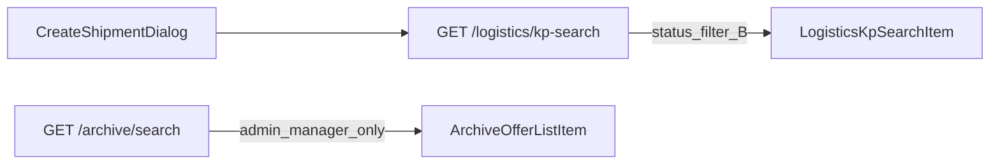

# Plan: Стабилизация волна 1 (аудит 2026-08-02)

**Created:** 2026-08-02  
**Status:** IMPLEMENTED  
**Spec:** [`ai_docs/specs/stabilizaciya-wave1-audit-2026-08-02.md`](../../specs/stabilizaciya-wave1-audit-2026-08-02.md)  
**Источник:** [`../audits/2026-08-02-full-project-audit.md`](../audits/2026-08-02-full-project-audit.md)  
**Defaults locked:** Q1–Q4 из спеки (`выполнено` вне ACL; ADR + workers=1; slim schema канон в logistics; `audit:ci` в deploy-contract + минимальный GitHub workflow)

## Overview

Закрыть волну 1: npm CVE (S4), честный single-instance deploy (A2/S2), DEBUG guard (S9), свой `/logistics/kp-search` с ACL B (A8/S12), тесты `draftItems` (Q2). Без Redis, без split ShipmentService, без OCR/CSP.

## Decisions locked

| # | Решение |
|---|---------|
| D1 | ACL B: статусы только `в работе`, `На СГП` |
| D2 | Redis out of scope; опереться на [`deploy-contract.md`](../deploy-contract.md) + новый ADR |
| D3 | Hard-fail: `APP_ENV=production` ∧ `APP_DEBUG=true` |
| D4 | Убрать `logistics` с `GET /commercial/archive/search` |
| D5 | Канон slim DTO в `app/schemas/logistics.py`; убрать logistics-ветки из archive search |
| D6 | `npm run audit:ci` — в deploy-contract + `.github/workflows/frontend-audit.yml` |
| D7 | Patched `react-router-dom`: взять минимальную ≥ patched из advisory при implement (`npm audit` / GHSA) |

## Architecture



**Backend search:** тонкий метод (в `ShipmentService` или отдельный helper рядом с logistics) → repository `get_by_id` / `search_by_customer_name` с фильтром статусов → slim map. Предпочтительно переиспользовать `readable_statuses` в offers_read/repository, если параметр уже есть.

## Task List

### Phase 1: Security + deploy (parallel-safe)

#### Task 1: S4 — bump react-router-dom + audit:ci

**Description:** Обновить `react-router-dom` до patched; убедиться что `npm run audit:ci` зелёный; добавить `.github/workflows/frontend-audit.yml` (checkout + `npm ci` + `npm run audit:ci`); упомянуть команду в `deploy-contract.md`.

**Acceptance:**
- [ ] `react-router-dom` ≠ 7.18.0 (patched)
- [ ] `cd frontend && npm run audit:ci` exit 0
- [ ] Workflow или явная строка в deploy-contract про pre-release `audit:ci`

**Verify:** `npm run audit:ci` && `npm run typecheck`  
**Files:** `frontend/package.json`, `frontend/package-lock.json`, `.github/workflows/frontend-audit.yml`, `ai_docs/develop/deploy-contract.md`  
**Scope:** S

#### Task 2: S9 — DEBUG forbidden in production

**Description:** `model_validator` на Settings: production + debug → ValueError. Тест.

**Acceptance:**
- [ ] Старт с production+debug падает на settings
- [ ] development + debug допустим

**Verify:** `pytest tests/test_settings_guards.py -q`  
**Files:** `core/config/settings.py`, `tests/test_settings_guards.py`  
**Scope:** S

#### Task 3: A2/S2 — ADR single-instance

**Description:** Новый `ai_docs/develop/architecture/deployment-single-instance.md` (SQLite, drafts, rate-limit → workers=1). Обновить `rate-limiting.md` ссылкой на ADR. В compose/docs — явный `--workers 1` / `UVICORN_WORKERS=1` где есть uvicorn-команда.

**Acceptance:**
- [ ] ADR существует
- [ ] rate-limiting.md ссылается на ADR / deploy-contract
- [ ] Нет скрытого multi-worker в prod-примерах

**Verify:** docs review; grep `workers` в docker/deploy  
**Files:** `ai_docs/develop/architecture/deployment-single-instance.md`, `ai_docs/develop/architecture/rate-limiting.md`, `docker-compose.yml` (если применимо), `deploy-contract.md`  
**Scope:** S

### Checkpoint A
- [ ] S4/S9/A2 docs+guards готовы независимо от logistics

---

### Phase 2: Logistics kp-search (A8/S12)

#### Task 4: Backend GET /logistics/kp-search + ACL B

**Description:** Схемы в `schemas/logistics.py`; endpoint под `REQUIRE_LOGISTICS`; фильтр статусов; slim response без финансов. Убрать `logistics` из `require_roles` на archive `/search`. Удалить/не использовать archive `LogisticsArchiveSearchResponse` для logistics (можно оставить типы мёртвыми кратко или удалить — предпочтительно удалить неиспользуемое).

**Acceptance:**
- [ ] logistics kp-search: 200, нет financial keys
- [ ] КП `в архиве` / `выполнено` → пустой результат (не 500)
- [ ] archive/search + logistics cookie → 403
- [ ] admin/manager archive search без регрессии

**Verify:**
```bash
.venv/bin/pytest tests/test_logistics_api.py tests/test_archive_authorization.py tests/test_archive_endpoints.py -q
```

**Files:** `app/schemas/logistics.py`, `app/api/v1/endpoints/logistics.py`, `app/services/*` (thin search), `app/api/v1/endpoints/archive.py`, `app/services/archive_service.py` (убрать logistics branch), `app/schemas/archive.py` (cleanup), `tests/test_logistics_api.py`  
**Scope:** M (≤5 файлов логики + tests; при >5 — разбить: schemas+endpoint, затем archive cleanup)

#### Task 5: Frontend — logisticsApi.searchKp + CreateShipmentDialog

**Description:** API client + типы; диалог на новый endpoint; UX-текст если пусто («КП должно быть в работе или на СГП»); обновить тесты диалога.

**Acceptance:**
- [ ] Нет импорта `archiveApi.search` в CreateShipmentDialog
- [ ] Tests зелёные

**Verify:**
```bash
cd frontend && npm test -- --run src/features/logistics/components/CreateShipmentDialog.test.tsx && npm run typecheck
```

**Files:** `frontend/src/features/logistics/api/logisticsApi.ts`, `types/logistics.ts`, `CreateShipmentDialog.tsx`, `CreateShipmentDialog.test.tsx`  
**Scope:** S–M

### Checkpoint B
- [ ] Logistics bounded context search изолирован; ACL B на сервере

---

### Phase 3: Q2 tests

#### Task 6: draftItems unit tests (+ optional smoke)

**Description:** `draftItems.test.ts` — `draftFromSaved`, `draftsToPayload`, manual weight, total weight. Optional: минимальный smoke ShipmentItemsSection только если остаётся время; не блокер.

**Acceptance:**
- [ ] draftItems tests покрывают payload/manual weight
- [ ] vitest зелёный

**Verify:** `cd frontend && npm test -- --run src/features/logistics/lib/draftItems.test.ts`  
**Files:** `frontend/src/features/logistics/lib/draftItems.test.ts`  
**Scope:** S

### Checkpoint C — Final gate

```bash
cd frontend && npm run audit:ci && npm run typecheck && npm test -- --run src/features/logistics
.venv/bin/pytest \
  tests/test_logistics_api.py \
  tests/test_archive_endpoints.py \
  tests/test_archive_authorization.py \
  tests/test_settings_guards.py \
  -q
```

- [ ] Все Success Criteria спеки §9
- [ ] Diff без A1/Redis/OCR/CSP

## Order and parallelization

```
T1 (S4) ──┐
T2 (S9) ──┼── Checkpoint A ── T4 (backend) ── T5 (frontend) ── T6 (draftItems) ── Gate
T3 (A2) ──┘
```

T1/T2/T3 параллельны. T4 → T5 строго. T6 после T5 или параллельно с T5.

## Risks

| Risk | Mitigation |
|------|------------|
| Логист не находит КП в архиве | Сообщение в UI; менеджер → «в работу» |
| npm bump ломает router | typecheck + logistics tests |
| search без status filter в SQL | Явно передавать `readable_statuses` / фильтровать post-read + тест |
| Слишком много файлов в T4 | Сначала endpoint+schema+test, потом cleanup archive |

## Out of scope

A1 ShipmentService split, Redis, OCR, CSP, encryption, A11 UI split, audit FIXED markers.

---

*PLAN ready for human approval before IMPLEMENT.*
