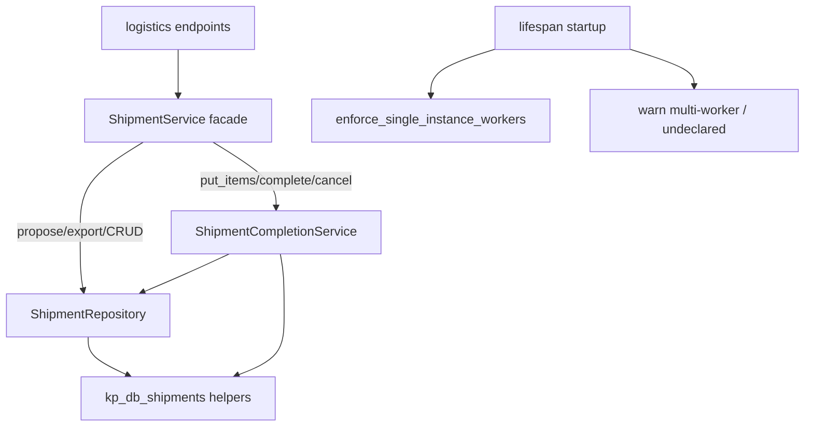

# Plan: Стабилизация S3 + A2 + узкий A1 (аудит 2026-08-03)

**Spec:** [`ai_docs/specs/stabilizaciya-s3-a2-narrow-a1-audit-2026-08-03.md`](../../specs/stabilizaciya-s3-a2-narrow-a1-audit-2026-08-03.md)  
**Источник:** [`ai_docs/develop/audits/2026-08-03-full-project-audit.ru.md`](../audits/2026-08-03-full-project-audit.ru.md)  
**Статус:** IMPLEMENTED  
**Фаза SDD:** IMPLEMENT ✅

## Overview

Закрыть целостность списания СГП (S3), ужесточить single-instance деплой в production (A2) и вынести SQL + lifecycle completion из god-`ShipmentService`, оставив propose/export в фасаде. Endpoints не меняют Depends — только фасад.

## Decisions locked

| # | Решение |
|---|---------|
| D1 | Scope D |
| D2 | Hard-fail только production + single_instance + workers>1 |
| D3 | workers=None → не fail; WARNING + `/health` note |
| D4 | S3 в put + complete; без patch-orders UX-гарда |
| D5 | Pile null-ok |
| D6 | cancel в CompletionService |
| D7 | Фасад-only для endpoints |
| D8 | Audit FIXED / Redis / полный A1 / A4 — out |

## Architecture



**Ключевые точки сейчас:**
- `_prepare_item` / `put_items` / `complete` — [`shipment_service.py`](../../../app/services/shipment_service.py) ~589–804
- Резерв qty — [`kp_db_shipments.py`](../../../core/kp_db_shipments.py)
- Startup warn — [`login_rate_limit.py`](../../../app/security/login_rate_limit.py) `warn_if_multi_worker_*`; вызов в [`main.py`](../../../app/main.py) lifespan
- Factory — [`services.py`](../../../app/dependencies/services.py) `get_shipment_service`

## Risks & mitigations

| Risk | Mitigation |
|------|------------|
| Extract completion ломает shared helpers (`_to_card`, `_fetch_*`) | Сначала S3 in-place; extract после зелёных S3-тестов; фасад сохраняет сигнатуры |
| Круговые импорты facade ↔ completion | Completion не импортирует фасад; фасад держит completion как collaborator |
| Hard-fail ломает pytest с `APP_ENV=production` | Тесты enforce изолированы monkeypatch; autouse фикстуры оставляют development |
| Прямой SQL seed для complete-bypass | Явный тест: INSERT item с чужим kp, затем complete → mismatch |

## Parallelism

- Task 1–2 (S3) строго до Task 4–5 (extract)
- Task 3 (A2) параллелен Task 1–2 (другие файлы)
- Task 6 после всех

---

## Task List

### Phase 1: S3 integrity

#### Task 1: TDD — тесты KP membership

**Description:** Новый `tests/test_shipment_kp_membership.py` на текущем `ShipmentService`: чужая плита на put; чужой item на complete (SQL seed обход put); pile с чужим kp_id; pile без kp_id ok; happy-path своей плиты.

**Acceptance criteria:**
- [ ] Тесты красные до Task 2 (ожидают codes `shipment_plate_kp_mismatch` / `shipment_pile_kp_mismatch`)
- [ ] Happy-path put+complete своей плиты описан (зелёный уже сейчас или станет после Task 2)

**Verification:**
- [ ] `pytest tests/test_shipment_kp_membership.py -q` — fail на mismatch-кейсах до impl

**Dependencies:** None  
**Files:** `tests/test_shipment_kp_membership.py`  
**Scope:** S

#### Task 2: Реализовать S3 checks

**Description:** В `_prepare_item` (plate + pile с kp_id) и в `complete` (перед `_ship_plate_item` / списанием) требовать `kp_id ∈ shipment_orders` для рейса. Вынести маленький helper `_assert_kp_in_shipment_orders` (пока в `shipment_service.py` — переедет в Completion в Task 5).

**Acceptance criteria:**
- [ ] put_items чужой плиты → `shipment_plate_kp_mismatch`
- [ ] complete с seeded чужим item → тот же code, qty СГП не уменьшается
- [ ] pile чужой kp → `shipment_pile_kp_mismatch`; null → ok
- [ ] существующие happy-path тесты зелёные

**Verification:**
- [ ] `pytest tests/test_shipment_kp_membership.py tests/test_shipment_service.py -q`

**Dependencies:** Task 1  
**Files:** `app/services/shipment_service.py`, опционально `core/kp_db_shipments.py`  
**Scope:** S

---

### Phase 2: A2 enforcement (можно параллельно с Phase 1)

#### Task 3: Production hard-fail + undeclared visibility + docs

**Description:** Добавить `enforce_single_instance_workers` рядом с rate-limit helpers; вызывать из lifespan после settings. При `configured_workers is None` и in-process store — WARNING + поле в `rate_limit_deployment_info` (например `workers_undeclared: true` / warning text). Обновить ADR и deploy-contract: hard-fail in scope для production.

**Acceptance criteria:**
- [ ] prod + single_instance + workers=2 → `RuntimeError` (или эквивалент fail-fast) при enforce/lifespan
- [ ] development + workers=2 → no raise; существующий warn остаётся
- [ ] workers=None → no raise; warning + health metadata про undeclared
- [ ] ADR Non-goals больше не обещает «hard-fail out of scope» для prod multi-worker

**Verification:**
- [ ] `pytest tests/test_rate_limit_deployment.py -q`

**Dependencies:** None (параллельно Phase 1)  
**Files:** `app/security/login_rate_limit.py`, `app/main.py`, `ai_docs/develop/architecture/deployment-single-instance.md`, `ai_docs/develop/deploy-contract.md`, `tests/test_rate_limit_deployment.py`  
**Scope:** S

---

### Phase 3: Узкий A1 extract

#### Task 4: ShipmentRepository — CRUD SQL

**Description:** Создать `app/repositories/shipment_repository.py`: connect + fetch shipment/orders/items, insert shipment+orders, replace orders/items, status updates, asserts существования КП/carrier где это чистый SQL. Зарезервированную логику qty оставить в `kp_db_shipments`. Переключить `ShipmentService` на repo для этих операций **до** или вместе с выносом completion — без смены внешнего API.

**Acceptance criteria:**
- [ ] Сырой SQL create/get/list/patch/orders/items больше не размазан дублями в сервисных методах (основные блоки в repo)
- [ ] Тесты shipment зелёные после переключения

**Verification:**
- [ ] `pytest tests/test_shipment_service.py tests/test_shipment_qty_balance.py -q`

**Dependencies:** Task 2 (S3 уже в коде, чтобы не потерять при move)  
**Files:** `app/repositories/shipment_repository.py`, `app/services/shipment_service.py`, `core/kp_db_shipments.py`  
**Scope:** M

#### Task 5: ShipmentCompletionService + facade delegate

**Description:** Вынести `put_items`, `_prepare_item`, `complete`, `_preflight_*`, `_ship_plate_item`, `cancel` (+ связанные private helpers) в `ShipmentCompletionService`. `ShipmentService` создаёт/принимает completion и делегирует три публичных метода. `get_shipment_service` wiring минимальный. propose/export/search остаются в фасаде.

**Acceptance criteria:**
- [ ] CompletionService содержит put_items/complete/cancel
- [ ] Endpoints по-прежнему Depends(`get_shipment_service`)
- [ ] S3-тесты и shipment suite зелёные
- [ ] propose/export не переезжали в отдельный сервис

**Verification:**
- [ ] `pytest tests/test_shipment_kp_membership.py tests/test_shipment_service.py tests/test_logistics_api.py -q`

**Dependencies:** Task 4  
**Files:** `app/services/shipment_completion_service.py`, `app/services/shipment_service.py`, `app/dependencies/services.py`  
**Scope:** M

---

### Phase 4: Gate

#### Task 6: Full targeted regression

**Description:** Прогнать полный целевой набор; поправить мелкие поломки импортов/фикстур. Обновить status спеки на IMPLEMENTED только если попросят / в documenter step — **не** трогать audit FIXED.

**Acceptance criteria:**
- [ ] Все success criteria спеки закрыты тестами или проверкой файлов
- [ ] Целевой pytest зелёный

**Verification:**
- [ ] ```bash
.venv/bin/pytest \
  tests/test_shipment_service.py \
  tests/test_shipment_qty_balance.py \
  tests/test_shipment_kp_membership.py \
  tests/test_logistics_api.py \
  tests/test_rate_limit_deployment.py \
  -q
```

**Dependencies:** Tasks 1–5  
**Files:** тесты / мелкие фиксы  
**Scope:** S

---

## Implementation order

```
Task1 (S3 tests) ──► Task2 (S3 impl) ──► Task4 (repo) ──► Task5 (completion) ──► Task6
Task3 (A2) ───────────────────────────────────────────────╝
```

## Checkpoint для human

После approval этого плана → IMPLEMENT по Task 1…6 без расширения scope.

**Approve?** «ок» / правки к задачам.
