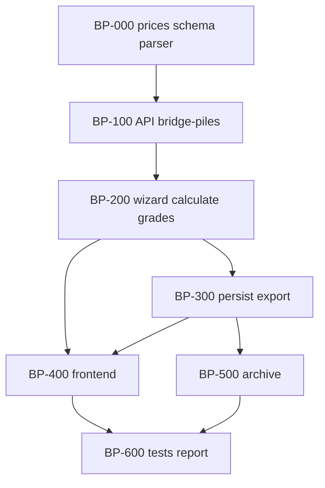

# Plan: КП на мостовые сваи

**Created:** 2026-08-05  
**Status:** ✅ Implemented (2026-08-05)  
**Spec:** [`ai_docs/specs/kp-bridge-piles.md`](../../specs/kp-bridge-piles.md)  
**Idea:** [`ai_docs/ideas/kp-bridge-piles-and-fbs.md`](../../ideas/kp-bridge-piles-and-fbs.md)  
**Templates:** piles ([`2026-07-30-kp-piles.md`](2026-07-30-kp-piles.md)) — UX/domain; marches ([`2026-08-05-kp-stair-marches.md`](2026-08-05-kp-stair-marches.md)) — multi-product wiring + hide preview until confirm

## Goal

Менеджер создаёт **отдельное КП на мостовые сваи** через web-мастер: picker «Мостовые сваи» → текст/фото/ИИ → после «Список верен» preview с классом бетона → client → PDF/XLSX → архив. Цены только из листа «Прайс» мостовых свай. Марка в КП/PDF — как ввёл менеджер; алиасы T/В — только для lookup. Production — только plates.

## Current state

| Компонент | Сейчас |
|-----------|--------|
| Прайс мостовых | Excel есть; таблиц в `pb.db` нет |
| `ProductType` | `plates \| piles \| steps \| marches` |
| Persistence | `kp_plates`, `kp_piles`, `kp_steps`, `kp_marches` |
| Архив | Плиты / Сваи / Ступени / Марши |
| Production | whitelist `plates` |
| UX образец | `PileInputStep` + grade dropdown + «применить ко всем» |

## Architecture decisions

1. **`product_type = "bridge_piles"`**, UI «Мостовые сваи»; immutable after create.
2. **Clone piles** for domain/UX (grade per-line, `/bridge-piles/grades`, PDF with grade).
3. **Clone marches/steps wiring** for multi-product (picker, archive filter, wizard step order, hide preview while `pendingBatchReview`, client-step errors).
4. **Separate tables** — `bridge_pile_prices` (pb.db), `kp_bridge_piles` (plita.db). Never write into `pile_prices` / `kp_piles`.
5. **Import only sheet «Прайс».** Grades from headers: `25` → `B25`, `30` → `B30`. Skip zero/empty cells (no price row).
6. **Alias groups:** `C8-35T4; C8-35В4` → multiple `mark` keys, same `variant_group` + prices. Lookup via any synonym; **display/PDF = manager-typed mark** (no forced canon, no variant dropdown).
7. **Normalize for lookup only:** `C`↔`С`, `B`↔`В`, trim, case. Do not rewrite stored mark to price-list left part.
8. **Available grades per mark** — dropdown only grades with price. Single available → auto-select.
9. **Bulk «применить класс ко всем» (Q12/A):** apply where grade exists; **skip** others + **warning** (do not set unpriced grade).
10. **Default grade:** if mark has one priced grade → that; else prefer `B25` if priced; else unpriced until chosen.
11. **OCR** — dedicated `bridge_pile_format_prompt.py` (clone pile).
12. **No generic framework**; ФБС — next iteration, not this plan.
13. **Shared `kp_id`**; production whitelist unchanged.



## Implementation order

| Phase | Focus | Depends |
|-------|-------|---------|
| 0 | import + `bridge_pile_prices` + `kp_bridge_piles` + parser + pricing + aliases | — |
| 1 | schemas, draft `bridge_piles`, `/bridge-piles`, `/ai`, `/grades` | 0 |
| 2 | wizard + calculate (no wide-plates); bulk skip+warning | 1 |
| 3 | save + PDF/XLSX with grade; mark as typed | 2 |
| 4 | picker + BridgePileInputStep + preview (hide until confirm) | 1 |
| 5 | archive badge/filter/drawer/regen | 3 |
| 6 | E2E + plate/pile/step/march regression + report | all |

## Risks

| Риск | Митигация |
|------|-----------|
| Путаница с обычными `piles` | Отдельный product_type, таблицы, лейбл; regression pile flow |
| Алиасы / кириллица `С` | Import both parts; lookup normalizer; fixtures на T/В и C/С |
| Разреженная матрица B25/B30 | available-grades API; bulk skip+warning; auto single-grade |
| Подмена марки в PDF | Assert display mark == manager input in flow tests |
| Regression multi-product | Existing flow tests each checkpoint |

## Parallelism

| Parallel | After |
|----------|-------|
| PDF/XLSX ∥ frontend shell | API contract ready |
| Archive ∥ frontend polish | save writes `bridge_piles` |

---

## Task list

### Phase 0: Foundation

- [x] **BP-001:** `core/bridge_pile_price_db.py` + `scripts/import_bridge_pile_prices_from_xlsx.py`
  - **Acceptance:** Import **only** sheet «Прайс»; ≥64 marks; grades `B25`/`B30` only where cell > 0; alias rows split on `;` into synonym marks + shared `variant_group`; `get_bridge_pile_price(mark, grade)`; `list_available_grades(mark)`; lookup normalizes C/С, B/В
  - **Verify:** `pytest tests/test_bridge_pile_price_import.py -q`
  - **Files:** `core/bridge_pile_price_db.py`, script, tests
  - **Source:** `банк знаний/Прайс на мостовые сваи от 03.08.2026.xlsx`

- [x] **BP-002:** Schema `kp_bridge_piles` (with `concrete_grade`)
  - **Acceptance:** Idempotent create; columns mirror `kp_piles`
  - **Verify:** `pytest tests/test_kp_bridge_piles_schema.py -q`
  - **Files:** `core/kp_db_schema.py`, tests

- [x] **BP-003:** `core/bridge_pile_line_parser.py` — mark + optional grade + qty; merge mark+grade; keep manager mark spelling
  - **Verify:** `pytest tests/test_bridge_pile_line_parser.py -q`
  - **Files:** `core/bridge_pile_line_parser.py`, tests

- [x] **BP-004:** Pricing path in `commercial_pricing.py` for `product_kind=bridge_pile`
  - **Acceptance:** Lookup via synonyms; unpriced blocks; available grades helper
  - **Verify:** `pytest tests/test_commercial_bridge_pile_pricing.py -q`

- [x] **BP-005:** `bridge_pile_format_prompt.py` + `bridge_pile_text_normalizer.py`
  - **Verify:** unit tests non-empty prompt; normalizer basics

**Checkpoint 0:** import + parser + pricing + schema green

### Phase 1: API / schemas

- [x] **BP-101:** Extend `ProductType` / literals with `bridge_piles`; create draft accepts it
  - **Files:** `app/schemas/commercial.py`, draft create path, types

- [x] **BP-102:** `CommercialBridgePileService` + endpoints `.../bridge-piles`, `.../ai`, `.../grades`
  - **Acceptance:** ingest text/image; AI; grades bulk with **skip+warning** payload for unavailable
  - **Verify:** API unit/integration tests

- [x] **BP-103:** Wire OCR pipeline for bridge piles (verify_policy / parser_gate analogs)
  - **Verify:** smoke or unit on prompt + gate

**Checkpoint 1:** create draft `bridge_piles` → ingest → grades

### Phase 2: Wizard + calculate

- [x] **BP-201:** `commercial_wizard_step_service` — step id `bridge_piles`; hide client errors on input; no wide-plates
- [x] **BP-202:** `commercial_calculation_service` / workflow — branch `bridge_piles`
- [x] **BP-203:** Grades bulk semantics: apply available only; return skipped marks/indices + warning message

**Checkpoint 2:** calculate succeeds on priced lines; blocks unpriced

### Phase 3: Persist + export

- [x] **BP-301:** `kp_persistence_service` / `kp_order_data` / `offers_read` — save `kp_bridge_piles` + meta
- [x] **BP-302:** PDF/XLSX — columns like piles; **mark as typed**; no breakdown/schema
- [x] **BP-303:** Export/archive regen paths include `bridge_piles`

**Checkpoint 3:** save → reopen archive row with lines + files

### Phase 4: Frontend

- [x] **BP-401:** `ProductTypePicker` — card «Мостовые сваи» → `bridge_piles`
- [x] **BP-402:** `BridgePileInputStep` + `KpBridgePilePreviewPanel` + `buildBridgePilePreviewRows` (grade dropdown available-only; **no** variant picker; hide preview until confirm)
- [x] **BP-403:** Wizard wiring: step order, mutations, bulk grade UI shows warning for skips
- [x] **BP-404:** Types / `wizardStepOrder` / API client

**Checkpoint 4:** `npm run typecheck && npm run test` green for new tests

### Phase 5: Archive

- [x] **BP-501:** Badge «Мостовые сваи» + filter option
- [x] **BP-502:** Drawer columns mark/grade/qty/price; regen PDF/XLSX; production button disabled
- [x] **BP-503:** Confirm production candidates exclude `bridge_piles`

### Phase 6: E2E + report

- [x] **BP-601:** `tests/test_commercial_bridge_pile_flow.py` — create → grades → calculate → save
- [x] **BP-602:** Regression: plate/pile/step/march flows
- [x] **BP-603:** Report `ai_docs/develop/reports/2026-08-05-kp-bridge-piles-implementation.md`
- [x] **BP-604:** Update handoff next step → ФБС

---

## Verification (Definition of Done)

```bash
source venv/bin/activate
python scripts/import_bridge_pile_prices_from_xlsx.py \
  "банк знаний/Прайс на мостовые сваи от 03.08.2026.xlsx" --sheet Прайс

pytest tests/ -k "bridge_pile or pile or step or march or wizard" -q
cd frontend && npm run typecheck && npm run test && npm run build
```

Manual smoke: picker → text with `C8-35T1` and alias form → grade → bulk B25 (warning on B30-only rows) → client → PDF shows typed marks → archive badge.

## Out of scope

- ФБС
- Mixing with `piles`
- Variant dropdown / forcing price-list canon mark
- Generic multi-product framework
- Production / СГП
- UI price import
- Sheets other than «Прайс»

## Next

Human reviews PLAN → TASKS already embedded above → IMPLEMENT (TDD, incremental).
