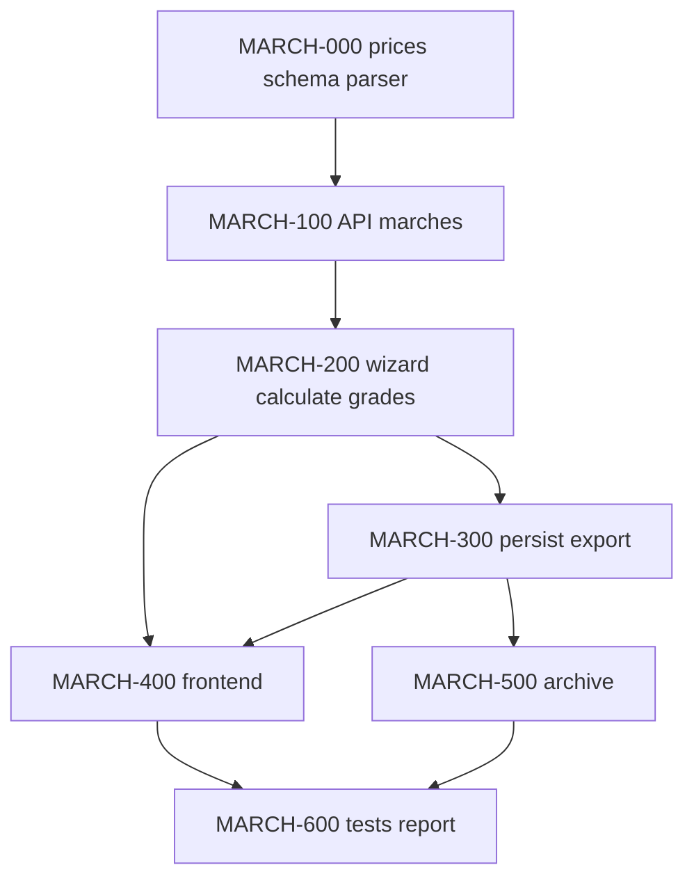

# Plan: КП на лестничные марши (ЛМ)

**Created:** 2026-08-05  
**Status:** ✅ Implemented  
**Spec:** [`ai_docs/specs/kp-stair-marches.md`](../../specs/kp-stair-marches.md)  
**Report:** [`ai_docs/develop/reports/2026-08-05-kp-stair-marches-implementation.md`](../reports/2026-08-05-kp-stair-marches-implementation.md)  
**Templates:** piles ([`2026-07-30-kp-piles.md`](2026-07-30-kp-piles.md)) — grade UI; steps ([`2026-08-05-kp-stair-steps.md`](2026-08-05-kp-stair-steps.md)) — multi-product wiring + hide preview until confirm

## Goal

Менеджер создаёт **отдельное КП на лестничные марши (ЛМ)**: picker «Марши» → текст/фото/ИИ → после «Список верен» preview с **классом бетона** → client → PDF/XLSX → архив. Цены из матрицы `march_prices` (7 марок × 5 классов). Production — только plates.

## Current state

| Компонент | Сейчас |
|-----------|--------|
| Прайс ЛМ | `march_prices` в pb.db — **35** строк (CLI import) |
| `ProductType` | `plates \| piles \| steps \| marches` |
| Persistence | `kp_plates`, `kp_piles`, `kp_steps`, `kp_marches` |
| Архив | Плиты / Сваи / Ступени / Марши |
| Production | whitelist `plates` |

## Architecture decisions

1. **`product_type = "marches"`**, UI «Марши»; immutable after create.
2. **Clone piles for domain/UX** (grade matrix + dropdown + `/marches/grades`).
3. **Clone steps for multi-product wiring** (picker, archive filter, wizard step order, hide preview while `pendingBatchReview`).
4. **`march_prices(mark, concrete_grade, price)`** in `pb.db`; import sheet «Прайс».
5. **Canonical marks** as in price list (incl. `ЛМ 2,8` with comma; `… закладные справа` as full mark). Parser accepts `2.8` → canon `2,8`.
6. **`kp_marches`** like `kp_piles` (with `concrete_grade`).
7. **PDF/XLSX:** short mark + grade columns (pile-like); no breakdown/schema.
8. **No generic framework** this release.
9. **Default grade B25.**

## Implementation order

| Phase | Focus | Depends |
|-------|-------|---------|
| 0 | import + `march_prices` + `kp_marches` + parser + pricing | — |
| 1 | schemas, draft `marches`, `/marches`, `/ai`, `/grades` | 0 |
| 2 | wizard + calculate (no wide-plates) | 1 |
| 3 | save + PDF/XLSX with grade | 2 |
| 4 | picker + MarchInputStep + preview (hide until confirm) | 1 |
| 5 | archive badge/filter/drawer/regen | 3 |
| 6 | E2E + plate/pile/step regression + report | all |

## Risks

| Риск | Митигация |
|------|-----------|
| Парсер `1ЛМ …` vs `ЛМ 2,8` vs «закладные справа» | Fixtures на все 7 SKU; acceptance tests |
| `2,8` / `2.8` | Normalize to price-list comma form |
| Regression steps/piles | Existing flow tests each checkpoint |
| Preview+manager noise | Hide preview until confirm (already pattern on steps) |

## Parallelism

| Parallel | After |
|----------|-------|
| PDF/XLSX ∥ frontend shell | API contract ready |
| Archive ∥ frontend polish | save writes `marches` |

---

## Task list

### Phase 0: Foundation

- [x] **MARCH-001:** `core/march_price_db.py` + `scripts/import_march_prices_from_xlsx.py`
  - **Acceptance:** 7 marks × 5 grades in `march_prices`; `get_march_price`; strip «Лестничные марши»; canon `ЛМ 2,8`
  - **Verify:** `pytest tests/test_march_price_import.py -q`
  - **Files:** `core/march_price_db.py`, script, tests
  - **Source:** `банк знаний/Прайс ЛМ от 03.08.2026.xlsx`

- [x] **MARCH-002:** Schema `kp_marches` (with `concrete_grade`)
  - **Verify:** `pytest tests/test_kp_marches_schema.py -q`
  - **Files:** `core/kp_db_schema.py`

- [x] **MARCH-003:** `core/march_line_parser.py` — mark + optional grade + qty; merge mark+grade; `2.8`→`2,8`
  - **Verify:** `pytest tests/test_march_line_parser.py -q`

- [x] **MARCH-004:** Pricing branch `product_kind=march`
  - **Verify:** `pytest tests/test_commercial_march_pricing.py -q`

- [x] **MARCH-005:** `march_format_prompt.py` + normalizer
  - **Verify:** unit tests

**Checkpoint 0:** import 35 price rows + parser + schema green ✅

---

### Phase 1: API

- [x] **MARCH-101:** Extend `ProductType` / `WizardStepId` / batches — `marches`, `ingest_marches`
- [x] **MARCH-102:** `POST /drafts` with `product_type=marches`
- [x] **MARCH-103:** `CommercialMarchService` + `PATCH .../marches` + `POST .../ai` + `PATCH .../grades` (+ OCR)

**Checkpoint 1:** HTTP create + ingest + grades ✅

---

### Phase 2: Wizard & calculate

- [x] **MARCH-201:** Wizard step service — marches branch; client-step errors hidden on product step
- [x] **MARCH-202:** Calculation service — re-price on grade; block unpriced

**Checkpoint 2:** calculate totals for valid march draft ✅

---

### Phase 3: Persistence & export

- [x] **MARCH-301:** Save `kp_marches` + meta; shared `kp_id`
- [x] **MARCH-302/303:** PDF + XLSX with grade; short mark
- [x] **MARCH-304:** generate-files pdf+xlsx only

**Checkpoint 3:** save → downloadable files ✅

---

### Phase 4: Frontend

- [x] **MARCH-401:** ProductTypePicker «Марши»
- [x] **MARCH-402:** `MarchInputStep` (mirror piles; hide priced preview while `pendingBatchReview`)
- [x] **MARCH-403:** `KpMarchPreviewPanel` — grade dropdown + apply-all
- [x] **MARCH-404:** Wizard progress / result — no schema/breakdown

**Checkpoint 4:** manual UI text → save ✅

---

### Phase 5: Archive

- [x] **MARCH-501:** Archive API filter `marches`
- [x] **MARCH-502:** Badge «Марши», drawer with grade, production disabled
- [x] **MARCH-503:** Regen via `order_data_from_kp_marches`

**Checkpoint 5:** archive + no production leak ✅

---

### Phase 6: Hardening

- [x] **MARCH-601:** E2E `test_commercial_march_flow.py`
- [x] **MARCH-602:** Plate + pile + step regression
- [x] **MARCH-603:** Frontend typecheck/test/build
- [x] **MARCH-604:** Report `ai_docs/develop/reports/2026-08-05-kp-stair-marches-implementation.md`

**Checkpoint 6:** AC done ✅

---

## Out of scope

- ФБС; смешанное КП; generic framework; fuzzy-match; UI price import; production/SGP for marches

## Next

IMPLEMENT complete → optional OCR pipeline dedicated test / ФБС planning.
