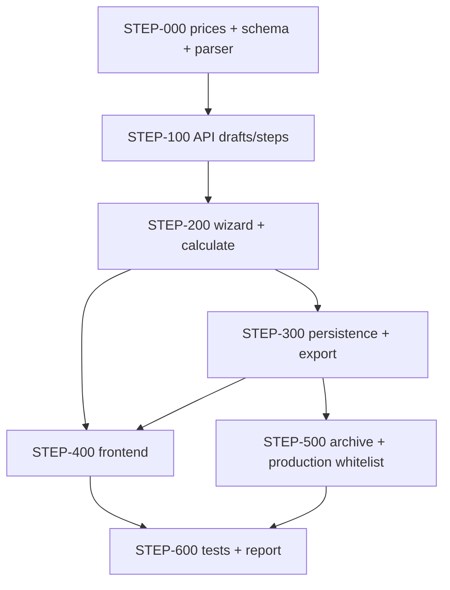

# Plan: КП на лестничные ступени (ЛС)

**Created:** 2026-08-05  
**Status:** ✅ Implemented  
**Spec:** [`ai_docs/specs/kp-stair-steps.md`](../../specs/kp-stair-steps.md)  
**Idea:** [`ai_docs/ideas/kp-stair-steps.md`](../../ideas/kp-stair-steps.md)  
**Template:** pile MVP ([`2026-07-30-kp-piles.md`](2026-07-30-kp-piles.md)) — clone минус grade

## Goal

Менеджер создаёт **отдельное КП на лестничные ступени (ЛС)** через web-мастер: выбор «Ступени» → текст/фото/ИИ → preview (марка + qty + цена) → client → PDF/XLSX → архив. Цены только из `step_prices`. Без UI бетона. Production — только `product_type=plates` (whitelist). ЛМ/ФБС — вне плана.

## Current state

| Компонент | Сейчас |
|-----------|--------|
| Прайс ЛС | ❌ файл в `банк знаний/…xlsx`; нет `step_prices` / import |
| Мастер КП | Плиты + сваи; picker без «Ступени» |
| `ProductType` | `plates \| piles` |
| Persistence | `kp_plates`, `kp_piles`; нет `kp_steps` |
| Архив | Фильтр Плиты/Сваи; нет steps |
| OCR | Plate + pile prompts; step prompt — нет |
| Production | Исключает `piles`; whitelist plates ещё не везде |

## Architecture decisions

1. **`product_type = "steps"`** — immutable после create; UI-лейбл «Ступени».
2. **Wizard step `steps`** — параллельно plates/piles; shared client/result.
3. **Domain first:** `step_price_db` + import + `step_line_parser` + pricing до API.
4. **`kp_steps`** — отдельная таблица **без** `concrete_grade`.
5. **Ключ цены / PDF name:** короткая марка `ЛС…` (без «Лестничные ступени»).
6. **OCR:** тот же pipeline, что у свай; `step_format_prompt.py`.
7. **Нет** `/steps/grades` и grade UI.
8. **Dedup:** одинаковая `mark` → merge qty.
9. **Files:** PDF/XLSX без колонки бетона; без breakdown/schema.
10. **Archive:** badge + filter `all|plates|piles|steps`; drawer без grade; regen PDF/XLSX.
11. **Production:** `COALESCE(product_type,'plates') = 'plates'` (whitelist).
12. **Нумерация:** общий `kp_id`.
13. **Не** строить generic multi-product framework в этом плане.

## Implementation order

| Phase | Focus | Depends on |
|-------|-------|------------|
| 0 | `step_prices` + import, `kp_steps`, parser, pricing | — |
| 1 | Schemas, create draft `steps`, `/steps` + `/steps/ai` | 0 |
| 2 | Wizard step service, calculate (no grade, no wide-plates) | 1 |
| 3 | Save `kp_steps`, PDF/XLSX, generate-files filter | 2 |
| 4 | Frontend picker + StepInputStep + preview | 1 (API) |
| 5 | Archive + production whitelist | 3 |
| 6 | E2E + plate/pile regression + report | all |

## Risks

| Риск | Митигация |
|------|-----------|
| Plate/pile regression | Существующие commercial/pile tests на каждом checkpoint |
| Парсер путает суффиксы (`-1лев` / `-Б-1`) | Fixtures из всех 42 марок прайса |
| Импорт полного имени → ключ | Regex `ЛС\S+` + normalize; тест на строку с лишним пробелом |
| Дублирование workflow | Ветка по `product_type`, зеркало pile service |
| Production leak новых типов | Whitelist `= 'plates'`, не чёрный список |

## Parallelism

| Можно параллельно | После |
|-------------------|-------|
| STEP-301/302 (PDF/XLSX) ∥ STEP-401 (frontend shell) | API contract draft response |
| STEP-501 (archive) ∥ финал frontend | save пишет `product_type=steps` |

---

## Task list

### Phase 0: Foundation

- [x] **STEP-001:** `core/step_price_db.py` + `scripts/import_step_prices_from_xlsx.py`
  - **Acceptance:** Лист «Прайс» → ≥42 `mark` в `step_prices`; ключ = короткая `ЛС…`; `get_step_price`
  - **Verify:** `pytest tests/test_step_price_import.py -q`
  - **Files:** `core/step_price_db.py`, `scripts/import_step_prices_from_xlsx.py`, tests
  - **Fixture source:** `банк знаний/Прайс на лестничные ступени от 03.08.2026.xlsx`

- [x] **STEP-002:** Schema — table `kp_steps` (no concrete_grade)
  - **Acceptance:** `init_kp_schema` создаёт таблицу idempotently
  - **Verify:** `pytest tests/test_kp_steps_schema.py -q`
  - **Files:** `core/kp_db_schema.py`, tests

- [x] **STEP-003:** `core/step_line_parser.py` — mark + qty + merge same mark
  - **Acceptance:** Парсит `ЛС14-1лев 5`, полное имя → `ЛС…`; merge qty; не требует grade
  - **Verify:** `pytest tests/test_step_line_parser.py -q`
  - **Files:** `core/step_line_parser.py`, tests

- [x] **STEP-004:** Pricing branch — `lookup_step_price`, `ensure_order_priced` for `product_kind=step`
  - **Acceptance:** Missing mark → `PriceNotFoundError`
  - **Verify:** `pytest tests/test_commercial_step_pricing.py -q`
  - **Files:** `core/commercial_pricing.py`, tests

- [x] **STEP-005:** `core/step_format_prompt.py` + `step_text_normalizer.py` (mirror piles)
  - **Acceptance:** Prompt описывает форматы ЛС; normalizer multiline
  - **Verify:** unit tests non-empty prompt + normalizer
  - **Files:** `core/step_format_prompt.py`, `core/step_text_normalizer.py`, tests

**Checkpoint 0:** import 42 SKU + parser + pricing + schema green

---

### Phase 1: API & schemas

- [x] **STEP-101:** Extend `ProductType` / `WizardStepId` / batches — `steps`, `ingest_steps`
  - **Acceptance:** OpenAPI + TS types; plates/piles backward compatible
  - **Verify:** schema/wizard tests
  - **Files:** `app/schemas/commercial.py`, `frontend/.../types/commercialOffer.ts`

- [x] **STEP-102:** `POST /commercial/drafts` — `product_type=steps`
  - **Acceptance:** metadata.product_type=steps; immutable; default plates
  - **Verify:** create draft test
  - **Files:** `commercial.py` endpoints, `commercial_workflow_service.py`

- [x] **STEP-103:** `CommercialStepService` + `PATCH .../steps` + `POST .../steps/ai` (+ OCR path)
  - **Acceptance:** Text/image → order_data с `product_kind=step`, ценами; OCR как у свай
  - **Verify:** `pytest tests/test_commercial_step_flow.py -q` (create + update; OCR mocked)
  - **Files:** `commercial_step_service.py`, workflow, draft/OCR pipeline hooks, endpoints

**Checkpoint 1:** HTTP create + steps ingest (text; OCR mocked)

---

### Phase 2: Wizard & calculation

- [x] **STEP-201:** `CommercialWizardStepService` — steps branch
  - **Acceptance:** No wide-plates; `ingest_steps`; step id `steps`
  - **Verify:** wizard step tests
  - **Files:** `commercial_wizard_step_service.py`

- [x] **STEP-202:** `CommercialCalculationService` — steps path
  - **Acceptance:** Re-price by mark; block unpriced; **no grade logic**
  - **Verify:** calculation tests
  - **Files:** `commercial_calculation_service.py`, tests

**Checkpoint 2:** calculate totals for valid step draft

---

### Phase 3: Persistence & export

- [x] **STEP-301:** `KpPersistenceService` — save to `kp_steps`
  - **Acceptance:** `KP_offers` + `kp_steps` + `kp_meta(product_type=steps)`; shared `kp_id`; no plates/piles rows
  - **Verify:** `pytest tests/test_kp_persistence_steps.py -q`
  - **Files:** `kp_persistence_service.py`, `offers_read.py`, `kp_order_data.py`

- [x] **STEP-302:** PDF branch — columns без бетона; name = `ЛС…`
  - **Acceptance:** Row content uses short mark
  - **Verify:** PDF generation test
  - **Files:** `core/commercial_offer.py`

- [x] **STEP-303:** XLSX branch — same columns
  - **Verify:** xlsx test
  - **Files:** `core/commercial_offer_xlsx.py`

- [x] **STEP-304:** `generate-files` — only pdf+xlsx for steps
  - **Verify:** export API test
  - **Files:** `commercial_export_service.py`

**Checkpoint 3:** save step KP → files downloadable

---

### Phase 4: Frontend

- [x] **STEP-401:** `ProductTypePicker` + «Ступени» + store/API wiring
  - **Acceptance:** createDraft(`steps`)
  - **Verify:** component/store tests
  - **Files:** `ProductTypePicker.tsx`, create page, `wizardStepOrder.ts`

- [x] **STEP-402:** `StepInputStep` (mirror `PileInputStep`, без grade)
  - **Acceptance:** text/file/paste/recognize/AI → steps API
  - **Verify:** vitest + manual
  - **Files:** `StepInputStep.tsx`, `commercialOfferApi.ts`, hooks

- [x] **STEP-403:** `KpStepPreviewPanel` — mark | qty | price | sum (**no grade**)
  - **Acceptance:** Missing price highlighted; no grades toolbar/endpoint calls
  - **Verify:** vitest
  - **Files:** `KpStepPreviewPanel.tsx`, `buildStepPreviewRows.ts`

- [x] **STEP-404:** Wizard progress / result — hide schema/breakdown for steps
  - **Verify:** wizard tests
  - **Files:** `CommercialOfferWizard.tsx`, `CalculationResultStep.tsx`, `WizardProgress.tsx`

**Checkpoint 4:** manual UI text → save

---

### Phase 5: Archive & production

- [x] **STEP-501:** Archive API — filter `steps` + list field
  - **Verify:** archive tests
  - **Files:** `archive_service.py`, archive endpoints, `offers_read` filter helpers

- [x] **STEP-502:** Archive UI — badge «Ступени», filter, drawer (no grade), disabled production
  - **Verify:** vitest + manual
  - **Files:** commercial-archive feature

- [x] **STEP-503:** Archive PDF/XLSX regen via `order_data_from_kp_steps`
  - **Verify:** archive service test
  - **Files:** `archive_service.py`, `kp_order_data.py`

- [x] **STEP-504:** Production candidates — whitelist `product_type = 'plates'`
  - **Acceptance:** piles и steps не в wizard производства; будущие типы тоже отсекаются
  - **Verify:** `tests/test_production_step_exclusion.py` + обновить pile exclusion tests если меняется предикат
  - **Files:** `kp_repository.py` / production queries

**Checkpoint 5:** archive filter; no production leak

---

### Phase 6: Hardening

- [x] **STEP-601:** E2E API — text → calculate → generate → save → archive
  - **Verify:** `pytest tests/test_commercial_step_flow.py -q`

- [x] **STEP-602:** Plate + pile regression
  - **Verify:** `pytest tests/test_commercial_web_flow.py tests/test_commercial_pile_flow.py -q`

- [x] **STEP-603:** Frontend `typecheck` + `test` + `build`

- [x] **STEP-604:** Implementation report + AC checklist
  - **Files:** `ai_docs/develop/reports/2026-08-05-kp-stair-steps-implementation.md`

**Checkpoint 6 (Done):** AC-1…AC-18 ✅

---

## Verification checkpoints

| CP | Gate |
|----|------|
| 0 | import/parser/pricing/schema pytest |
| 1 | HTTP create + steps ingest |
| 2 | calculate for steps |
| 3 | save + PDF/XLSX |
| 4 | manual UI happy path |
| 5 | archive + production whitelist |
| 6 | plate/pile regression + report |

## Mapping to AC

| AC | Tasks |
|----|-------|
| AC-1 picker | STEP-401 |
| AC-2 input+OCR | STEP-005, STEP-103, STEP-402 |
| AC-3 parser | STEP-003 |
| AC-4 preview no grade | STEP-403 |
| AC-5 import ≥42 | STEP-001 |
| AC-6 unpriced block | STEP-004, STEP-202 |
| AC-7 client/result files | STEP-201, STEP-304, STEP-404 |
| AC-8 PDF/XLSX short mark | STEP-302, STEP-303 |
| AC-9 save kp_steps | STEP-301 |
| AC-10 archive badge/filter | STEP-501, STEP-502 |
| AC-11 regression | STEP-602 |
| AC-12 production | STEP-504 |
| AC-13 kp_id series | STEP-301 |
| AC-14 drawer | STEP-502 |
| AC-15 archive regen | STEP-503 |
| AC-16 production disabled UI | STEP-502 |
| AC-17 merge mark | STEP-003, STEP-103 |
| AC-18 no grades API | STEP-103, STEP-403 (absence) |

## Out of scope

- ЛМ, ФБС и прочие типы
- Класс бетона UI/API
- Fuzzy-match, смешанное КП
- Generic product framework
- Производство/СГП для ступеней
- UI-импорт прайса, калькулятор веса
- Отдельный счётчик КП / 1С

## Next

После **approve PLAN** → IMPLEMENT с TDD, начиная с **STEP-001** (или `/orchestrate` / `/implement` по желанию).
