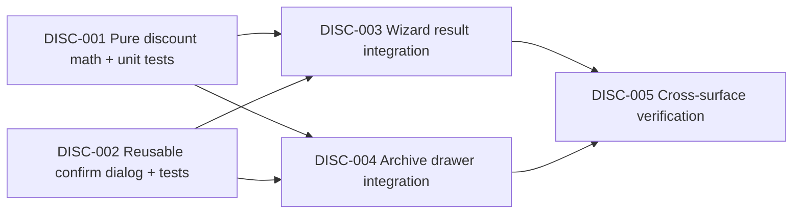

# Plan: КП — целевая сумма и подтверждение скидки >16%

**Created:** 2026-08-05  
**Orchestration:** `orch-2026-08-05-16-46-kp-target-sum-discount`  
**Status:** ✅ Implemented (verification completed 2026-08-05)  
**Spec:** [`ai_docs/specs/kp-target-sum-discount.md`](../../specs/kp-target-sum-discount.md)  
**Idea:** [`ai_docs/ideas/kp-target-sum-discount.md`](../../ideas/kp-target-sum-discount.md)

## Goal

Добавить менеджеру двусторонний черновой ввод «Целевая сумма (₽)» ↔ «Скидка (%)» в результате wizard и drawer архива. Целевая сумма включает доставку, но скидка применяется только к товарным строкам. Применение скидки строго выше 16% требует ввода `ПОДТВЕРЖДАЮ`; сохраняется по уже существующим путям скидки.

## Confirmed decisions

- Процент хранится как единственный persisted value: `discount_percent` в диапазоне 0–100; целевая сумма не попадает в API или БД.
- Расчёт на клиенте; новый backend endpoint и изменение `core/commercial_pricing.calculate_total_cost` не нужны.
- Формула: `target = baseProducts × (1 - discount / 100) + delivery`, где `baseProducts = Σ(unit_price × qty)` без скидки.
- Обратная формула допускается только при `baseProducts > 0` и `delivery ≤ target ≤ baseProducts + delivery`; результат процента округляется до двух знаков.
- После серверного apply итог может расходиться с целью не более чем на 1 ₽; residual/построчная корректировка не создаются.
- `target > max` — ошибка без наценки; `target < delivery` — ошибка; при нулевой товарной базе поле цели disabled.
- Threshold строго `discount > 16`; `16.00` не требует подтверждения, `16.01` требует.
- Черновики синхронизируются на `onChange`; сохранение происходит только по кнопке apply/OK. Отмена модалки возвращает оба черновика к последнему сохранённому проценту и его вычисленной цели.
- Изменение логистики не открывает модалку повторно само по себе.

## Existing paths and dependencies

| Layer | Current source | Planned responsibility |
|---|---|---|
| Pricing contract | `core/commercial_pricing.py:calculate_total_cost` | Reference-only: confirm products are discounted and delivery is added afterwards. |
| Shared frontend math | `frontend/src/features/commercial-offer/lib/discountFromTargetSum.ts` (new) | Constants, parsing-independent pure formulas, boundary validation, rounding, confirmation predicate. |
| Shared confirm UI | `frontend/src/features/commercial-offer/components/HighDiscountConfirmDialog.tsx` (new) | Reusable `Modal` patterned after `ResetConfirmDialog`; local keyword state resets when closed. |
| Wizard surface | `CalculationResultStep.tsx` | Derive product base from `draft.order_data`; derive current delivery from server total and current applied discount; own two drafts, validation, confirmation and cancel rollback. |
| Wizard persistence | `CommercialOfferWizard.tsx` | Existing `updateDraftMeta(discountPercent)` then `calculateDraft` remains the only apply path. |
| Archive surface | `OfferDetailsDrawer.tsx` | Build product base from returned item arrays and use `delivery_service_total_rub`; own identical drafts/confirmation, then call existing PATCH mutation. |
| Archive persistence | `archiveApi.ts` → `useUpdateDiscountMutation` → `PATCH /api/v1/commercial/archive/{kp_id}/discount` | Unchanged API/service/repository path; receives only calculated percentage. |

## Delivery source policy

1. **Archive:** use `offer.delivery_service_total_rub`, already calculated with the same delivery formula as the backend.
2. **Wizard:** `CommercialDraftDetails.totals` has no explicit delivery field. Calculate:
   `delivery = currentTotalWithVat - baseProducts × (1 - currentDiscount / 100)`.
   Clamp only tiny floating-point noise to zero; do not silently mask a materially negative value.
3. **Implementation checkpoint:** validate the derived wizard delivery against a freshly calculated `discount=0` total for (a) zero logistics and (b) non-zero logistics. If the difference exceeds one kopeck, stop and expose/return an explicit delivery component from the existing calculate response rather than shipping an unstable client inference. This is the one meaningful implementation risk left by Q5.

## Implementation order

`DISC-001` is first and blocks both UI surfaces. `DISC-002` can proceed in parallel with `DISC-001` after the shared constants/API shape are agreed. `DISC-003` and `DISC-004` can then proceed in parallel. `DISC-005` is sequential and is the release gate.

## Tasks

### [x] DISC-001 — Shared target-sum math and unit tests

- **Priority:** Critical
- **Complexity:** Moderate
- **Dependencies:** none
- **Files:**
  - `frontend/src/features/commercial-offer/lib/discountFromTargetSum.ts` (new)
  - `frontend/src/features/commercial-offer/lib/discountFromTargetSum.test.ts` (new)
- **Work:**
  - Export `APPROVAL_THRESHOLD_PERCENT = 16`, the exact warning/keyword constants, `roundMoney`, `roundPercent`, `discountPercentFromTargetSum`, `targetSumFromDiscountPercent`, `requiresHighDiscountConfirmation`, and, if useful to prevent duplicated UI arithmetic, `baseProductsTotal`.
  - Keep the module React- and API-free. It receives finite numeric values only; parsing localized input remains at the component boundary.
  - Return typed success/error results for zero base, target below delivery, target above max, and non-finite values.
- **Acceptance criteria:**
  - Standard forward and reverse calculations match within the specified rounding contract.
  - Boundary targets `delivery` and `base + delivery` yield 100% and 0% respectively.
  - Invalid targets never return a percentage.
  - `16` is not high discount; `16.01` is high discount.
- **Verify:**
  - `cd frontend && npm run test -- --run src/features/commercial-offer/lib/discountFromTargetSum.test.ts`

### [x] DISC-002 — Reusable high-discount confirmation dialog

- **Priority:** High
- **Complexity:** Simple
- **Dependencies:** DISC-001
- **Files:**
  - `frontend/src/features/commercial-offer/components/HighDiscountConfirmDialog.tsx` (new)
  - `frontend/src/features/commercial-offer/components/HighDiscountConfirmDialog.test.tsx` (new)
- **Work:**
  - Mirror `ResetConfirmDialog` styling and lifecycle, but use the approved large-discount warning.
  - Accept `open`, `discountPercent`, `isPending`, `onConfirm`, and `onCancel`; keep typed keyword private.
  - Disable confirm until `typedKeyword.trim() === "ПОДТВЕРЖДАЮ"`; close/cancel clears keyword.
- **Acceptance criteria:**
  - Keyword matching, pending state, cancel behavior, and warning text are identical for both consumers.
  - No mutation is embedded in the dialog.
- **Verify:**
  - `cd frontend && npm run test -- --run src/features/commercial-offer/components/HighDiscountConfirmDialog.test.tsx`

### [x] DISC-003 — Wizard target-sum interaction and existing apply path

- **Priority:** Critical
- **Complexity:** Complex
- **Dependencies:** DISC-001, DISC-002
- **Files:**
  - `frontend/src/features/commercial-offer/components/steps/CalculationResultStep.tsx`
  - `frontend/src/features/commercial-offer/components/CommercialOfferWizard.tsx`
  - `frontend/src/features/commercial-offer/components/steps/CalculationResultStep.test.tsx` (new)
- **Work:**
  - Add target-sum draft adjacent to the existing discount field and synchronize drafts on every valid edit without invoking mutations.
  - Derive `baseProducts` from `order_data` `unit_price × qty`; derive delivery by the documented current-total method. Render a clear disabled/error state if no product base or delivery cannot be inferred safely.
  - Keep `CommercialOfferWizard.handleDiscountSubmit` as the sole mutation/calculation path. On apply, pass only the calculated/entered percent.
  - Route high discounts through the shared dialog. On cancel, restore drafts from `draft.metadata.discount_percent` and recomputed target; no network call.
  - After success/hydration, recompute both drafts from server data; report a visible error if returned total differs from the submitted target by more than 1 ₽.
- **Acceptance criteria:**
  - Editing either field updates the other; no request occurs before apply.
  - Invalid target does not invoke `onDiscountSubmit` or open confirmation.
  - A high discount requires the keyword; cancel leaves the persisted discount untouched.
  - Existing logistics update remains functional and updates the displayed target draft after the recalculated draft arrives.
- **Verify:**
  - `cd frontend && npm run test -- --run src/features/commercial-offer/components/steps/CalculationResultStep.test.tsx`
  - Manual: 0% and non-zero logistics wizard cases; change logistics after an approved high discount.

### [x] DISC-004 — Archive target-sum interaction and PATCH reuse

- **Priority:** Critical
- **Complexity:** Moderate
- **Dependencies:** DISC-001, DISC-002
- **Files:**
  - `frontend/src/features/commercial-archive/components/OfferDetailsDrawer.tsx`
  - `frontend/src/features/commercial-archive/components/OfferDetailsDrawer.test.tsx`
- **Work:**
  - Add target-sum draft beside discount; calculate base from the product array applicable to each `product_type` using original `unit_price × qty`, not `discounted_price`.
  - Use `offer.delivery_service_total_rub` directly. Apply via the existing `useUpdateDiscountMutation` and retain its cache invalidation behavior.
  - Reuse the shared dialog and the same validation/error/cancel semantics as the wizard.
  - Reset both drafts when a different offer loads or when its finance/logistics data changes.
- **Acceptance criteria:**
  - All product types supported by the drawer calculate the same way.
  - PATCH request body remains `{ discount }`; no archive backend/API/schema file changes.
  - Cancel and invalid target make no mutation; confirmed high discount mutates exactly once.
- **Verify:**
  - `cd frontend && npm run test -- --run src/features/commercial-archive/components/OfferDetailsDrawer.test.tsx`
  - Manual: archive offer with delivery and archive offer without delivery.

### [x] DISC-005 — Integration, regression, and implementation handoff

- **Priority:** High
- **Complexity:** Moderate
- **Dependencies:** DISC-003, DISC-004
- **Files:**
  - `ai_docs/develop/reports/2026-08-05-kp-target-sum-discount-implementation.md` (new, after implementation)
- **Work:**
  - Run component, feature, typecheck, build, and targeted backend regression suites.
  - Exercise all product types through representative data, boundary and rounding cases, and the existing archive PATCH/wizard calculate paths.
  - Record actual verification output and any known delivery-derivation limitation in the implementation report.
- **Acceptance criteria:**
  - Every spec success criterion has a passing automated test or recorded manual verification.
  - No API/DB migration or PDF/XLSX behavior is introduced.
- **Verify:**
  - `cd frontend && npm run typecheck`
  - `cd frontend && npm run test -- --run src/features/commercial-offer src/features/commercial-archive`
  - `cd frontend && npm run build`
  - `source venv/bin/activate && pytest tests/ -k "discount or commercial_pricing or archive" -q`

## Verification checkpoints

| Checkpoint | Gate |
|---|---|
| CP-1 | Pure math validates all bounds, rounding, and 16/16.01 threshold. |
| CP-2 | Dialog prevents confirm until exact keyword and has no side effects on cancel. |
| CP-3 | Wizard delivery inference agrees with backend totals for zero and positive delivery. |
| CP-4 | Wizard and archive each mutate only through their pre-existing discount path. |
| CP-5 | Typecheck, focused Vitest, full frontend build, and targeted pytest are green. |

## Risks and mitigations

| Risk | Impact | Mitigation |
|---|---|---|
| Wizard has no explicit delivery total | Incorrect reverse percentage | Derive from server total/current percent; validate at CP-3; if mismatch > 0.01 ₽, add an explicit existing-calculate response field only after human approval. |
| Server floating/post-line rounding differs from client | Missed target | Centralize two-decimal percent and money rounding; accept only ≤1 ₽ after response; test realistic multi-line totals. |
| Archive item arrays vary by product type | Base can be zero/incorrect | Use a single array resolver and original `unit_price`, with unit tests for plates, piles, steps, marches, bridge piles, and FBS. |
| Local drafts become stale after mutation/logistics change | UI shows a wrong target | Reset/recompute drafts from fresh query/draft data in `useEffect`; never persist target sum. |
| Confirm bypass through direct `%` entry | Large discount applied silently | Both apply entry points call the one threshold predicate before their existing mutation. |

## Explicit non-goals

- No new endpoint, database column, migration, audit field, manager approval role, or server-side target-sum calculation.
- No modification of delivery pricing, VAT, `calculate_total_cost`, PDF/XLSX, or download permissions.
- No markup/negative discount, per-line discount, or threshold configuration.

## Recommended first task

Start with **DISC-001**. It freezes the rounding and validation contract before two independent UI integrations duplicate it.
