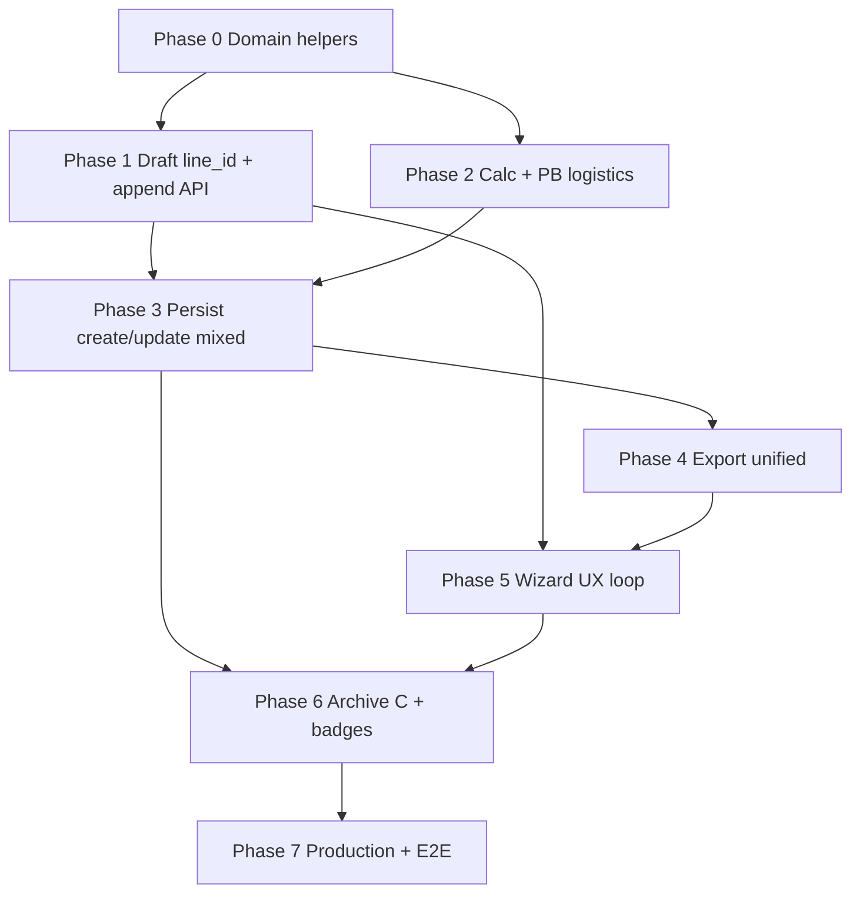

# Plan: КП — несколько наименований (append loop)

**Created:** 2026-08-12  
**Orchestration:** `orch-2026-08-12-14-05-kp-multi-append`  
**Status:** ✅ Completed  
**Report:** [`ai_docs/develop/reports/2026-08-12-kp-multi-nomenclature-append-implementation.md`](../reports/2026-08-12-kp-multi-nomenclature-append-implementation.md)  

**Spec:** [`ai_docs/specs/kp-multi-nomenclature-append.md`](../../specs/kp-multi-nomenclature-append.md)  
**Idea:** [`ai_docs/ideas/kp-multi-nomenclature-append.md`](../../ideas/kp-multi-nomenclature-append.md)  
**Handoff (new window):** [`ai_docs/develop/handoffs/2026-08-12-kp-multi-nomenclature-append.md`](../handoffs/2026-08-12-kp-multi-nomenclature-append.md)

## Goal

Менеджер собирает **одно КП** из нескольких заходов (в т.ч. повтор типа), с общей скидкой, логистикой только по весу ПБ, unified PDF/XLSX при multi/append, и может **дописать уже сохранённое КП** из архива (Q1=C, тот же `kp_id`). Каждый шаг — TDD: сначала failing tests, потом код.

## Confirmed decisions (locked 2026-08-12)

| # | Тема | Решение |
|---|------|---------|
| D1–D5, D7, D9 | UX loop | Sticky header; chronological append; skip client со 2-го; одна скидка; колонка «Тип»; undo last batch + delete line; без лимита |
| Q1 | Resume | **C** — append к сохранённому КП из архива, тот же `kp_id` |
| Q2 | Логистика | Рейсы только от веса `product_type=plates`; non-plates вне `cargo_kg`; поле рейса активно если есть ≥1 plate |
| Q3 | Архив | Несколько бейджей типов; фильтр «содержит тип» |
| Q4 | Export | Unified: `№ \| Тип \| Наименование \| Кол-во \| Цена \| Сумма`; grade в имени |
| Q5 | Identity | `line_id` на каждую строку |
| R1 | PDF versions | **MVP без истории** — последний export = актуальный |
| R2 | Статусы | Append **только** при `status = «в работе»` (узкий safe default; см. codebase) |
| R3 | Mono | Mono без append — **текущий** PDF/XLSX шаблон, без регрессии |
| Prod | Production | Только plate-строки; bot out of scope; без группировки по типу в PDF |

### Residual R2 — codebase note

`kp_meta.status` values: `в работе`, `выполнено`, `отклонено`, `в ожидании`, `На СГП`, `в архиве`.  
Drawer уже ограничивает часть действий статусами `в работе` / `На СГП`. Для append выбираем **только «в работе»** — не трогаем КП на СГП/выполненные.

---

## Summary / approach

1. **Draft model first:** каждая строка `order_data` несёт `product_type` + `line_id` (+ `append_batch_id`); `metadata.append_batches` для undo; `metadata.product_type` = тип **текущего** цикла.
2. **Domain logistics:** расширить `total_order_cargo_weight_kg` фильтром plates-only; pricing/export/archive читают тот же helper.
3. **Wizard loop:** result → «Добавить другое наименование» → picker → input → result (client skip); sticky discount/client.
4. **Persistence:** create как сейчас; update существующего `kp_id` — multi-table sync by `line_id` (не wipe `kp_plates` с production state); `kp_meta.product_type = mixed` при >1 типе.
5. **Export:** ветка unified для multi / post-append; mono one-shot — старые шаблоны.
6. **Archive C:** CTA на карточке → hydrate draft из KP → append → save update → regenerate files; multi badges.

---

## Architecture notes

### Draft

- `order_data[]`: `{ line_id, product_type, append_batch_id?, mark/…, qty, unit_price, … }`
- `metadata.append_batches`: `[{ batch_id, product_type, line_ids[] }]` — только draft/undo, не в PDF
- `metadata.product_type`: текущий цикл ввода (не «тип всего КП»)
- `saved_offer.kp_id` / resume flag: при C-edit draft привязан к существующему `kp_id`

### Logistics (PB-only)

```
plates_kg = total_order_cargo_weight_kg(order_data, product_types={"plates"})
trips = ceil(plates_kg / 18600) if plates_kg > 0 else 0
delivery = trip_cost * trips
```

- Нет plate-строк → delivery = 0, UI рейса disabled (как mono non-plates).
- Не полагаться на `is_pile_order(entire_order)` для mixed — ветвление **per line**.

### Persistence

- **Create:** `KpPersistenceService.save_kp_to_db` → INSERT `KP_offers` + строки в `kp_*` по `line.product_type`, сквозной `position_number`, `kp_meta.product_type` = single | `mixed`.
- **Update (C):** sync by `line_id` across `kp_plates|kp_piles|kp_steps|kp_marches|kp_bridge_piles|kp_fbs`:
  - new `line_id` → INSERT
  - existing → UPDATE fields + `position_number` (**сохранить** DB `id` / production fields у `kp_plates`)
  - removed → DELETE only if plate not in production plan; иначе 409/ошибка
- **Read:** все `kp_*` для `kp_id` → merge + sort by `position_number`; выставить `product_type` на строках.
- Колонка `line_id TEXT` на line-таблицах (миграция в `core/kp_db_schema.py`).

### Archive resume C

```
Archive drawer (status==«в работе») → «Добавить другое наименование»
  → POST/GET hydrate draft from kp_id
  → wizard picker (client skip) → input → result
  → save updates same kp_id + regenerate PDF/XLSX (overwrite paths; no version history)
```

### Export

- Mono, один заход, один тип: текущие `generate_commercial_offer_pdf/xlsx` ветки.
- Multi или любой документ после append/C-edit: unified columns; `format_line_name(item)` с grade в скобках; delivery line только если PB delivery > 0.

### Production

- Candidates / plates: только строки из `kp_plates`; mixed KP с плитами **виден** в production через plate-строки.
- `list_kps_in_production` сейчас фильтрует `product_type = 'plates'` — расширить на `plates|mixed` (или «есть kp_plates»).

---

## Existing paths (grounded)

| Layer | Files |
|-------|-------|
| Schemas | `app/schemas/commercial.py`, `app/schemas/archive.py` |
| Draft / wizard BE | `app/services/commercial_draft_service.py`, `commercial_wizard_step_service.py`, `commercial_workflow_service.py`, `commercial_calculation_service.py`, `commercial_export_service.py` |
| API | `app/api/v1/endpoints/commercial.py`, `app/api/v1/endpoints/archive.py` |
| Domain | `core/cargo_delivery_pricing.py`, `core/commercial_pricing.py`, `core/commercial_offer.py`, `core/commercial_offer_xlsx.py`, `core/kp_plate_weight.py` |
| Persist / read | `core/kp_persistence_service.py`, `core/kp/offers_write.py`, `core/kp/offers_read.py`, `core/kp_db_schema.py`, `app/repositories/kp_repository.py` |
| Archive | `app/services/archive_service.py`, `frontend/.../commercial-archive/*` |
| Wizard FE | `CommercialOfferWizard.tsx`, `CalculationResultStep.tsx`, `ProductTypePicker.tsx`, `wizardDraftStore.tsx`, `wizardStepOrder.ts`, `commercialOfferApi.ts` |
| Tests seed | `tests/test_commercial_*.py`, `tests/test_kp_persistence_*.py`, `tests/test_archive_*.py`, `tests/test_commercial_logistics_cost.py`, FE `*.test.ts(x)` |

---

## Implementation order



---

## Tasks

### Phase 0 — Domain foundation

#### MNA-001 — Plates-only cargo weight helper

- **Priority:** Critical | **Complexity:** Simple | **Deps:** none
- **Files:**
  - `core/cargo_delivery_pricing.py`
  - `tests/test_commercial_logistics_cost.py`
- **TDD:** extend tests first for optional `product_types: set[str] | None = None` (None = all lines, backward compatible); `{"plates"}` sums only plate lines via `item["product_type"]` (default treat missing as plates for legacy mono).
- **Acceptance:**
  - Empty / all non-plates → 0
  - Mixed order → weight == sum of plate lines only
  - Existing callers without filter unchanged
- **Verify:**
  ```bash
  source venv/bin/activate && pytest tests/test_commercial_logistics_cost.py -q
  ```

#### MNA-002 — `format_line_name` (grade in name)

- **Priority:** High | **Complexity:** Simple | **Deps:** none
- **Files:**
  - `core/commercial_line_format.py` (new) **or** small helper in `core/commercial_offer.py` if team prefers co-location — prefer **new tiny module** to avoid PDF bloat
  - `tests/test_commercial_line_format.py` (new)
- **TDD:** mark + optional `(B25)` / pile grade; no grade → mark only; empty mark guarded.
- **Acceptance:**
  - `С30.15-3` + `B25` → `С30.15-3 (B25)`
  - Plate without grade → plate name as today
- **Verify:**
  ```bash
  source venv/bin/activate && pytest tests/test_commercial_line_format.py -q
  ```

---

### Checkpoint CP-0

- [x] `pytest tests/test_commercial_logistics_cost.py tests/test_commercial_line_format.py -q` green
- [x] No wizard/API changes yet

---

### Phase 1 — Draft model: line_id, batches, append/undo/delete

#### MNA-101 — Schema: line fields + append_batches metadata

- **Priority:** Critical | **Complexity:** Moderate | **Deps:** none
- **Files:**
  - `app/schemas/commercial.py`
  - `tests/test_commercial_web_flow.py` (schema round-trip assertions) **or** `tests/test_commercial_draft_append.py` (new)
- **Work:** document `line_id` / `product_type` / `append_batch_id` on order lines; `append_batches` on metadata; optional `resume_kp_id` / keep using `saved_offer.kp_id`.
- **Acceptance:**
  - Pydantic accepts mixed draft payload; rejects nothing legacy-breaking
- **Verify:**
  ```bash
  source venv/bin/activate && pytest tests/ -k "draft_append or CommercialDraftMetadata or line_id" -q
  ```

#### MNA-102 — Ensure line_id on calculate / input paths

- **Priority:** Critical | **Complexity:** Moderate | **Deps:** MNA-101
- **Files:**
  - `app/services/commercial_workflow_service.py` (stamp `line_id` + `product_type` when building order_data)
  - `app/services/commercial_draft_service.py` (if preview builders need stamp)
  - `tests/test_commercial_draft_append.py` (new) / extend `tests/test_commercial_web_flow.py`
- **TDD:** after plates/piles parse+calculate, every line has non-empty `line_id` and correct `product_type`.
- **Acceptance:**
  - Stable ids across recalculate for unchanged lines (or documented remint policy — prefer stable)
- **Verify:**
  ```bash
  source venv/bin/activate && pytest tests/test_commercial_draft_append.py tests/test_commercial_web_flow.py -k "line_id" -q
  ```

#### MNA-103 — API: append batch / undo last batch / delete line

- **Priority:** Critical | **Complexity:** Complex | **Deps:** MNA-102
- **Files:**
  - `app/api/v1/endpoints/commercial.py`
  - `app/services/commercial_workflow_service.py`
  - `tests/test_commercial_draft_append.py`
- **Work:** endpoints e.g.  
  - `POST /drafts/{id}/append/start` (set cycle product_type, clear cycle input, keep header)  
  - `POST /drafts/{id}/append/commit` (merge new priced lines + batch record) — **or** fold commit into existing calculate after cycle input  
  - `POST /drafts/{id}/append/undo-last`  
  - `DELETE /drafts/{id}/lines/{line_id}`  
  Prefer minimal surface: undo + delete explicit; append commit = existing type update paths in `mode=append` **across types** without wiping prior types.
- **Acceptance:**
  - Plates then piles → order_data length sum; chronological order; one discount in meta
  - Undo removes last batch only
  - Delete removes one `line_id`
- **Verify:**
  ```bash
  source venv/bin/activate && pytest tests/test_commercial_draft_append.py -q
  ```

#### MNA-104 — Wizard step service: skip client on cycle ≥2 / resume

- **Priority:** High | **Complexity:** Moderate | **Deps:** MNA-101
- **Files:**
  - `app/services/commercial_wizard_step_service.py`
  - `tests/test_commercial_wizard_step_service.py`
  - `frontend/src/features/commercial-offer/lib/wizardStepOrder.ts`
  - `frontend/src/features/commercial-offer/lib/wizardStepOrder.test.ts`
- **Acceptance:**
  - If `client_name` already set (or `append_batches` non-empty / `resume_kp_id`) → step order skips `client`
  - Mono first cycle unchanged
- **Verify:**
  ```bash
  source venv/bin/activate && pytest tests/test_commercial_wizard_step_service.py -q
  cd frontend && npm run test -- --run src/features/commercial-offer/lib/wizardStepOrder.test.ts
  ```

---

### Checkpoint CP-1

- [x] Append/undo/delete covered by pytest
- [x] Skip-client unit tests green (BE + FE step order)

---

### Phase 2 — Calculation + PB logistics wiring

#### MNA-201 — `calculate_total_cost` / calculation service use plates-only weight

- **Priority:** Critical | **Complexity:** Moderate | **Deps:** MNA-001
- **Files:**
  - `core/commercial_pricing.py`
  - `app/services/commercial_calculation_service.py`
  - `tests/test_commercial_calculation_service.py` (extend) + logistics tests
- **Acceptance:**
  - Mixed plates+piles: delivery from plates kg only
  - Piles-only: delivery 0 even if logistics_cost > 0
  - Plates-only: same as today
- **Verify:**
  ```bash
  source venv/bin/activate && pytest tests/test_commercial_calculation_service.py tests/test_commercial_logistics_cost.py -q
  ```

#### MNA-202 — Mixed draft: discount applies to all lines; validate calculate

- **Priority:** High | **Complexity:** Moderate | **Deps:** MNA-103, MNA-201
- **Files:**
  - `app/services/commercial_calculation_service.py`
  - `app/services/commercial_workflow_service.py` (`calculate_draft`)
  - `tests/test_commercial_draft_append.py`
- **Acceptance:**
  - One `discount_percent` recomputes all lines
  - `is_*_draft(metadata)` must not block mixed calculate (use per-line / “has any plates” helpers)
- **Verify:**
  ```bash
  source venv/bin/activate && pytest tests/test_commercial_draft_append.py tests/test_commercial_calculation_service.py -k "discount or mixed or append" -q
  ```

---

### Checkpoint CP-2

- [x] PB-only delivery + mixed discount tests green
- [ ] Mono piles/plates calc regression: `pytest tests/test_commercial_pile_flow.py tests/test_commercial_web_flow.py -k "calculate" -q`

---

### Phase 3 — Persistence create/update + read merge

#### MNA-301 — Schema migration: `line_id` on kp_* tables + allow `mixed`

- **Priority:** Critical | **Complexity:** Moderate | **Deps:** none (can parallel Phase 1)
- **Files:**
  - `core/kp_db_schema.py`
  - `tests/test_kp_db_schema_boundary.py` / `tests/test_kp_persistence_service.py`
- **Acceptance:**
  - Fresh + migrate path add `line_id` to `kp_plates`, `kp_piles`, `kp_steps`, `kp_marches`, `kp_bridge_piles`, `kp_fbs`
  - `kp_meta.product_type` accepts `mixed`
- **Verify:**
  ```bash
  source venv/bin/activate && pytest tests/test_kp_db_schema_boundary.py tests/test_kp_persistence_service.py -q
  ```

#### MNA-302 — Save create: multi-table + position_number + mixed meta

- **Priority:** Critical | **Complexity:** Complex | **Deps:** MNA-301, MNA-102
- **Files:**
  - `core/kp_persistence_service.py`
  - `core/kp/offers_write.py`
  - `app/repositories/kp_repository.py`
  - `tests/test_kp_persistence_mixed.py` (new)
- **Acceptance:**
  - Plates→Piles order saved into both tables; `position_number` 1..N chronological
  - `kp_meta.product_type == "mixed"` when ≥2 types; single type unchanged
- **Verify:**
  ```bash
  source venv/bin/activate && pytest tests/test_kp_persistence_mixed.py tests/test_kp_persistence_piles.py tests/test_kp_persistence_service.py -q
  ```

#### MNA-303 — Read merge by position_number for mixed

- **Priority:** Critical | **Complexity:** Moderate | **Deps:** MNA-302
- **Files:**
  - `core/kp/offers_read.py`
  - `tests/test_kp_persistence_mixed.py`
  - `app/services/archive_service.py` (order_data assembly if separate)
- **Acceptance:**
  - `get_kp_by_id` returns chronological lines with `product_type` set
  - Archive details cargo weight uses plates-only helper
- **Verify:**
  ```bash
  source venv/bin/activate && pytest tests/test_kp_persistence_mixed.py tests/test_archive_service.py -k "mixed or cargo or product_type" -q
  ```

#### MNA-304 — Update existing kp_id (sync by line_id); status gate «в работе»

- **Priority:** Critical | **Complexity:** Complex | **Deps:** MNA-302, MNA-303
- **Files:**
  - `core/kp/offers_write.py` / `core/kp_persistence_service.py` (`update_kp_from_order_data`)
  - `app/services/commercial_workflow_service.py` (`save_offer` branch if `saved_offer.kp_id`)
  - `app/api/v1/endpoints/commercial.py` if needed
  - `tests/test_kp_persistence_mixed.py`, `tests/test_commercial_draft_append.py`
- **Acceptance:**
  - Append save keeps same `kp_id`; files regenerated (R1 overwrite)
  - Reject append/update if status ≠ `в работе`
  - Existing `kp_plates.id` preserved when `line_id` matches (production-safe)
- **Verify:**
  ```bash
  source venv/bin/activate && pytest tests/test_kp_persistence_mixed.py -k "update or sync or status" -q
  ```

---

### Checkpoint CP-3

- [x] Create mixed + update same kp_id + read merge tests green
- [x] Mono persistence regression: `pytest tests/test_kp_persistence_*.py -q`

---

### Phase 4 — Export unified

#### MNA-401 — Detect multi/append document mode; mono regression

- **Priority:** Critical | **Complexity:** Moderate | **Deps:** MNA-002
- **Files:**
  - `core/commercial_offer.py`
  - `core/commercial_offer_xlsx.py`
  - `tests/test_kp_generation.py` (extend) / `tests/test_commercial_export_mixed.py` (new)
- **Acceptance:**
  - Mono one-type one-shot: existing column layout unchanged (R3)
  - Multi: unified headers; «Тип» column; names via `format_line_name`; chronological; no type grouping
  - Delivery row only if PB delivery > 0
- **Verify:**
  ```bash
  source venv/bin/activate && pytest tests/test_commercial_export_mixed.py tests/test_kp_generation.py -q
  ```

#### MNA-402 — Export service + archive regen use same rules

- **Priority:** High | **Complexity:** Moderate | **Deps:** MNA-401, MNA-201
- **Files:**
  - `app/services/commercial_export_service.py`
  - `app/services/archive_service.py`
  - `tests/test_archive_endpoints.py` / export mixed tests
- **Acceptance:**
  - Wizard generate-files and archive download/regen agree on mixed layout + PB logistics
- **Verify:**
  ```bash
  source venv/bin/activate && pytest tests/test_commercial_export_mixed.py tests/test_archive_pile.py tests/test_archive_endpoints.py -k "pdf or xlsx or regenerat or mixed" -q
  ```

---

### Checkpoint CP-4

- [x] Mono PDF snapshot/behavior tests still pass
- [x] Mixed export assertions green

---

### Phase 5 — Frontend wizard loop

#### MNA-501 — Result: «Тип» column + append CTA + undo/delete

- **Priority:** Critical | **Complexity:** Complex | **Deps:** MNA-103, MNA-104
- **Files:**
  - `frontend/src/features/commercial-offer/components/steps/CalculationResultStep.tsx`
  - `frontend/src/features/commercial-offer/components/steps/CalculationResultStep.test.tsx`
  - `frontend/src/features/commercial-offer/api/commercialOfferApi.ts`
  - `frontend/src/features/commercial-offer/types/commercialOffer.ts`
- **Acceptance:**
  - Column «Тип» visible when >1 type or any append
  - CTA «Добавить другое наименование»
  - Undo last batch / delete line call API and refresh draft
  - Trip cost disabled when no plate lines
- **Verify:**
  ```bash
  cd frontend && npm run test -- --run src/features/commercial-offer/components/steps/CalculationResultStep.test.tsx
  ```

#### MNA-502 — Wizard orchestration: loop + sticky header + skip client

- **Priority:** Critical | **Complexity:** Complex | **Deps:** MNA-501, MNA-104
- **Files:**
  - `frontend/src/features/commercial-offer/components/CommercialOfferWizard.tsx`
  - `frontend/src/features/commercial-offer/store/wizardDraftStore.tsx`
  - `frontend/src/features/commercial-offer/store/wizardDraftStore.test.tsx`
  - `frontend/src/features/commercial-offer/components/ProductTypePicker.tsx` (only if needed for re-entry)
- **Acceptance:**
  - Append → picker → input → result; client skipped; discount retained
  - «Создать новое КП» still full reset
- **Verify:**
  ```bash
  cd frontend && npm run test -- --run src/features/commercial-offer/store/wizardDraftStore.test.tsx
  cd frontend && npm run typecheck
  ```

---

### Checkpoint CP-5

- [x] `cd frontend && npm run test -- --run src/features/commercial-offer` focused green
- [x] `npm run typecheck` green

---

### Phase 6 — Archive resume C + multi badges

#### MNA-601 — Hydrate draft from saved KP (status «в работе» only)

- **Priority:** Critical | **Complexity:** Complex | **Deps:** MNA-303, MNA-304
- **Files:**
  - `app/api/v1/endpoints/archive.py` and/or `commercial.py`
  - `app/services/archive_service.py` / `commercial_workflow_service.py`
  - `tests/test_archive_endpoints.py` / `tests/test_commercial_draft_append.py`
- **Acceptance:**
  - Endpoint loads order_data+header into new/existing draft with `saved_offer.kp_id`
  - Non-`в работе` → 409/400
- **Verify:**
  ```bash
  source venv/bin/activate && pytest tests/test_archive_endpoints.py tests/test_commercial_draft_append.py -k "resume or hydrate or append" -q
  ```

#### MNA-602 — Archive UI: multi badges + filter «contains type» + CTA

- **Priority:** Critical | **Complexity:** Moderate | **Deps:** MNA-601
- **Files:**
  - `frontend/src/features/commercial-archive/components/ArchiveOfferList.tsx`
  - `frontend/src/features/commercial-archive/components/OfferDetailsDrawer.tsx`
  - `frontend/src/features/commercial-archive/types/archive.ts`
  - `app/schemas/archive.py` + list serializer (`product_types: list[str]`)
  - Matching `*.test.tsx` / `tests/test_archive_service.py`
- **Acceptance:**
  - N badges for types present
  - Filter plates shows mixed-with-plates
  - CTA only if `status === "в работе"`
- **Verify:**
  ```bash
  source venv/bin/activate && pytest tests/test_archive_service.py -k "badge or product_type or mixed or filter" -q
  cd frontend && npm run test -- --run src/features/commercial-archive
  ```

---

### Checkpoint CP-6

- [x] Resume C API + UI tests green
- [x] Badge/filter tests green

---

### Phase 7 — Production safety + E2E gate

#### MNA-701 — Production candidates include mixed-with-plates; plates only

- **Priority:** High | **Complexity:** Moderate | **Deps:** MNA-302
- **Files:**
  - `app/repositories/kp_repository.py` (`list_kps_in_production`)
  - `tests/test_production_fbs_exclusion.py` pattern → `tests/test_production_mixed_inclusion.py` (new)
- **Acceptance:**
  - `mixed` with plates appears; non-plate-only KP still excluded; only `kp_plates` rows used
- **Verify:**
  ```bash
  source venv/bin/activate && pytest tests/test_production_mixed_inclusion.py tests/test_production_fbs_exclusion.py tests/test_production_bridge_pile_exclusion.py -q
  ```

#### MNA-702 — E2E flow tests + mono regression suite

- **Priority:** Critical | **Complexity:** Complex | **Deps:** all prior
- **Files:**
  - `tests/test_commercial_multi_append_flow.py` (new)
  - touch report only after impl: `ai_docs/develop/reports/2026-08-12-kp-multi-nomenclature-append-implementation.md`
- **Acceptance (SC mapping):**
  - SC-1..SC-9 from spec covered by automated tests where feasible
  - Flow: plates→piles→plates create; append to saved; export; undo/delete; PB logistics; mono unchanged
- **Verify:**
  ```bash
  source venv/bin/activate && pytest tests/test_commercial_multi_append_flow.py tests/test_commercial_draft_append.py tests/test_commercial_export_mixed.py tests/test_kp_persistence_mixed.py -q
  source venv/bin/activate && pytest tests/ -k "commercial or wizard or kp_persistence or archive" -q
  cd frontend && npm run typecheck && npm run test -- --run src/features/commercial-offer src/features/commercial-archive && npm run build
  ```

---

### Checkpoint CP-7 (release gate)

- [x] Full Verify block above green
- [ ] Manual smoke: archive «в работе» → append → download PDF (unified) → check trips from plates only
- [x] Spec success criteria SC-1..SC-9 checked off in implementation report

---

## Task checklist (SDD)

- [x] **Task: MNA-001** Plates-only cargo weight — ✅ Completed  
  - Acceptance: filter `{"plates"}`; legacy None unchanged  
  - Verify: `pytest tests/test_commercial_logistics_cost.py -q`  
  - Files: `core/cargo_delivery_pricing.py`, `tests/test_commercial_logistics_cost.py`

- [x] **Task: MNA-002** format_line_name — ✅ Completed  
  - Acceptance: grade in parentheses when present  
  - Verify: `pytest tests/test_commercial_line_format.py -q`  
  - Files: `core/commercial_line_format.py`, `tests/test_commercial_line_format.py`

- [x] **Task: MNA-101** Schema append_batches / line fields — ✅ Completed  
  - Acceptance: metadata + lines round-trip  
  - Verify: `pytest tests/ -k "draft_append or line_id" -q`  
  - Files: `app/schemas/commercial.py`, tests

- [x] **Task: MNA-102** Stamp line_id + product_type — ✅ Completed  
  - Acceptance: every priced line has ids  
  - Verify: `pytest tests/test_commercial_draft_append.py -k line_id -q`  
  - Files: `commercial_workflow_service.py`, `commercial_draft_service.py`, tests

- [x] **Task: MNA-103** Append / undo / delete API — ✅ Completed  
  - Acceptance: chronological merge; undo last; delete by line_id  
  - Verify: `pytest tests/test_commercial_draft_append.py -q`  
  - Files: `commercial.py` endpoints, `commercial_workflow_service.py`, tests

- [x] **Task: MNA-104** Skip client cycle ≥2 — ✅ Completed  
  - Acceptance: step order omits client when header sticky  
  - Verify: wizard step pytest + `wizardStepOrder.test.ts`  
  - Files: `commercial_wizard_step_service.py`, `wizardStepOrder.ts`, tests

- [x] **Task: MNA-201** PB-only in pricing/calc — ✅ Completed  
  - Acceptance: mixed delivery from plates only  
  - Verify: calculation + logistics pytest  
  - Files: `commercial_pricing.py`, `commercial_calculation_service.py`, tests

- [x] **Task: MNA-202** Mixed calculate + shared discount — ✅ Completed  
  - Acceptance: one discount recomputes all  
  - Verify: append/discount pytest  
  - Files: calculation + workflow, tests

- [x] **Task: MNA-301** DB line_id + mixed meta — ✅ Completed  

  - Acceptance: migration + mixed allowed  
  - Verify: schema/persistence pytest  
  - Files: `kp_db_schema.py`, tests

- [x] **Task: MNA-302** Multi-table create — ✅ Completed  
  - Acceptance: lines split by type; positions chronological; mixed meta  
  - Verify: `pytest tests/test_kp_persistence_mixed.py -q`  
  - Files: `kp_persistence_service.py`, `offers_write.py`, `kp_repository.py`, tests

- [x] **Task: MNA-303** Read merge mixed — ✅ Completed  
  - Acceptance: sort by position_number; product_type on lines  
  - Verify: persistence mixed + archive cargo tests  
  - Files: `offers_read.py`, `archive_service.py`, tests

- [x] **Task: MNA-304** Update kp_id sync + status gate — ✅ Completed  
  - Acceptance: same kp_id; only «в работе»; preserve plate row ids  
  - Verify: update/sync/status pytest  
  - Files: offers_write/persistence, workflow save, tests

- [x] **Task: MNA-401** Unified export + mono R3 — ✅ Completed  
  - Acceptance: multi unified; mono unchanged  
  - Verify: export mixed + kp_generation pytest  
  - Files: `commercial_offer.py`, `commercial_offer_xlsx.py`, tests

- [x] **Task: MNA-402** Export service + archive regen — ✅ Completed  
  - Acceptance: wizard/archive agree  
  - Verify: export + archive pytest  
  - Files: `commercial_export_service.py`, `archive_service.py`, tests

- [x] **Task: MNA-501** Result UI Тип + CTA + undo/delete — ✅ Completed  
  - Acceptance: UI actions wired; trip field gated  
  - Verify: CalculationResultStep vitest  
  - Files: CalculationResultStep, api, types, tests

- [x] **Task: MNA-502** Wizard loop sticky — ✅ Completed  
  - Acceptance: append cycle skip client; reset still works  
  - Verify: wizardDraftStore vitest + typecheck  
  - Files: CommercialOfferWizard, wizardDraftStore, tests

- [x] **Task: MNA-601** Hydrate from archive KP — ✅ Completed  
  - Acceptance: draft with kp_id; reject non-в работе  
  - Verify: archive/append pytest  
  - Files: archive/commercial endpoints + services, tests

- [x] **Task: MNA-602** Multi badges + filter + CTA — ✅ Completed  
  - Acceptance: N badges; contains-type filter; CTA gated  
  - Verify: archive service pytest + commercial-archive vitest  
  - Files: ArchiveOfferList, OfferDetailsDrawer, archive schema, tests

- [x] **Task: MNA-701** Production mixed-with-plates — ✅ Completed  
  - Acceptance: mixed visible; non-plates excluded  
  - Verify: production inclusion/exclusion pytest  
  - Files: `kp_repository.py`, new production test

- [x] **Task: MNA-702** E2E + regression gate — ✅ Completed  
  - Acceptance: SC-1..SC-9 evidenced  
  - Verify: multi flow pytest + broad commercial/archive + FE typecheck/test/build  
  - Files: `tests/test_commercial_multi_append_flow.py`, `core/kp_order_data.py`, `app/services/commercial_draft_service.py`, `app/services/commercial_workflow_service.py`  
  - Tests: 112/112 core gate (FE 121 separate)

---

## Risks and mitigations

| Risk | Impact | Mitigation |
|------|--------|------------|
| Wipe `kp_plates` on update destroys production state | High | Sync by `line_id`; preserve DB ids; status gate «в работе» |
| `is_*_order(entire_order)` breaks mixed export/calc | High | Per-line `product_type`; document mode detector for unified |
| Existing type update APIs wipe other types | High | Cross-type append must merge, not replace whole `order_data` |
| Archive filter SQL `product_type = ?` misses mixed | Med | Filter = meta type match **or** presence in line tables / `product_types` list |
| FE assumes single `productType` for step order | Med | Cycle product type separate from sticky header; skip-client helper |
| PDF/XLSX layout regressions for mono | High | Explicit R3 tests before unified branch |
| Large drafts (10+ OCR cycles) | Med | Batches metadata only; no PDF segments; watch draft payload size in E2E |

---

## Explicit out of scope

- Вес/доставка non-plates в cargo_kg  
- Сегменты / «Этаж N» / группировка по типу в PDF  
- Разные скидки по заходам  
- История версий PDF (R1)  
- Append для статусов ≠ «в работе» (R2)  
- Production/СГП для non-plates  
- Bot path (`bot_archived`)  
- Generic multi-product framework сверх append  
- Новые npm/pip зависимости  

---

## Recommended first task

Start **MNA-001** (PB cargo filter) and **MNA-002** (`format_line_name`) in parallel — pure domain, unlocks pricing and export. Then **MNA-101 → MNA-103** for draft append TDD spine.

## Suggested agent split

| Parallel-safe | Sequential |
|---------------|------------|
| MNA-001 ∥ MNA-002 ∥ MNA-301 | MNA-103 after MNA-102 |
| MNA-104 ∥ MNA-201 after MNA-001 | MNA-304 after MNA-302/303 |
| MNA-501 after API contract frozen | MNA-601/602 after persist update |
| | MNA-702 last |

Execute: `/orchestrate execute orch-2026-08-12-14-05-kp-multi-append`
