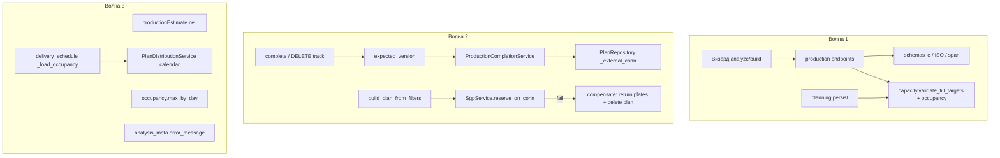

# Plan: Стабилизация модуля Производство (аудит 2026-08-12)

**Spec:** [`ai_docs/specs/stabilizaciya-production-audit-2026-08-12.md`](../../specs/stabilizaciya-production-audit-2026-08-12.md)  
**Источник:** [`ai_docs/develop/audits/2026-08-12-production-module-audit.md`](../audits/2026-08-12-production-module-audit.md)  
**Канвас объёма:** [production-audit-fix-size](/home/roman/.cursor/projects/home-roman-project/canvases/production-audit-fix-size.canvas.tsx)  
**Статус:** READY FOR REVIEW  
**Фаза SDD:** PLAN  
**Поставка:** три последовательных PR = волны 1 → 2 → 3. Не начинать волну N+1, пока checkpoint волны N зелёный.

## Overview

Закрыть рассинхрон учёта и плана в модуле Производство: один occupancy-aware валидатор fill, живой `expected_version`, атомарное завершение дня, компенсация при ошибке резерва СГП, честные цифры в UI и графике поставки. God-модули не режем. Схема SQLite не меняется.

## Decisions locked

| # | Решение | Почему |
|---|---------|--------|
| D1 | Scope = волны 1–3 | Подтверждено 2026-08-14 |
| D2 | Повторный complete → **409** `day_already_completed` | Не маскировать повтор; код уже есть на remove_track |
| D3 | `expected_version` **optional**; если передан — соблюдаем | Не ломать клиентов без поля |
| D4 | **S2 = одна sqlite tx.** **A3 = compensating delete** плана + `return_plan_plates_to_production` при ошибке СГП | Одна tx на complete реальна (completion + repo). Протаскивать conn через `persist` + `PlanPersistPort` + adapter = XL и регрессия build. Паттерн компенсации уже есть в `planning.persist` |
| D5 | ISO-даты; span `from..to` и min..max fill ≤ **366**; `min_fill` не дальше **today+366**. **Нет пола «сегодня−30»** | Пол −30 ломает фикстуры (2026-04-21) и дозаполнение прошедших дней. DoS закрывается span/горизонтом вперёд |
| D6 | Оценка дней = **`Math.ceil` / `math.ceil`** | Канон — backend |
| D7 | A4 = `_load_occupancy` → `PlanDistributionService.get_global_calendar_info` | Тот же `days_info.max` с overrides. `plan_calendar.py` не удаляем |
| D8 | **Три PR** по волнам | Волна 2 рискованная; 1 и 3 не должны ждать |
| D9 | Текущий `plita.db` = тестовые данные | Нет миграций/dual-read старых планов. Pytest и FE-контракт остаются |

## Architecture



**Ключевые точки сейчас:**
- Два валидатора: [`core/production/capacity.py`](../../../core/production/capacity.py) vs [`core/production/planning.py`](../../../core/production/planning.py) `validate_fill_targets`
- Analyze без occupancy: [`production_service.py`](../../../app/services/production_service.py) ~157–161
- Complete без guard / отдельный mark: [`production_completion_service.py`](../../../app/services/production_completion_service.py) `send_to_sgp`; [`production_service.py`](../../../app/services/production_service.py) `complete_day`
- SGP после persist: [`production_service.py`](../../../app/services/production_service.py) `build_plan_from_filters` ~289–325
- FE шлёт version, schema дропает: [`productionApi.ts`](../../../frontend/src/features/production/api/productionApi.ts); [`CompleteProductionDayRequest`](../../../app/schemas/production.py)
- Delivery calendar: [`delivery_schedule_service.py`](../../../app/services/delivery_schedule_service.py) `_load_occupancy` → `plan_calendar.get_global_calendar_info` (`max` всегда 5)
- Alert подложек уже есть: [`SubstrateRecommendationsBlock`](../../../frontend/src/features/production/components/create-plan-wizard/SubstrateRecommendationsBlock.tsx); wizard берёт только HTTP error, не `optimization_status=error`

## Dependency graph

```
T1 red tests W1
 ├── T2 API guards          ← можно параллельно с T3 после T1
 └── T3 one validator
      └── T4 analyze occupancy
           └── Checkpoint W1 / PR1
                └── T5 red tests W2
                     ├── T6 expected_version     ← параллельно T7
                     ├── T7 complete guards
                     └── T8 repo _external_conn
                          └── T9 complete one tx   ← после T7+T8
                     └── T10 SGP compensate        ← после T5; не зависит от T8
                          └── Checkpoint W2 / PR2
                               ├── T11 ceil         ← параллельно T12–T14
                               ├── T12 occupancy max
                               ├── T13 substrate error
                               └── T14 delivery calendar
                                    └── T15 regression gate / PR3
```

## Parallelism

- После T1: T2 и T3 можно параллелить (разные файлы), T4 ждёт T3.
- После T5: T6, T7, T8, T10 параллельны; T9 ждёт T7+T8.
- Волна 3: T11–T14 параллельны после checkpoint W2.
- Волны 1/2/3 **не** параллелить между собой в одном PR.

## Risks and Mitigations

| Risk | Impact | Mitigation |
|------|--------|------------|
| Occupancy в analyze меняет happy-path, где fill = day_max при уже занятых слотах | High | T1 красный тест на занятость; существующий `test_analyze_substrates_happy_path` на пустом календаре |
| `_external_conn` на `save` сломает автокоммит существующих вызовов | High | `own_conn` паттерн; без conn поведение 1:1; тесты `test_plan_repository.py` |
| Компенсация A3: crash между commit плана и compensate | Med | Лог + residual в спеке; не XL-протаскивание persist port в этом срезе |
| Span 366 ломает e2e с широким календарём | Med | T2 гоняет существующие `day-capacity` тесты; диапазоны в фикстурах обычно месяц |
| A4: mock path `get_global_calendar_info` в delivery тестах | Med | Обновить патч на новый импорт; форма `days_info` та же |
| FE ceil меняет цифру в визарде | Low | Явный тест 38.3→1; продукт-ожидание — как бэк |

---

## Task List

### Phase 1 / PR1 — вход и один валидатор

#### Task 1: Красные тесты A1 occupancy + API guards

**Description:** Новый `tests/test_production_fill_integrity.py`: (1) день occupancy=3, max=5, fill tracks=4 → analyze сейчас 200, тест ждёт 422 (красный до T4); tracks=2 → 200. (2) API: `day-capacity` span >366 → 422; `tracks=6` → 422; `limit=10**9` → 422; path `/days/foo` → 422. Не чинить прод-код.

**Acceptance criteria:**
- [ ] Тест occupancy-over-free падает на текущем коде
- [ ] Тесты span/cap/limit/ISO написаны и падают или ждут T2

**Verification:**
- [ ] `.venv/bin/pytest tests/test_production_fill_integrity.py -q` — ожидаемые fail, не error импорта

**Dependencies:** None  
**Files:** `tests/test_production_fill_integrity.py`  
**Scope:** S

#### Task 2: Schema/Query guards — span, ISO, cap 5, limit

**Description:** `FillTargetItem.date` через `date` / ISO; `tracks` и `SaveDayCapacityRequest.max_tracks` `le=TRACKS_PER_DAY_HARD_CAP`; `GET /day-capacity` отказ если `(to-from).days > 365`; `GET /candidates` `Query(ge=1, le=500)`; path `{target_date}` / `{date}` — `date` (FastAPI) или `fromisoformat` → 422. Горизонт fill: max(date)−min(date) ≤ 366 и min_fill ≤ today+366. Без пола в прошлое.

**Acceptance criteria:**
- [ ] Кейсы span/cap/limit/ISO из T1 зелёные
- [ ] Существующие `test_production_api_integration` day-capacity/analyze не красные из‑за −30

**Verification:**
- [ ] `.venv/bin/pytest tests/test_production_fill_integrity.py tests/test_production_api_integration.py -q`

**Dependencies:** T1  
**Files:** `app/schemas/production.py`, `app/api/v1/endpoints/production.py`  
**Scope:** S

#### Task 3: Один `validate_fill_targets` с occupancy

**Description:** В `core.production.capacity.validate_fill_targets` добавить `occupancy` (default `{}`): лимит = `day_free_tracks`. Сообщение «свободно N, запрошено M». `planning.validate_fill_targets` удалить; `persist` вызывает capacity. Обновить unit-тесты capacity/planning.

**Acceptance criteria:**
- [ ] В `planning.py` нет своей `validate_fill_targets`
- [ ] Unit: occupancy 3, max 5, tracks 3 OK; tracks 4 → `PlanBuildError`

**Verification:**
- [ ] `.venv/bin/pytest tests/test_production_capacity.py tests/test_core_production_planning.py tests/test_production_capacity_service.py -q`

**Dependencies:** T1  
**Files:** `core/production/capacity.py`, `core/production/planning.py`, `core/production/__init__.py`, `tests/test_production_capacity.py`, `tests/test_core_production_planning.py`  
**Scope:** M

#### Task 4: Analyze вызывает shared validate с occupancy

**Description:** `ProductionCapacityService.validate_fill_targets` принимает occupancy и прокидывает в core. `analyze_substrates` передаёт `get_global_occupancy()` (сейчас occupancy грузится только для deficit). Ручной парсинг дат в analyze оставить минимальным или опереться на уже провалидированную schema.

**Acceptance criteria:**
- [ ] Occupancy-кейс T1 зелёный: tracks=4 → analyze 422; tracks=2 → 200
- [ ] Happy-path analyze на пустом календаре зелёный

**Verification:**
- [ ] `.venv/bin/pytest tests/test_production_fill_integrity.py tests/test_production_api_integration.py tests/test_production_podlozhki_e2e.py -q`

**Dependencies:** T3  
**Files:** `app/services/production_capacity_service.py`, `app/services/production_service.py`  
**Scope:** S

### Checkpoint: Wave 1 / PR1

- [ ] Analyze и build отвергают fill сверх свободных слотов одним текстом
- [ ] Гигантский диапазон дат / tracks=6 / limit=1e9 / не-ISO path → 422
- [ ] Команды T2+T4 зелёные
- [ ] Review человека перед волной 2

---

### Phase 2 / PR2 — целостность учёта

#### Task 5: Красные тесты complete 409 / version / SGP compensate

**Description:** В `tests/test_production_fill_integrity.py` (или рядом): повторный complete → 409, `completed_plates` не растут; `expected_version` stale на complete → 409, КП не списаны; stale на DELETE track → 409, дорожка на месте; mock `reserve_on_conn` raise после успешного build → плана нет, плиты не «в плане». До impl — красные.

**Acceptance criteria:**
- [ ] Четыре кейса описаны и падают на текущем коде (кроме тех, что уже 409 случайно)

**Verification:**
- [ ] `.venv/bin/pytest tests/test_production_fill_integrity.py -q -k "complete or sgp or expected_version"`

**Dependencies:** Checkpoint W1  
**Files:** `tests/test_production_fill_integrity.py`  
**Scope:** S

#### Task 6: Прокинуть `expected_version` в complete и DELETE track

**Description:** Поле `expected_version: int | None` в `CompleteProductionDayRequest`. Query `expected_version: int | None` на `remove_track_from_plan`. Прокинуть в `ProductionService.complete_day` / `remove_track` → уже существующий параметр `PlanDistributionService.remove_track_from_plan` и `mark_day_completed`. FE уже шлёт поле — сверить имена.

**Acceptance criteria:**
- [ ] Stale version complete → 409, без списания (после T9; после этой задачи mark уже может 409, но КП ещё спишутся — допустимо до T9)
- [ ] Stale DELETE track → 409, дорожка на месте

**Verification:**
- [ ] `.venv/bin/pytest tests/test_production_api_integration.py tests/test_production_fill_integrity.py -q -k "version or remove_track or complete"`

**Dependencies:** T5  
**Files:** `app/schemas/production.py`, `app/api/v1/endpoints/production.py`, `app/services/production_service.py`  
**Scope:** M

#### Task 7: Guard `day.completed` + skip `write_off_completed`

**Description:** В `send_to_sgp` до списания: если `plan["days"][date].completed` → `ProductionCompletionError` с кодом, который endpoint мапит в 409 (`day_already_completed`). В `_collect_plates_by_kp` пропускать `write_off_completed` (не суммировать в planned, не двигать).

**Acceptance criteria:**
- [ ] Второй complete → 409
- [ ] Snapshot-позиции не увеличивают `completed_plates`

**Verification:**
- [ ] `.venv/bin/pytest tests/test_production_completion_service.py tests/test_production_fill_integrity.py -q -k complete`

**Dependencies:** T5  
**Files:** `app/services/production_completion_service.py`, `app/api/v1/endpoints/production.py` (маппинг 409, если ещё нет)  
**Scope:** S

#### Task 8: `PlanRepository` + `_external_conn`

**Description:** `save` / `create` / `mark_day_completed` принимают `_external_conn`. Паттерн `own_conn`: внешний conn — без commit/close. Без аргумента — как сейчас. Тесты репозитория: внешний conn + rollback не оставляет completed.

**Acceptance criteria:**
- [ ] Старые `test_plan_repository` зелёные
- [ ] Новый тест: mark на external conn, rollback → флаг дня не записан

**Verification:**
- [ ] `.venv/bin/pytest tests/test_plan_repository.py -q`

**Dependencies:** T5  
**Files:** `app/repositories/plan_repository.py`, `tests/test_plan_repository.py`  
**Scope:** S

#### Task 9: `complete_day` — одна транзакция

**Description:** `send_to_sgp` / `complete_day` принимают `expected_version` и выполняют move КП + `mark_day_completed(..., _external_conn=conn)` до `conn.commit()`. Конфликт версии → rollback, 409, КП не списаны. `ProductionService.complete_day` не вызывает mark второй раз.

**Acceptance criteria:**
- [ ] Monkeypatch fail на mark после move → КП откатились, день не completed
- [ ] Stale `expected_version` → 409, `completed_plates` без новых строк

**Verification:**
- [ ] `.venv/bin/pytest tests/test_plan_consistency.py tests/test_production_completion_service.py tests/test_production_fill_integrity.py -q`

**Dependencies:** T6, T7, T8  
**Files:** `app/services/production_completion_service.py`, `app/services/production_service.py`  
**Scope:** S

#### Task 10: Ошибка SGP при build — компенсация

**Description:** В `build_plan_from_filters` после `planning_service.build_plan`: при `SgpError` / любом fail резерва — `return_plan_plates_to_production(plan_id)` + `plan_repository.delete(plan_id)`, затем re-raise. Не оставлять план с `sgp_reservations` без резерва. Не протаскивать conn в `persist` (D4).

**Acceptance criteria:**
- [ ] Тест T5 SGP-fail зелёный: плана нет, статус плит не «в плане», резервов нет
- [ ] Happy-path build с `sgp_reservations` зелёный

**Verification:**
- [ ] `.venv/bin/pytest tests/test_production_fill_integrity.py tests/test_production_planning_service.py -q`

**Dependencies:** T5  
**Files:** `app/services/production_service.py`  
**Scope:** S

### Checkpoint: Wave 2 / PR2

- [ ] Повторный complete и stale version не портят КП
- [ ] Fail SGP не оставляет план
- [ ] `test_plan_consistency` + fill_integrity зелёные
- [ ] Review человека перед волной 3

---

### Phase 3 / PR3 — правда в UI и графике поставки

#### Task 11: FE estimate = ceil

**Description:** `estimateFromLengthM`: `Math.ceil` для tracks и days (не `round(x+0.5)`). Тест 38.3 м / 1 дорожка → `estimated_days === 1`. Поправить завязанные ожидания.

**Acceptance criteria:**
- [ ] 38.3 м, 1 track/day → 1 день
- [ ] 200 м, 5/day без ложной лишней единицы

**Verification:**
- [ ] `cd frontend && npm test -- --run src/features/production/lib/productionEstimate.test.ts`

**Dependencies:** Checkpoint W2  
**Files:** `frontend/src/features/production/lib/productionEstimate.ts`, `frontend/src/features/production/lib/productionEstimate.test.ts`  
**Scope:** S

#### Task 12: Occupancy API — `max_by_day`

**Description:** `get_day_occupancy` добавляет `max_by_day: {iso: int}` из `ProductionCapacityService.get_capacity_map` по ключам occupancy (+ разумный горизонт, если occupancy пуст — не раздувать). `max_per_day` оставить как default/hard cap (5), не ломая FE. Типы TS обновить.

**Acceptance criteria:**
- [ ] Override дня 3 → `max_by_day[date] === 3`, не 5
- [ ] FE типы компилируются; `max_per_day` на месте

**Verification:**
- [ ] `.venv/bin/pytest tests/test_production_api_integration.py -q -k occupancy`
- [ ] `cd frontend && npx tsc -p tsconfig.app.json --noEmit` если трогали types

**Dependencies:** Checkpoint W2  
**Files:** `app/services/production_service.py`, `app/schemas/production.py`, `frontend/src/features/production/types/production.ts`  
**Scope:** M

#### Task 13: `error_message` анализа подложек

**Description:** `AnalysisMetaItem.error_message: str | None`. В `analyze_substrates` при `ProductionSubstrateError` логировать `exc`, заполнять `error_message`, статус `error` (как сейчас), не глотать молча. Wizard: при `optimization_status === "error"` передавать `analysis_meta.error_message` в `SubstrateRecommendationsBlock` (проп уже есть). Тест блока + хука.

**Acceptance criteria:**
- [ ] HTTP 200 + `error_message` непустой при сбое подложек
- [ ] UI показывает Alert, не «Нет рекомендаций»

**Verification:**
- [ ] `.venv/bin/pytest tests/test_production_api_integration.py -q -k analyze`
- [ ] `cd frontend && npm test -- --run src/features/production/hooks/useCreatePlanWizardState.test.ts src/features/production/components/create-plan-wizard/SubstrateRecommendationsBlock.test.tsx`

**Dependencies:** Checkpoint W2  
**Files:** `app/schemas/production.py`, `app/services/production_service.py`, `frontend/src/features/production/types/production.ts`, `frontend/src/features/production/hooks/useCreatePlanWizardState.ts`  
**Scope:** M

#### Task 14: delivery_schedule — production calendar

**Description:** `_load_occupancy` берёт `days_info` из `PlanDistributionService.get_global_calendar_info(PlanRepository())` (тот же `max` с overrides). Обновить моки в `tests/test_delivery_schedule_service.py` (сейчас патч `get_global_calendar_info` на модуле delivery). `plan_calendar.py` не удалять.

**Acceptance criteria:**
- [ ] Тест: override max=3 (или 0) виден в occupancy светофора, не 5
- [ ] Существующие delivery service тесты зелёные после смены патча

**Verification:**
- [ ] `.venv/bin/pytest tests/test_delivery_schedule_service.py tests/test_delivery_schedule_endpoints.py -q`

**Dependencies:** Checkpoint W2  
**Files:** `app/services/delivery_schedule_service.py`, `tests/test_delivery_schedule_service.py`  
**Scope:** S

#### Task 15: Регрессионный gate

**Description:** Прогнать целевой набор спеки целиком. Починить только регрессии этого среза. Audit-файл не помечать FIXED.

**Acceptance criteria:**
- [ ] Команды из spec §3 зелёные
- [ ] Нет разрезанных god-модулей «заодно»

**Verification:**
- [ ] Команды spec §3
- [ ] `git diff --stat` — только файлы плана

**Dependencies:** T11, T12, T13, T14  
**Files:** none planned  
**Scope:** S

### Checkpoint: Complete / PR3

- [ ] Success criteria спеки § «готово» выполнены
- [ ] Три PR влиты по порядку
- [ ] Ready for `/review` по каждому PR

---

## Out of scope (напоминание)

Нарезка `planning.py` / completion / wizard; CPU worker; rate limit; `POST /plans` legacy; deprecate `plan_calendar.py`; `bot_archived`; audit FIXED; протаскивание `_external_conn` через `PlanPersistPort` (follow-up, если окно компенсации A3 станет реальным инцидентом).

## Open Questions

Нет блокирующих. D1–D8 зафиксированы в этом плане. Если отвергаете D4 (хотите одну tx и на build+SGP) — сказать до Task 10: тогда вместо компенсации появятся T10a–T10c на persist port (оценка +2–3 дня, XL-риск build).
