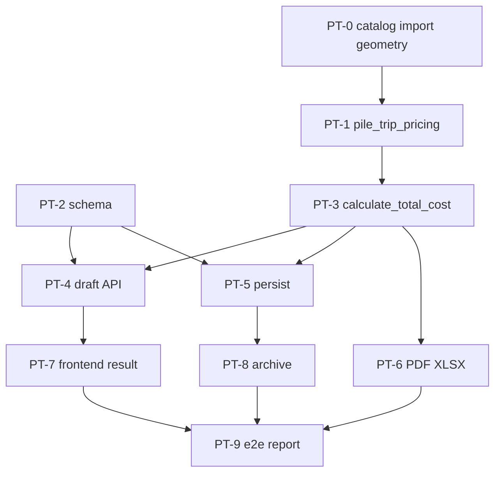

# Plan: Рейсы свай и мостовых свай в КП

**Created:** 2026-09-01  
**Status:** Implemented — 2026-09-01  
**Spec:** [`ai_docs/specs/pile-bridge-trip-calculation.md`](../../specs/pile-bridge-trip-calculation.md) ✅ IMPLEMENT  
**Idea:** [`ai_docs/ideas/pile-bridge-trip-calculation.md`](../../ideas/pile-bridge-trip-calculation.md)

## Goal

Менеджер на шаге итогов КП (и в архиве) получает доставку свай/мостовых: гибрид `floor(qty/pcs)` + остатки / 19,8 т, вопрос «сколько машин» если нормы нет. Плиты по-прежнему 18,6 т. Две строки доставки. Код отгрузок не трогаем.

## Current state

| Компонент | Сейчас |
|-----------|--------|
| `pile_catalog` | Схема есть (`weight_kg`, `pcs_per_20t`); **0 строк**; импорт ждёт лист «Вес и объем» |
| Рейсы КП | Только плиты: `ceil(кг / 18600)`; поле рейса **disabled** без plate-строк |
| Mixed PDF | Одна «Услуга по доставке грузов» только по плитам |
| Архив PATCH | `logistics_cost` → пересчёт сумм, **без** перегенерации PDF |
| Отгрузки | `pile_weight_for_mark` по точному `mark` — не меняем |

## Architecture decisions

1. **Чистая доменная функция** `core/pile_trip_pricing.py` — единственное место формулы; calculate/PDF/архив только вызывают.
2. **Константы:** `CARGO_DELIVERY_TRUCK_CAPACITY_KG = 18600` (плиты, без изменения); `PILE_REMAINDER_TRUCK_CAPACITY_KG = 19800` в `pile_trip_pricing` (не в `cargo_delivery_pricing`, чтобы не смешать).
3. **`calculate_total_cost`:** новые kwargs `pile_logistics_cost`, `pile_trip_overrides`, `pile_catalog_db_path`; в return — `plate_delivery_total`, `pile_delivery_total`, `pile_trips`, `pile_trip_pending_marks`, `pile_delivery_ready`. Старые ключи totals сохраняем.
4. **Два тарифа:** `KP_offers.logistics_cost` плиты; `KP_offers.pile_logistics_cost` сваи. Mono-сваи: UI «Стоимость рейса» → `pile_logistics_cost`.
5. **Overrides JSON** в `kp_meta.pile_trip_overrides_json` + draft metadata `pile_trip_overrides`.
6. **Архив PATCH:** расширить payload (`pile_logistics_cost`, `pile_trip_overrides`); пересчёт сумм **как у плит** — без авто-PDF; файлы кнопкой regen.
7. **Lookup каталога:** `resolve_catalog_for_mark(mark)` — точный mark (C↔С), иначе геометрия. Не трогать `shipment_repository.pile_weight_for_mark`.
8. **Импорт:** header-detect + fallback `Лист1`; колонка авто 20 т.



## Implementation order

| Phase | Focus | Depends |
|-------|-------|---------|
| 0 | Импорт Лист1 + geometry lookup | — |
| 1 | `PileTripBreakdown` + фикстура 42 | 0 |
| 2 | Schema ALTER | — (∥ 0–1) |
| 3 | `calculate_total_cost` две доставки | 1, 2 |
| 4 | Draft meta / calculate API | 3 |
| 5 | Save persist | 3, 2 |
| 6 | PDF/XLSX две строки | 3 |
| 7 | Result step UI | 4 |
| 8 | Архив details + PATCH | 5 |
| 9 | Flow tests + report | all |

## Risks

| Риск | Митигация |
|------|-----------|
| Путаница 18600 / 19800 | Разные имена констант; отдельные тесты |
| `calculate_total_cost` зовут много мест | kwargs со default 0; регрессия `test_commercial_logistics_cost` |
| Геометрия не матчит Excel | Фикстура C14-40T4 → С140.40; тест импорта реального файла если есть |
| Mixed PDF layout | Две строки только если сумма > 0 и ready |
| Случайный diff отгрузок | DoD: нет `shipment*.py` в diff |

## Parallelism

| Можно параллельно | После |
|-------------------|--------|
| Phase 2 schema ∥ Phase 0–1 | — |
| Phase 6 PDF ∥ Phase 7 FE | Phase 3 contract totals |
| Phase 8 archive ∥ Phase 7 | Phase 5 save пишет колонки |

---

## Task list

### Phase 0: Catalog

- [x] **PT-001:** Импорт `Лист1` / header-detect / «-» → NULL pcs
  - **Acceptance:** `сваи вес и объем.xlsx` → 44 марки; `С160.40` pcs NULL; `С140.40` weight 5650, pcs 3
  - **Verify:** `pytest tests/test_pile_catalog_import.py -q`
  - **Files:** `core/pile_catalog.py`, `scripts/import_pile_catalog.py`, tests
  - **Scope:** M

- [x] **PT-002:** `parse_bridge_pile_geometry` + `resolve_catalog_for_mark`
  - **Acceptance:** `C14-40T4` / `С14-40Т4` → та же строка, что `С140.40`; неизвестная марка → None
  - **Verify:** unit в том же test-файле или `tests/test_pile_catalog_resolve.py`
  - **Files:** `core/pile_catalog.py`, tests
  - **Scope:** S
  - **Dependencies:** PT-001

**Checkpoint 0:** импорт 44 + резолв мостовых

### Phase 1: Domain trips

- [x] **PT-101:** `core/pile_trip_pricing.py` — `compute_pile_trips(lines, overrides, catalog_lookup)`
  - **Acceptance:** тендер без C18 → full 39, remainder_trips 3, total 42, ready; C18 без N → pending, total_trips 0 для доставки (`ready=False`); N=k → 42+k; N=0 → ready, +0; pcs NULL как pending
  - **Verify:** `pytest tests/test_pile_trip_pricing.py -q`
  - **Files:** `core/pile_trip_pricing.py`, tests
  - **Scope:** M
  - **Dependencies:** PT-002

**Checkpoint 1:** формула закрыта тестами, UI ещё нет

### Phase 2: Schema

- [x] **PT-201:** `ALTER KP_offers.pile_logistics_cost`; `kp_meta.pile_trip_overrides_json`
  - **Acceptance:** idempotent; default 0 / NULL
  - **Verify:** schema test (новый или рядом с `test_kp_db_schema`)
  - **Files:** `core/kp_db_schema.py`, tests
  - **Scope:** S

**Checkpoint 2:** схема зелёная

### Phase 3: Totals

- [x] **PT-301:** `calculate_total_cost` — plate delivery без регрессии; pile delivery если ready; mixed сумма; pending → pile_delivery 0
  - **Acceptance:** существующие logistics tests зелёные; новые mixed/pending
  - **Verify:** `pytest tests/test_commercial_logistics_cost.py tests/test_commercial_calculation_service.py -q`
  - **Files:** `core/commercial_pricing.py`, tests
  - **Scope:** M
  - **Dependencies:** PT-101, PT-201

**Checkpoint 3:** цифры КП сходятся на backend

### Phase 4: Draft API

- [x] **PT-401:** Metadata + calculate response: `pile_logistics_cost`, `pile_trip_overrides`, `pile_trips`, `pile_trip_pending_marks`, `pile_delivery_ready`, `plate_delivery_total`, `pile_delivery_total`
  - **Acceptance:** PATCH meta round-trip; calculate отдаёт pending C18
  - **Verify:** commercial draft/calculate tests
  - **Files:** `app/schemas/commercial.py`, draft_service, calculation/workflow, tests
  - **Scope:** M
  - **Dependencies:** PT-301

**Checkpoint 4:** API контракт для FE

### Phase 5: Persist

- [x] **PT-501:** Save пишет `pile_logistics_cost` + overrides JSON; load/resume читает
  - **Verify:** persist / commercial flow test save→reload
  - **Files:** `core/kp_persistence_service.py`, `core/kp/offers_write.py` (сигнатуры), tests
  - **Scope:** M
  - **Dependencies:** PT-201, PT-301

**Checkpoint 5:** сохранённое КП помнит тариф свай и N

### Phase 6: Export

- [x] **PT-601:** PDF/XLSX: «Доставка плит» и «Доставка свай» если сумма > 0; pending — строки свайной доставки нет
  - **Verify:** `tests/test_commercial_export_mixed.py` (+ pile-only)
  - **Files:** `core/commercial_offer.py`, `core/commercial_offer_xlsx.py`, tests
  - **Scope:** M
  - **Dependencies:** PT-301

**Checkpoint 6:** файлы как на экране итогов

### Phase 7: Frontend KP

- [x] **PT-701:** Types + API client новых полей
  - **Files:** `frontend/src/features/commercial-offer/types/`, `api/commercialOfferApi.ts`
  - **Scope:** S
  - **Dependencies:** PT-401

- [x] **PT-702:** `CalculationResultStep` — включить рейс без плит; mixed два поля; вопросы N; итог рейсов без 39+3
  - **Acceptance:** vitest: disabled→enabled; pending banner; submit N
  - **Verify:** `cd frontend && npm run test -- --run CalculationResultStep`
  - **Files:** `CalculationResultStep.tsx`, tests, optional `pileTripPricing.ts` если дублируем display-only
  - **Scope:** M
  - **Dependencies:** PT-701

**Checkpoint 7:** `npm run typecheck` + vitest result step

### Phase 8: Archive

- [x] **PT-801:** Details: свайный тариф, N, pending, две доставки
  - **Files:** `app/schemas/archive.py`, `archive_service.py`, FE types/drawer
  - **Scope:** M
  - **Dependencies:** PT-501

- [x] **PT-802:** PATCH logistics расширить; пересчёт totals **без** авто-PDF (как сейчас у плит)
  - **Acceptance:** смена N → новые суммы; `logistics_cost` без регрессии
  - **Verify:** `tests/test_archive_endpoints.py` / `test_archive_service.py`
  - **Files:** archive schema, `offers_write.update_kp_logistics_cost` (или новый helper), FE drawer
  - **Scope:** M
  - **Dependencies:** PT-801

**Checkpoint 8:** архив правит N как тариф плит

### Phase 9: E2E + docs

- [x] **PT-901:** Flow: bridge draft → calculate 42 pending C18 → set N → delivery 42+N → save → archive PATCH
  - **Verify:** `pytest tests/test_commercial_bridge_pile_flow.py tests/test_commercial_pile_flow.py` + новый logistics slice
  - **Scope:** M

- [x] **PT-902:** Report `ai_docs/develop/reports/2026-09-01-pile-bridge-trip-calculation.md`; spec status IMPLEMENT
  - **Scope:** S
  - **Never:** `app/services/shipment*.py`

**Checkpoint 9 / DoD:** см. ниже

---

## Verification (Definition of Done)

```bash
source .venv/bin/activate
python scripts/import_pile_catalog.py --xlsx "банк знаний/сваи вес и объем.xlsx" --sheet Лист1

pytest tests/test_pile_catalog_import.py tests/test_pile_trip_pricing.py \
  tests/test_commercial_logistics_cost.py tests/test_commercial_calculation_service.py \
  tests/test_commercial_export_mixed.py tests/test_archive_service.py \
  tests/test_archive_endpoints.py -q

cd frontend && npm run typecheck && npm run test -- --run
```

- [x] Тендер без C18 = 42; с N = 42+N
- [x] КП только мостовые: поле рейса активно
- [x] Mixed: две доставки в totals и PDF
- [x] `git diff --name-only` без `shipment`

## Open Questions

Нет (spec D14–D16). Regen PDF при PATCH — **как у плит: нет**, кнопка regen.

## Status

**PLAN — IMPLEMENT complete.** Tasks PT-001…PT-902.
