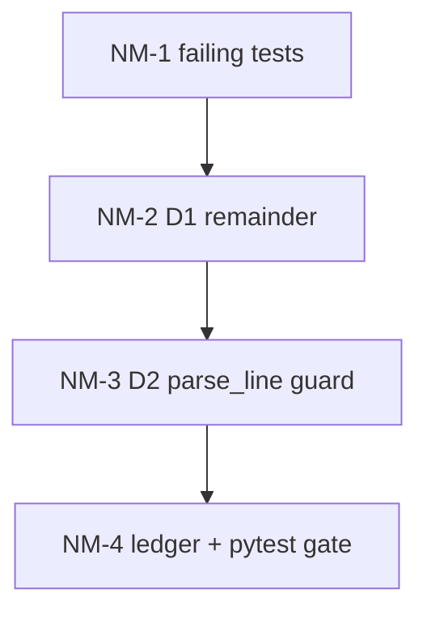

# Plan: Целостность нормализации марок ПБ

**Created:** 2026-09-01  
**Status:** IMPLEMENT done 2026-09-01  
**Spec:** [`ai_docs/specs/plate-mark-normalizer-integrity.md`](../../specs/plate-mark-normalizer-integrity.md)  
**Idea:** [`ai_docs/ideas/plate-mark-normalizer-integrity.md`](../../ideas/plate-mark-normalizer-integrity.md)

## Goal

Нормализатор не подменяет десятичную длину (`ПБ 70.5-12-8п`) каталожным `L.W`. Каталог (`59.12-8Вр1400-25`, `56.05-10`) без регресса. Эталонная ведомость → 32 плиты, без жёлтых `'47.5' → '47-5,0'`.

## Current state

| Компонент | Сейчас |
|-----------|--------|
| `_CATALOG_CORE_RE` | Точка = L.W. `70.5-12-8п` → L=70, W=5, load=12 |
| `parse_catalog_mark` | Остаток, не qty, **отбрасывается**, кортеж всё равно возвращается |
| `canonicalize_plate_line` | Warning `'src' → 'dst'` уходит в UI предпросмотра |
| `parse_line` | `.` и `,` в длине уже эквивалентны |
| OCR / прайс / FE | Не при чём; ломает шаг после распознавания |

## Architecture decisions

1. **Одна развилка в `parse_catalog_mark` (D1).** Если `remainder` не пустой и не `_QTY_RE` → `return None`. Не менять `_CATALOG_CORE_RE`. Не заменять все точки на запятые.
2. **Сторож в `canonicalize_plate_line` (D2), не в catalog regex.** Канон без точки (`ПБ 59-12-8п`) через `parse_catalog_mark` не крутится. Сверять кортеж (L, W, load, qty) с `parse_line(canonical)`: длина ≈ L/10 м, ширина ≈ W/10 м, нагрузка, qty. Расхождение → вернуть cleaned без warning.
3. **Отказ от каталога — не warning в UI.** Только `logger.debug`. Успешный каталог — warning как сейчас.
4. **Тесты сначала** в `tests/test_plate_normalizer.py` (pytest уже собирает `test_*`). Новый файл не плодить, если не раздуется.
5. **Потребители не трогаем:** `plate_parser_service`, `dobor_split`, OCR, прайс, фронт. Регресс — существующий `test_dobor_split.py`.



## Implementation order

| Phase | Focus | Depends |
|-------|-------|---------|
| 1 | Красные тесты: таблица остатка + эталон 32 | — |
| 2 | D1 в `parse_catalog_mark` | 1 |
| 3 | D2 сторож + откат | 2 |
| 4 | Gate pytest + добор без регресса | 3 |

Параллелить нечего: один модуль.

## Risks

| Риск | Митигация |
|------|-----------|
| `_QTY_RE` слишком широкий, съест хвост | Тест: `-8п 3` не qty; `3 шт` — qty |
| Сторож ломает каталог `5,0` ширина / `Вр1400` | Сверять через `parse_line`, не «все цифры в строке»; фикстуры 59.12 и 56.05 |
| `43.0-12-8п` уже не каталог (W=0) — не регрессировать | Assert: `warn is None`, размеры 4.3×1.2 |
| `ИПБ` не матчится `\bпб` — не чинить в этом плане | Вне scope; эталон без префикса ИПБ |

## Task list

### Phase 1: Tests first

- [x] **NM-101:** Параметризация `parse_catalog_mark` / `canonicalize_plate_line` по таблице spec (каталог да/нет)
  - **Acceptance:** `59.12-8Вр1400-25`, `56.05-10`, `56.05-10 3 шт`, `59.12-8п` → каталог; `70.5-12-8п`, `70.5-12-8п 1`, `47.5-10.7-8  4`, `70.5-10.7-8п доб. 70.5-1.25-8` → не каталог (`parse_catalog_mark is None` или канон содержит исходную десятичную длину, `warn is None`)
  - **Verify:** тесты красные до NM-201
  - **Files:** `tests/test_plate_normalizer.py`
  - **Scope:** S

- [x] **NM-102:** Эталонная ведомость 14 строк
  - **Acceptance:** после `normalize_order_text` + `parse_line` Σ qty=32; длины/ширины как в spec; в `warnings` нет `47.5` → `47-5,0` и аналогов `70.5`/`60.5`
  - **Verify:** красный до NM-201
  - **Files:** `tests/test_plate_normalizer.py`
  - **Scope:** S
  - **Dependencies:** NM-101

**Checkpoint 1:** зафиксирован контракт, код ещё старый, тесты падают ожидаемо.

### Phase 2: D1 remainder

- [x] **NM-201:** В `parse_catalog_mark` после `remainder = s[m.end():].strip()`: непустой и не `_QTY_RE` → `return None`
  - **Acceptance:** NM-101 зелёный; существующие `test_parse_catalog_mark_*` / `test_canonicalize_catalog*` без смены ожиданий
  - **Verify:** `pytest tests/test_plate_normalizer.py -q`
  - **Files:** `core/plate_text_normalizer.py`
  - **Scope:** XS
  - **Dependencies:** NM-101

**Checkpoint 2:** десятичная длина больше не переписывается; каталог жив.

### Phase 3: D2 guard

- [x] **NM-301:** После сборки канона — сверка с `parse_line(canonical)` vs кортеж; mismatch → `return cleaned, None` + `logger.debug`
  - **Acceptance:** легитимный каталог по-прежнему с warning; тест на искусственный mismatch (если проще — unit хелпера `_catalog_tuple_matches_canonical`); отказ D1 по-прежнему без warning
  - **Verify:** `pytest tests/test_plate_normalizer.py -q`
  - **Files:** `core/plate_text_normalizer.py`, `tests/test_plate_normalizer.py`
  - **Scope:** S
  - **Dependencies:** NM-201

**Checkpoint 3:** тихая подмена закрыта двумя слоями.

### Phase 4: Gate

- [x] **NM-401:** Эталон NM-102 зелёный; добор без регресса; дым parse КП
  - **Acceptance:** Σ qty=32; `test_normalize_order_text_splits_dobor_line` ок
  - **Verify:**
    ```bash
    pytest tests/test_plate_normalizer.py tests/test_dobor_split.py tests/test_config_and_data_plate_naming.py -q
    pytest tests/test_commercial_web_flow.py -q -k parse
    ```
  - **Files:** только если всплывёт регресс
  - **Scope:** S
  - **Dependencies:** NM-102, NM-301

**Checkpoint 4:** spec success criteria 1–9 закрыты. IMPLEMENT можно закрывать.

## Out of this plan

- Добор `доб. L-W-N` как две позиции
- OCR / ИПБ / петли
- Прайс 10,7 / 5,3
- Склейка дублей
- `_CATALOG_CORE_RE`, фронт, схема БД

## DoD

- [x] Success criteria spec § выполнены
- [x] Diff только нормализатор + тесты (+ docs status)
- [x] Нет замены всех `.` → `,`
- [x] Жёлтый UI только у настоящего каталога
