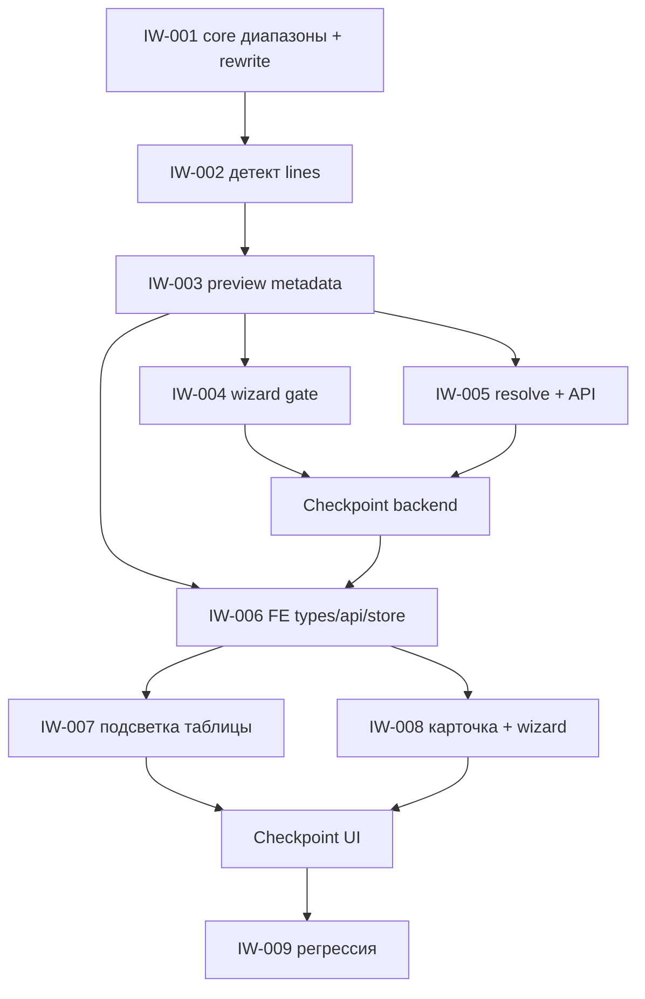

# Implementation Plan: Неверная ширина в составе КП

**Created:** 2026-09-02  
**Status:** 🟢 Ready (ожидает ревью плана)  
**Spec:** [`ai_docs/specs/kp-nevernaia-shirina.md`](../../specs/kp-nevernaia-shirina.md)  
**Idea:** [`ai_docs/ideas/kp-nevernaia-shirina.md`](../../ideas/kp-nevernaia-shirina.md)  
**Orchestration:** `orch-2026-09-02-16-01-kp-nevernaia-shirina`

## Overview

Третий гейт wizard КП (после wide, до unpriced): любая разобранная ширина ≤ 12 дм вне таблицы резов блокирует расчёт. Менеджер заменяет на соседа (края диапазонов) или исключает строку. Карточка — клон unpriced, не новый UX.

Код не пишем, пока этот план не подтверждён.

## Current state

| Компонент | Сейчас |
|-----------|--------|
| Парсер | `parse_pb_width_to_m`: `8` → 0.8 м; `0.3`/`0.2` — уже метры |
| Wide | `get_wide_plate_lines` (W_dm > 12) → confirm / replace / exclude |
| Unpriced | `build_unpriced_plate_lines` + `resolve_unpriced_plates` |
| Resolve | `CommercialPlateResolve` + `PlateResolveSpec.kind: wide \| unpriced` |
| Предпросмотр | `KpPlatePreviewPanel` + highlights: correction / unparsed / wide / dobor |
| Раскладка | `add_items` snap «меньший рез» (800 → 720). **Не меняем** |

## Architecture decisions

1. **Домен в `core/factory_width.py`.** Диапазоны, `is_factory_width_mm`, `suggest_factory_width_mm`, формат label, rewrite W в марке. Один источник истины. `add_items` не трогаем.
2. **Детект как unpriced:** `build_invalid_width_lines(order_data, …)` после `_build_order_data` в `generate_preview`. Wide-строки (неresolved) пропускаем. Не regex `-8-`.
3. **Metadata-пара:** `invalid_width_lines` + `invalid_widths_resolved = not bool(lines)`. Пишет только `build_preview_metadata`.
4. **Третий `PlateResolveSpec`** `kind="invalid_width"`. Не плодить второй resolve-сервис. Действия `replace_width` \| `exclude`; `width_mm` только из `replacements`.
5. **Порядок ошибок:** wide → invalid width → unpriced. Первый в `validate_calculate_prerequisites` задаёт `next_required_action`.
6. **Карандаш даром:** «Список верен» уже пересобирает preview. Отдельного handler нет.
7. **Предвыбор UI:** верхний сосед (для 800 — 860 / 8,6).

IW-004 и IW-005 после IW-003 можно параллелить. IW-006 types — после контракта IW-003, не ждать resolve.

## Task List

### Phase 1: Foundation

- [ ] **IW-001:** Диапазоны, соседи, rewrite марки `(type: feat-be)` (⏳ Pending)
- [ ] **IW-002:** Сборка `invalid_width_lines` из order_data `(type: feat-be, dependsOn: IW-001)` (⏳ Pending)

### Checkpoint: Foundation

- [ ] `pytest tests/test_factory_width.py tests/test_invalid_width_lines.py -q`
- [ ] 800→[720,860], 1000→[920,1020], 200→[260], 300/1200 не в lines; wide 15 пропуск

### Phase 2: Backend gate

- [ ] **IW-003:** Preview кладёт lines в metadata `(type: feat-be, dependsOn: IW-002)` (⏳ Pending)
- [ ] **IW-004:** Wizard блокирует calculate `(type: feat-be, dependsOn: IW-003)` (⏳ Pending)
- [ ] **IW-005:** Resolve + endpoint `(type: api, dependsOn: IW-001,IW-003)` (⏳ Pending)

### Checkpoint: Backend

- [ ] Preview смеси 12+8 → три invalid, `next_required_action=resolve_invalid_widths`
- [ ] `replace_width` 860 → марка `8,6`, гейт пуст
- [ ] Wide 15 и unpriced без ширины — как сейчас
- [ ] `pytest tests/ -q -k "factory_width or invalid_width or unpriced or wide_plate"`

### Phase 3: Frontend

- [ ] **IW-006:** Types, API, store `(type: feat-fe, dependsOn: IW-003)` (⏳ Pending)
- [ ] **IW-007:** Подсветка и алерт в таблице `(type: ui, dependsOn: IW-006)` (⏳ Pending)
- [ ] **IW-008:** Карточка и «Применить» `(type: ui, dependsOn: IW-005,IW-006)` (⏳ Pending)

### Checkpoint: UI

- [ ] Карточка под таблицей, предвыбор верхнего соседа, Apply disabled без выбора
- [ ] Строка `-8-` красная; `12` и `0.3` без этого kind

### Phase 4: Verify

- [ ] **IW-009:** Регрессия + спека `(type: chore, dependsOn: IW-004,IW-005,IW-007,IW-008)` (⏳ Pending)

### Checkpoint: Complete

- [ ] Success Criteria спеки
- [ ] `pytest tests/ -q` и `cd frontend && npm run test -- --run && npm run typecheck && npm run build`

---

## Task IW-001: Диапазоны, соседи, rewrite марки

**Description:** Чистый домен без FastAPI: таблица резов, проверка мм, два соседа, label в дм, перепись только части W в марке `L-W-N`.

**Acceptance criteria:**
- [ ] `is_factory_width_mm`: 260–320, 460–530, 660–720, 860–920, 1020–1080, 1200 — true; 200, 400, 600, 800, 1000, 1100, 1190 — false
- [ ] `suggest_factory_width_mm(800)==[720,860]`; `(1000)==[920,1020]`; `(200)==[260]`; `(1100)==[1080,1200]`; in-range → `[]`
- [ ] `Плиты ПБ 29-8-8п` + 860 → `Плиты ПБ 29-8,6-8п`; qty и нагрузка на месте

**Verification:**
- [ ] `pytest tests/test_factory_width.py -q`

**Dependencies:** None

**Files likely touched:**
- `core/factory_width.py` (новый)
- `tests/test_factory_width.py` (новый)

**Estimated scope:** Small (1-2 files)

---

## Task IW-002: Сборка invalid_width_lines

**Description:** Из `order_data` + `normalized_lines` собрать список проблемных позиций с replacements (`width_mm`, `width_label`, `price` если `lookup_plate_price` > 0). Строки из неresolved `wide_plate_lines` не включать. Не плиты — пропуск.

**Acceptance criteria:**
- [ ] Смесь 29-12 и 29-8 → одна invalid, replacements 720/860
- [ ] `78-0.3` / `78-3` → пусто
- [ ] `60-15` при переданном wide skip → пусто
- [ ] Нет цены — replacement всё равно есть, `price` null/omit

**Verification:**
- [ ] `pytest tests/test_invalid_width_lines.py -q`

**Dependencies:** IW-001

**Files likely touched:**
- `core/invalid_width_lines.py` (новый) или функции в `core/factory_width.py`
- `tests/test_invalid_width_lines.py` (новый)

**Estimated scope:** Small (1-2 files)

---

## Task IW-003: Preview metadata

**Description:** `generate_preview` кладёт lines в `CommercialPreviewResult`. `build_preview_metadata` сериализует `invalid_width_lines` и считает `invalid_widths_resolved`. Схемы Pydantic. Не-плитные черновики — пустой список / resolved true.

**Acceptance criteria:**
- [ ] Preview текста со скрина (12+8) → ровно три invalid (`29-8`, `32-8`, `36-8`)
- [ ] `invalid_widths_resolved is False` тогда и только тогда, когда список непуст
- [ ] Сваи/ступени не получают ложный гейт

**Verification:**
- [ ] pytest на `generate_preview` / serialize (новый или рядом с commercial_service)

**Dependencies:** IW-002

**Files likely touched:**
- `app/services/commercial_service.py`
- `app/services/commercial_draft_service.py`
- `app/schemas/commercial.py`
- `tests/test_invalid_width_preview.py` (новый)

**Estimated scope:** Medium (3-5 files)

---

## Task IW-004: Wizard gate

**Description:** `ERR_INVALID_WIDTHS`, `WizardNextRequiredAction.resolve_invalid_widths`, blocking в calculation + `infer_wizard_current_step` / `infer_next_required_action`. Порядок: wide раньше, unpriced позже.

**Acceptance criteria:**
- [ ] Есть invalid и не resolved → `next_required_action=resolve_invalid_widths`, `can_proceed_to=[]`, calculate недоступен
- [ ] Одновременно wide + invalid → action всё ещё `resolve_wide_plates`
- [ ] Только unpriced без invalid → как сейчас

**Verification:**
- [ ] Расширить `tests/test_commercial_unpriced_plates_resolve.py` или `tests/test_invalid_width_wizard.py`
- [ ] `pytest tests/ -q -k "wizard_state or invalid_width"`

**Dependencies:** IW-003

**Files likely touched:**
- `app/schemas/errors.py` (если нужен код) / `app/schemas/commercial.py`
- `app/services/commercial_calculation_service.py`
- `app/services/commercial_wizard_step_service.py`
- `tests/test_invalid_width_wizard.py` (новый)

**Estimated scope:** Medium (3-5 files)

---

## Task IW-005: Resolve + API

**Description:** `INVALID_WIDTH_RESOLVE` в `commercial_plate_resolve`: bind `replace_width`/`exclude`, rewrite через IW-001, persist preview. `POST /drafts/{id}/invalid-widths/resolve`. Workflow-обёртка как у unpriced.

**Acceptance criteria:**
- [ ] replace 29-8 → 860: в draft имя с `8,6`, invalid пуст
- [ ] `width_mm` не из replacements → 400
- [ ] exclude всех при пустом остатке → ошибка «список стал пустым»
- [ ] exclude неверной при живых 12-х — заказ жив

**Verification:**
- [ ] `pytest tests/test_invalid_width_resolve.py -q` (зеркало `test_commercial_unpriced_plates_resolve.py`)

**Dependencies:** IW-001, IW-003

**Files likely touched:**
- `app/services/commercial_plate_resolve.py`
- `app/services/commercial_workflow_service.py`
- `app/api/v1/endpoints/commercial.py`
- `app/schemas/commercial.py` (request body / action literal)
- `tests/test_invalid_width_resolve.py` (новый)

**Estimated scope:** Medium (3-5 files) — на верхней границе; не добавлять сюда UI

---

## Task IW-006: Frontend types, API, store

**Description:** Зеркало контракта: типы lines/replacements/action, `resolveInvalidWidths` в API, `invalidWidthActions` в wizard store (как unpriced).

**Acceptance criteria:**
- [ ] `WizardNextRequiredAction` включает `resolve_invalid_widths`
- [ ] Store сбрасывает actions после resolved preview
- [ ] `tsc` на затронутых файлах без дыр в типах metadata

**Verification:**
- [ ] `cd frontend && npm run test -- --run src/features/commercial-offer/store/wizardDraftStore.test.tsx`

**Dependencies:** IW-003

**Files likely touched:**
- `frontend/src/features/commercial-offer/types/commercialOffer.ts`
- `frontend/src/features/commercial-offer/api/commercialOfferApi.ts`
- `frontend/src/features/commercial-offer/store/wizardDraftStore.tsx`

**Estimated scope:** Small (1-2 files) / Medium если store-тест править отдельно

---

## Task IW-007: Подсветка таблицы

**Description:** kind `invalid_width` в `plateLineHighlights` (стиль как `wide`). Алерт в `KpPlatePreviewPanel`: N позиций вне таблицы.

**Acceptance criteria:**
- [ ] `29-8-8п` → kind `invalid_width`
- [ ] `12` и `0.3` этим kind не красятся
- [ ] Wide не перетирается этим kind (приоритет wide, как в спеке)

**Verification:**
- [ ] `cd frontend && npm run test -- --run src/features/commercial-offer/lib/plateLineHighlights.test.ts src/features/commercial-offer/components/KpPlatePreviewPanel.test.tsx`

**Dependencies:** IW-006

**Files likely touched:**
- `frontend/src/features/commercial-offer/lib/plateLineHighlights.ts`
- `frontend/src/features/commercial-offer/lib/plateLineHighlights.test.ts`
- `frontend/src/features/commercial-offer/components/KpPlatePreviewPanel.tsx`
- `frontend/src/features/commercial-offer/components/KpPlatePreviewPanel.test.tsx`

**Estimated scope:** Medium (3-5 files)

---

## Task IW-008: Карточка и Применить

**Description:** `InvalidWidthsInlineSection` (клон unpriced): радио замен с ценой, exclude, предвыбор max(width_mm) среди replacements, Apply. Вставить на `PlateInputStep` между wide и unpriced. Wizard: collect decisions + вызов API.

**Acceptance criteria:**
- [ ] Apply disabled, пока не по всем строкам есть действие
- [ ] Для 800 предвыбран 860
- [ ] `next_required_action=resolve_invalid_widths` не пускает дальше, пока не Apply
- [ ] Нет `confirm as-is`

**Verification:**
- [ ] vitest на карточку + кусок wizard/PlateInputStep

**Dependencies:** IW-005, IW-006

**Files likely touched:**
- `frontend/src/features/commercial-offer/components/InvalidWidthsInlineSection.tsx` (новый)
- `frontend/src/features/commercial-offer/components/InvalidWidthsInlineSection.test.tsx` (новый)
- `frontend/src/features/commercial-offer/components/steps/PlateInputStep.tsx`
- `frontend/src/features/commercial-offer/components/CommercialOfferWizard.tsx`

**Estimated scope:** Medium (3-5 files)

---

## Task IW-009: Регрессия и спека

**Description:** Полный прогон тестов. Обновить фазу SDD в спеке (PLAN ✅, TASKS/IMPLEMENT по факту). Не коммитить без просьбы.

**Acceptance criteria:**
- [ ] `pytest tests/ -q` зелёный
- [ ] `cd frontend && npm run test -- --run && npm run typecheck && npm run build` зелёные
- [ ] Спека: ссылка на этот план, чекбоксы Success Criteria отмечены по факту

**Verification:** команды выше

**Dependencies:** IW-004, IW-005, IW-007, IW-008

**Files likely touched:**
- `ai_docs/specs/kp-nevernaia-shirina.md`

**Estimated scope:** Small

---

## Risks and Mitigations

| Risk | Impact | Mitigation |
|------|--------|------------|
| `PlateResolveSpec.kind` заточен под 2 ветки | Med | Третья ветка рядом с unpriced; не обобщать «на будущее» |
| Забыть гейт в `infer_wizard_current_step` | High | Тест «нельзя на client/result» в IW-004 |
| `-10-` каждый день в заказах | Med (продукт) | В спеке принято; клички — Ask first, не в этих задачах |
| Rewrite W сломает `0.3` / `10,8` | Med | Фикстуры rewrite в IW-001; 0.3 не должен вызываться |
| Карточка разъедется с unpriced | Low | Копировать разметку, не изобретать третий UI |

## Open Questions

Нет блокирующих. Предвыбор верхнего соседа — из спеки (decision 13 + Design/Frontend).

## Parallelization

- **После IW-003:** IW-004 ∥ IW-005; IW-006 types можно начать сразу после IW-003.
- **После IW-006:** IW-007 ∥ (IW-008 ждёт ещё IW-005).
- **Не параллелить:** IW-001→002→003 (один контракт lines).

## Not doing (из спеки)

Snap раскладки, confirm as-is, кличка 10→10,8, производство, решение в ячейке таблицы.
