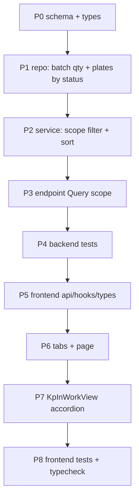

# Plan: КП в работе (вкладка в производстве)

**Created:** 2026-09-02  
**Status:** ✅ Implemented (MVP)  
**Spec:** [`ai_docs/specs/kp-v-rabote-v-proizvodstve.md`](../../specs/kp-v-rabote-v-proizvodstve.md)  
**Idea:** [`ai_docs/ideas/kp-v-rabote-v-proizvodstve.md`](../../ideas/kp-v-rabote-v-proizvodstve.md)

## Goal

Вкладка «КП в работе» в `/production`: очередь плит не на СГП для `admin`/`production`. Мастер планирования не меняет состав кандидатов.

## Current state

| Компонент | Сейчас |
|-----------|--------|
| `GET /kp-candidates` | Без query; фильтр `in_plan_pct < 100` и непустой `plates` |
| `list_kps_in_production` | КП «в работе» с `kp_plates`; `plates[]` только статус «в производстве» |
| Потребители `plates[]` репо | Мастер, urgent, substrate, analyze — ждут **только** «в производстве» |
| Qty СГП | `SgpService._sgp_progress_on_cursor`; в кандидатах нет |
| Срок | `core.execution_terms.parse_execution_terms_to_datetime` |
| UI | Вкладки без «КП в работе»; раскрытие плит уже есть в мастере (`KpCandidateRow`) |
| Роли | `/production` = admin + production |

## Architecture decisions

1. **Один эндпоинт**, query `scope`: omit/`plan` = мастер; `in_work` = вкладка; иное → 422.
2. **Не менять смысл `plates[]` в `list_kps_in_production()`.** Urgent/substrate сломаются, если туда попадут плиты «в плане». Для вкладки сервис отдельно подмешивает in-plan plates + `bucket`.
3. **Qty батчом** по списку `kp_id`: два GROUP BY (`kp_plates` по status, `completed_plates` по kp_id). Не звать readiness N раз.
4. **Сортировка `in_work` на сервере** через `parse_execution_terms_to_datetime`. Непарс → в конец (не fallback +14 из urgent). Тай-брейк `kp_id`. Срез `plan` — прежний порядок (`kp_id`).
5. **Аддитивные поля** на обоих срезах: `remaining_qty`, `in_plan_qty`, `on_sgp_qty`, `bucket` на плите (у мастера всегда `awaiting_plan`).
6. **UI:** новая вкладка после «Планы»; `KpInWorkView` — аккордеон одной строки, без `Drawer` и без `commercial-archive`.
7. **Без** миграции, нового роута, feature-flag.



P0–P4 строго последовательно (контракт API). P5–P8 после зелёного P4. P6 и P7 можно в одном вертикальном срезе, но вкладка без списка бессмысленна — сначала P7 с моком, либо сразу после P5.

## Implementation order

### P0 — Контракт

- `KpCandidatesScope = Literal["plan", "in_work"]`
- `KpCandidatePlateItem.bucket`
- `remaining_qty` / `in_plan_qty` / `on_sgp_qty` на item
- Frontend types зеркало

**Verify:** импорт схем, дефолты не ломают существующий `KpCandidatesResponse`.

### P1 — Репозиторий, не ломая urgent

- Батч qty: `remaining` = SUM «в производстве», `in_plan` = SUM «в плане», `on_sgp` = SUM `completed_plates` WHERE `kp_id IN (...)`.
- Хелпер загрузки плит по статусам (для сервиса `in_work`), **не** подменять `plates` в `list_kps_in_production`.
- Аддитивные qty-ключи в dict репо — ок для urgent (проигнорирует).

**Verify:** exclusion/mixed тесты репо зелёные; `plates` по-прежнему только «в производстве».

### P2 — Сервис

```
list_kp_candidates(scope="plan"|"in_work")
```

- `plan`: текущий фильтр; plates только awaiting_plan; qty заполнены.
- `in_work`: `remaining_qty + in_plan_qty > 0`; plates = производство + план с `bucket`; сортировка по сроку.
- Неизвестный scope не здесь, а в роутере (422).

**Verify:** юнит на фикстуре БД: 100% в плане есть в `in_work`, нет в `plan`; полностью на СГП нет нигде.

### P3 — Роутер

```python
scope: Literal["plan", "in_work"] = Query("plan")
```

Без параметра = `plan`. FastAPI сам отдаст 422 на чужое значение.

**Verify:** `GET .../kp-candidates` без query как сегодня; `?scope=in_work` 200; `?scope=foo` 422.

### P4 — Backend tests

Новый `tests/test_kp_candidates_scope.py` + точечные добавления:

- auth: production 200 на оба scope; offers 403 без изменений
- mixed/piles/fbs/steps/marches/bridge: `in_work` не расширяет номенклатуру
- `test_get_kp_candidates` — по-прежнему 200 без query

### P5 — Frontend API

- `listKpCandidates(scope?: "in_work")` — мастер без аргумента
- `productionKeys.kpCandidates(scope)` чтобы кэш мастера и вкладки не смешивались
- `useKpCandidatesQuery` мастера без изменений вызова

**Verify:** `useCreatePlanWizardState.test.ts` — URL без `scope=in_work`.

### P6 — Вкладки

`ProductionTab` += `"in-work"`. `OPTIONS`: calendar, plans, **in-work**, sgp, work-calendar. `ProductionPage` рендерит `KpInWorkView` при `tab === "in-work"`. `VALID_TABS` обновлён.

### P7 — `KpInWorkView`

- Запрос `scope=in_work`
- Строка: КП, клиент, срок, осталось (`remaining+in_plan`), в плане, на СГП
- Клик: одна раскрытая строка; плиты с пометкой bucket
- 100% в плане: список с «в плане, ждёт отливки»
- Пусто / loading / error как соседние вкладки
- Нет сумм, PDF, скидки

Паттерн раскрытия — упрощённый `KpCandidateRow` (без чекбоксов и СГП-propose).

### P8 — Frontend tests

- вкладка после «Планы»
- нет денег в DOM
- expand/collapse, одна открытая
- пометка «ждёт отливки»
- пустое состояние  
`npm run typecheck`

## Risks

| Риск | Митигация |
|------|-----------|
| `plates[]` репо начнут включать «в плане» | Не трогать состав `list_kps_in_production().plates`; отдельный хелпер |
| N+1 по СГП | Два GROUP BY на все kp_id, не readiness per row |
| Срок «14 дней» / мусор | `parse_execution_terms_to_datetime`; непарс в конец, не +14 |
| Кэш TanStack смешает срезы | queryKey включает scope |
| Мастер видит новые поля и ломается | Поля аддитивны; `bucket` с дефолтом; мастер не рендерит qty колонки |

## Parallel vs sequential

- Только последовательно: P0 → P1 → P2 → P3 → P4.
- UI (P5–P8) после P4.
- Не параллелить backend и UI: контракт qty/bucket ещё сядет.

## Verification checkpoints

| После | Проверка |
|-------|----------|
| P4 | `pytest tests/test_kp_candidates_scope.py tests/test_offers_production_authorization.py tests/test_production_api_integration.py tests/test_production_mixed_inclusion.py tests/test_production_pile_exclusion.py tests/test_production_fbs_exclusion.py tests/test_production_step_exclusion.py tests/test_production_march_exclusion.py tests/test_production_bridge_pile_exclusion.py -q` |
| P8 | `cd frontend && npm run test -- --run src/features/production && npm run typecheck` |
| Done | Ручной: admin и production, `/production?tab=in-work`, раскрыть КП 100% в плане; мастер без регрессии |

## Out of this plan

Счётчик на календаре, «на дорожки» из строки, архив, не-плиты, drawer.
