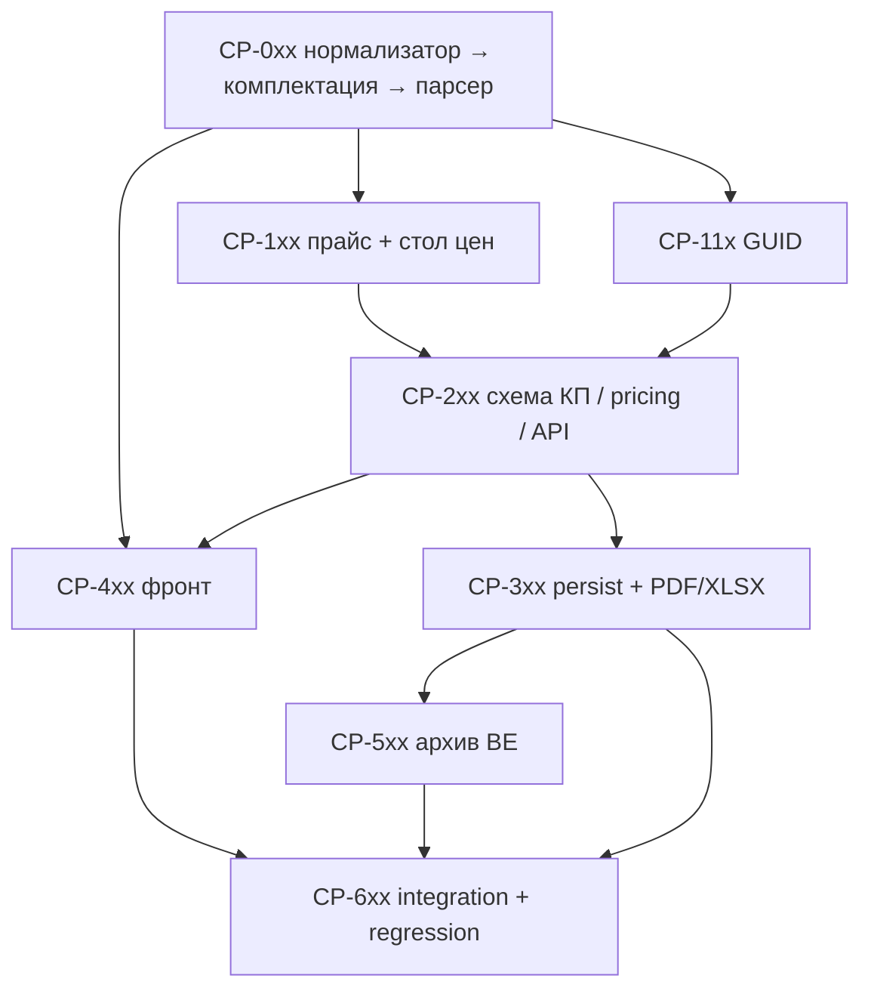

# Plan: КП на составные сваи

**Created:** 2026-09-22  
**Status:** ✅ IMPLEMENTED (code complete; CP-603 report pending documenter)  
**Spec:** [`ai_docs/specs/kp-composite-piles.md`](../../specs/kp-composite-piles.md)  
**Idea:** [`ai_docs/ideas/kp-composite-piles.md`](../../ideas/kp-composite-piles.md)  
**Orchestration:** `orch-2026-09-22-16-51-composite-piles`  
**Образцы:** [`2026-07-30-kp-piles.md`](2026-07-30-kp-piles.md), [`2026-08-05-kp-bridge-piles.md`](2026-08-05-kp-bridge-piles.md)  
**TDD:** каждая порция поведения — сначала падающий тест (отдельная задача `*-T` или «сначала тест» внутри задачи), затем код; Verify — команда, которая была красной.

## Goal

Менеджер создаёт **отдельное КП на составные сваи** (`product_type=composite_piles`, UI «Составные сваи»): простой шаг ввода → взрыв целой марки по комплектации серии → канон секции + класс → цена из прайса 18.09.2026 → PDF/XLSX только секции → архив с бейджем. GUID из листа 1С при точном каноне; пустой GUID не блокирует save. Без производства/СГП, без мостовых составных, без записи в `pile_prices` / `kp_piles`.

## Current state

| Компонент | Сейчас |
|-----------|--------|
| Комплектация | xlsx в `банк знаний/`, в БД нет |
| Прайс составных | xlsx от 18.09.2026; таблиц нет |
| Стол цен | `составн` → kind `composite` → `MSG_COMPOSITE` / 422 |
| `ProductType` | нет `composite_piles` |
| Persistence | нет `kp_composite_piles` |
| GUID | нет `composite_pile` в `PRODUCT_KINDS` / `guid_gate` |
| UX | `productTypeConfig` + `SimpleProductInputStep` для simple KP |

## Architecture decisions

1. **`product_type = "composite_piles"`**, UI «Составные сваи»; **`product_kind = "composite_pile"`** (прайс, nomenclature_guid, guid_gate) — как `bridge_piles` / `bridge_pile`.
2. **Таблицы:** `composite_pile_assemblies`, `composite_pile_prices`, `kp_composite_piles`. Не писать в `pile_prices` / `kp_piles`.
3. **Канон в КП/PDF:** `С60.30-ВС.1` (не написание менеджера). Слияние: канон + класс.
4. **Классы:** `B15`, `B20`, `B22_5`, `B25`, `B30_granite`. Нет класса → `B25`.
5. **Раскрой только из 123 сборок.** Целая марка вне таблицы — `pattern_not_matched`. Парсер длины не угадывает. Инвариант длин — тест данных при импорте.
6. **Суффиксы стыка:** `-Св.ВП` раньше `-Св`, `-Св` раньше `-С`.
7. **Секция без цены** — разобрана, расчёт блокируется.
8. **Хвостовая «у» / `guid_1c_u`** — не входят.
9. **Простой КП:** только `productTypeConfig` + `SimpleProductInputStep`; новый каркас мастера не строить.
10. **Стол цен:** classify `composite` → `composite_pile`; файл с «составн» даёт preview, не 422. Существующие тесты на 422 — переписать.
11. **GUID:** лист «Сваи составные — только в 1С»; точный канон → `auto`; не из серии — не писать; два GUID → `ambiguous`. `Прайс сваи составные.xls` не читать.
12. **Архив без GUID** сохраняется и открывает `guid_demand`. `assert_invoice_guids` на save архива не вешать.
13. **PDF/XLSX:** только секции (марка, класс, кол-во, цена, сумма).



## Implementation order

| Phase | Focus | Depends | Parallel? |
|-------|-------|---------|-----------|
| 0 | Нормализатор → комплектация → парсер/взрыв | — | **строго последовательно** |
| 1a | Прайс + стол цен | Phase 0 | ∥ Phase 1b и ранние FE-лейблы |
| 1b | GUID import | Phase 0 | ∥ Phase 1a |
| 2 | Schema `kp_composite_piles`, pricing, ProductType, service, API, wizard/calculate | 1a + 1b | последовательно внутри фазы |
| 3 | Persist + PDF/XLSX | Phase 2 | PDF ∥ XLSX после contract save |
| 4 | Frontend (config/preview можно начать после Phase 0) | 0 для лейблов; 2 для API wiring | config/preview ∥ Phase 1 |
| 5 | Archive BE + guid_demand | Phase 3 | ∥ polish FE archive |
| 6 | Integration + regression + report | all | — |

**Не параллелить:** нормализатор ↔ комплектация ↔ парсер; прайс ↔ price desk rewrite (одни тесты `test_price_desk_*`); API contract до полного wizard wiring.

## Risks

| Риск | Митигация |
|------|-----------|
| Путаница стыков `-С` / `-Св` / `-Св.ВП` | Порядок суффиксов в тестах; три разные пары на `С140.30-*` |
| Латинская `B` в марке vs класс `B25` | Нормализатор трогает только марку; отдельный assert «класс не кириллица» |
| Столкновение с цельными сваями | Отдельные таблицы/kind; regression `test_commercial_pile_flow` |
| 31 имя 1С не из серии | GUID import: не писать; fixture с негативами |
| Тесты price desk ждут 422 на «составн» | **Переписать** на preview `composite_pile`; не оставлять красными |
| Целая марка в PDF | Assert в flow: нет `С140.30-С` в байтах/тексте PDF |

---

## Task list

### Phase 0: Нормализатор → комплектация → парсер

- [x] **CP-001:** Тесты нормализатора `(type: feat-be)` — **RED first**
  - **Acceptance:** Падают до кода. Покрывают: префикс «Сваи», пробелы → `С60.30-ВС.1`; латинские `C`/`B` в марке → `С`/`В`; `Всв`→`ВСв`, `Нсв`→`НСв`; слипшийся `ВСв4`→`ВСв.4`; класс `B25` / `22.5` **не** портится кириллицей (AC-5 часть).
  - **Verify:** `pytest tests/test_composite_pile_text_normalizer.py -q` (ожидаемо RED до CP-002)
  - **Files:** `tests/test_composite_pile_text_normalizer.py`
  - **dependsOn:** []
  - **TDD:** только тесты

- [x] **CP-002:** `composite_pile_text_normalizer` `(type: feat-be)`
  - **Acceptance:** Все кейсы CP-001 зелёные; публичная функция канона марки без изменения класса бетона.
  - **Verify:** `pytest tests/test_composite_pile_text_normalizer.py -q`
  - **Files:** `core/composite_pile_text_normalizer.py`, `tests/test_composite_pile_text_normalizer.py`
  - **dependsOn:** [CP-001]

- [x] **CP-003:** Тесты импорта комплектации `(type: feat-be)` — **RED first**
  - **Acceptance:** 123 сборки; для каждой сумма длин секций (из марок, дм) = длина сваи; три стыка на одной длине — три разных `pile_mark` (AC-11).
  - **Verify:** `pytest tests/test_composite_pile_kit_import.py -q` (RED до CP-004)
  - **Files:** `tests/test_composite_pile_kit_import.py`, `tests/fixtures/composite_pile_kit_sample.xlsx` (урезанный fixture + полный путь в интеграционном импорте)
  - **dependsOn:** [CP-002]
  - **TDD:** только тесты

- [x] **CP-004:** Schema `composite_pile_assemblies` + kit + CLI `(type: feat-be)`
  - **Acceptance:** Таблица по спеке; lookup целой марки → `(upper_mark, lower_mark)`; импорт листа «Комплектация»; CLI `scripts/import_composite_pile_kit.py`.
  - **Verify:** `pytest tests/test_composite_pile_kit_import.py -q`
  - **Files:** `core/composite_pile_kit.py`, `scripts/import_composite_pile_kit.py`, `tests/test_composite_pile_kit_import.py` (+ schema create внутри kit или тонкий вызов из `kp_db_schema` / pb init — не раздувать)
  - **dependsOn:** [CP-003]
  - **Source:** `банк знаний/Составные сваи — комплектация секций (серия 1.011.1-10 вып.8).xlsx`

- [x] **CP-005:** Тесты парсера/взрыва `(type: feat-be)` — **RED first**
  - **Acceptance (AC-3,4,5,6,7,8):**  
    - три стыка `С140.30-С` / `-Св` / `-Св.ВП` → три разные пары;  
    - `С140.30-С × 5` → `С60.30-ВС.1 × 5` + `С80.30-НС.1 × 5`, класс `B25`;  
    - `С140.30-С × 2` + `С60.30-ВС.1 × 3` при `B25` → `С60.30-ВС.1 × 5` + `С80.30-НС.1 × 2`;  
    - разный класс → разные строки;  
    - `С999.30-С` → не разобрано;  
    - секция-алиас → одна строка канона;  
    - класс `B25` не портится кириллицей рядом с маркой.
  - **Verify:** `pytest tests/test_composite_pile_line_parser.py -q` (RED до CP-006)
  - **Files:** `tests/test_composite_pile_line_parser.py`
  - **dependsOn:** [CP-002, CP-004]
  - **TDD:** только тесты

- [x] **CP-006:** `composite_pile_line_parser` / expand `(type: feat-be)`
  - **Acceptance:** Порядок суффиксов; qty копируется на обе секции; merge канон+класс; вне комплектации — `pattern_not_matched` (не угадывать пару).
  - **Verify:** `pytest tests/test_composite_pile_line_parser.py tests/test_composite_pile_text_normalizer.py -q`
  - **Files:** `core/composite_pile_line_parser.py`, `tests/test_composite_pile_line_parser.py`
  - **dependsOn:** [CP-005]

**Checkpoint 0 — domain parse**

```bash
source .venv/bin/activate
pytest tests/test_composite_pile_text_normalizer.py \
  tests/test_composite_pile_kit_import.py \
  tests/test_composite_pile_line_parser.py -q
```

---

### Phase 1a: Прайс + стол цен (∥ Phase 1b после Checkpoint 0)

- [x] **CP-101:** Тесты импорта прайса `(type: feat-be)` — **RED first**
  - **Acceptance (AC-10 часть):** канон из `Сваи С 60.30-ВС.1`; пять классов; пустая/нулевая ячейка — не цена; кривое имя — ошибка импорта, не silent skip (AC-9 косвенно через lookup later).
  - **Verify:** `pytest tests/test_composite_pile_price_import.py -q` (RED до CP-102)
  - **Files:** `tests/test_composite_pile_price_import.py`, `tests/fixtures/composite_pile_price_sample.xlsx`
  - **dependsOn:** [CP-006]
  - **parallelSafe:** true (с CP-110)
  - **TDD:** только тесты

- [x] **CP-102:** `composite_pile_price_db` + CLI `(type: feat-be)`
  - **Acceptance:** Таблица `composite_pile_prices`; `get_composite_pile_price(canon, grade)`; импорт только лист «Прайс»; CLI `scripts/import_composite_pile_prices_from_xlsx.py`.
  - **Verify:** `pytest tests/test_composite_pile_price_import.py -q`
  - **Files:** `core/composite_pile_price_db.py`, `scripts/import_composite_pile_prices_from_xlsx.py`, `tests/test_composite_pile_price_import.py`
  - **dependsOn:** [CP-101]
  - **parallelSafe:** true (с CP-111)

- [x] **CP-103:** Тесты стола цен — rewrite 422 → preview `(type: feat-be)` — **RED first**
  - **Acceptance (AC-10):** `classify` → `composite_pile` (не `composite`); файл «Прайс на составные сваи…» даёт preview kind `composite_pile`, не `MSG_COMPOSITE`/422; substring «составн» побеждает «сваи».
  - **Verify:** `pytest tests/test_price_desk_classify.py tests/test_price_desk_service.py tests/test_price_desk_api.py -q` (после переписывания ассертов — RED до CP-104, пока service ещё отвергает)
  - **Files:** `tests/test_price_desk_classify.py`, `tests/test_price_desk_service.py`, `tests/test_price_desk_api.py`
  - **dependsOn:** [CP-102]
  - **TDD:** сначала меняем ожидания тестов (станут красными), потом код

- [x] **CP-104:** Стол цен принимает составные `(type: feat-be)`
  - **Acceptance:** Токен classify `composite` → `composite_pile`; preview/apply пишут `composite_pile_prices`; `PriceDeskKind` / схемы обновлены; `MSG_COMPOSITE` больше не путь для этого файла.
  - **Verify:** `pytest tests/test_price_desk_classify.py tests/test_price_desk_service.py tests/test_price_desk_api.py -q`
  - **Files:** `core/price_desk_classify.py`, `app/services/price_desk_service.py`, `app/schemas/price_desk.py`, `tests/test_price_desk_classify.py`
  - **dependsOn:** [CP-103]
  - **securitySensitive:** true (upload/import)

---

### Phase 1b: GUID (∥ Phase 1a после Checkpoint 0)

- [x] **CP-110:** Тесты GUID import `(type: feat-be)` — **RED first**
  - **Acceptance (AC-12):** точный канон → `auto`; имя не из серии / целая свая / комплект — не пишется; два GUID → `ambiguous`; не читает `Прайс сваи составные.xls`.
  - **Verify:** `pytest tests/test_composite_pile_guid_import.py -q` (RED до CP-111)
  - **Files:** `tests/test_composite_pile_guid_import.py`, `tests/fixtures/composite_pile_guid_sample.xlsx`
  - **dependsOn:** [CP-006]
  - **parallelSafe:** true (с CP-101)
  - **TDD:** только тесты

- [x] **CP-111:** GUID wiring + CLI `(type: feat-be)`
  - **Acceptance:** `PRODUCT_KINDS += composite_pile`; `guid_gate` map `composite_piles → composite_pile`; CLI `scripts/import_composite_pile_guids.py` — лист «Сваи составные — только в 1С»; без `guid_1c_u`.
  - **Verify:** `pytest tests/test_composite_pile_guid_import.py tests/test_nomenclature_guid.py tests/test_guid_gate.py -q`
  - **Files:** `core/nomenclature_guid.py`, `core/guid_gate.py`, `scripts/import_composite_pile_guids.py`, `tests/test_composite_pile_guid_import.py`
  - **dependsOn:** [CP-110]
  - **parallelSafe:** true (с CP-102)
  - **securitySensitive:** true

**Checkpoint 1 — прайс / GUID / стол**

```bash
source .venv/bin/activate
pytest tests/test_composite_pile_price_import.py \
  tests/test_composite_pile_guid_import.py \
  tests/test_price_desk_classify.py \
  tests/test_price_desk_service.py \
  tests/test_price_desk_api.py -q
```

---

### Phase 2: Схема КП / pricing / API / wizard

- [x] **CP-201:** Schema `kp_composite_piles` + pricing path `(type: feat-be)`
  - **Acceptance:** Idempotent create (как `kp_piles`); `commercial_pricing` для `composite_pile` — strict lookup; нет цены → блок расчёта (AC-9); секция без прайса разобрана, но calculate fails.
  - **Verify:** `pytest tests/test_kp_composite_piles_schema.py tests/test_commercial_composite_pile_pricing.py -q`
  - **Files:** `core/kp_db_schema.py`, `core/commercial_pricing.py`, `tests/test_kp_composite_piles_schema.py`, `tests/test_commercial_composite_pile_pricing.py`
  - **dependsOn:** [CP-102, CP-006]
  - **TDD:** сначала тесты в тех же файлах, потом код

- [x] **CP-202:** `ProductType` / draft `composite_piles` `(type: api)`
  - **Acceptance (AC-1):** create draft с `product_type=composite_piles`; immutable после create; OpenAPI/literals обновлены.
  - **Verify:** `pytest tests/test_commercial_composite_pile_flow.py -k "create or draft or product_type" -q` (минимальный create-тест; полный flow — CP-601)
  - **Files:** `app/schemas/commercial.py`, `app/schemas/archive.py` (literal filter), draft create path в workflow
  - **dependsOn:** [CP-201]
  - **TDD:** сначала assert create в тестовом файле flow

- [x] **CP-203:** `CommercialCompositePileService` + endpoints `(type: api)`
  - **Acceptance (AC-2):** ingest text/image/AI через `…/composite-piles` (+ `/ai`, grades); expand до канон-секций; `normalized_text` в metadata.
  - **Verify:** `pytest tests/test_commercial_composite_pile_flow.py -k "ingest or update or grades or ai" -q`
  - **Files:** `app/services/commercial_composite_pile_service.py`, `app/api/v1/endpoints/commercial.py`, `core/composite_pile_format_prompt.py`
  - **dependsOn:** [CP-202, CP-006, CP-102]
  - **needsExplore:** true

- [x] **CP-204:** Wizard step + calculate `(type: feat-be)`
  - **Acceptance:** step id `composite_piles`; calculate блокируется на unparsed / unpriced; без wide-plates; production whitelist не расширяется (AC-16 часть).
  - **Verify:** `pytest tests/test_commercial_wizard_step_service.py tests/test_commercial_composite_pile_pricing.py -q`
  - **Files:** `app/services/commercial_wizard_step_service.py`, `app/services/commercial_calculation_service.py`, tests
  - **dependsOn:** [CP-203]

**Checkpoint 2 — API calculate**

```bash
source .venv/bin/activate
pytest tests/test_kp_composite_piles_schema.py \
  tests/test_commercial_composite_pile_pricing.py \
  tests/test_commercial_composite_pile_flow.py -k "create or ingest or calculate" -q
```

---

### Phase 3: Persist + PDF / XLSX

- [x] **CP-301:** Persistence → `kp_composite_piles` `(type: feat-be)`
  - **Acceptance (AC-14 часть):** save пишет `kp_composite_piles` + meta `composite_piles`; **нет** строк в `kp_piles` / `pile_prices` (AC-16).
  - **Verify:** `pytest tests/test_kp_persistence_composite_piles.py -q`
  - **Files:** `app/services/kp_persistence_service.py` (или актуальный persistence path), `tests/test_kp_persistence_composite_piles.py`
  - **dependsOn:** [CP-204]
  - **TDD:** сначала тест persistence

- [x] **CP-302:** PDF — только секции `(type: feat-be)`
  - **Acceptance (AC-13):** колонки марка/класс/кол-во/цена/сумма; **нет** марки целой сваи (`С140.30-С` и аналоги).
  - **Verify:** `pytest tests/test_commercial_composite_pile_flow.py -k "pdf or export" -q`
  - **Files:** `core/commercial_offer.py`, `tests/test_commercial_composite_pile_flow.py`
  - **dependsOn:** [CP-301]
  - **parallelSafe:** true (с CP-303)

- [x] **CP-303:** XLSX — только секции `(type: feat-be)`
  - **Acceptance (AC-13):** те же колонки; нет целой марки.
  - **Verify:** `pytest tests/test_commercial_composite_pile_flow.py -k "xlsx or export" -q`
  - **Files:** `core/commercial_offer_xlsx.py`, `tests/test_commercial_composite_pile_flow.py`
  - **dependsOn:** [CP-301]
  - **parallelSafe:** true (с CP-302)

**Checkpoint 3 — save + files**

```bash
source .venv/bin/activate
pytest tests/test_kp_persistence_composite_piles.py \
  tests/test_commercial_composite_pile_flow.py -k "save or pdf or xlsx or export" -q
```

---

### Phase 4: Frontend (лейблы ∥ Phase 1 после Checkpoint 0; wiring после Phase 2)

- [x] **CP-401:** `productTypeConfig` + wizard order — vitest first `(type: feat-fe)`
  - **Acceptance (AC-1, AC-2):** конфиг `composite_piles`: `isSimpleKp`, grades, endpoint `composite-piles`, лейблы «Составные сваи»; step order `[composite_piles, client, result]`.
  - **Verify:** `cd frontend && npx vitest run src/features/commercial-offer/lib/productTypeConfig.test.ts src/features/commercial-offer/lib/wizardStepOrder.test.ts`
  - **Files:** `frontend/src/features/commercial-offer/lib/productTypeConfig.ts`, `frontend/src/features/commercial-offer/lib/wizardStepOrder.ts`, `frontend/src/features/commercial-offer/types/commercialOffer.ts`, соответствующие `*.test.ts`
  - **dependsOn:** [CP-006]
  - **parallelSafe:** true (с Phase 1a/1b)
  - **TDD:** сначала расширить существующие vitest (RED), потом конфиг

- [x] **CP-402:** `buildCompositePilePreviewRows` — vitest first `(type: feat-fe)`
  - **Acceptance:** строки превью из `order_data` с каноном/классом/qty/ценой (образец `buildPilePreviewRows.test.ts` / `buildBridgePilePreviewRows.test.ts`).
  - **Verify:** `cd frontend && npx vitest run src/features/commercial-offer/lib/buildCompositePilePreviewRows.test.ts`
  - **Files:** `frontend/src/features/commercial-offer/lib/buildCompositePilePreviewRows.ts`, `frontend/src/features/commercial-offer/lib/buildCompositePilePreviewRows.test.ts`
  - **dependsOn:** [CP-401]
  - **parallelSafe:** true (пока нет API wiring)
  - **TDD:** сначала тест

- [x] **CP-403:** Picker + SimpleProductInputStep wiring `(type: ui)`
  - **Acceptance:** карточка «Составные сваи» → `composite_piles`; простой шаг без нового каркаса; preview после confirm.
  - **Verify:** `cd frontend && npx vitest run src/features/commercial-offer/components/ProductTypePicker.test.tsx src/features/commercial-offer/lib/productTypeConfig.test.ts`
  - **Files:** `frontend/src/features/commercial-offer/components/ProductTypePicker.tsx`, `CommercialOfferWizard.tsx` (точечно), `ProductTypePicker.test.tsx`
  - **dependsOn:** [CP-401, CP-203]

- [x] **CP-404:** Архив FE — бейдж / фильтр `(type: ui)`
  - **Acceptance (AC-14):** бейдж «Составные сваи»; опция фильтра.
  - **Verify:** `cd frontend && npx vitest run src/features/commercial-offer` (или узкий тест архив-бейджа, если появится отдельный файл)
  - **Files:** archive list/badge components (зеркало bridge/piles), types
  - **dependsOn:** [CP-401, CP-501]

**Checkpoint 4 — frontend**

```bash
cd frontend && npm run typecheck && npx vitest run \
  src/features/commercial-offer/lib/productTypeConfig.test.ts \
  src/features/commercial-offer/lib/wizardStepOrder.test.ts \
  src/features/commercial-offer/lib/buildCompositePilePreviewRows.test.ts \
  src/features/commercial-offer/components/ProductTypePicker.test.tsx
```

---

### Phase 5: Архив BE + guid_demand

- [x] **CP-501:** Архив API + save без GUID `(type: api)` — тест first
  - **Acceptance (AC-14, AC-15):** фильтр `product_type=composite_piles`; save архива **без** GUID проходит и открывает `guid_demand`; **не** вызывать `assert_invoice_guids` на save; production button / candidates исключают вид (AC-16).
  - **Verify:** `pytest tests/test_archive_composite_pile.py tests/test_guid_demand.py -k "composite or guid_demand" -q`
  - **Files:** `app/schemas/archive.py`, archive service/endpoints, `core/guid_gate.py` (карта уже в CP-111), `tests/test_archive_composite_pile.py`
  - **dependsOn:** [CP-301, CP-111]
  - **securitySensitive:** true
  - **TDD:** сначала тесты архива/спроса

**Checkpoint 5 — archive**

```bash
source .venv/bin/activate
pytest tests/test_archive_composite_pile.py tests/test_guid_demand.py -k "composite" -q
```

---

### Phase 6: Integration + regression + docs

- [x] **CP-601:** Integration flow create → expand → calculate → save `(type: feat-be)`
  - **Acceptance (AC-3…9, AC-13, AC-14):** полный путь; PDF без целой марки; строки в `kp_composite_piles`.
  - **Verify:** `pytest tests/test_commercial_composite_pile_flow.py -q`
  - **Files:** `tests/test_commercial_composite_pile_flow.py` (+ минимальные фикстуры прайса/kit в tmp db)
  - **dependsOn:** [CP-302, CP-303, CP-203]
  - **TDD:** наращивать сценарии; красные до закрытия дыр в Phase 2–3

- [x] **CP-602:** Регрессия плит/свай/мостовых/ФБС/ступеней/маршей `(type: chore)`
  - **Acceptance (AC-17):** существующие flow-тесты зелёные; price desk не ломает прочие kinds.
  - **Verify:** `pytest tests/ -k "pile or bridge_pile or commercial or price_desk or guid or fbs or march or step or plate" -q`
  - **Files:** только правки тестов/фикстур при коллизиях (не продуктовый код без нужды)
  - **dependsOn:** [CP-601, CP-104, CP-501]

- [ ] **CP-603:** Отчёт реализации `(type: docs)`
  - **Acceptance:** краткий report со ссылкой на спеку/план и список Verify-команд.
  - **Verify:** файл существует: `ai_docs/develop/reports/2026-09-22-kp-composite-piles-implementation.md`
  - **Files:** `ai_docs/develop/reports/2026-09-22-kp-composite-piles-implementation.md`
  - **dependsOn:** [CP-602]
  - **pipeline:** ["worker"]

---

## Progress (orchestrator)

- ✅ CP-001 … CP-602 — done  
- ⏳ CP-603 report — documenter  
- Статус оркестрации: **implemented** (orch workspace not created; plan checklist is source of truth)

## Mapping AC → задачи

| AC | Задачи |
|----|--------|
| AC-1 Picker / draft | CP-202, CP-401, CP-403 |
| AC-2 Simple input | CP-203, CP-401, CP-403 |
| AC-3 Взрыв ×5 | CP-005, CP-006, CP-601 |
| AC-4 Три стыка | CP-005, CP-006 |
| AC-5 Алиасы → канон | CP-001, CP-002, CP-005 |
| AC-6 Сумма qty | CP-005, CP-006, CP-601 |
| AC-7 Разный класс | CP-005, CP-006 |
| AC-8 Вне комплектации | CP-005, CP-006, CP-204 |
| AC-9 Нет цены | CP-201, CP-204, CP-601 |
| AC-10 Прайс + стол | CP-101…CP-104 |
| AC-11 Комплектация 123 | CP-003, CP-004 |
| AC-12 GUID | CP-110, CP-111 |
| AC-13 PDF/XLSX | CP-302, CP-303, CP-601 |
| AC-14 Save + бейдж | CP-301, CP-404, CP-501, CP-601 |
| AC-15 Архив без GUID | CP-501 |
| AC-16 Не в пр-во / не в kp_piles | CP-301, CP-204, CP-501, CP-602 |
| AC-17 Регрессия | CP-602 |

## Verification (Definition of Done)

```bash
source .venv/bin/activate

python scripts/import_composite_pile_kit.py \
  "банк знаний/Составные сваи — комплектация секций (серия 1.011.1-10 вып.8).xlsx"

python scripts/import_composite_pile_prices_from_xlsx.py \
  "Прайс на составные сваи от 18.09.2026.xlsx" --sheet Прайс

# GUID — локальный xlsx, не коммитить книгу сопоставления
# python scripts/import_composite_pile_guids.py "…" --sheet "Сваи составные — только в 1С"

pytest tests/test_composite_pile_text_normalizer.py \
  tests/test_composite_pile_kit_import.py \
  tests/test_composite_pile_line_parser.py \
  tests/test_composite_pile_price_import.py \
  tests/test_composite_pile_guid_import.py \
  tests/test_commercial_composite_pile_flow.py \
  tests/test_price_desk_classify.py \
  tests/test_price_desk_service.py \
  tests/test_price_desk_api.py \
  tests/test_archive_composite_pile.py -q

pytest tests/ -k "pile or bridge_pile or commercial or price_desk or guid or fbs or march or step or plate" -q

cd frontend && npm run typecheck && npm run test && npm run build
```

Manual smoke: picker «Составные сваи» → `С140.30-С 5` + алиас секции → preview только секции → client → PDF без целой марки → архив бейдж; КП без GUID сохраняется с колокольчиком спроса.

## Out of scope (сознательно сужено = спека Not Doing)

- Производство / СГП  
- Мостовые составные  
- Общий фреймворк видов КП  
- `assert_invoice_guids` на save архива  
- Цена/GUID из `Прайс сваи составные.xls`  
- Хвостовая «у» / `guid_1c_u`  
- Раскрой формулой; марка целой сваи в PDF  
- Telegram-бот  
- Листы книги прайса кроме «Прайс»

## Next

**Checkpoint:** ревью этого PLAN (типы + DAG) → approve → `/orchestrate execute orch-2026-09-22-16-51-composite-piles`.  
Код не начинать до approve. Context для worker: skill `plan-web-context`.
