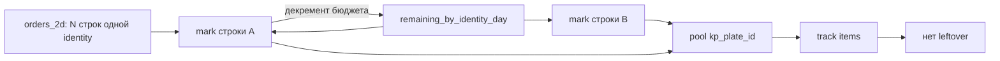

# Spec: Исправление orphan `kp_plates` при commit плана

> **Тип:** bugfix + regression suite  
> **Фаза SDD:** SPECIFY → PLAN → TASKS → IMPLEMENT  
> **Дата:** 2026-07-21  
> **Статус:** реализовано  
> **План реализации:** [`../develop/plans/2026-07-21-fix-orphan-kp-plates-commit.md`](../develop/plans/2026-07-21-fix-orphan-kp-plates-commit.md)  
> **План Cursor (черновик):** [`fix_orphan_kp_plates_305ed643.plan.md`](file:///home/roman/.cursor/plans/fix_orphan_kp_plates_305ed643.plan.md)  
> **Доказательства:** `reports/plate_loss_regression_20260721_120437.md`, `reports/plate_loss_regression_20260721_123805.md`, БД `tmp/plate_loss_regression/plita_regression.db`  
> **Фикстура:** `tests/fixtures/regression/roman_20260503_plates.txt`

---

## Objective

Устранить расхождение «учёт ≠ раскладка» после `commit_plan_plates`: в БД появляются строки `kp_plates` со статусом **«в плане»**, на которые **нет** ссылок `kp_plate_id` с дорожек (orphan).

**Простыми словами:**

| Слой | Что видит |
|------|-----------|
| Завод / схема | плиты на дорожке (items) |
| База | строки учёта («позиция занята планом») |
| Связь | `item.kp_plate_id` → `kp_plates.id` |

Сейчас учёту иногда записывают **больше**, чем привязали к раскладке. Orphan не виден в day_view / «день выполнен» → в КП остаётся хвост «в плане».

**Пользователи:** производство (список дня, complete_day), менеджер (статус КП).  
**Успех:** после commit для каждого `(plan_id, day_number)`:

`Σ kp_plates.qty` = число ссылок `kp_plate_id` в items + `secondary_cuts` этого дня;

на фикстуре roman_20260503 — **orphan qty = 0**.

---

## Problem statement (runtime evidence)

### Симптом (регрессия)

На фикстуре `roman_20260503` (871 плит):

| Уровень | Результат |
|---------|-----------|
| Оптимизатор / coverage | OK |
| Баланс БД (всё «в плане») | OK |
| Orphan day_view | **WARN: Σ delta = 15** на 4 из 18 дней |

Примеры из отчёта:

| День | Orphan |
|------|--------|
| 1 | `77-12-8п` id=217 qty=2 unreferenced |
| 2 | `60-6,65-8п` qty_mismatch; `54,3-5,3-8п` id=199; `58-3,2-8п` id=202 |
| 3 | `45-12-8п` id=191, id=192 |
| 8 | `73-12-8п` id=212 qty=4 |

Это **не** «плита пропала с формы», а **лишняя галочка в учёте без картинки**.

### Корень (H1 CONFIRMED)

В [`core/plan_commit.py`](../../core/plan_commit.py) → `commit_plan_plates`:

1. Считается `counts_by_identity_and_day` (сколько физических items на identity+день).
2. Цикл по `(order, qty_to_mark)` из `orders_with_qty`.
3. Для каждой строки: `take = min(per_day[d], remaining)` **без декремента** `per_day`.

Если в `orders_2d` / seed КП **две+ строки с одним** `(kp_id, plate_name)`:

- первая строка забирает слоты ранних дней;
- вторая снова видит тот же `per_day` и **повторно** помечает те же дни;
- в пул `ids_by_identity_day` попадает больше id/qty, чем items на дорожке;
- link назначает слоты items → остаток пула = **orphan**.

Код (текущее поведение):

```python
for d in ordered_days:
    take = min(per_day[d], remaining)  # per_day не уменьшается между order-строками
```

### Подтверждение фикстурой

Все orphan-имена — **дубликаты строк** во входе:

| plate_name | Строки qty | Σ |
|------------|------------|---|
| `Плиты ПБ 77-12-8п` | 5 + 2 | 7 |
| `Плиты ПБ 45-12-8п` | 6 + 10 | 16 |
| `Плиты ПБ 73-12-8п` | 93 + 4 | 97 |
| `Плиты ПБ 54,3-5,3-8п` | 6 + 6 | 12 |
| `Плиты ПБ 58-3,2-8п` | 3 + 1 | 4 |
| `Плиты ПБ 60-6,65-8п` | 2 + 2 | 4 |

### Подтверждение БД после регрессии

`tmp/plate_loss_regression/plita_regression.db`, план `plan_20260721_123804`:

- день 1, `77-12-8п`: **id=94 qty=2** и **id=217 qty=2** (оба `day_number=1`) → 217 orphan;
- день 3, `45-12-8п`: несколько id с `day_number=3`, в т.ч. 191/192 orphan;
- день 8, `73-12-8п`: id=212 qty=4 на day=8 orphan рядом с крупной строкой day=8.

Симуляция для day1 cap=2 и заказов `[5, 2]` без бюджета: marked day1=4 → orphan=2 (совпадает с отчётом).

### Отклонённые / вторичные гипотезы

| ID | Гипотеза | Статус |
|----|----------|--------|
| H1 | Дубликаты order-строк + не mutual `per_day` | **CONFIRMED** — корень |
| H2 | После link leftover в пуле | следствие H1 |
| H3 | Item без identity | не объясняет дни с orphan id |
| H4 | `qty_to_mark` > sum(per_day) → undated | не основной путь на этой фикстуре |
| H5 | Mark без day при пустом per_day | не основной путь |

---

## Scope

### In scope

1. **Фикс** в `core/plan_commit.py` → `commit_plan_plates`:
   - общий **mutable бюджет** дней на identity;
   - safety-net: leftover в пуле после link → `PlanCommitError` + откат `return_plan_plates_to_production`;
   - убрать временную диагностику `#region agent log` / `_agent_dbg` (если осталась).
2. **Unit-тест** в `tests/test_plan_commit.py`: две строки `orders_2d` с одной identity.
3. **Регрессия** `scripts/run_plate_loss_regression.py`: при `orphan_total_qty > 0` — **FAIL** и ненулевой exit code.
4. Прогон на `tests/fixtures/regression/roman_20260503_plates.txt`.

### Out of scope

- Досписание orphans в `complete_day` / day_view (маскирует баг; follow-up только для уже залипших прод-планов).
- Мерж дубликатов на seed/load КП (реальный кейс — несколько строк `kp_plates` с одним именем; commit должен это переживать).
- Изменения оптимизатора / геометрии дорожек.
- Heal-скрипты по прод-БД (отдельная задача после фикса).

---

## Assumptions

1. Identity ключ остаётся `(kp_id, canonical(plate_name))` — как сейчас в commit.
2. `distribute_assigned_plates_to_orders` уже корректно делит `qty_to_mark` по строкам; чиним только **day allocation / mark**.
3. При исчерпании бюджета дней остаток строки либо уходит на следующие дни бюджета, либо (если бюджета нет) — существующая ветка mismatch / no-per-day; не вводим молчаливый overbook.
4. `PlanCommitError` на leftover пула допустим: лучше откатить план, чем тихо оставить orphan.
5. Диагностические `_agent_dbg` в `plan_commit.py` — временные; в мерж не входят.

→ Если допущение неверно — поправить спеку до кода.

---

## Tech Stack

Без новых зависимостей: Python 3, SQLite `kp_plates`, pytest, существующий `venv/`.

Ключевые модули:

| Модуль | Роль |
|--------|------|
| `core/plan_commit.py` | mark + link `kp_plate_id` |
| `core/kp_db_plates_planning.py` | `mark_plates_as_planned`, rollback |
| `app/services/day_view_service.py` | `plates_info` только по linked id |
| `scripts/run_plate_loss_regression.py` | E2E orphan gate |

---

## Commands

```bash
# Unit на commit
./venv/bin/python -m pytest tests/test_plan_commit.py -q

# Новый кейс (после добавления) — по имени теста
./venv/bin/python -m pytest tests/test_plan_commit.py -q -k duplicate_orders

# Регрессия потери плит (gate: orphan == 0)
./venv/bin/python scripts/run_plate_loss_regression.py

# Узкая проверка связанных тестов планирования
./venv/bin/python -m pytest tests/test_production_planning_service.py tests/test_plan_commit.py -q
```

---

## Project Structure

```
core/
  plan_commit.py                 ← фикс бюджета + leftover assert
  kp_db_plates_planning.py       ← без изменений API (используем как есть)

tests/
  test_plan_commit.py            ← кейс двух order-строк одной identity
  fixtures/regression/
    roman_20260503_plates.txt    ← E2E фикстура

scripts/
  run_plate_loss_regression.py   ← FAIL при orphan_total_qty > 0

ai_docs/specs/
  fix-orphan-kp-plates-commit.md ← этот документ

reports/
  plate_loss_regression_*.md     ← артефакты прогонов
```

---

## Code Style

Следовать существующему стилю `commit_plan_plates`:

- typing, docstring на русском для доменных шагов;
- логирование через `logger` (`[PLAN_COMMIT] ...`);
- при ошибке mark/mismatch — уже есть rollback; leftover pool использует тот же путь;
- не дублировать подсчёт identity — переиспользовать `_count_track_items_by_day` / `_identity_for_track_item`.

**Целевой фрагмент (эскиз):**

```python
# mutable budget: копия counts_by_identity_and_day
remaining_by_identity_day: dict[OrderIdentity, dict[int, int]] = {
    ident: dict(days) for ident, days in counts_by_identity_and_day.items()
}

# в аллокации дня:
budget = remaining_by_identity_day.get(identity) or {}
take = min(budget.get(d, 0), remaining)
if take > 0:
    budget[d] -= take
    remaining -= take
    day_alloc.append((d, take))

# после link:
if any(rem > 0 for days in ids_by_identity_day.values() for pool in days.values() for _, rem in pool):
    kp_db_plates.return_plan_plates_to_production(plan_id, db_path)
    raise PlanCommitError("После привязки kp_plate_id остались непокрытые слоты пула (orphan).")
```

---

## Proposed solution



### 1. Общий бюджет `per_day`

- Перед циклом по `orders_with_qty` — **mutable копия** `remaining_by_identity_day`.
- `take = min(remaining_by_identity_day[identity][d], remaining)`; затем `-= take`.
- Та же логика в ветке `total_in_days < qty_to_mark`.

### 2. Safety-net после link

Если в `ids_by_identity_day` остался `remaining > 0`:

- `logger.error` с деталями leftover;
- `return_plan_plates_to_production(plan_id, db_path)`;
- `raise PlanCommitError(...)`.

### 3. Регрессия = жёсткий критерий

`orphan_total_qty > 0` → вердикт **FAIL**, `sys.exit(1)` (сейчас WARN).

---

## Testing Strategy

| Уровень | Что | Где |
|---------|-----|-----|
| Unit | Две order-строки, одна identity; tracks на 2 дня; все `kp_plate_id` покрывают qty; нет unreferenced id | `tests/test_plan_commit.py` |
| Unit | (опционально) leftover pool → `PlanCommitError` (можно через monkeypatch / синтетический over-mark) | там же |
| E2E regression | Фикстура roman_20260503; orphan Σ = 0; exit 0 | `scripts/run_plate_loss_regression.py` |
| Smoke | Существующие `test_plan_commit.py` / planning service | pytest |

**Инвариант для assert (день):**

```
db_qty(plan_id, day) == count_refs(kp_plate_id in tracks of day)
для каждого plate_id: refs >= 1 если строка «в плане» на этом дне
# эквивалентно: нет orphan unreferenced / qty_mismatch
```

---

## Boundaries

**Always:**

- Писать failing unit до фикса (TDD).
- После фикса — зелёный `test_plan_commit` + regression exit 0.
- Откат БД при leftover пула (не оставлять полузакоммиченный план).

**Ask first:**

- Менять семантику `complete_day` / day_view.
- Миграции / heal уже существующих orphan в прод-БД.
- Менять формат `orders_2d` или слияние дубликатов при импорте КП.

**Never:**

- «Лечить» orphan только в UI (plates_info из всех строк дня без ссылок).
- Списывать unreferenced id в `complete_day` как основной фикс.
- Коммитить секреты / прод-дампы БД.
- Оставлять `_agent_dbg` в мерже.

---

## Success Criteria

1. Unit: две строки одной identity → все items имеют `kp_plate_id`, нет unreferenced `kp_plates` на затронутых днях.
2. `./venv/bin/python scripts/run_plate_loss_regression.py` → **orphan Σ = 0**, exit code 0.
3. Баланс «все 871 в плане» на фикстуре сохраняется (не чиним ценой недопометки спроса без явной ошибки).
4. При искусственном leftover пула — `PlanCommitError` и откат статуса плит плана.
5. Спека и план согласованы; временные debug-логи удалены.

---

## Implementation tasks

- [x] **Task: Mutable day budget in `commit_plan_plates`**
  - Acceptance: повторный mark той же identity не превышает оставшийся `per_day`; leftover pool → error + rollback
  - Verify: `pytest tests/test_plan_commit.py -q`
  - Files: `core/plan_commit.py`

- [x] **Task: Unit — duplicate order lines same identity**
  - Acceptance: 2+2 qty, tracks по дням, покрытие `kp_plate_id` полное
  - Verify: `pytest tests/test_plan_commit.py -k duplicate -q`
  - Files: `tests/test_plan_commit.py`

- [x] **Task: Regression FAIL on orphan > 0**
  - Acceptance: скрипт падает на старом баге, зеленеет после фикса; отчёт отражает FAIL/OK
  - Verify: `./venv/bin/python scripts/run_plate_loss_regression.py`
  - Files: `scripts/run_plate_loss_regression.py`

- [x] **Task: Cleanup debug instrumentation**
  - Acceptance: нет `_agent_dbg` / `#region agent log` в `plan_commit.py`
  - Verify: `rg "_agent_dbg|debug-c54f9e" core/plan_commit.py` пусто
  - Files: `core/plan_commit.py`

---

## Risks

| Риск | Митигация |
|------|-----------|
| После бюджета часть `qty_to_mark` не найдёт день → mismatch path / undated | Логировать; unit на дубликаты; не overbook |
| Safety-net начнёт ронять планы, которые «раньше проходили» с orphan | Это желаемо; regression станет красной до фикса |
| Прод уже содержит orphan | Out of scope; отдельный recover/heal |

---

## Open Questions

1. Нужен ли сразу follow-up «heal» для уже залипших планов в прод, или достаточно фикса на новые commit?
2. При нехватке бюджета дней после декремента: предпочитаем `PlanCommitError` сразу или текущую ветку «остаток без day_number» (она сама создаёт невидимые в day_view строки)?  
   **Рекомендация спеки:** не создавать undated «в плане» молча; либо распределить по оставшимся дням бюджета, либо ошибка commit.

---

## References

- Диагностика debug-сессии: гипотезы H1–H5, логи в `core/plan_commit.py` (временные).
- Отчёты: `reports/plate_loss_regression_20260721_120437.md`, `*_123805.md`.
- Связанный UX-симптом: day_view `aggregate_plates_for_track_from_db` считает только items с `kp_plate_id`.
- Обратная операция: `ai_docs/develop/features/remove-track-from-plan.md` (симметрия commit ↔ return).
