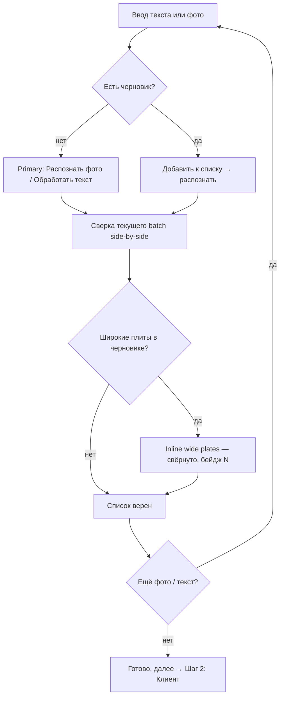
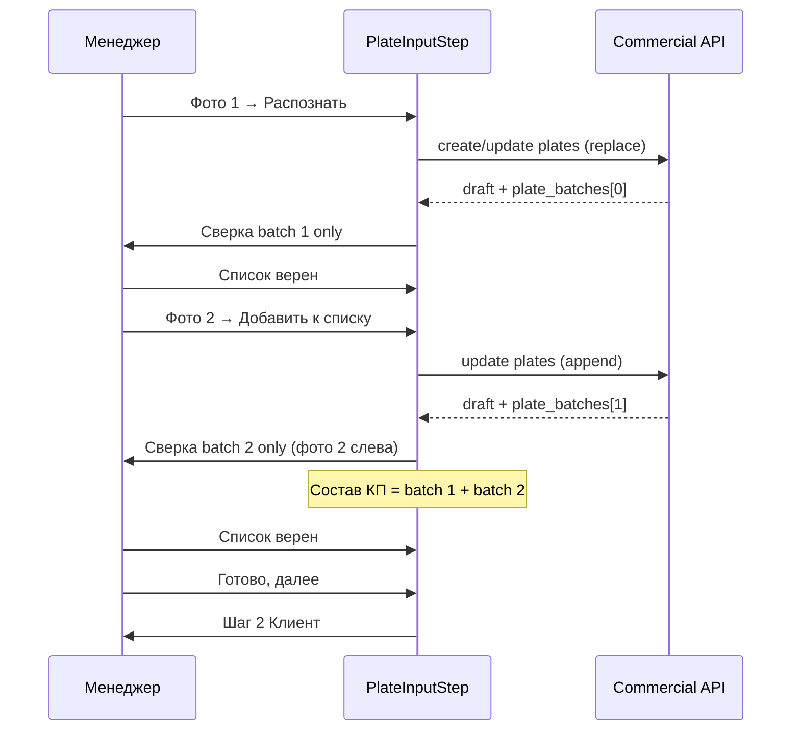
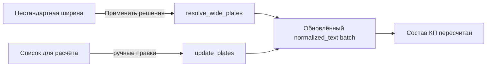

# Spec: UX менеджера — редизайн мастера КП (3 шага)

> Источник: [manager-ux-improvements.md](../ideas/manager-ux-improvements.md)  
> Статус: **утверждено (v1.2 — синхронизация списка)**  
> Версия: v1 (мастер) + v1.1 (batch-сверка) + v1.2 (список ↔ wide plates) + v2 (архив)

## Objective

Дать менеджеру по продажам быстрый и понятный путь **«фото/текст → проверенный список плит → документы клиенту»** в веб-кабинете, без лишних шагов, технического жаргона и страха отправить ошибочное КП.

**Пользователь:** менеджер, 5–20 КП в день, канал — только веб (Telegram не используется).

**Успех выглядит так:**
- Мастер сокращён с 5 до 3 шагов без потери контроля над OCR и широкими плитами.
- После распознавания фото менеджер видит side-by-side сверку **только по текущему источнику** и явно подтверждает batch; суммарный состав КП — отдельным блоком.
- Менеджер по умолчанию подставляется из профиля; смена — в раскрывающемся блоке на шаге «Клиент».
- На финале — чеклист готовности и понятные кнопки выгрузки файлов.
- Роль `manager` не видит пункт «Производство» в шапке.

### User stories (v1)

| # | Как менеджер… | Хочу… | Чтобы… |
|---|---------------|-------|--------|
| US-1 | получил список с фото | увидеть фото слева и редактируемый список справа | убедиться, что OCR не ошибся |
| US-2 | на шаге плит | одну primary-кнопку «Распознать» / «Обработать текст» | не выбирать из 4–5 кнопок |
| US-3 | встретил широкую плиту | решить её на том же шаге | не переходить на отдельный экран |
| US-4 | оформляю КП | видеть себя менеджером по умолчанию | не проходить отдельный шаг |
| US-5 | иногда оформляю за коллегу | сменить менеджера в блоке «Другой менеджер» | не терять гибкость |
| US-6 | на финале | видеть чеклист (плиты, клиент, сумма, предупреждения) | не отправить неполное КП |
| US-7 | в шапке | не видеть «Производство» | не попадать на редирект |
| US-8 | добавляю второе фото к уже утверждённому списку | сверять только новое фото и его строки | не перепроверять старые позиции |
| US-9 | собрал КП из нескольких фото | видеть суммарный «Состав КП» и править строки там | исправить ошибку без повторного OCR |
| US-10 | закончил добавлять плиты | нажать «Готово, далее» и перейти к клиенту | явно отделить «утвердил batch» от «закончил ввод» |
| US-11 | исключил или заменил широкую плиту | сразу увидеть изменения в «Списке для расчёта» и «Составе КП» | список для расчёта всегда отражает актуальные позиции |
| US-12 | исправил строку в «Списке для расчёта» | чтобы правка учитывалась при расчёте КП | не терять ручные корректировки OCR |

## Assumptions (явные)

1. **Канал — только веб-кабинет** (`frontend/`), Telegram-бот вне scope.
2. **Черновики остаются в localStorage** до отдельной задачи server-side drafts.
3. **Сервер — источник истины** для `wizard_state`; фронт синхронизирует UI с `CommercialWizardState`.
4. **Связь auth ↔ менеджер** уже есть: `app_users.manager_id` → `AuthUser.manager_id` (см. `app/repositories/auth_repository.py`, `frontend/src/features/auth/model/types.ts`). В v1 используем это поле; если `manager_id` null — показываем выбор менеджера без дефолта.
5. **Мобильная вёрстка, AI-чат, onboarding-туры** — out of scope v1.
6. **Автопереход** на шаг 2 после OCR **не делаем** — переход на «Клиент» только по кнопке **«Готово, далее»**; подтверждение batch — отдельной кнопкой **«Список верен»** (**решение заказчика**).
7. **Режимы сохранения:** дефолт **«В работе»**; «В архив» и «Пропустить» — в выпадающем «Другой вариант сохранения» (**решение заказчика**).
8. **manager_id = null:** обязательный выбор менеджера в раскрытом блоке, без дефолта (**решение заказчика**).
9. **Многофото:** сверка OCR работает в контексте **текущего batch** (`plate_batches[-1]`); накопительный итог — в блоке «Состав КП (предпросмотр)» по всему `order_data` (**решение заказчика, 2026-07-13**).

## Tech Stack

| Слой | Стек |
|------|------|
| Frontend | React 18, Vite, TypeScript, React Query |
| Backend | FastAPI, Pydantic v2, SQLite |
| Тесты | pytest (`tests/`), Vitest (frontend `*.test.ts(x)`) |
| OCR | `core/ocr/`, `commercial_draft_service.py` |

## Commands

```bash
# Backend (из корня, venv активирован)
uvicorn app.main:app --reload
pytest tests/ -q
pytest tests/test_commercial_wizard_step_service.py -q   # после изменений шагов

# Frontend (из frontend/)
npm run dev
npm run build
npm test
npm test -- wizardDraftStore
```

## Project Structure

```
frontend/src/features/commercial-offer/
  components/
    CommercialOfferWizard.tsx      # оркестратор шагов
    WizardProgress.tsx             # сайдбар: 3 шага
    steps/
      PlateInputStep.tsx           # шаг 1: ввод + сверка + wide plates inline
      ClientConditionsStep.tsx     # шаг 2: клиент + менеджер (collapsed)
      CalculationResultStep.tsx    # шаг 3: чеклист + файлы + сохранение
  lib/wizardStepOrder.ts           # ["plates", "client", "result"]
  types/commercialOffer.ts         # WizardStepId (3 значения)
  store/wizardDraftStore.tsx       # localStorage + merge с сервером

app/services/commercial_wizard_step_service.py  # infer can_proceed_to для 3 шагов
app/schemas/commercial.py                       # WizardStepId enum

frontend/src/app/layout/AppHeader.tsx           # скрыть «Производство» для manager
frontend/src/shared/lib/roleRoutes.ts             # RBAC маршрутов (без изменений логики)

ai_docs/
  ideas/manager-ux-improvements.md
  specs/manager-ux-redesign.md                    # этот документ
  plans/manager-ux-redesign.md                    # план реализации
```

## Архитектура: 3-шаговая модель

### Текущее → целевое

| Текущий шаг | Судьба в v1 |
|-------------|-------------|
| `plates` | **Шаг 1 «Плиты»** — ввод, OCR, side-by-side сверка |
| `wide-plates` | **Inline** в шаг 1 (collapsible до «Далее») |
| `manager` | **Merge** в шаг 2 «Клиент» (collapsed «Другой менеджер») |
| `client` | **Шаг 2 «Клиент»** |
| `result` | **Шаг 3 «Результат»** |

### Канонический `WizardStepId` (v1)

```typescript
export type WizardStepId = "plates" | "client" | "result";
```

Backend `WizardStepId` — те же три значения. Старые значения (`wide-plates`, `manager`) — **legacy aliases** при чтении черновиков:

| Legacy step | Маппинг |
|-------------|---------|
| `wide-plates` | `plates` |
| `manager` | `client` |

### Поток шага 1 «Плиты»



**UI-режимы шага 1:**
1. **Ввод** — primary «Распознать фото» / «Обработать текст»; secondary **«Добавить к списку»** при наличии черновика.
2. **Сверка (текущий batch)** — side-by-side: фото/источник слева, **textarea** справа **только с позициями текущего batch**; подсветка `ocr_corrections` / `unparsed_lines` — **только для текущего batch**.
3. **Состав КП (предпросмотр)** — **суммарный** список по всем утверждённым batch; редактирование строк здесь с пересчётом (правка ранее добавленных позиций без повторного OCR).
4. **Широкие плиты** — collapsible, **свёрнуто** с бейджем «N позиций требуют внимания». Блокируют шаг, пока **не решены все** широкие плиты в черновике (включая из предыдущих batch). Решения **синхронизируются** со «Списком для расчёта» и «Составом КП» (см. ниже).
5. **Дополнительно** (collapsed): «Заменить список», «ИИ» — редкие сценарии.

**Две primary-CTA на шаге 1 (не путать):**

| Кнопка | Когда | Действие |
|--------|-------|----------|
| **«Список верен»** | После сверки текущего batch | Утверждает batch, **остаёмся на шаге 1**, можно добавить ещё фото/текст |
| **«Готово, далее»** | Когда ввод плит завершён | Переход на шаг 2 «Клиент» (disabled, если есть нерешённые wide plates или незавершённая сверка) |

**Тексты (бизнесовые, не технические):**
- «Нормализованный результат» → «Список плит для расчёта»
- «backend» / «12 дм» → «шире стандартной, рекомендуем заменить на …»
- Подтверждение batch: **«Список верен»**
- Завершение ввода плит: **«Готово, далее»**

### Многофото: batch vs cumulative (v1.1)

Шаг 1 разделяет **два контекста данных** — это разные зоны UI, не один список.

| Зона UI | Данные | Назначение |
|---------|--------|------------|
| **Сверка OCR** (side-by-side) | Только **текущий batch** — последний распознанный источник (`plate_batches[-1]`: `normalized_text`, `filename`, `ocr_text`) | Сверить фото/текст с распознанными строками **этого** источника |
| **Состав КП (предпросмотр)** | **Суммарный** список по всему черновику (`order_data` / `buildKpPreviewRows`) | Увидеть итог КП, отредактировать любую позицию, пересчитать |

**Правила batch:**

1. **Первое фото/текст** — после распознавания сверка показывает весь batch (он же единственный).
2. **«Добавить к списку»** (append) — после распознавания в сверке **только новые строки** и **новое фото**; строки из ранее утверждённых batch **не показываются** в textarea сверки.
3. **«Список верен»** — фиксирует текущий batch как утверждённый; UI возвращается в режим ввода (можно добавить ещё источник).
4. **Текстовое добавление** — та же логика, что у фото: сверка только новых строк, состав — суммарный.
5. **Правка старых позиций** — через редактирование в **«Составе КП»**, не через повторную сверку старого фото.
6. **Широкие плиты** — проверяются по **всему черновику**; «Список верен» и «Готово, далее» disabled, пока есть нерешённые wide plates в любом batch.
7. **Подсветка OCR** (`ocr_corrections`, `unparsed_lines`, `wide_plate_lines`) — **только для текущего batch** в зоне сверки.

**Источник данных на backend:** `metadata.plate_batches[]` уже хранит per-batch `normalized_text`, `filename`, `source_type`. Фронт при сверке читает последний batch; при отображении состава — полный `draft.order_data`.



### Синхронизация: список для расчёта ↔ wide plates ↔ состав КП (v1.2)

На шаге 1 три связанных представления одних и тех же позиций должны оставаться **согласованными**. Пользователь не должен видеть в «Списке для расчёта» строки, которые уже исключены, или наоборот — предупреждения о плитах, которых в списке уже нет.

| Представление | Роль |
|---------------|------|
| **Список плит для расчёта** (textarea в сверке) | Редактируемый текст **текущего batch** — источник правды для подтверждения batch |
| **Нестандартная ширина** (inline wide plates) | Решения по проблемным строкам: подтвердить / заменить / исключить |
| **Состав КП (предпросмотр)** | Суммарный пересчитанный результат по черновику (`order_data`) |

**Правила синхронизации:**

1. **«Применить решения» (wide plates)** — **немедленно** обновляет:
   - «Список плит для расчёта» (текущий batch): исключённые строки **удаляются**, заменённые — **подставляются** новые позиции;
   - «Состав КП» — **пересчитывается** с сервера (`generate_preview` / `order_data`).
2. **Исключить** в блоке wide plates ≡ **удаление строки** из «Списка для расчёта»; предупреждение по этой позиции снимается.
3. **Заменить** в блоке wide plates ≡ **замена строки** в «Списке для расчёта» на указанные позиции (в т.ч. авто-рекомендация split).
4. **Подтвердить** — строка **остаётся** в «Списке для расчёта» без изменений; позиция помечается как принятая.
5. **Ручное редактирование** «Списка для расчёта» (исправление OCR, изменение количества, удаление строки):
   - учитывается при **«Список верен»** и далее в расчёте КП;
   - если менеджер **вручную удалил** строку широкой плиты — это **эквивалентно «Исключить»** (предупреждение снимается, строка не участвует в расчёте);
   - если менеджер **вручную изменил** строку так, что она больше не широкая — предупреждение по старой строке снимается после пересчёта/сохранения.
6. **Порядок операций:** менеджер может сначала править textarea, затем нажать «Применить решения» (или наоборот). Итоговый текст списка — результат **последней синхронизации** с сервером; конфликты не показываются отдельным диалогом — серверный `resolve_wide_plates` / `update_plates` пересобирает список и отдаёт актуальный draft.
7. **«Список верен»** сохраняет **текущее содержимое** «Списка для расчёта» (включая все ручные правки и результаты wide plates) в batch и на сервер.



**Тексты UI (wide plates):**
- Заголовок блока: **«Нестандартная ширина»**
- Действия: **Подтвердить** / **Заменить** / **Исключить**
- CTA блока: **«Применить решения»** (не «далее» — это не навигация)

### Поток шага 2 «Клиент»

- Поля: имя клиента, режим условий (стандартные по умолчанию / индивидуальные).
- **Менеджер:** по умолчанию `user.manager_id` (если есть в справочнике `managers` API).
- Блок **«Другой менеджер»** (collapsed): select из `GET /api/v1/managers`.
- Submit → `updateMeta` + `calculate` → переход на `result`.

### Поток шага 3 «Результат»

- **Чеклист готовности** (новый блок вверху):
  - ✓ N плит
  - ✓ Клиент: {имя}
  - ✓ Сумма: {форматированная}
  - ⚠ Предупреждения (если есть `metadata.warnings`, `unparsed_lines`)
- Скидка / логистика (как сейчас).
- Кнопки файлов — **контекстные** (не все сразу): PDF, Excel, схема — по наличию в `draft.files` / флагам.
- Сохранение: primary **«В работе»**; «В архив» и «Пропустить» — в «Другой вариант сохранения».

## Code Style

Следуем существующим паттернам feature-модуля `commercial-offer`:

```tsx
// StepLayout + Card + primary/ghost Button — как в PlateInputStep
<StepLayout
  title="Шаг 1. Плиты"
  description="Загрузите фото или вставьте список, затем сверьте распознанные позиции."
  footer={
    <>
      <Button variant="primary" onClick={onConfirmBatch} disabled={hasPendingReview}>
        Список верен
      </Button>
      <Button variant="secondary" onClick={onFinishPlates} disabled={!canProceedToClient}>
        Готово, далее
      </Button>
    </>
  }
>
  {/* side-by-side: current batch image | current batch plate list */}
  {/* KpPlatePreviewPanel: cumulative order_data */}
</StepLayout>
```

- Типы шагов — единый `WizardStepId` на фронте и в `app/schemas/commercial.py`.
- Тексты ошибок — русские, без внутренних терминов; маппинг server `validation_errors` без изменения смысла.
- Стили — inline + существующие CSS-классы (`wizard-shell`, `app-header`); без нового UI-фреймворка.

## Testing Strategy

| Уровень | Что покрываем | Где |
|---------|---------------|-----|
| Unit (backend) | `infer_can_proceed_to`, legacy step aliases, wide plates блокируют переход plates→client | `tests/test_commercial_wizard_step_service.py` |
| Unit (frontend) | `WIZARD_STEP_ORDER`, merge localStorage step с сервером, маппинг legacy steps, batch-only review text vs cumulative preview | `wizardDraftStore.test.tsx`, `wizardStepOrder.test.ts`, `PlateInputStep` / batch helpers |
| Component | Client step: default manager from auth | `ClientConditionsStep.test.tsx` (новый) |
| Integration | Полный flow create draft → plates → client → result; wide plates exclude/replace → список и состав обновлены | commercial API tests, manual |
| Manual | Think-aloud с менеджером (5 КП) | чеклист в плане |

**Coverage expectation:** все изменения в `commercial_wizard_step_service.py` и `wizardStepOrder.ts` — тесты обязательны. UI — smoke через `npm run build` + ручная проверка.

## Boundaries

### Always
- Запускать `pytest tests/` для затронутых backend-модулей.
- Запускать `npm run build` после существенных frontend-изменений.
- Сохранять обратную совместимость черновиков (legacy step aliases).
- RBAC на API не ослаблять — скрытие «Производство» только UX.

### Ask first
- Изменение схемы БД (`app_users`, managers).
- Новые npm-зависимости.
- Удаление legacy step values из API (только после периода миграции).

### Never
- Коммитить секреты (`bot.env`, `*.env`).
- Удалять выбор менеджера полностью.
- Делать «Скачать всё» без выбора наборов файлов.
- 2-экранный flow в v1.

## Success Criteria (v1)

### Функциональные
- [ ] `WIZARD_STEP_ORDER` = `["plates", "client", "result"]` на фронте и в backend enum.
- [ ] Шаг 1: после OCR — side-by-side **текущего batch**; «Список верен» утверждает batch; «Готово, далее» → клиент; wide plates inline.
- [ ] Шаг 1 (многофото): append показывает в сверке только новый batch; «Состав КП» — суммарный список; правка старых позиций — в составе.
- [ ] Шаг 1 (синхронизация): «Применить решения» по wide plates сразу обновляет «Список для расчёта» и пересчитывает «Состав КП»; ручные правки textarea учитываются при «Список верен»; ручное удаление широкой строки ≡ «Исключить».
- [ ] Шаг 1: режимы append/replace/ИИ — в collapsed «Дополнительно».
- [ ] Шаг 2: `user.manager_id` подставляется автоматически; смена в «Другой менеджер».
- [ ] Шаг 3: чеклист (плиты, клиент, сумма, предупреждения).
- [ ] AppHeader: пункт «Производство» скрыт для `role === "manager"`.
- [ ] Legacy черновики с `wide-plates` / `manager` открываются без ошибок.

### Нефункциональные
- [ ] `pytest tests/ -q` — green.
- [ ] `npm run build` — без ошибок.
- [ ] Нет регрессии: admin по-прежнему видит «Производство».

### Метрики (после релиза, 1–2 недели)
- Доля правок OCR после сверки (до/после).
- Время прохождения мастера (5 реальных КП, think-aloud).
- % новых КП с `manager_id` = logged-in user (ожидание >80%).

## Scope

### In (v1)
Всё из [MVP Scope](../ideas/manager-ux-improvements.md#mvp-scope) идеи.

### Out (v1) → v2+
| Фича | Версия |
|------|--------|
| «Создать КП на основе №…» из архива | **v2** |
| Server-side черновики | отдельная задача |
| Рабочий стол менеджера (дашборд) | v3+ |
| Мобильная вёрстка | backlog |
| AI-чат на каждом шаге | backlog |

## Решения заказчика (2026-07-13)

| # | Вопрос | Решение |
|---|--------|---------|
| OQ-1 | `manager_id = null` на шаге «Клиент» | **Обязательный выбор** менеджера (раскрытый блок, без дефолта) |
| OQ-2 | Режимы сохранения | **Дефолт «В работе»**; «В архив» и «Пропустить» — в «Другой вариант сохранения» |
| OQ-3 | Порядок выката | **Сначала Phase 0 (quick wins)**, затем 3-шаговый мастер |
| OQ-4 | Автопереход после OCR | **Нет** — «Список верен» утверждает batch; «Готово, далее» → клиент |
| OQ-5 | v2 duplicate: чей менеджер | **Текущий залогиненный пользователь** (если привязан) |
| OQ-7 | Широкие плиты inline | **Свёрнута** с бейджем «N позиций требуют внимания»; разворот по клику |
| OQ-8 | «Дополнительно» шаг 1 | **«Добавить к списку»** — на основном уровне (частый); **«Заменить» и «ИИ»** — в свёрнутом «Дополнительно» |
| OQ-9 | Формат списка в сверке | **Textarea** (как сейчас), не таблица строк в v1 |
| OQ-10 | v2 duplicate: что копировать | **Только позиции плит**; клиент и условия — заново |
| OQ-11 | v2 archive: скидка/логистика | **Кнопка «Изменить»** заметно в карточке архива |
| OQ-12 | После «Список верен» по фото | **Остаёмся на шаге 1**; на «Клиент» — отдельная кнопка **«Готово, далее»** |
| OQ-13 | Правка утверждённого batch | **Редактирование в «Составе КП»** с пересчётом |
| OQ-14 | Текстовое append | **Та же логика**, что у фото: сверка только новых строк |
| OQ-15 | Широкие плиты при append | **Блокируют шаг**, пока не решены **все** (включая старые batch) |
| OQ-16 | Подсветка OCR в сверке | **Только текущий batch** |
| OQ-17 | Ручное удаление широкой строки в списке | **Эквивалентно «Исключить»** — предупреждение снимается |
| OQ-18 | Когда exclude/замена попадают в список и состав | **Сразу после «Применить решения»** + немедленный пересчёт «Состава КП» |

## Связанные файлы (as-is)

| Область | Файлы |
|---------|-------|
| 5 шагов (сейчас) | `frontend/src/features/commercial-offer/lib/wizardStepOrder.ts` |
| Шаг 1 | `PlateInputStep.tsx` |
| Batch vs cumulative | `PlateInputStep.tsx`, `KpPlatePreviewPanel.tsx`, `plate_batches` в metadata |
| Backend batches | `commercial_workflow_service.py`, `commercial_draft_service.py`, `app/schemas/commercial.py` |
| Wide plates sync | `WidePlatesInlineSection.tsx`, `commercial_workflow_service.resolve_wide_plates` |
| Manager | `ManagerStep.tsx` → merge в `ClientConditionsStep.tsx` |
| Шапка | `AppHeader.tsx`, `roleRoutes.ts` |
| Backend steps | `commercial_wizard_step_service.py`, `app/schemas/commercial.py` |
| Auth → manager | `auth_repository.py`, `AuthUser.manager_id` |
