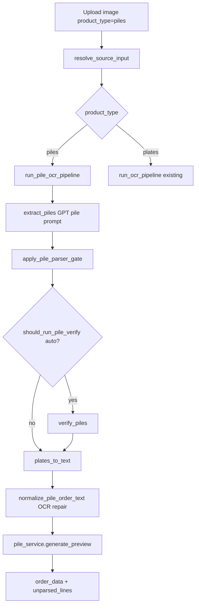

# Spec: Надёжное OCR свай + ускорение verify (плиты)

> **Источник идеи:** [`ai_docs/ideas/pile-ocr-reliability.md`](../ideas/pile-ocr-reliability.md)  
> **Родительская спека:** [`kp-piles.md`](./kp-piles.md) — закрывает gap по **Q7** (OCR с pile prompt)  
> **Фаза SDD:** SPECIFY ✅ → PLAN ✅ → IMPLEMENT ✅ (manual smoke pending)  
> **Plan:** [`ai_docs/develop/plans/2026-07-31-pile-ocr-reliability.md`](../develop/plans/2026-07-31-pile-ocr-reliability.md)  
> **Статус:** approved (2026-07-31, review Q&A)  
> **Связанные модули:** `CommercialDraftService`, `CommercialWorkflowService`, `core/ocr/*`, `core/pile_text_normalizer.py`, `core/pile_line_parser.py`, `core/pile_format_prompt.py`

---

## ASSUMPTIONS I'M MAKING

1. **Web-only** — wizard КП (`PileInputStep` / `CommercialOfferWizard`); Telegram вне scope.
2. **Провайдер OCR в prod — GigaChat** (`OCR_PROVIDER=gigachat`); MVP реализует pile extract+verify для GigaChat; OpenAI — только mocks/regression, без live parity в этом PR.
3. **JSON-контракт OCR** — тот же массив объектов (`raw_name`, `normalized_candidate`, `qty`, `confidence`, `issues`); для свай добавляется `concrete_grade`.
4. **Strict match марок** не меняем — OCR должен выдавать марку **как в прайсе**; normalizer только чинит типовые OCR-артефакты, не fuzzy-match.
5. **Verify** — режим `auto` по умолчанию; `always` / `never` через env без изменения кода.
6. **Batch-review UI** уже есть — при `verify_failed` или unparsed менеджер правит текст; цель — **реже** доходить до этого шага.
7. **Schema DB** не меняется.
8. **Марки пилотного скрина подтверждены в `pb.db`:** `С90.30-11`, `С110.30-13`, `С120.30-12` — по 5 классов бетона каждая (1590 строк в `pile_prices`).
9. **Default класс бетона при OCR** — **B25**, если на фото класс не указан (как в kp-piles spec).
10. **Fixture** — PNG пилотного скрина + mock GigaChat в CI (`tests/fixtures/pile_ocr/`).
11. **Verify для свай** — reuse plate verify prompt + pile JSON в draft (без отдельного pile verify prompt file).
12. **Ускорение OCR плит** — **D11 pending** (см. § Plate speed options); не блокирует pile MVP.

---

## Decisions locked

| # | Тема | Решение |
|---|------|---------|
| D1 | Направление | **A+C:** pile OCR pipeline + post-OCR normalizer |
| D2 | Цель надёжности | **≥95%** типовых фото (печатная/скрин таблица) → все строки в `order_data` без правки текста |
| D3 | Скорость | Качество важнее; target **1 API call** на чистых таблицах ≤10 строк; допустимо **2 calls** на сложных |
| D4 | Verify policy | **`auto`** с pile parser gate; не `always` |
| D5 | Scope плит | Ускорить за счёт корректного auto-skip verify (не новый провайдер) |
| D6 | Normalizer | Детерминированный, до `parse_pile_line`; не заменяет GPT |
| D7 | AI-инструкция `/piles/ai` | Уже на pile prompt — **не ломать**; унифицировать text conversion |
| D8 | Default grade после OCR | **B25** если класс не на фото |
| D9 | OCR provider MVP | **GigaChat-only** для pile pipeline; OpenAI — mocks/regression |
| D10 | Fixtures | **PNG пилота + mock GigaChat** в CI |
| D11 | Verify piles | **Reuse** plate verify + pile JSON |
| D12 | Ускорение плит | **P0 defer** — не трогаем plate OCR в этом PR (качество > скорость) |

---

## DB validation (2026-07-31)

Проверено в `/home/roman/project/Шишов/pb.db`:

| Марка (пилот) | В `pile_prices` | Пример цены (B25) |
|---------------|-----------------|-------------------|
| `С90.30-11` | ✅ 5 grades | ~25.7k ₽ |
| `С110.30-13` | ✅ 5 grades | ~37.0k ₽ |
| `С120.30-12` | ✅ 5 grades | ~36.2k ₽ |

→ После успешного OCR+parse менеджер должен видеть **цены**, не только состав.

---

## Plate speed options (D12 — locked: P0 defer)

Сейчас latency ~30 с – 1 мин при **2 API calls** (Extract + Verify). Verify включается в `auto` когда:

| Триггер | Default env | Эффект |
|---------|-------------|--------|
| `image_size_bytes > OCR_VERIFY_AUTO_MAX_BYTES` | **800 KB** | Фото с телефона часто >800 KB → **verify всегда** |
| `len(rows) > OCR_VERIFY_AUTO_MAX_ROWS` | 10 | Длинные таблицы → verify |
| `confidence < 0.92` или `parser_rejected` | — | verify |
| Все строки parsed + conf OK + маленький файл | — | **skip verify** (1 call) |

### Варианты

| ID | Что делаем | Выигрыш | Риск | Рекомендация |
|----|------------|---------|------|--------------|
| **P0 defer** | Плиты не трогаем в этом PR | 0 | 0 | ✅ **Для фокуса PR** |
| **P1 test-only** | Тест + doc: «3-row clean → 1 call»; без изменения prod | Документация | 0 | ✅ Если хотим зафиксировать baseline |
| **P2 skip-if-clean** | Skip verify при ≤20 rows + all parsed + conf OK **независимо от размера файла** | −15…30 с на типовых фото | Редкий пропуск ошибки qty на большом но чётком файле | ⚠️ После pile PR отдельно |
| **P3 tune bytes** | Поднять `OCR_VERIFY_AUTO_MAX_BYTES` (напр. 2–3 MB) | Меньше verify на phone photos | Больше verify-skipped на размытых больших файлах | ⚠️ Ask first + pilot |
| **P4 resize** | Сжимать image перед OCR | Меньше bytes + быстрее API | Новая логика, качество OCR | ❌ Out of scope |

**Рекомендация:** **P0** (defer) или **P1** (test-only) в этом PR; **P2** — отдельный маленький PR после pilot pile OCR с метриками `ocr_api_calls`.

---

## Objective

Менеджер загружает фото таблицы свай на шаге 1 wizard → получает заполненный **«Состав КП»** с ценами (если марка в прайсе), без ручного исправления «Сваи 90.30-11» → «С90.30-11».

### Проблема (as-is)

```
POST drafts?product_type=piles + image
  → resolve_source_input (без product_type)
  → recognize_text_smart → run_ocr_pipeline (PLATES)
  → apply_parser_gate (plate_line_parser)
  → plates_to_text
  → pile_line_parser FAIL → unparsed_lines, пустой состав
```

Баннер «Повторная проверка не удалась» — verify отработал на **plate**-данных и не спас ситуацию, добавив latency.

### User stories

| # | Как менеджер… | Я хочу… | Чтобы… |
|---|---------------|---------|--------|
| US-1 | загружаю фото «Сваи С90.30-11 189 шт» | увидеть строку в составе с qty=189 | не править OCR вручную |
| US-2 | загружаю фото 3–5 строк | получить результат за ~15 с | не ждать минуту |
| US-3 | OCR чуть ошибся («Сваи 90.30-11») | normalizer восстановил «С90.30-11» | система прощала типовые ошибки |
| US-4 | таблица нечёткая | verify автоматически включился | qty сверили с фото |
| US-5 | загружаю фото плит | по-прежнему plate pipeline | регрессии нет |
| US-6 | короткая таблица плит | 1 API call в auto | быстрее текущих 30 с |

### Reframed success criteria

| Требование | Измеримый критерий |
|------------|-------------------|
| «Надёжно» | **AC-1…AC-8** ниже — все green в pytest |
| «Не медленно» | **AC-4:** mock OCR на 3-row fixture → `ocr_api_calls == 1` |
| «95% auto-parse» | **AC-1:** fixture строк со скрина → 3/3 в `order_data`; pilot manual на 10+ фото — out of band |
| «Плиты не сломать» | **AC-9:** `test_commercial_web_flow.py` + OCR policy tests green |

---

## Tech Stack

| Слой | Стек |
|------|------|
| Backend | Python 3, FastAPI, **GigaChat 2 Max Vision** (prod), OpenAI (mocks only) |
| Domain | `core/pile_text_normalizer.py`, `core/pile_line_parser.py`, `core/pile_format_prompt.py` |
| OCR | `core/ocr/pipeline.py`, `parser_gate.py`, `verify_policy.py`, `providers/openai.py`, `providers/gigachat.py` |
| Services | `CommercialDraftService.resolve_source_input`, `CommercialWorkflowService._create_pile_draft` |
| Tests | pytest + mock providers (без live API в CI) |

---

## Commands

```bash
# Backend
source .venv/bin/activate

# OCR / pile unit tests
pytest tests/test_pile_line_parser.py tests/test_ocr_parser_gate.py tests/test_ocr_verify_policy.py -q
pytest tests/test_commercial_pile_flow.py -q
pytest tests/ -k "pile and (ocr or parser or normalizer)" -q

# Regression plates + commercial
pytest tests/test_commercial_web_flow.py tests/test_commercial_ocr_policy.py -q

# Frontend (без изменений UI в MVP — smoke optional)
cd frontend && npm run test && npm run build
```

**Проверка марок в pb.db (ручная, до pilot):**
```bash
sqlite3 pb.db "SELECT mark FROM pile_prices WHERE mark LIKE '%90.30%' OR mark LIKE '%110.30%' OR mark LIKE '%120.30%' LIMIT 20;"
```

---

## Project Structure

```
core/
  pile_text_normalizer.py     # EXTEND — OCR repair rules
  pile_line_parser.py         # unchanged (strict); normalizer feeds it
  pile_format_prompt.py       # EXTEND — few-shot «Сваи С90.30-11»
  ocr/
    pipeline.py               # NEW run_pile_ocr_pipeline OR product_type param
    pile_parser_gate.py       # NEW — parse_pile_line gate
    pile_verify_policy.py     # NEW or extend verify_policy (pile parse fn)
    result.py                 # piles_to_text or reuse plates_to_text
    providers/openai.py       # extract_piles / call_gpt_for_piles in pipeline
    providers/gigachat.py     # sync extract for piles
app/services/
  commercial_draft_service.py # product_type in resolve_source_input / extract_text_from_image
  commercial_workflow_service.py  # pass product_type=piles on pile paths
tests/
  test_pile_ocr_normalizer.py     # NEW
  test_pile_ocr_pipeline.py       # NEW (mock GPT)
  test_commercial_pile_flow.py    # EXTEND — image create with mock OCR
  fixtures/pile_ocr/              # NEW — pilot_table.png + lines.txt + mock responses
```

---

## Code Style

- Зеркалировать plate OCR: отдельные функции `apply_pile_parser_gate`, `should_run_pile_verify`, не if-else в 200 строк в одном файле.
- `product_type: Literal["plates", "piles"]` на границе `resolve_source_input`.
- Normalizer — чистые функции + dataclass result; каждое правило — отдельная функция с docstring «какой OCR-баг чинит».
- Пример normalizer rule:

```python
def _repair_missing_cyrillic_c_mark(line: str) -> str:
    """«Сваи 90.30-11 189» → «С90.30-11 189» (GPT оторвал С от марки)."""
    ...
```

---

## Testing Strategy

| Уровень | Что тестируем | Где |
|---------|---------------|-----|
| Unit | Normalizer rules (pilot strings) | `test_pile_ocr_normalizer.py` |
| Unit | Pile parser gate, pile verify policy | `test_ocr_parser_gate.py`, `test_ocr_verify_policy.py` |
| Integration | PNG fixture + mock GigaChat pile extract | `test_pile_ocr_pipeline.py`, `test_commercial_pile_flow.py` |
| Regression | Plate OCR unchanged | `test_commercial_web_flow.py` |
| Manual | 10 реальных фото mixed | checklist в report |

**Fixture strings (из пилота):**
```
Сваи 90.30-11 189
Свай 110.30-13 26
Свай 120.30-12 20
```
Expected after normalizer + parser:
```
С90.30-11  189
С110.30-13 26
С120.30-12 20
```

---

## Boundaries

**Always:**
- Mock external API в CI; не вызывать OpenAI/GigaChat в pytest
- Сохранять backward compat `recognize_text_smart()` для plates (default `product_type=plates`)
- Логировать `ocr_api_calls`, `ocr_verify_skipped_reason` в metadata draft

**Ask first:**
- Изменение default env (`OCR_VERIFY_AUTO_MAX_BYTES`, `OCR_MAX_API_CALLS`)
- Новые зависимости (PIL resize, tesseract)
- Изменение GigaChat prompt contract

**Never:**
- Fuzzy match марок в normalizer
- Commit secrets / API keys
- Удалять batch-review при verify_failed

---

## Architecture (target)



### Normalizer rules (MVP)

| Rule | Input | Output |
|------|-------|--------|
| R1 | `Сваи 90.30-11 189` | `С90.30-11 189` |
| R2 | `Свай 110.30-13 26` | `С110.30-13 26` |
| R3 | `… 189 шт` | `… 189` |
| R4 | Multiple spaces, dash variants | existing `_basic_cleanup` |

Применять **после** OCR text assembly, **до** `parse_pile_line`.

### Provider changes (MVP)

- **GigaChat (prod):** `_sync_extract_piles` + `_sync_verify_piles` (reuse verify prompt structure) с `build_pile_parser_system_prompt()`.
- **OpenAI:** `call_gpt_for_piles` остаётся для `/piles/ai`; pile upload pipeline в CI — **mock**, не live OpenAI.
- **Verify piles:** reuse `get_verification_prompt()` / plate verify flow; в user message — pile JSON draft.

---

## Acceptance Criteria

| ID | Критерий | Verify |
|----|----------|--------|
| AC-1 | Строки пилотного скрина после normalizer парсятся в 3 позиции `order_data` | `test_pile_ocr_normalizer.py` + parser |
| AC-2 | `POST drafts?product_type=piles` + PNG fixture (mock GigaChat) → 3 rows in `order_data` | `test_commercial_pile_flow.py` |
| AC-3 | Plate `POST drafts` + image (mock) → по-прежнему plate pipeline | regression test |
| AC-4 | Pile OCR mock: 3 rows, high confidence → `ocr_api_calls == 1`, verify skipped | `test_pile_ocr_pipeline.py` |
| AC-5 | Pile OCR mock: parser_rejected row → verify runs (`ocr_api_calls == 2`) | `test_pile_ocr_pipeline.py` |
| AC-6 | `apply_ai_piles_instruction` не регрессирует | existing test green |
| AC-7 | `pile_format_prompt` содержит пример «Сваи С90.30-11 … шт» | snapshot / string assert |
| AC-8 | Metadata содержит `ocr_method`, `ocr_verify_skipped_reason` или `ocr_verify_applied_reason` | integration assert |
| AC-9 | `pytest tests/test_commercial_web_flow.py tests/test_commercial_ocr_policy.py -q` green | CI |
| AC-10 | Plate speed (D12): per chosen option — defer = no code change; P1 = test documents auto-skip | optional |

---

## Open Questions

1. ~~Марки в pb.db~~ → **resolved** (см. DB validation)
2. ~~Fixture PNG~~ → **D10:** да, PNG + mock GigaChat in CI
3. ~~Verify prompt~~ → **D11:** reuse plate verify
4. ~~D12 Plate speed~~ → **P0 defer** (отдельный PR после pilot, если нужно)

---

## Success Criteria (Definition of Done)

- [ ] AC-1 … AC-10 выполнены
- [ ] Spec review approved
- [ ] Plan + tasks в `ai_docs/develop/plans/2026-07-31-pile-ocr-reliability.md`
- [ ] Manual smoke: загрузка фото свай в wizard → состав не пустой
- [ ] Report в `ai_docs/develop/reports/`

---

## Risks & Mitigations

| Risk | Mitigation |
|------|------------|
| GigaChat путает «Сваи» и марку | Normalizer R1/R2 + prompt few-shot |
| Марки нет в прайсе → null price | Отдельно от OCR; wizard validation уже блокирует |
| GigaChat pile extract quality | Mock + manual pilot; normalizer R1/R2 |
| Verify skip пропускает ошибку qty | auto только when **all** rows pass pile parser + confidence |
| Scope creep (image resize) | Explicitly out of MVP |

---

## Not Doing

- Tesseract / easyocr
- Client-side image compression
- Telegram bot
- Изменение strict pricing
- UI auto-fix buttons

---

## Next Steps (after spec approval)

1. Human review этого документа
2. PLAN: `ai_docs/develop/plans/2026-07-31-pile-ocr-reliability.md`
3. IMPLEMENT по tasks (TDD: normalizer → pipeline → wire draft service → integration tests)
