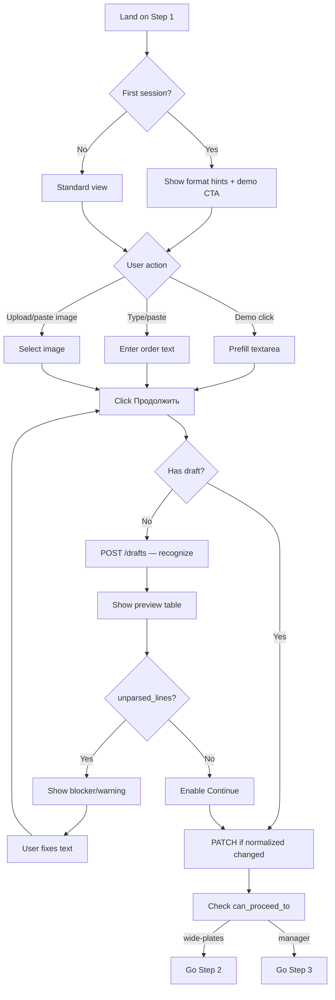
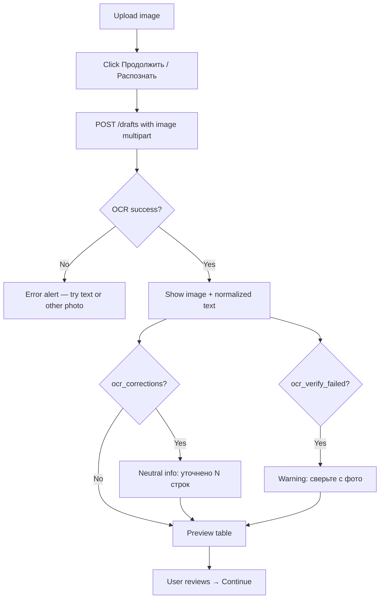

# UX Deep-Dive: Шаг 1 «Ввод плит» (PlateInputStep)

> **Тип:** UX-спека / as-is + to-be  
> **Дата:** 2026-06-19  
> **Статус:** черновик на ревью  
> **Связанные документы:** [`prd-onboarding.md`](./prd-onboarding.md), [`product-analysis-swot-ost-assumptions.md`](./product-analysis-swot-ost-assumptions.md)

---

## 1. Контекст

Шаг `plates` — первый и **наиболее friction-heavy** этап wizard создания КП. Именно здесь новый менеджер решает, продолжит ли он работу в системе или вернётся к Excel.

| Параметр | Значение |
|----------|----------|
| Step ID | `plates` (шаг 1 из 5) |
| Компонент | `PlateInputStep.tsx` |
| Orchestrator | `CommercialOfferWizard.tsx` |
| Порядок шагов | `wizardStepOrder.ts`: `plates → wide-plates → manager → client → result` |
| API | `POST /commercial/drafts`, `PATCH /commercial/drafts/{id}/plates`, `POST .../plates/ai` |

---

## 2. Current UX (As-Is)

### 2.1. Структура экрана

```
┌──────────────────────────────────────────────────────────────────────────────┐
│ StepLayout: «Шаг 1. Ввод плит»                                               │
│ Description: «Вставьте текст списка плит или загрузите фото/изображение…»  │
├──────────────────────────────────────────────────────────────────────────────┤
│ [Alert error] — если stepError                                                │
├──────────────────────────────────────────────────────────────────────────────┤
│ Card «Источник данных»                                                        │
│   FieldWrapper «Список плит» → Textarea (placeholder с примерами)            │
│   FieldWrapper «Фото / изображение» → input[type=file] accept=image/*       │
│   [Alert info] — если файл выбран                                             │
│   FieldWrapper «Инструкция для ИИ» — ТОЛЬКО если draft exists               │
│   Buttons: [Распознать] | [Распознать (заменить)] | [Распознать и добавить] │
│            [ИИ] — только если draft                                           │
├──────────────────────────────────────────────────────────────────────────────┤
│ IF draft:                                                                     │
│   KpPlatePreviewPanel — таблица наименование/кол-во/цена                     │
│   [Alert warning] OCR corrections (до 5 строк)                               │
│   [Alert warning] ocr_verify_failed                                          │
│   Grid: [Card изображение] | [Card нормализованный текст — editable]         │
│   Card «Предпросмотр обработанного списка» — counts only                     │
├──────────────────────────────────────────────────────────────────────────────┤
│ Footer (ТОЛЬКО если draft): [Начать заново danger] [Обработать primary]    │
└──────────────────────────────────────────────────────────────────────────────┘
Sidebar: WizardProgress — 5 шагов, кликабельные если canNavigateToStep
```

### 2.2. Поля и действия

| Элемент | Тип | Поведение |
|---------|-----|-----------|
| **Список плит** (`sourceText`) | Textarea | Controlled; placeholder: `ПБ 78-12-8п 2\n71-12-8 3\n...` |
| **Фото** | file input | `accept="image/*"`; paste Ctrl+V на grid container |
| **Распознать** | Button | Primary если нет draft; ghost если draft. Вызывает `onRecognize("replace")` |
| **Распознать и добавить** | Button | Только при draft; mode `append` |
| **ИИ** | Button | Требует draft + непустую `aiInstruction`; вызывает `POST .../plates/ai` |
| **Нормализованный результат** | AutoResizeTextarea | Editable; sync через `onNormalizedTextChange` |
| **Обработать** | Button (footer) | `handleProcess`: save normalized edits → check `can_proceed_to[0]` → next step |
| **Начать заново** | Button danger | `handleCreateNewOffer` — full reset |

### 2.3. Двухфазный flow (ключевая модель)

```
Фаза A (нет draft):     [ввод текста/фото] → [Распознать] → API createDraft
Фаза B (есть draft):    [preview + edit normalized] → [Обработать] → next step
```

**Важно:** footer с «Обработать» **скрыт** до создания draft. Новый пользователь может нажать «Распознать», увидеть preview, но не понять, что нужен второй клик «Обработать» в footer.

### 2.4. OCR flow

1. User загружает image или paste из буфера.
2. При recognize с image: `sourceText` отправляется пустым, image в multipart.
3. `setPreviewFromFile` — local blob URL для preview изображения.
4. Backend возвращает draft с `metadata.ocr_corrections`, `ocr_verify_failed`, `normalized_text`.
5. UI показывает warning с auto-corrections (до 5 items + «и ещё N»).
6. Если `ocr_verify_failed` — warning «сверьте вручную».

**Зависимость:** `OPENAI_API_KEY`; без ключа OCR недоступен (graceful degrade на backend).

### 2.5. Error states

| Условие | Сообщение | Источник |
|---------|-----------|----------|
| Пустой text + нет image | «Введите текст списка плит или загрузите изображение.» | `handleRecognize` |
| Пустая AI instruction | «Введите инструкцию для ИИ.» | `handleApplyAi` |
| AI без draft | «Сначала распознайте список плит…» | `handleApplyAi` |
| Нет wizard_state | «Нет состояния мастера с сервера…» | `handleProcess` |
| can_proceed_to пуст | validation_errors или «Сначала распознайте…» | `handleProcess` |
| API error | `getErrorMessage(error)` | mutations |
| unparsed_lines | список в KpPlatePreviewPanel, не blocking | metadata |
| normalized text changed | info «нажмите Обработать для пересчёта» | KpPlatePreviewPanel |

### 2.6. Preview table (KpPlatePreviewPanel)

Колонки: **Наименование** | **Кол-во** | **Цена**

Дополнительно:
- Warning для wide plates (→ step 2)
- Warnings из metadata
- Unparsed lines внизу списком
- Empty state: «Список пуст — распознайте плиты»

Subtitle: «Скидка и доставка учитываются позже.»

### 2.7. Поддерживаемые форматы (backend parser)

Из `core/plate_line_parser.py`:

| Формат | Пример | Примечание |
|--------|--------|------------|
| Полная марка ПБ | `ПБ 78-12-8п 2` | length_dm-width_dm-loadп qty |
| Bare line | `71-12-8 3` | без префикса ПБ |
| L×W×H мм | `7800x1200x220 4` | load 8п по умолчанию + warning |
| W×L | `1.2x7.1 3` | альтернативный формат |

---

## 3. Pain Points для новых менеджеров

| # | Pain Point | Severity | Evidence |
|---|------------|----------|----------|
| P1 | **Два клика неочевидны** («Распознать» then «Обработать») | Critical | Footer hidden до draft; нет progress hint |
| P2 | **Нет обучающего контекста** — сразу форма | Critical | Login → `/new`, no welcome |
| P3 | **Термин «нормализованный результат»** непонятен домену | High | Card subtitle mentions «backend» |
| P4 | **Три режима OCR** (replace/append/AI) — cognitive overload | High | 4 buttons после first recognize |
| P5 | **unparsed_lines не blocking** — user proceeds с неполным заказом | High | Can proceed if ≥1 parsed |
| P6 | **Summary card только counts** — дублирует preview без value | Medium | «Позиции: N» redundant |
| P7 | **Image OR text** — выбор файла очищает text (`handleImageSelect`) | Medium | Surprising if user had both |
| P8 | **Нет demo/example one-click** | High | Empty textarea intimidating |
| P9 | **Wide plates warning** без объяснения «что делать» | Medium | «проверка на шаге 2» — ok for experts |
| P10 | **OCR corrections** — страшный warning для novices | Medium | Looks like error |

---

## 4. Proposed UX Improvements (5–8 items)

### IMP-1: Format hint panel + «Заполнить примером» (P0)

**Что:** Collapsible блок под textarea с 3 примерами формата и кнопкой demo prefill.

**Rationale:** Снижает P2, P8; не требует backend. Согласовано с PRD US-3.1, US-2.1.

**Implementation:** `PlateFormatHint.tsx`; константа `DEMO_PLATE_ORDER_TEXT`.

---

### IMP-2: Step progress в header — «Шаг 1 из 5 · Ввод плит» (P0)

**Что:** Дополнить `StepLayout` title progress indicator.

**Rationale:** Orientation (P1 partial); связь с sidebar для novices.

---

### IMP-3: Unified primary action «Продолжить» (P1)

**Что:** Одна primary CTA:
- Нет draft → label «Распознать и продолжить» (createDraft + auto-process если valid)
- Есть draft → label «Продолжить к следующему шагу» (handleProcess)

**Rationale:** Устраняет P1 — главный UX bug step 1.

**Risk:** Требует аккуратной интеграции с `can_proceed_to`; spike + tests.

---

### IMP-4: Rename «Нормализованный результат» → «Исправленный список (для расчёта)» (P0)

**Что:** User-facing copy без слова «backend»; hint «Система привела марки к единому формату. Можно править вручную.»

**Rationale:** P3 — domain language.

---

### IMP-5: Prominent unparsed_lines blocker (P0)

**Что:** Если `unparsed_lines.length > 0` после recognize:
- Amber alert в top of preview: «N строк не распознано — исправьте перед продолжением»
- «Обработать» disabled OR confirmation dialog «Продолжить с N нераспознанными строками?»

**Rationale:** P5 — prevent silent data loss.

**Config:** MVP — soft block (dialog); v2 — hard block for first-time users.

---

### IMP-6: Simplify OCR actions for first session (P1)

**Что:** При `isFirstSession` (localStorage flag):
- Hide «Распознать и добавить» и «ИИ» за «Дополнительно ▾»
- Primary path: text или photo → single «Распознать»

**Rationale:** P4 — progressive disclosure.

---

### IMP-7: Merge redundant summary card into preview (P1)

**Что:** Убрать Card «Предпросмотр обработанного списка» (counts); перенести stats inline в `KpPlatePreviewPanel` header: «7 позиций · 0 предупреждений · 1 не распознана».

**Rationale:** P6 — reduce scroll, single source of truth.

---

### IMP-8: OCR success framing (P2)

**Что:** Заменить «OCR: автоисправлено N строк» на neutral tone: «Система уточнила N строк при распознавании» + expandable details.

**Rationale:** P10 — reduce alarm.

---

## 5. ASCII Wireframe — Proposed UI

### 5.1. Before (As-Is) — первый визит, нет draft

```
┌─────────────────────────────────────────────────────────────────────────────┐
│ Sidebar          │ Main                                                     │
│ ┌──────────────┐ │ ┌─────────────────────────────────────────────────────┐  │
│ │ Шаги мастера │ │ │ Шаг 1. Ввод плит                                    │  │
│ │              │ │ │ Вставьте текст...                                   │  │
│ │ [1. Ввод]*   │ │ ├─────────────────────────────────────────────────────┤  │
│ │ [2. Проблем] │ │ │ Источник данных                                     │  │
│ │ [3. Менеджер]│ │ │ Список плит                                         │  │
│ │ [4. Клиент]  │ │ │ ┌─────────────────────────────────────────────────┐ │  │
│ │ [5. Расчёт]  │ │ │ │ ПБ 78-12-8п 2                                    │ │  │
│ │              │ │ │ │ (placeholder only)                               │ │  │
│ └──────────────┘ │ │ └─────────────────────────────────────────────────┘ │  │
│                  │ │ [ Choose File ]                                       │  │
│                  │ │ [ Распознать ]  ← единственный obvious action        │  │
│                  │ │ (NO FOOTER — user stuck after recognize?)             │  │
│                  │ └─────────────────────────────────────────────────────┘  │
└─────────────────────────────────────────────────────────────────────────────┘
```

### 5.2. After (Proposed) — первый визит с onboarding hints

```
┌─────────────────────────────────────────────────────────────────────────────────────────┐
│ Sidebar          │ Main                                                                 │
│ ┌──────────────┐ │ ┌─────────────────────────────────────────────────────────────────┐  │
│ │ Шаги мастера │ │ │ ●●●○○  Шаг 1 из 5 · Ввод плит                                   │  │
│ │ Шаг 1 из 5   │ │ │ Вставьте список плит текстом или загрузите фото таблицы         │  │
│ │              │ │ ├─────────────────────────────────────────────────────────────────┤  │
│ │ [1. Ввод]*   │ │ │ 💡 Первое КП?  [ Заполнить примером ]  [ Справка по формату ▾ ] │  │
│ │ [2. Проблем] │ │ ├─────────────────────────────────────────────────────────────────┤  │
│ │ ...          │ │ │ ┌─ Примеры формата ────────────────────────────────────────────┐ │  │
│ └──────────────┘ │ │ │ ПБ 78-12-8п 2    → плита 78 дм × 12 дм, нагрузка 8п, 2 шт   │ │  │
│                  │ │ │ 71-12-8 3        → без префикса ПБ, тоже ok                 │ │  │
│                  │ │ │ 7800×1200×220 4  → размеры в мм (нагрузка 8п по умолчанию)  │ │  │
│                  │ │ └──────────────────────────────────────────────────────────────┘ │  │
│                  │ │                                                                  │  │
│                  │ │ Список плит                                                      │  │
│                  │ │ ┌──────────────────────────────────────────────────────────────┐│  │
│                  │ │ │ ПБ 78-12-8п 2                                                 ││  │
│                  │ │ │ 71-12-8 3                                                     ││  │
│                  │ │ │ ПБ 66-12-8п 4                                                 ││  │
│                  │ │ │ ...                                                           ││  │
│                  │ │ └──────────────────────────────────────────────────────────────┘│  │
│                  │ │                                                                  │  │
│                  │ │ ── или загрузите фото ──                                         │  │
│                  │ │ ┌──────────────────────────────────────────────────────────────┐│  │
│                  │ │ │  📷  Перетащите изображение или [ Выбрать файл ]              ││  │
│                  │ │ │      Ctrl+V — вставить из буфера                              ││  │
│                  │ │ └──────────────────────────────────────────────────────────────┘│  │
│                  │ │                                                                  │  │
│                  │ │ ▾ Дополнительно: ИИ-инструкции, добавить к списку              │  │
│                  │ ├─────────────────────────────────────────────────────────────────┤  │
│                  │ │                              [ Начать заново ]  [ Продолжить ▶ ]│  │
│                  │ └─────────────────────────────────────────────────────────────────┘  │
└─────────────────────────────────────────────────────────────────────────────────────────┘
```

### 5.3. After (Proposed) — после recognize, с preview

```
┌─────────────────────────────────────────────────────────────────────────────────────────┐
│ Sidebar          │ Main                                                                 │
│ ┌──────────────┐ │ ┌─────────────────────────────────────────────────────────────────┐  │
│ │ [1. Ввод]*   │ │ │ ●●●○○  Шаг 1 из 5 · Ввод плит                                   │  │
│ └──────────────┘ │ ├─────────────────────────────────────────────────────────────────┤  │
│                  │ │ ✅ Распознано 6 позиций                                           │  │
│                  │ │ ⚠  1 строка не распознана — исправьте в поле ниже или в списке │  │
│                  │ │     • «71-12-8пп 3» — опечатка в нагрузке?                      │  │
│                  │ ├─────────────────────────────────────────────────────────────────┤  │
│                  │ │ Состав КП (предпросмотр)          6 поз · 1 ошибка · 0 wide    │  │
│                  │ │ ┌───────────────┬────────┬──────────────┐                       │  │
│                  │ │ │ Наименование  │ Кол-во │ Цена         │                       │  │
│                  │ │ ├───────────────┼────────┼──────────────┤                       │  │
│                  │ │ │ ПБ 78-12-8п   │   2    │   12 450,00  │                       │  │
│                  │ │ │ ПБ 71-12-8п   │   3    │   11 200,00  │                       │  │
│                  │ │ │ ...           │        │              │                       │  │
│                  │ │ └───────────────┴────────┴──────────────┘                       │  │
│                  │ │ Скидка и доставка — на шагах 4–5                                  │  │
│                  │ ├─────────────────────────────────────────────────────────────────┤  │
│                  │ │ ┌─ Исправленный список (для расчёта) ────────┐ ┌─ Фото ────────┐ │  │
│                  │ │ │ ПБ 78-12-8п 2                               │ │ [thumbnail]  │ │  │
│                  │ │ │ ПБ 71-12-8п 3                               │ │              │ │  │
│                  │ │ │ (editable)                                  │ │              │ │  │
│                  │ │ └─────────────────────────────────────────────┘ └──────────────┘ │  │
│                  │ ├─────────────────────────────────────────────────────────────────┤  │
│                  │ │ ℹ Система уточнила 2 строки при OCR  [ Показать детали ▾ ]     │  │
│                  │ ├─────────────────────────────────────────────────────────────────┤  │
│                  │ │ [ Начать заново ]              [ Продолжить к шагу 2 ▶ ]        │  │
│                  │ │                                  ↑ primary, always visible       │  │
│                  │ └─────────────────────────────────────────────────────────────────┘  │
└─────────────────────────────────────────────────────────────────────────────────────────┘
```

### 5.4. Component layout map (implementation)

```
PlateInputStep (proposed)
├── StepLayout
│   ├── title: "Шаг 1 из 5 · Ввод плит"
│   ├── headerExtra: <OnboardingBanner /> (first session only)
│   └── footer: [Reset] [Primary CTA] — ALWAYS visible when text or draft
├── PlateFormatHint (NEW)
│   ├── ExampleRows: 3│
│   ├── [Заполнить примером]
│   └── Collapsible detailed help
├── Card "Источник данных"
│   ├── Textarea
│   ├── Dropzone file input (enhanced styling)
│   └── Collapsible "Дополнительно" → AI instruction, append OCR
├── ParseStatusBar (NEW) — success/warning counts
├── KpPlatePreviewPanel (enhanced unparsed)
├── OcrCorrectionsPanel (NEW) — neutral tone, collapsible
├── Split view: NormalizedEditor | ImagePreview
└── (removed) redundant summary Card
```

---

## 6. User Flow (Mermaid)

### 6.1. Happy path — text input (proposed)



### 6.2. OCR path



---

## 7. Implementation Notes

### 7.1. Files to modify (MVP hints)

| File | Change |
|------|--------|
| `PlateInputStep.tsx` | Add PlateFormatHint, progress title, always-visible footer |
| `CommercialOfferWizard.tsx` | Demo prefill from query param; optional unified CTA handler |
| `KpPlatePreviewPanel.tsx` | Inline stats header; prominent unparsed |
| `StepLayout.tsx` | Optional `stepIndicator` prop |
| **New** `PlateFormatHint.tsx` | Examples + collapsible help |
| **New** `demoOrder.ts` | `DEMO_PLATE_ORDER_TEXT` constant |

### 7.2. Copy deck (RU)

| Element | Current | Proposed |
|---------|---------|----------|
| Card subtitle normalized | «…backend использует для расчёта» | «Система привела марки к единому формату. Можно править вручную.» |
| Primary CTA (no draft) | «Распознать» | «Продолжить» |
| Primary CTA (draft) | «Обработать» | «Продолжить к шагу 2» / «Продолжить» |
| OCR corrections | «автоисправлено» | «уточнила при распознавании» |

### 7.3. Testing checklist

- [ ] Demo prefill → recognize → preview shows rows
- [ ] unparsed line → warning visible; dialog on continue (if enabled)
- [ ] Image paste Ctrl+V works with new layout
- [ ] Footer visible before draft when text entered
- [ ] Normalized text edit → info → re-process updates preview
- [ ] Vitest: demo order constant non-empty
- [ ] No regression: `CommercialOfferWizard` step navigation

---

## 8. Prioritization Summary

| ID | Improvement | Priority | Effort |
|----|-------------|----------|--------|
| IMP-1 | Format hint + demo | P0 | S |
| IMP-2 | Step X of 5 header | P0 | S |
| IMP-4 | Rename.Rename normalized copy | P0 | S |
| IMP-5 | Unparsed blocker | P0 | M |
| IMP-3 | Unified CTA | P1 | L |
| IMP-6 | Progressive OCR disclosure | P1 | M |
| IMP-7 | Merge summary card | P1 | S |
| IMP-8 | OCR tone | P2 | S |

---

## Связанные документы

- [`prd-onboarding.md`](./prd-onboarding.md)
- [`product-analysis-swot-ost-assumptions.md`](./product-analysis-swot-ost-assumptions.md)
- Код: `frontend/src/features/commercial-offer/components/steps/PlateInputStep.tsx`
- Код: `frontend/src/features/commercial-offer/components/CommercialOfferWizard.tsx`
