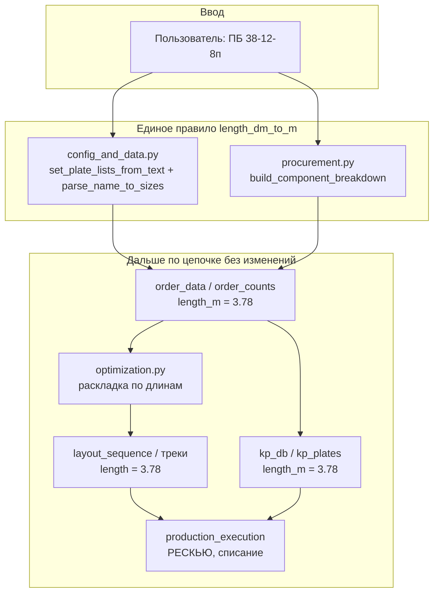
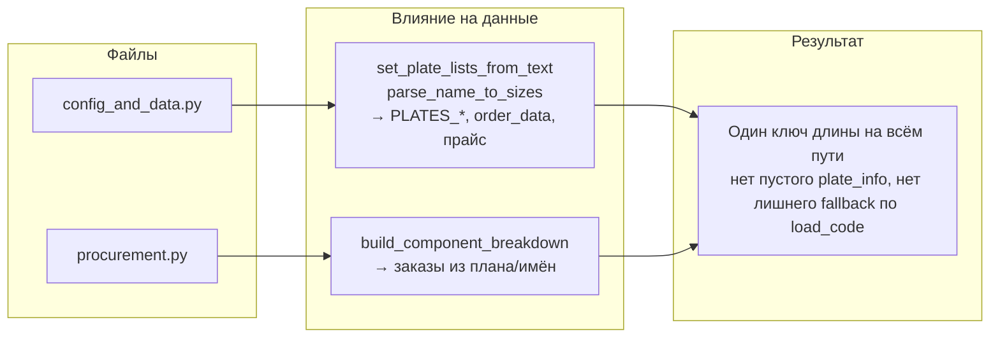

# Правка парсинга длины плиты: какие файлы изменены и как это влияет на данные

## 1. Изменённые файлы

| Файл | Что сделано |
|------|-----------------------------|
| **[core/config_and_data.py](core/config_and_data.py)** | Функция `length_dm_to_m(Ldm_str)`: целое в строке → номинал минус 20 мм (39→3.88 м), с запятой/точкой → Ldm/10. В `set_plate_lists_from_text` длина из марки ПБ считается через `length_dm_to_m(Ldm_str)`. В **`parse_name_to_sizes`** длина теперь тоже считается через `length_dm_to_m(первая_группа)` вместо `length_dm/10` — одна длина на номинал везде. |
| **[viz_modules/procurement.py](viz_modules/procurement.py)** | В **`build_component_breakdown`** при парсинге имени плиты длина считается через `cfg.length_dm_to_m(match.group(1))` вместо `length_dm/10`. |
| **[bot/handlers/commercial.py](bot/handlers/commercial.py)** | Не менялся: `length_m` берётся из `build_procurement_items`; сопоставление с прайсом идёт через `parse_name_to_sizes`, который теперь возвращает ту же длину (length_dm_to_m). |

Итог: **везде** длина из марки ПБ переводится в метры только через `length_dm_to_m` (set_plate_lists_from_text, parse_name_to_sizes, build_component_breakdown). Остальные файлы (optimization, layout_sequence, production_execution, kp_db) не менялись.

---

## 2. Как данные идут дальше (после правки)

- **Раньше:** из «ПБ 38» получали 3.8 м → в заказе и БД ключ (3.8, …), в раскладке по факту 3.78 → ключи не совпадали.
- **Теперь:** из «ПБ 38» получаем 3.78 м → в заказе, БД и раскладке одна и та же длина 3.78 → один ключ (3.78, …).

---

## 3. Влияние на проблему (решает ли это задачу)

**Да, это устраняет корневую причину** расхождения ключей по длине для номинальных марок (ПБ 38, ПБ 75 и т.д.):

| Аспект | Было | Стало |
|--------|------|--------|
| **Парсинг «ПБ 38»** | 3.8 м везде | 3.78 м (номинал −20 мм) |
| **Ключ заказа / order_counts** | (3.8, 1200, 8) | (3.78, 1200, 8) |
| **Раскладка (optimization)** | Длина плиты 3.78 | Без изменений, по-прежнему 3.78 |
| **Ключ в треке / track_counts** | (3.78, 1200, 8) | (3.78, 1200, 8) |
| **Сравнение заказ vs треки** | 3.8 ≠ 3.78 → «недостача», лишний РЕСКЬЮ | 3.78 = 3.78 → совпадение, нет ложного РЕСКЬЮ |
| **БД kp_plates** | length_m = 3.8 | length_m = 3.78 |
| **Списание** | Поиск по 3.8, в БД 3.8 или 3.79 | Поиск по 3.78, в БД 3.78 (допуск 0.02 м при find_one_row по-прежнему можно использовать) |

Итог: **одна и та же длина** с самого ввода (парсинг) и до заказа, раскладки, БД и РЕСКЬЮ/списания — ключи совпадают, ложная «недостача» и дублирование в плане из-за разницы 3.8 vs 3.78 исчезают для номиналов без запятой. Для марок с запятой («ПБ 38,0») по-прежнему 3.8 м — поведение сохраняется.

---

## 4. Краткая схема: где что изменилось

Везде длина из марки ПБ переводится в метры через `length_dm_to_m`; в заказах и плане одна длина на номинал (например 3.88 для «39»), поэтому оптимизатор и эмиссия работают с едиными ключами.
