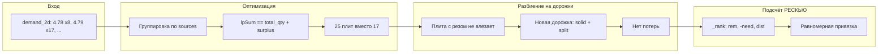

# Исправление потери плит — что изменили

Краткое описание трёх исправлений и визуализация потока «было → стало».

---

## 1. Оптимизация: конкурирующие спросы (4.78 и 4.79)

**Проблема:** Два спроса с близкими длинами (4.78 м и 4.79 м) использовали одни и те же переменные производства. Solver получал два равенства на одни переменные и фактически производил только максимум из двух чисел, а не сумму.

```
БЫЛО:
┌─────────────────────────────────────────────────────────────────┐
│  Спрос: (4.78, 1200, 8) → 8 шт   │   (4.79, 1200, 8) → 17 шт    │
│           sources: [x_4.78, x_4.79]    sources: [x_4.78, x_4.79] │
└─────────────────────────────────────────────────────────────────┘
                    │                              │
                    ▼                              ▼
         x_4.78 + x_4.79 == 8 + s1       x_4.78 + x_4.79 == 17 + s2
                    │                              │
                    └──────────────┬───────────────┘
                                   ▼
                    8 + s1 = 17 + s2  →  производится только 17 плит
                    Нужно было: 8 + 17 = 25
```

**Решение:** Группируем все спросы по одинаковому набору источников и задаём одно ограничение на группу: сумма производства = сумма спроса по группе.

```
СТАЛО:
┌─────────────────────────────────────────────────────────────────┐
│  Группа с общими sources [x_4.78, x_4.79]:                      │
│    • (4.78, 1200, 8) → 8 шт                                      │
│    • (4.79, 1200, 8) → 17 шт                                     │
│    total_qty = 8 + 17 = 25                                       │
└─────────────────────────────────────────────────────────────────┘
                                   │
                                   ▼
                    x_4.78 + x_4.79 == 25 + surplus
                                   │
                                   ▼
                    Производится 25 плит (или больше при surplus)
```

**Файл:** `core/optimization.py` — цикл по `demand_2d`, группировка в `sources_to_demands`, один constraint на группу.

---

## 2. Визуализация: плиты с резом при закрытии дорожки

**Проблема:** Когда дорожка заполнена и следующая плита — с резом (split) и не влезает, код искал целую плиту для «завершения» дорожки, добавлял её в текущую дорожку, закрывал дорожку, а плиту с резом никуда не добавлял — она терялась.

```
БЫЛО:
  Дорожка: [ ... ]  осталось 3.69 м
  Следующая плита: 4.78 м (split) — не влезает

  ┌──────────────────────────────────────┐
  │  Ищем целую плиту для завершения      │
  │  Находим, добавляем в текущую дорожку │
  │  Закрываем дорожку                    │
  │  Плита 4.78 м — НЕ ДОБАВЛЕНА НИКУДА  │  ← потеря
  └──────────────────────────────────────┘
```

**Решение:** Найденную целую плиту используем как **первую** плиту **новой** дорожки, а плиту с резом — как **вторую**. Так ни одна плита не теряется.

```
СТАЛО:
  Дорожка: [ ... ]  осталось 3.69 м
  Следующая плита: 4.78 м (split) — не влезает

  ┌──────────────────────────────────────┐
  │  Ищем целую плиту (влезает в 3.69 м)  │
  │  Закрываем текущую дорожку как есть   │
  │  Новая дорожка: [целая, 4.78 split]   │  ← обе плиты в плане
  └──────────────────────────────────────┘
```

**Файл:** `core/visualization.py` — блок `elif not is_solid:` в `split_sequence_into_tracks`.

---

## 3. Подсчёт РЕСКЬЮ: привязка к ключу при равном остатке

**Проблема:** При нескольких ключах в допуске (например 4.17 и 4.18) с одинаковым остатком спроса выбирался ключ с меньшим расстоянием по длине. Все плиты 4.18 шли в ключ (4.18), ключ (4.17) получал 0 и уходил в РЕСКЬЮ.

```
БЫЛО:
  В треке плита 4.18 м. Кандидаты: (4.18, 1200, 8) need=4, (4.17, 1200, 8) need=4
  Ранжирование: (rem, dist, ...) → при rem=4,4 выбираем по dist → 4.18 (dist=0)
  Все такие плиты → (4.18), (4.17) получает 0 → РЕСКЬЮ
```

**Решение:** При равном `remaining` отдаём приоритет ключу с **большим** спросом (need), чтобы не «забивать» один ключ и не оставлять другой без привязки.

```
СТАЛО:
  Ранжирование: (rem, -need, dist, ...)
  При rem=4,4: больше need → меньше -need → выигрывает ключ с большим need
  Распределение становится равномернее; оба ключа получают привязку, где возможно
```

**Файл:** `bot/handlers/production_execution.py` — функция `_normalize_key_to_orders`, критерий `_rank`.

---

## Общая схема потока (после исправлений)



---

## Итог

| Этап | Было | Стало |
|------|------|--------|
| Оптимизация | 44 плиты терялись (shared sources) | Группа спросов → одно ограничение, производство по сумме спроса |
| Дорожки | 16 плит с резом пропускались | Перенос в новую дорожку: сначала solid, потом split |
| РЕСКЬЮ | Один ключ забирал все плиты | При равном rem приоритет ключу с большим need |

В результате плиты не теряются, полностью попадают в план и корректно списываются по ключам.
