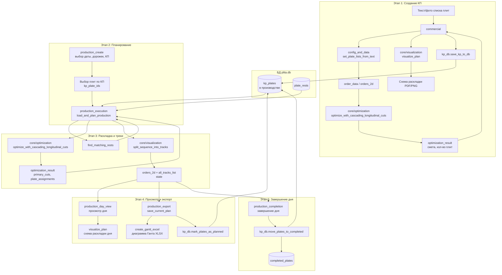
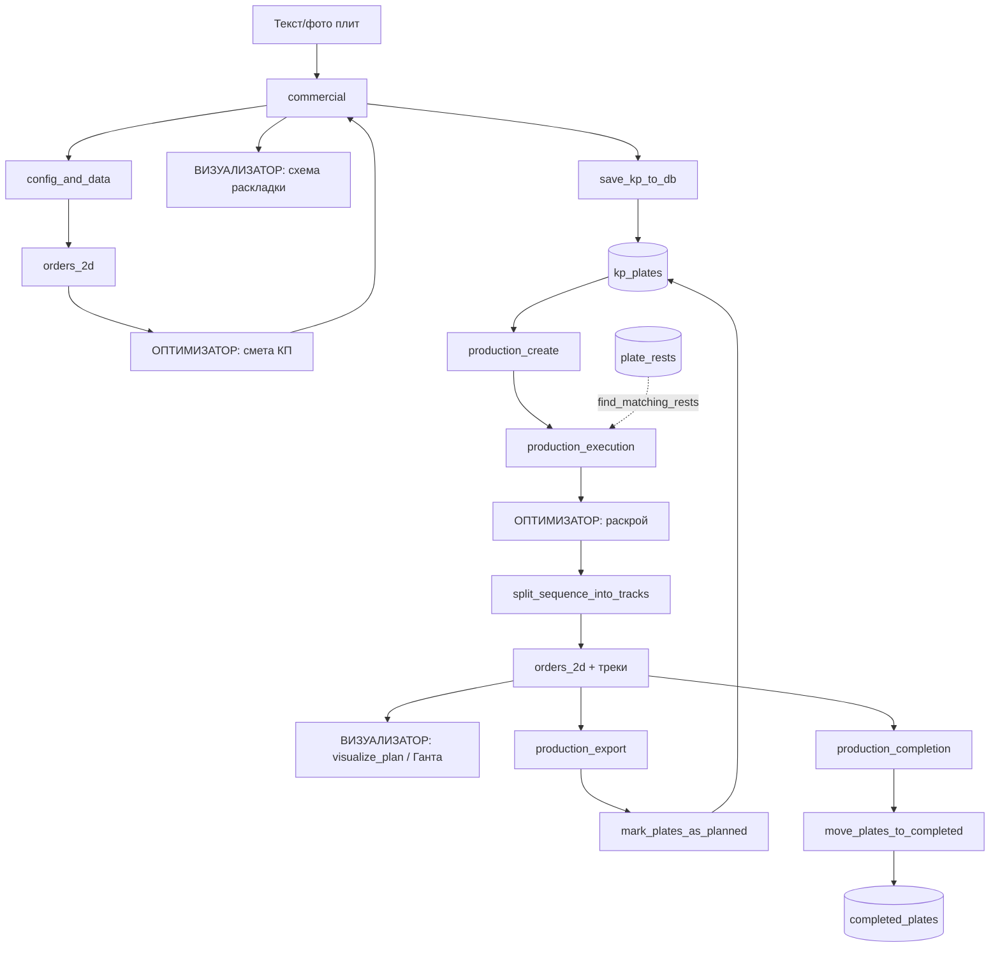

# Поток плит в боте: схема с этапами, оптимизатором и визуализатором

## Полная схема (Mermaid)

Скопируй блок ниже в [mermaid.live](https://mermaid.live) для просмотра и экспорта в PNG/SVG.

## Упрощённый линейный поток

## Сводка этапов

| Этап | Handlers | Оптимизатор | Визуализатор | БД |
|------|----------|-------------|--------------|-----|
| **1. КП** | commercial | Да (смета по orders_2d) | visualize_plan — схема раскладки | save_kp_to_db → kp_plates |
| **2. Планирование** | production_create | — | — | чтение kp_plates |
| **3. Раскладка** | production_execution | Да (раскрой → треки) | split_sequence_into_tracks | kp_plates + plate_rests, find_matching_rests |
| **4. Просмотр/экспорт** | production_day_view, production_export | данные из state | visualize_plan, create_gantt_excel | mark_plates_as_planned → kp_plates |
| **5. Завершение дня** | production_completion | — | — | move_plates_to_completed → completed_plates |
