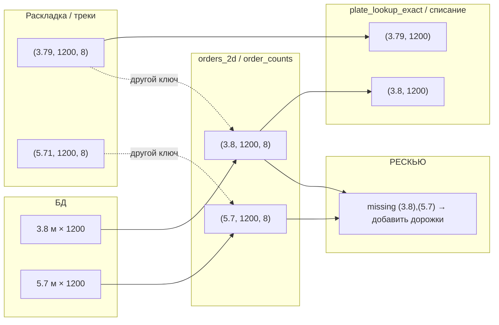
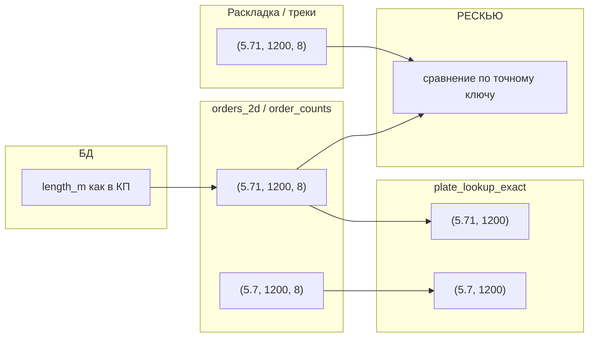

# Визуализация: проблема ключей и исправление

## 0. Правила по длине плиты (актуальная логика)

- **5.7 и 5.71 (и любые две разные длины из КП) — разные позиции заказа.** Не объединять в один ключ.
- **Длина из КП** хранится и передаётся с точностью не хуже 0.01 м (два знака); не округлять до одного знака.
- В ключах заказа, треков и lookup используются **разные ключи** для разных длин: (5.7, 1200, 8) и (5.71, 1200, 8) — два ключа.
- **Допуск по длине 0.02 м** используется только при **поиске записи в БД** при списании (одна и та же физическая плита: в заказе 3.8, в БД может быть 3.79). Для ключей заказа и для слияния позиций допуск не применяется (merge отключён, tol_len=0).

---

## 1. Проблема: два «мира» длин

```
┌─────────────────────────────────────────────────────────────────────────────┐
│  БД (kp_plates)                    Раскладка (optimization/layout)          │
│  length_m = 3.8, 5.7               length = 3.79, 5.71  (float)             │
│  ключ заказа: (3.8, 1200, 8)       ключ в треке: (3.79, 1200, 8)            │
└─────────────────────────────────────────────────────────────────────────────┘
                    │                                    │
                    │ order_counts                       │ track_counts
                    │ key = (3.8, 1200, 8)  qty=6       │ key = (3.79, 1200, 8)  qty=6
                    ▼                                    ▼
┌─────────────────────────────────────────────────────────────────────────────┐
│  Сравнение:  qty_need(3.8) = 6   vs   qty_have(3.8) = 0                     │
│  (в track_counts ключ 3.79, а ищем по 3.8 — не совпадает!)                  │
│  → missing_counts[(3.8, 1200, 8)] = 6  → РЕСКЬЮ добавляет ещё 6 плит         │
│  → дублирование в плане и риск, что при списании что-то «потеряется»        │
└─────────────────────────────────────────────────────────────────────────────┘
```

**Итог:** Одна и та же физическая плита (3.79 м из раскладки = 3.8 м в заказе) учитывалась по разным ключам → «недостача» и лишние плиты в РЕСКЬЮ.

---

## 2. Схема потока данных (было → стало)

### Было (разные ключи)



Сравнение идёт по **разным** ключам → РЕСКЬЮ считает, что плит не хватает. В lookup могут быть оба ключа (3.8 и 3.79) или только один → при списании возможны промахи.

### Стало (точные ключи, без слияния)



Ключи заказа **не сливаются** по длине (tol_len=0). Длина из КП сохраняется везде одинаковой (5.71 → 5.71 в заказе, в раскладке, в lookup). РЕСКЬЮ и списание работают по одному ключу на позицию. Допуск 0.02 м только при поиске строки в БД при списании.

---

## 3. Почему это решает проблему

| Место | Было | Стало |
|-------|------|--------|
| **order_counts** | Ключ из БД (3.8, 5.7), merge ±0.02 склеивал с (3.79, 5.71) | Ключ строго из КП: (5.71, 1200, 8) и (5.7, 1200, 8) — разные; merge отключён (tol_len=0) |
| **track_counts** | Трек (3.79, 5.71), нормализация к заказу (3.8, 5.7) | Трек и заказ с одной длиной из КП → совпадение по ключу (допуск 0.001 только для float) |
| **plate_lookup_exact** | Ключи объединялись по _canon_L ±0.02 | Ключ строго (length, width) без слияния длин |
| **Списание (find_one_row)** | ABS(length_m - ?) < 0.02 при поиске в БД | Без изменений: допуск 0.02 только для поиска строки в БД (одна физическая плита) |

**Кратко:**  
Длина из КП хранится без округления до одного знака; 5.7 и 5.71 — разные позиции и не объединяются. Одна длина из КП — один ключ на всех этапах. Ложный недостаток в РЕСКЬЮ и «плита не найдена» при списании устраняются за счёт единых ключей.

---

## 4. Допуск 0.02 м

Допуск **0.02 м по длине** используется **только при поиске записи в БД** в `find_one_row` (списание): запрос по длине 3.8 может найти строку с 3.79 в БД (одна и та же физическая плита). Для ключей заказа, треков и lookup слияние по длине **не применяется** (разные длины — разные ключи).
