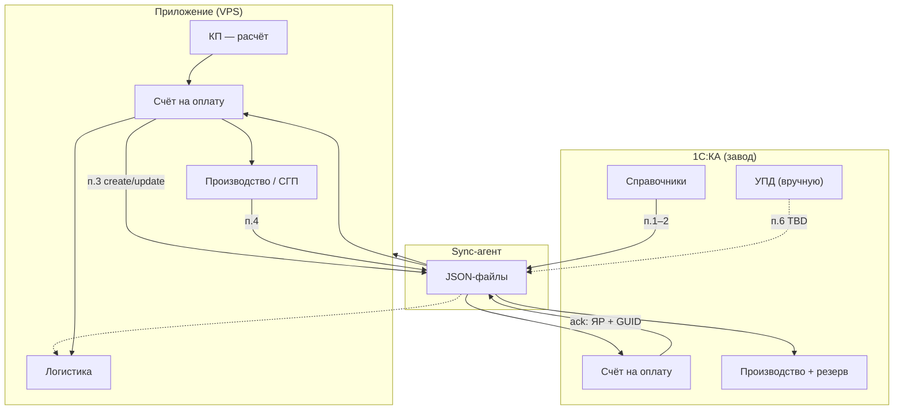
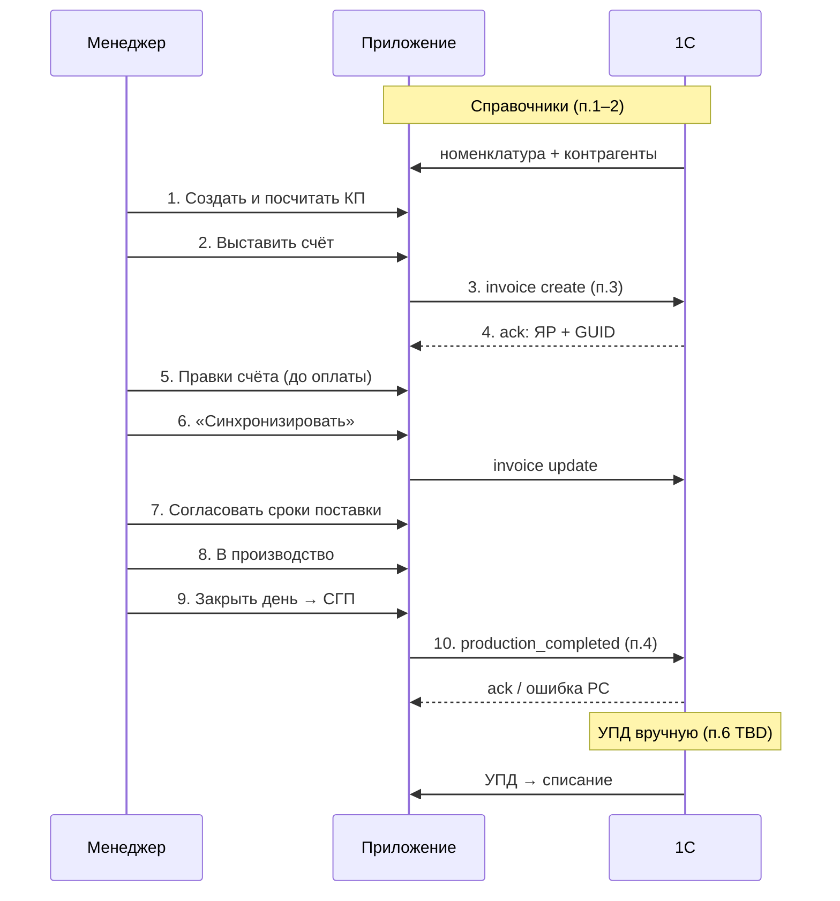

# Интеграция 1С:КА ↔ приложение «Шишов»

> **Версия:** 2.0 (представление заказчика)  
> **Дата:** 04.08.2026  
> **Статус:** на согласование с 1С-интегратором  
> **Обмен:** JSON · UTF-8 · папка обмена · sync-агент (завод ↔ VPS)

---

## Содержание

1. [Зачем это нужно](#1-зачем-это-нужно)
2. [Ключевые решения](#2-ключевые-решения)
3. [Схема обмена](#3-схема-обмена)
4. [Состав работ (6+1 пунктов)](#4-состав-работ)
5. [Номенклатура](#5-номенклатура)
6. [Документооборот по шагам](#6-документооборот-по-шагам)
7. [Инфраструктура](#7-инфраструктура)
8. [Сравнение с перечнем 1С](#8-сравнение-с-перечнем-1с)
9. [Этапность](#9-этапность)
10. [Вопросы на встречу](#10-вопросы-на-встречу)
11. [Задачи заказчика](#11-задачи-заказчика)

---

## 1. Зачем это нужно

| Система | Роль |
|---------|------|
| **Приложение «Шишов»** | КП, расчёт, счёт, производство, СГП, логистика |
| **1С:Комплексная автоматизация** | Учёт: справочники, **счета с номером ЯР**, выпуск ГП, резерв, УПД |

**Цель:** один номер **ЯР** везде, без двойного ввода, без расхождений между app и 1С.

---

## 2. Ключевые решения

| # | Решение |
|---|---------|
| ✅ | **КП** — только в приложении, в 1С **не передаётся** |
| ✅ | В 1С уходит **«Счёт на оплату»**, не «Коммерческое предложение» |
| ✅ | **Номер ЯР** выдаёт **только 1С** → приложение получает в ack |
| ✅ | В одном счёте **может быть разная продукция** (бухгалтерия) |
| ✅ | П.2 из 1С — **только справочники** + ответы (ack), **не документы КП** |
| ✅ | Правки счёта в 1С — **по кнопке «Синхронизировать»** (до оплаты) |
| ⏳ | Класс бетона (ФБС, ЛС, ЛМ…) — **уточнить у бухгалтерии** |
| ⏳ | УПД → приложение — **отдельный этап (TBD)** |

---

## 3. Схема обмена



### Направления потоков

| Направление | Что | Когда |
|-------------|-----|--------|
| **1С → app** | Справочники (дельта) | Регламент 5–15 мин |
| **1С → app** | Ack: ЯР, ошибки, РС | После обработки import |
| **app → 1С** | Счёт на оплату | Выставить / Синхронизировать |
| **app → 1С** | Выпуск ГП + резерв | Закрытие дня (СГП) |
| **1С → app** | УПД | TBD |

---

## 4. Состав работ

### П.1 — Первичная выгрузка (один раз)

**1С → приложение:** полные справочники в JSON.

- номенклатура (все виды, см. [§5](#5-номенклатура));
- контрагенты (GUID, имя, ИНН, КПП).

**Не входит:** КП, счета, производство.

---

### П.2 — Регламент 1С → приложение

**Период:** каждые 5–15 мин.

| Выгружаем | Не выгружаем |
|-----------|--------------|
| Дельта номенклатуры | `УИДКП`, `НомерКП` |
| Дельта контрагентов | Документы КП |
| **Ack** на счета и производство | |

**Пример ack (счёт):**

```json
{
  "event": "invoice_ack",
  "invoice_id": 7,
  "uid_invoice": "guid-счёта",
  "number_invoice": "ЯР-0001467",
  "status": "ok"
}
```

---

### П.3 — Счёт на оплату: приложение → 1С

> ⚠️ **Не** «Коммерческое предложение».

| Действие | Поведение 1С |
|----------|--------------|
| **create** | Новый «Счёт на оплату» + **номер ЯР** (ваш нумератор) |
| **update** | Тот же документ по GUID; без дубликата |
| Оплачен/проведён | **error** — правки запрещены |

**Триггер update:** кнопка **«Синхронизировать»** в приложении (не автоматом при каждом сохранении).

**Минимум в JSON:**

- контрагент (GUID, ИНН, КПП);
- строки: GUID номенклатуры, qty, цена, сумма, `product_kind`;
- для свай/ФБС/ЛС/ЛМ: класс бетона и цена — **из приложения**;
- итоги: subtotal, НДС, total.

---

### П.4 — Произведённая продукция: приложение → 1С

**Триггер:** закрытие производственного дня → **отправка на СГП**.

**1С создаёт:**

1. **«Производство без заказа»** — выпуск ГП;
2. **Резерв** в **«Заказе клиента»** по **счёту (ЯР)**, не по КП.

**Привязка:** `uid_invoice` + номер **ЯР**.

| Этап | Scope |
|------|--------|
| **v1 интеграции** | Только **плиты ПБ** |
| **Далее** | Остальные виды — после ТЗ заказчика «КП → СГП» |

---

### П.5 — Ресурсные спецификации

> **ЕСЛИ НЕ НАЙДЕНА РЕСУРСНАЯ СПЕЦИФИКАЦИЯ** — операция **не выполняется**, пользователь получает уведомление: нужно создать РС в 1С.

```json
{
  "event": "production_ack",
  "status": "error",
  "code": "missing_resource_specification",
  "items": [{ "name": "Плиты ПБ 60-12-8п" }]
}
```

---

### П.6 — УПД → приложение *(дополнение, TBD)*

| Сейчас | Цель |
|--------|------|
| УПД вручную в 1С | Загрузка УПД в app → **списание с СГП** без расхождений |

**Не в v1:** автовыгрузка «рейс выехал» app → 1С.

---

### П.7 — Тестирование и опытная эксплуатация

- [ ] Тестовая база 1С:КА + sync-агент
- [ ] Справочники (все виды)
- [ ] Счёт: create → **ЯР** → update → блокировка при оплате
- [ ] Смешанный счёт (разная продукция)
- [ ] Производство плит + ошибка без РС
- [ ] Пилот на реальных данных

---

## 5. Номенклатура

### Виды изделий в выгрузке п.1–2

| `product_kind` | Название | Пример марки |
|----------------|----------|--------------|
| `plate` | Плиты ПБ | `Плиты ПБ 60-12-8п` |
| `pile` | Цельные сваи | `С60.30` |
| `stair_step` | Лестничные ступени | `Лестничные ступени ЛС11-1лев` |
| `fbs` | ФБС | `ФБС 9.3.6-Т` |
| `stair_flight` | Лестничные марши | `1ЛМ 30-11-15-4` |
| `bridge_pile` | Мостовые сваи | `С13-40T7` |
| `custom` | Индивидуальные | в 1С **вручную** под заказ |

### Класс бетона

| Вид | Где задаётся |
|-----|--------------|
| Плиты ПБ | Нагрузка в марке |
| Сваи, ФБС, ЛС, ЛМ | **Приложение** (предварительно); в 1С — марка без класса |
| Индивидуальные | Калькулятор в app |

> ⏳ Уточнить с **бухгалтерией** по каждому виду.

---

## 6. Документооборот по шагам



### Роли документов

| Документ | Где | В 1С? |
|----------|-----|-------|
| KП | Только app | ❌ |
| Счёт (ЯР) | app + 1С | ✅ create/update |
| Выпуск ГП | app → 1С | ✅ п.4 |
| УПД | 1С → app | ✅ вручную |

---

## 7. Инфраструктура

```
┌─────────────────────────────────────────────────────────┐
│  ЗАВОД (Windows)                                        │
│  D:\Exchange\1c-shishov\                                │
│    export\   ← 1С пишет (справочники, ack)              │
│    import\   ← 1С читает (счета, производство)          │
│    archive\  error\                                     │
└───────────────────────┬─────────────────────────────────┘
                        │  sync-агент (1–5 мин)
                        ▼
┌─────────────────────────────────────────────────────────┐
│  VPS (Docker)                                           │
│  /data/exchange/from_1c/   ← app читает                 │
│  /data/exchange/to_1c/     ← app пишет                  │
└─────────────────────────────────────────────────────────┘
```

| Переменная (ориентир) | Путь |
|-----------------------|------|
| `EXCHANGE_IMPORT_DIR` | `/data/exchange/from_1c` |
| `EXCHANGE_EXPORT_DIR` | `/data/exchange/to_1c` |
| `ONEC_SYNC_ENABLED` | `false` до пилота |

**Sync-агент:** ответственный — **TBD**.

---

## 8. Сравнение с перечнем 1С

| № | Было у 1С-ников | **Как мы видим** |
|---|-----------------|------------------|
| **1** | Справочники | ✅ + **все виды ЖБИ** |
| **2** | Справочники + **КП** (`УИДКП`) | ✅ только справочники + **ack (ЯР)** |
| **3** | **Коммерческое предложение** | ❌ → **Счёт на оплату**, **ЯР из 1С** |
| **4** | Резерв по **КП** | ✅ по **счёту (ЯР)**; v1 — **плиты** |
| **5** | Ошибка без РС | ✅ без изменений |
| **6** | Тест и пилот | ✅ без изменений |
| **—** | — | ➕ **УПД → app** (TBD) |

---

## 9. Этапность

| Фаза | Содержание | Зависимости |
|------|------------|-------------|
| **A** | Инфраструктура (папка, sync, тестовая 1С) | IT |
| **B** | П.1–2 Справочники | A |
| **C** | П.3 Счёт + ЯР | B |
| **D** | П.4 Производство (плиты) + РС | C + РС в 1С |
| **E** | Пилот п.7 | C–D |
| **F** | УПД, остальные виды ЖБИ | ТЗ «КП → СГП» |

---

## 10. Вопросы на встречу

### Счёт (критично)

- [ ] «Счёт на оплату» вместо КП — **да?**
- [ ] **Смешанный счёт** (разная продукция) — поддерживается?
- [ ] **ЯР** — ваш нумератор, формат в ack?
- [ ] **Update** — полная замена строк?
- [ ] Блокировка при **оплате/проведении**?

### Справочники

- [ ] Все виды (ЛС, ФБС, ЛМ, мостовые) **в номенклатуре**?
- [ ] Поле **`product_kind`** в JSON — ок?
- [ ] **Сверка имён** плит с app до cutover?

### Производство

- [ ] **`production_completed`** после закрытия дня — да?
- [ ] **Резерв по счёту (ЯР)** — как именно?
- [ ] **РС** — только ПБ или все виды? Срок?

### Прочее

- [ ] **УПД → JSON** — возможно? Оценка?
- [ ] **Индивидуальные** — строка без GUID?
- [ ] **Примеры JSON** — срок?
- [ ] **Sync-агент** — в оценке?
- [ ] **Оценка и сроки** по этапам A–E?

---

## 11. Задачи заказчика

| # | Задача | Статус |
|---|--------|--------|
| 1 | ТЗ «КП и путь до СГП» по **всем видам** изделий | ⏳ в работе |
| 2 | Уточнить **класс бетона** (бухгалтерия) | ⏳ |
| 3 | IT: **sync-агент**, VPN, тестовая 1С | ⏳ TBD |
| 4 | Сущность **«Счёт»** в приложении | ⏳ разработка |
| 5 | Встреча с 1С (**параллельно** с инфраструктурой) | ⏳ |

---

## Приложение: таблица событий JSON

| `event` | Направление | Триггер |
|---------|-------------|---------|
| `nomenclature_*` | 1С → app | п.1 / регламент |
| `counterparties_*` | 1С → app | п.1 / регламент |
| `invoice_export` | app → 1С | выставить / синхронизировать |
| `invoice_ack` | 1С → app | после import |
| `production_completed` | app → 1С | закрытие дня |
| `production_ack` | 1С → app | после import |
| `upd_import` *(TBD)* | 1С → app | после УПД |

---

*Исходный перечень 1С-интегратора: `docs/specs/1c-integration-tz.md` (v1).*
