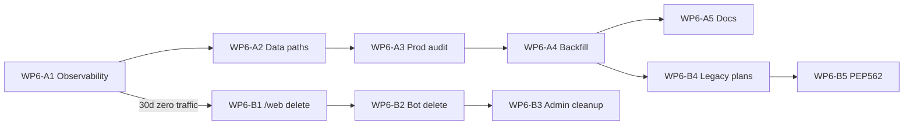

# P6 — Legacy decommission (бот, `/web/*`, data paths, PEP 562)

## Objective

Завершить миграцию на **единый продуктовый стек**:

```
React SPA (/commercial-offer/*)  →  /api/v1/*  →  app/services  →  core  →  SQLite
```

Убрать параллельные пути: Telegram-бот, HTML `/web/*`, JSON-планы на диске, PEP 562 proxy в `config_and_data`.

**Кто выигрывает:** разработчики (меньше веток), операторы (один UI), prod (меньше attack surface).

**Success criteria (DoD P6):**

1. Ноль обращений к `/web/*` в production logs **30 календарных дней** подряд
2. `bot_archived/` удалён из репозитория; `pytest tests/` без `tests/archived/`
3. Пути данных не содержат `bot/data` (defaults → `data/` или `/data` в Docker)
4. Активные планы в SQLite имеют `kp_plate_id` на items (или явно в архиве)
5. PEP 562 `MUTABLE_LEGACY_NAMES` удалён или сведён к no-op с ADR
6. `pytest tests/ -q` зелёный; `npm run build` из `frontend/` без регрессий

---

## Assumptions (зафиксированы по умолчанию)

| # | Допущение | Если неверно — действие |
|---|-----------|------------------------|
| A1 | Telegram-бот не используется в prod с 2026-06-21 | Отложить P6-A3 до подтверждения |
| A2 | Grace period **30 дней** мониторинга `/web/*` перед hard delete routes | См. WP6-B1 |
| A3 | Сначала перенос путей `bot/data` → `data/`, потом hard delete бота | WP6-A2 перед WP6-A3 |
| A4 | Backfill `kp_plate_id` / `day_number` для **активных** планов обязателен | WP6-A4 |
| A5 | Rollback = git history, не папка `bot_archived/` в репо | — |
| A6 | `zavodstart.ru` — основной prod; split compose | Проверить том `/data` на VPS |

---

## Текущее состояние (baseline)

| Компонент | Статус | Где |
|-----------|--------|-----|
| Бот soft-off (P5 WP1) | ✅ | `run_bot.py`, `bot/README.md`, `bot_archived/` |
| `/web/*` GET → SPA redirect | ✅ | `app/web/legacy_routes.py` |
| `/web/*` POST create/save draft | ✅ redirect в SPA | там же |
| Планы runtime → SQLite | ✅ | `PlanRepository`, grep-gate `test_plan_storage_deprecation.py` |
| Legacy plan read (`is_legacy`) | ⚠️ | `day_view_service.py`, `plan_repository.py` |
| Settings `bot/data/*` | ⚠️ | `core/config/settings.py` |
| PEP 562 proxy (частично) | ⚠️ | `core/config_and_data.py`, `MUTABLE_LEGACY_NAMES` |
| nginx `/web/` proxy | ⚠️ | `deploy/nginx-docker-ssl.conf` |

---

## Work packages

### Фаза A — Подготовка (низкий риск)

#### WP6-A1 — Legacy traffic observability

**Acceptance:**

- [ ] Документирован способ подсчёта hits: `grep "Legacy web route" logs/backend.log` (или агрегатор)
- [ ] Runbook: что делать при ненулевом трафике (уведомить пользователей, продлить grace)
- [ ] Baseline зафиксирован (дата старта 30-дневного окна): `________`

**Verify:** ручная проверка на prod/staging после деплоя.

---

#### WP6-A2 — Data paths: `bot/data` → `data/`

**Acceptance:**

- [ ] Defaults в `Settings`: `plans_dir`, `plans_metadata_path`, `current_plan_path`, `work_calendar_path` → `PROJECT_ROOT / "data" / ...`
- [ ] `core/work_calendar.py`: `CALENDAR_PATH` не ссылается на `bot/data`
- [ ] Docker compose: env/volume согласованы (`/data/...`)
- [ ] Миграция на prod: скопировать `work_calendar.json` и метаданные в новые пути **до** смены defaults
- [ ] `AdminService._clear_all_plans` не ссылается на «остановите бота» в docstring (бот мёртв)
- [ ] Тесты обновлены; `pytest tests/ -q` зелёный

**Verify:**

```bash
pytest tests/test_production_planning_service.py tests/test_plan_repository.py -q
rg "bot/data" core/config/settings.py app/ --glob "*.py"
```

**Not doing:** переименование Docker volume (только пути внутри `/data`).

---

#### WP6-A3 — Prod data audit

**Acceptance:**

- [ ] Проверен том prod: есть ли `*.json` планы вне SQLite (`plans_dir`, `bot/data/plans`)
- [ ] Если есть — выполнен `scripts/migrate_plans_to_sqlite.py` или ручная миграция; отчёт сохранён
- [ ] `current_plan.json` / `plans_metadata.json` — либо удалены как obsolete, либо не используются runtime

**Verify:**

```bash
python scripts/check_plan_vs_db.py   # если применимо к окружению
```

---

#### WP6-A4 — Active plans backfill

**Acceptance:**

- [ ] Для всех **активных** планов в `production_plans`: items содержат `kp_plate_id` где применимо
- [ ] `scripts/backfill_day_number.py` прогнан на prod (или эквивалент для SQLite-only планов)
- [ ] `day_view` для активных планов: `is_legacy=false` на smoke-плане
- [ ] Документирован критерий «архивный legacy»: планы только для чтения, не в active slot

**Verify:**

```bash
pytest tests/test_plan_consistency.py tests/test_day_view_service.py -q
```

**Not doing:** переписывание исторических completed планов без бизнес-запроса.

---

#### WP6-A5 — Documentation sync

**Acceptance:**

- [x] Эта спека (`docs/specs/p6-legacy-decommission.md`)
- [x] Security sprint обновлён (`docs/specs/security-sprint.md`, WP3 done)
- [x] PEP 562 checklist (`docs/pep562-config-and-data-decommission.md`)
- [x] Устаревший `docs/web-interface-guide.md` помечен deprecated
- [x] `bot/README.md` ссылается на P6 spec

---

### Фаза B — Hard delete (после WP6-A1: 30 дней ноль `/web/*`)

#### WP6-B1 — Remove `/web/*` routes

**Предусловие:** 30 дней подряд ноль `Legacy web route` в prod logs.

**Acceptance:**

- [ ] Удалены `app/web/legacy_routes.py` и include в `app/web/router.py`
- [ ] Удалены тесты, проверяющие только legacy POST/redirect (или сокращены до nginx-level)
- [ ] `deploy/nginx-docker-ssl.conf`: убран `location /web/` **или** заменён на 301 → `/commercial-offer/` (выбрать один вариант и задокументировать)
- [ ] `app/web/shell.py`: `page()` удалён, если не используется
- [ ] `pytest tests/ -q` зелёный

**Verify:**

```bash
pytest tests/ -q
rg "/web/" app/ --glob "*.py"
```

**Rollback:** revert PR; nginx 301 при необходимости.

---

#### WP6-B2 — Hard delete Telegram bot (P6)

**Acceptance:**

- [ ] Удалены: `bot_archived/`, `run_bot.py`, `requirements-bot.txt`
- [ ] Удалены: `tests/archived/test_bot_*`
- [ ] `Settings`: `bot_token`, `bot_*` — удалены или помечены deprecated no-op (минимальный diff)
- [ ] `scripts/smoke_check.py`, `requirements.txt` — без ссылок на бот
- [ ] `pytest tests/ -q` зелёный

**Verify:**

```bash
pytest tests/ -q
test ! -d bot_archived
```

**Not doing:** восстановление бота из репо — только git history.

---

#### WP6-B3 — Admin / JSON cleanup

**Acceptance:**

- [ ] `AdminService._clear_all_plans` удаляет только SQLite (+ obsolete metadata files если ещё есть)
- [ ] Нет unlink `plans_dir/*.json` в hot path
- [ ] `get_stats().current_plan_present` не зависит от `current_plan_path` если файл obsolete

**Verify:**

```bash
pytest tests/test_admin_service.py -q
```

---

#### WP6-B4 — Legacy plan read path removal

**Предусловие:** WP6-A4 выполнен на prod.

**Acceptance:**

- [ ] Удалён fuzzy / `legacy_identity_qty` path из hot paths **или** ограничен `pytest.mark` + явный `# legacy-archive-only`
- [ ] `day_view_service`: нет `is_legacy=true` на новых планах (grep-gate тест)
- [ ] `test_commit_warns_when_legacy_branch_used_with_tracks_by_day` — legacy branch недостижим для новых планов

**Verify:**

```bash
pytest tests/test_plan_commit.py tests/test_plan_consistency.py tests/test_production_completion_service.py -q
```

---

#### WP6-B5 — PEP 562 phase 2

**Acceptance:**

- [ ] Выполнен [pep562-config-and-data-decommission.md](../pep562-config-and-data-decommission.md) до шага «Remove proxy»
- [ ] `MUTABLE_LEGACY_NAMES` пуст или модуль без `__getattr__` proxy
- [ ] `test_config_and_data_proxy_boundary.py` и `test_config_and_data_module_semantics.py` зелёные
- [ ] `scripts/smoke_check.py` использует публичный API, не proxy

**Verify:**

```bash
pytest tests/test_config_and_data_proxy_boundary.py tests/test_config_and_data_module_semantics.py -q
```

---

## Execution order



**Рекомендуемые PR (малые):**

1. WP6-A2 + A5 (paths + docs)
2. WP6-A3 + A4 (скрипты, prod checklist)
3. WP6-A1 (runbook only)
4. *(ждём 30 дней)*
5. WP6-B1
6. WP6-B2 + B3
7. WP6-B4 + B5

---

## Boundaries

**Always:**

- `pytest tests/ -q` перед merge
- Минимальный diff; не трогать unrelated optimization code
- Grep-gates (`test_plan_storage_deprecation`, `test_config_and_data_proxy_boundary`, `test_core_viz_import_boundary`) должны оставаться зелёными

**Ask first:**

- Изменение nginx на prod без окна обслуживания
- Удаление `/web/*` до истечения grace period
- Массовый backfill на prod БД без бэкапа `/data`

**Never:**

- Импорт из `bot_archived/` в `app/` / `core/` / active `tests/`
- Force-push main; destructive git без явного запроса
- Удаление failing tests вместо фикса поведения

---

## Open questions (заполнить перед Фазой B)

| # | Вопрос | Ответ |
|---|--------|-------|
| Q1 | Есть ли реальные пользователи `/web/*` за последние 30 дней? | |
| Q2 | JSON-планы на VPS в `/data` или только SQLite? | |
| Q3 | nginx после B1: полное удаление `/web/` или вечный 301? | |
| Q4 | Дата старта grace period (WP6-A1): | |

---

## Related specs

- [security-sprint.md](./security-sprint.md) — WP1–WP5
- [pep562-config-and-data-decommission.md](../pep562-config-and-data-decommission.md)
- `bot/README.md` — P5 soft-decommission status
