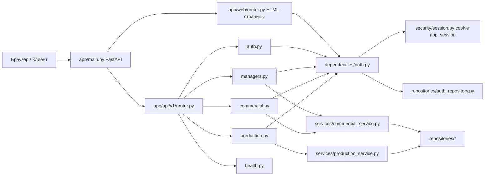

# Веб-интерфейс проекта: структура, запуск и использование

> **DEPRECATED (2026-07):** этот гайд описывает устаревший HTML-интерфейс `/web/*`.
> Канонический UI — React SPA под `/commercial-offer/*`.
> Актуальные спеки: `docs/specs/p6-legacy-decommission.md`, `docs/specs/security-sprint.md`.

Этот документ описывает только веб-часть проекта (`FastAPI` + HTML-страницы + API).
Старые Telegram-модули (`bot/...`, `run_bot.py`, `start_bot.sh`) здесь не рассматриваются.

## 1) Графическая структура веб-части

### Дерево файлов (только важное для web)

```text
app/
├── main.py                          # Точка входа FastAPI-приложения
├── core/
│   └── settings.py                  # Настройки из .env и путей к данным
├── web/
│   └── router.py                    # HTML-страницы: /web/login, /web, /web/managers, ...
├── api/
│   └── v1/
│       ├── router.py                # Сборка API-роутов v1
│       └── endpoints/
│           ├── health.py            # /api/v1/health
│           ├── auth.py              # /api/v1/auth/login|logout|me
│           ├── managers.py          # /api/v1/managers
│           ├── commercial.py        # /api/v1/commercial/*
│           └── production.py        # /api/v1/production/*
├── dependencies/
│   └── auth.py                      # Проверка cookie-сессии и ролей
├── security/
│   └── session.py                   # Подпись/проверка токена app_session
├── repositories/
│   ├── auth_repository.py           # Пользователи и логин (SQLite)
│   ├── manager_repository.py
│   ├── kp_repository.py
│   ├── plan_repository.py
│   └── work_calendar_repository.py
├── services/
│   ├── commercial_service.py        # Бизнес-логика КП
│   ├── production_service.py        # Бизнес-логика производства
│   ├── optimization_service.py
│   ├── plate_parser_service.py
│   ├── file_generation_service.py
│   └── draft_store.py
└── schemas/
    ├── auth.py
    ├── commercial.py
    └── production.py
```

### Поток запроса (Mermaid)



## 2) Как запустить веб-интерфейс (Linux Mint, `venv`)

## Шаг 1. Перейти в проект

```bash
cd /home/username/Code/plan_wed
```

## Шаг 2. Создать и активировать виртуальное окружение

```bash
python3 -m venv venv
source venv/bin/activate
python -m pip install --upgrade pip
pip install -r requirements.txt
```

## Шаг 3. Создать файл `.env` для веб-логина

Создай файл `.env` в корне проекта со следующим содержимым:

```env
APP_SECRET_KEY=change_this_to_long_random_secret_123456
APP_ADMIN_USERNAME=admin
APP_ADMIN_PASSWORD=admin123
APP_ADMIN_ROLE=admin
APP_DEBUG=true
```

Зачем это нужно:
- `APP_SECRET_KEY` — подпись cookie-сессии.
- `APP_ADMIN_USERNAME` и `APP_ADMIN_PASSWORD` — стартовый пользователь, который создаётся автоматически при запуске.

## Шаг 4. Запустить backend (FastAPI + web)

```bash
uvicorn app.main:app --host 127.0.0.1 --port 8000 --reload
```

После запуска открой в браузере:
- `http://127.0.0.1:8000/web/login` — вход в веб-кабинет
- `http://127.0.0.1:8000/docs` — Swagger UI (документация API)
- `http://127.0.0.1:8000/health` — общий health-check
- `http://127.0.0.1:8000/api/v1/health` — health-check API v1

## 3) Как пользоваться веб-интерфейсом

## Вход
1. Открой `http://127.0.0.1:8000/web/login`
2. Введи:
   - логин: `admin`
   - пароль: `admin123`
3. После входа откроется `http://127.0.0.1:8000/web`

## Разделы в веб-кабинете
- `Главная` (`/web`) — сводка: количество менеджеров и планов.
- `Менеджеры` (`/web/managers`) — таблица менеджеров.
  - Теперь это рабочий экран: создание КП + архив + карточка КП.
- `КП` (`/web/offers`) — список коммерческих предложений.
- `Производство` (`/web/production`) — список планов производства.

> В текущей реализации веб-страницы в основном показывают данные (таблицы).
> Основные операции (создание/изменение) доступны через API (`/api/v1/...`).

## 4) Быстрый сценарий работы через API (после запуска)

## 4.1 Логин (получить cookie-сессию)

```bash
curl -i -X POST "http://127.0.0.1:8000/api/v1/auth/login" \
  -H "Content-Type: application/json" \
  -d '{"username":"admin","password":"admin123"}' \
  -c cookies.txt
```

## 4.2 Проверить текущего пользователя

```bash
curl -s "http://127.0.0.1:8000/api/v1/auth/me" \
  -b cookies.txt
```

## 4.3 Получить менеджеров

```bash
curl -s "http://127.0.0.1:8000/api/v1/managers" \
  -b cookies.txt
```

## 4.4 Получить список планов производства

```bash
curl -s "http://127.0.0.1:8000/api/v1/production/plans" \
  -b cookies.txt
```

## 5) Минимальная карта URL

- Web UI:
  - `GET /web/login`
  - `POST /web/login`
  - `GET /web`
  - `GET /web/managers`
  - `GET /web/offers`
  - `GET /web/production`
- API v1:
  - `POST /api/v1/auth/login`
  - `POST /api/v1/auth/logout`
  - `GET /api/v1/auth/me`
  - `GET /api/v1/managers`
  - `POST /api/v1/commercial/parse`
  - `POST /api/v1/commercial/generate-preview`
  - `GET /api/v1/commercial/drafts/{draft_id}`
  - `GET /api/v1/offers`
  - `GET /api/v1/offers/{kp_id}`
  - `POST /api/v1/offers`
  - `PATCH /api/v1/offers/{kp_id}/discount`
  - `PATCH /api/v1/offers/{kp_id}/move-to-production`
  - `DELETE /api/v1/offers/{kp_id}`
  - `GET /api/v1/offers/{kp_id}/pdf`
  - `GET /api/v1/offers/{kp_id}/xlsx`
  - `GET/POST /api/v1/production/plans`
  - `GET /api/v1/production/plans/{plan_id}`
  - `POST /api/v1/production/plans/{plan_id}/activate`
  - `GET /api/v1/production/calendar`
  - `GET /api/v1/production/days/{target_date}`
  - `POST /api/v1/production/days/{target_date}/complete`
  - `GET /api/v1/production/candidates`
  - `GET/PUT /api/v1/production/work-calendar`

## 6) Если не получается войти

Проверь по шагам:
1. Файл `.env` есть в корне проекта.
2. `APP_ADMIN_USERNAME` и `APP_ADMIN_PASSWORD` заполнены.
3. Сервер перезапущен после изменения `.env`.
4. В браузере очищены cookies для `127.0.0.1`.
